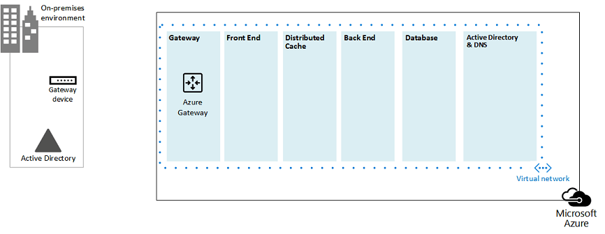
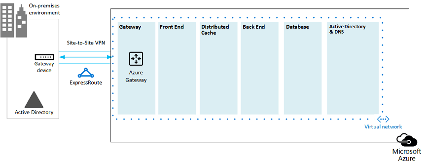
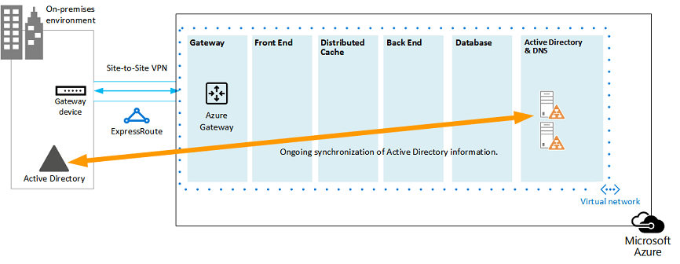
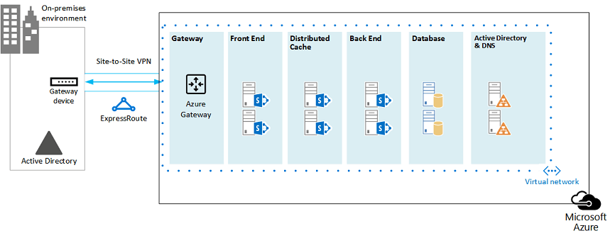
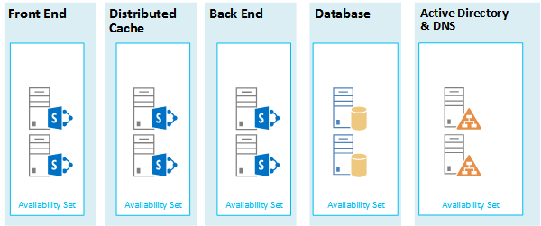
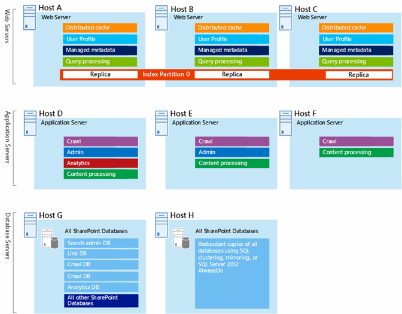
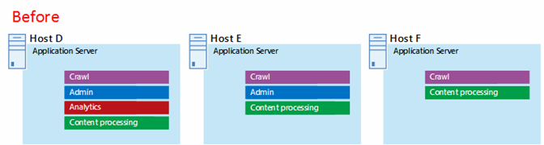
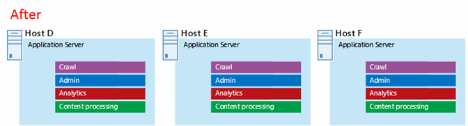
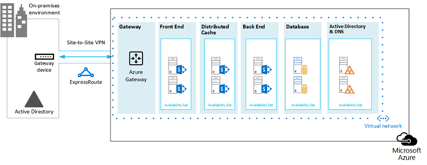

# Microsoft Azure Architectures for SharePoint 2013

Azure is a good environment for hosting a SharePoint Server 2013 solution. In most cases, we recommend Microsoft 365, but a SharePoint Server farm hosted in Azure can be a good option for specific solutions. This article describes how to architect SharePoint solutions so they are a good fit in the Azure platform. The following two specific solutions are used as examples:
  
- [SharePoint Server 2013 Disaster Recovery in Microsoft Azure](sharepoint-server-2013-disaster-recovery-in-microsoft-azure.md)
    
- [Internet Sites in Microsoft Azure using SharePoint Server 2013](internet-sites-in-microsoft-azure-using-sharepoint-server-2013.md)
    
## Recommended SharePoint solutions for Azure Infrastructure Services

Azure infrastructure services is a compelling option for hosting SharePoint solutions. Some solutions are a better fit for this platform than others. The following table shows recommended solutions.
  
|**Solution**|**Why this solution is recommended for Azure**|
|:-----|:-----|
|Development and test environments    |It's easy to create and manage these environments.    |
|Disaster recovery of on-premises SharePoint farms to Azure    |**Hosted secondary datacenter** Use Azure instead of investing in a secondary datacenter in a different region.   **Lower-cost disaster-recovery environments** Maintain and pay for fewer resources than an on-premises disaster recovery environment. The number of resources depends on the disaster recovery environment you choose: cold standby, warm standby, or hot standby.   **More elastic platform** In the event of a disaster, easily scale-out your recovery SharePoint farm to meet load requirements. Scale in when you no longer need the resources.   See [SharePoint Server 2013 Disaster Recovery in Microsoft Azure](sharepoint-server-2013-disaster-recovery-in-microsoft-azure.md).    |
|Internet-facing sites that use features and scale not available in Microsoft 365    |**Focus your efforts** Concentrate on building a great site rather than building infrastructure.   **Take advantage of elasticity in Azure** Size the farm for the demand by adding new servers, and pay only for resources you need. Dynamic machine allocation is not supported (auto scale).   **Use Azure Active Directory (AD)** Take advantage of Azure AD for customer accounts.   **Add SharePoint functionality not available in Microsoft 365** Add deep reporting and web analytics.   See [Internet Sites in Microsoft Azure using SharePoint Server 2013](internet-sites-in-microsoft-azure-using-sharepoint-server-2013.md).    |
|App farms to support Microsoft 365 or on-premises environments    |**Build, test, and host apps** in Azure to support both on-premises and cloud environments.   **Host this role** in Azure instead of buying new hardware for on-premises environments.   |
   
For intranet and collaboration solutions and workloads, consider the following options:
  
- Determine if Microsoft 365 meets your business requirements or can be part of the solution. Microsoft 365 provides a rich feature set that is always up to date.
    
- If Microsoft 365 does not meet all your business requirements, consider a standard implementation of SharePoint 2013 on premises from Microsoft Consulting Services (MCS). A standard architecture can be a quicker, cheaper, and easier solution for you to support than a customized one. 
    
- If a standard implementation doesn't meet your business requirements, consider a customized on-premises solution.
    
- If using a cloud platform is important for your business requirements, consider a standard or customized implementation of SharePoint 2013 hosted in Azure infrastructure services. SharePoint solutions are much easier to support in Azure than other non-native Microsoft public cloud platforms.
    
## Before you design the Azure environment

While this article uses example SharePoint topologies, you can use these design concepts with any SharePoint farm topology. Before you design the Azure environment, use the following topology, architecture, capacity, and performance guidance to design the SharePoint farm:
  
- [Architecture design for SharePoint 2013 IT pros](/SharePoint/technical-reference/technical-diagrams)
    
- [Plan for performance and capacity management in SharePoint Server 2013](/SharePoint/administration/performance-planning-in-sharepoint-server-2013)
    
## Determine the Active Directory domain type

Each SharePoint Server farm relies on Active Directory to provide administrative accounts for farm setup. At this time, there are two options for SharePoint solutions in Azure. These are described in the following table.
  
|**Option**|**Description**|
|:-----|:-----|
|Dedicated domain    |You can deploy a dedicated and isolated Active Directory domain to Azure to support your SharePoint farm. This is a good choice for public-facing Internet sites.    |
|Extend the on-premises domain through a cross-premises connection    |When you extend the on-premises domain through a cross-premises connection, users access the SharePoint farm via your intranet as if it were hosted on-premises. You can take advantage of your on-premises Active Directory and DNS implementation.    A cross-premises connection is required for building a disaster-recovery environment in Azure to fail over to from your on-premises farm.    |
   
This article includes design concepts for extending the on-premises domain through a cross-premises connection. If your solution uses a dedicated domain, you don't need a cross-premises connection.
  
## Design the virtual network

First you need a virtual network in Azure, which includes subnets on which you will place your virtual machines. The virtual network needs a private IP address space, portions of which you assign to the subnets.
  
If you are extending your on-premises network to Azure through a cross-premises connection (required for a disaster recovery environment), you must choose a private address space that is not already in use elsewhere in your organization network, which can include your on-premises environment and other Azure virtual networks. 
  
**Figure 1: On-premises environment with a virtual network in Azure**

  
In this diagram:
  
- A virtual network in Azure is illustrated side-by-side to the on-premises environment. The two environments are not yet connected by a cross-premises connection, which can be a site-to-site VPN connection or ExpressRoute.
    
- At this point, the virtual network just includes the subnets and no other architectural elements. One subnet will host the Azure gateway and other subnets host the tiers of the SharePoint farm, with an additional one for Active Directory and DNS.
    
## Add cross-premises connectivity

The next deployment step is to create the cross-premises connection (if this applies to your solution). For cross-premises connections, a Azure gateway resides in a separate gateway subnet, which you must create and assign an address space. 
  
When you plan for a cross-premises connection, you define and create an Azure gateway and connection to an on-premises gateway device.
  
**Figure 2: Using an Azure gateway and an on-premises gateway device to provide site-to-site connectivity between the on-premises environment and Azure**

  
In this diagram:
  
- Adding to the previous diagram, the on-premises environment is connected to the Azure virtual network by a cross-premise connection, which can be a site-to-site VPN connection or ExpressRoute.
    
- An Azure gateway is on a gateway subnet.
    
- The on-premises environment includes a gateway device, such as a router or VPN server.
    
For additional information to plan for and create a cross-premises virtual network, see [Connect an on-premises network to a Microsoft Azure virtual network](connect-an-on-premises-network-to-a-microsoft-azure-virtual-network.md).
  
## Add Active Directory Domain Services (AD DS) and DNS

For disaster recovery in Azure, you deploy Windows Server AD and DNS in a hybrid scenario where Windows Server AD is deployed both on-premises and on Azure virtual machines.
  
**Figure 3: Hybrid Active Directory domain configuration**

  
This diagram builds on the previous diagrams by adding two virtual machines to a Windows Server AD and DNS subnet. These virtual machines are replica domain controllers and DNS servers. They are an extension of the on-premises Windows Server AD environment. 
  
The following table provides configuration recommendations for these virtual machines in Azure. Use these as a starting point for designing your own environment—even for a dedicated domain where your Azure environment doesn't communicate with your on-premises environment.
  
|**Item**|**Configuration**|
|:-----|:-----|
|Virtual machine size in Azure    |A1 or A2 size in the Standard tier    |
|Operating system    |Windows Server 2012 R2    |
|Active Directory role    |AD DS domain controller designated as a global catalog server. This configuration reduces egress traffic across the cross-premises connection.    In a multidomain environment with high rates of change (this is not common), configure domain controllers on premises not to sync with the global catalog servers in Azure, to reduce replication traffic.    |
|DNS role    |Install and configure the DNS Server service on the domain controllers.    |
|Data disks    |Place the Active Directory database, logs, and SYSVOL on additional Azure data disks. Do not place these on the operating system disk or the temporary disks provided by Azure.    |
|IP addresses    |Use static IP addresses and configure the virtual network to assign these addresses to the virtual machines in the virtual network after the domain controllers have been configured.    |
   
> [!IMPORTANT]
> Before you deploy Active Directory in Azure, read [Guidelines for Deploying Windows Server Active Directory on Azure Virtual Machines](/windows-server/identity/ad-ds/introduction-to-active-directory-domain-services-ad-ds-virtualization-level-100). These help you determine if a different architecture or different configuration settings are needed for your solution. 
  
## Add the SharePoint farm

Place the virtual machines of the SharePoint farm in tiers on the appropriate subnets.
  
**Figure 4: Placement of SharePoint virtual machines**

  
This diagram builds on the previous diagrams by adding the SharePoint farm server roles in their respective tiers.
  
- Two database virtual machines running SQL Server create the database tier.
    
- Two virtual machines running SharePoint Server 2013 for each of the following tiers: front end servers, distributed cache servers, and back end servers.
    
## Design and fine tune server roles for availability sets and fault domains

A fault domain is a grouping of hardware in which role instances run. Virtual machines within the same fault domain can be updated by the Azure infrastructure at the same time. Or, they can fail at the same time because they share the same rack. To avoid the risk of having two virtual machines on the same fault domain, you can configure your virtual machines as an availability set, which ensures that each virtual machine is in a different fault domain. If three virtual machines are configured as an availability set, Azure guarantees that no more than two of the virtual machines are located in the same fault domain.
  
When you design the Azure architecture for a SharePoint farm, configure identical server roles to be part of an availability set. This ensures that your virtual machines are spread across multiple fault domains.
  
**Figure 5: Use Azure Availability Sets to provide high availability for the SharePoint farm tiers**

  
This diagram calls out the configuration of availability sets within the Azure infrastructure. Each of the following roles share a separate availability set:
  
- Active Directory and DNS
    
- Database
    
- Back end
    
- Distribute cache
    
- Front end
    
The SharePoint farm might need to be fine tuned in the Azure platform. To ensure high availability of all components, ensure that the server roles are all configured identically.
  
Here is an example that shows a standard Internet Sites architecture that meets specific capacity and performance goals. This example is featured in the following architecture model: [Internet Sites Search Architectures for SharePoint Server 2013](https://go.microsoft.com/fwlink/p/?LinkId=261519).
  
**Figure 6: Planning example for capacity and performance goals in a three-tier farm**

  
In this diagram:
  
- A three-tier farm is represented: web servers, application servers, and database servers.
    
- The three web servers are configured identically with multiple components.
    
- The two database servers are configured identically.
    
- The three application servers are not configured identically. These server roles require fine tuning for availability sets in Azure.
    
Let's look closer at the application server tier.
  
**Figure 7: Application server tier before fine tuning**

  
In this diagram:
  
- Three servers are included in the application tier.
    
- The first server includes four components.
    
- The second server includes three components.
    
- The third server includes two components.
    
You determine the number of components by the performance and capacity targets for the farm. To adapt this architecture for Azure, we'll replicate the four components across all three servers. This increases the number of components beyond what is necessary for performance and capacity. The tradeoff is that this design ensures high availability of all four components in the Azure platform when these three virtual machines are assigned to an availability set.
  
**Figure 8: Application server tier after fine tuning**

  
This diagram shows all three application servers configured identically with the same four components.
  
When we add availability sets to the tiers of the SharePoint farm, the implementation is complete.
  
**Figure 9: The completed SharePoint farm in Azure infrastructure services**

  
This diagram shows the SharePoint farm implemented in Azure infrastructure services, with availability sets to provide fault domains for the servers in each tier.
  
## See Also

[Microsoft 365 solution and architecture center](../solutions/index.yml)
  
[Internet Sites in Microsoft Azure using SharePoint Server 2013](internet-sites-in-microsoft-azure-using-sharepoint-server-2013.md)
  
[SharePoint Server 2013 Disaster Recovery in Microsoft Azure](sharepoint-server-2013-disaster-recovery-in-microsoft-azure.md)