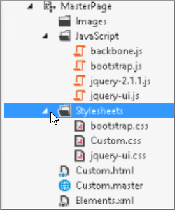
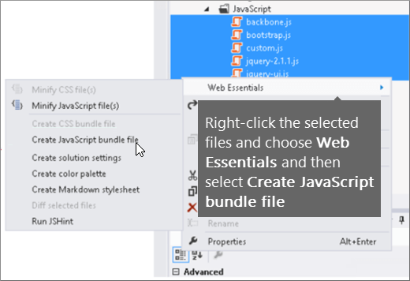
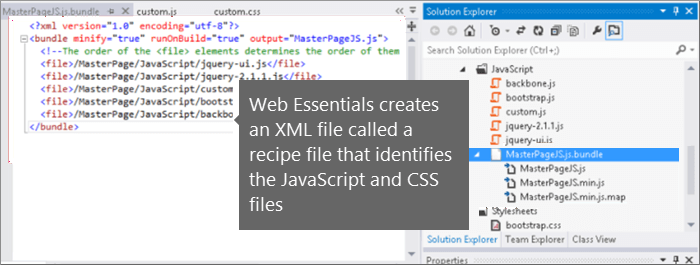
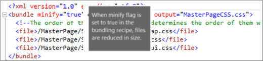
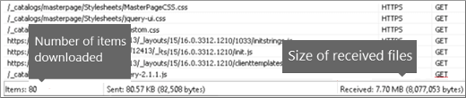
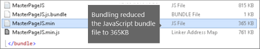
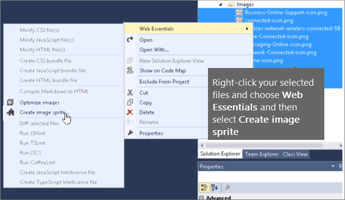
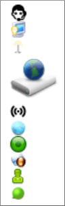

# Minification and bundling in SharePoint

This article describes how to use minification and bundling techniques with Web Essentials to reduce the number of HTTP requests and to reduce the time it takes to load pages in SharePoint.
  
When you customize your website, you can end up adding a large number of extra files to the server to support the customization. Adding extra JavaScript, CSS, and images increase the number of HTTP requests to the server, which in turn increases the time it takes to display a web page. If you have multiple files of the same type, you can bundle these files to make downloading these files faster.
  
For JavaScript and CSS files, you can also use an approach called minification, where you reduce the total size of files by removing whitespace and other characters that aren't necessary.
  
## Minification and bundling JavaScript and CSS files with Web Essentials

You can use third-party software such as Web Essentials to bundle CSS and JavaScript files.
  
> [!IMPORTANT]
> Web Essentials is a third-party, open-source, community-based project. The software is an extension to Visual Studio 2012 and Visual Studio 2013 and is not supported by Microsoft. To download Web Essentials, visit the website at [Web Essentials 2012](https://marketplace.visualstudio.com/items?itemName=MadsKristensen.WebEssentials2012).
  
Web Essentials offers two forms of bundling:
 
- .bundle: for CSS and JavaScript files
- .sprite: for images (only available in Visual Studio 2013)

You can use Web Essentials if you have an existing feature with some branding elements that are referenced inside a custom master page, such as:
  

  
### To create a TE000127218 and CSS bundle in Web Essentials
  
1. In Visual Studio, in Solution Explorer, select the files that you want to include in the bundle.
2. Right-click the selected files and then select **Web Essentials** \> **Create JavaScript bundle file** from the context menu. For example:

    
  
## Viewing the results of bundling JavaScript and CSS files

When you create a JavaScript and CSS bundle, Web Essentials creates an XML file called a recipe file that identifies the JavaScript and CSS files as well as some other configuration information:
  

  
In addition, if the minify flag is set to true in the bundling recipe the files are reduced in size and bundled together. This means that new, minified versions of the JavaScript files were created that you can reference in your master page.
  

  
When you load a page from your web site, you can use the developer tools from your web browser, such as Internet Explorer 11, to see the number of requests sent to the server and how long each file took to load.
  
The following figure is the result of loading the JavaScript and CSS files before minification.
  

  
After bundling the CSS and JavaScript files together, the number of requests dropped to 74 and each file took only slightly longer than the original files to download individually:
  

  
After bundling, the JavaScript bundle file is reduced significantly from 815 KB to 365 KB:
  

  
## Bundling images by creating an image sprite

Similar to how you bundle JavaScript and CSS files, you can combine many small icons and other common images into a larger sprite sheet and then use CSS to reveal the individual images. Instead of downloading each individual image, the user's web browser downloads the sprite sheet once and then caches it on the local computer. This improves page load performance by cutting down on the number of downloads and round trips to the web server.
  
### To create an image sprite in Web Essentials**
  
1. In Visual Studio, in Solution Explorer, select the files that you want to include in the bundle.
2. Right-click the selected files and then select **Web Essentials** \> **Create image sprite** from the context menu. For example:

    
  
3. Choose a location to save the sprite file. The .sprite file is an XML file that describes the settings and files in the sprite. The following figures show an example of a sprite PNG file and its corresponding .sprite XML file.

    
  
    
