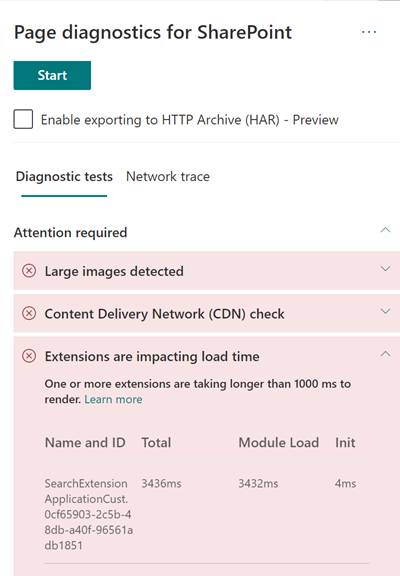

# Optimize custom extension performance in SharePoint modern site pages

This article will help you understand how to determine how custom extensions affect user perceived latency, and how to remediate common issues.

## Use the Page Diagnostics for SharePoint tool to analyze custom extensions

The Page Diagnostics for SharePoint tool is a browser extension for Microsoft Edge and Chrome browsers that analyzes both SharePoint in Microsoft 365 modern portal and classic publishing site pages. The tool provides a report for each analyzed page showing how the page performs against a defined set of performance criteria. To install and learn about the Page Diagnostics for SharePoint tool, visit [Use the Page Diagnostics tool for SharePoint](page-diagnostics-for-spo.md).

>[!NOTE]
>The Page Diagnostics tool only works for SharePoint in Microsoft 365, and cannot be used on a SharePoint system page.

When you analyze a SharePoint site page with the Page Diagnostics for SharePoint tool, you can see information about custom extensions that exceed the baseline metric in the **Extensions are impacting load time** and/or the **Too many extensions used** result in the _Diagnostic tests_ pane.

Possible results include:

- **Attention required** (red): Any _custom_ extension that takes longer than **one** second to load. Total load time as displayed in test results is broken down by module load and init.
Additionally, if there are too many extensions on a page they can impact the page load time and this will be highlighted if **seven** or more extensions are used on the page.
- **Improvement Opportunities** (yellow) If **five** or more extensions are used they'll be highlighted in this section as a warning until seven or more are used which will be highlighted as Attention Required.
- **No action required** (green): No extension is taking longer than one second to load.

If an extension is impacting page load time or there are too many extensions on the page, the result appears in the **Attention required** section of the results. Select the result to see details about which extension is loading slowly or too many extensions has been highlighted. Future updates to the Page Diagnostics for SharePoint tool might include updates to analysis rules, so please ensure you always have the latest version of the tool.

Information available in the results includes:

- **Name and ID** shows identifying information that can help you find the extension on the page
- **Total** shows the total time for the extension to module load and initialize. It's the total relative time taken by the extension to execute on the page, from beginning to the end.
- **Module Load** shows the time taken to download, evaluate and load the extensions JavaScript and CSS files. It will then start the Init process.
- **Init** shows the time taken for the extension to initialize the data.

  It's an asynchronous call and init time is the calculation of time for the onInit function when the returned promise is resolved.

This information is provided to help designers and developers troubleshoot issues. This information should be provided to your design and development team.

## Overview of extensions

SharePoint Framework (SPFx) Extensions can be used to extend the SharePoint user experience. With SharePoint Framework Extensions, you can customize more facets of the SharePoint experience, including notification areas, toolbars, and list data views.

Extensions can have a bad influence on the performance of a SharePoint page as it also takes CPU and network resources to do required work.

There are four types of extensions:

- **Application Customizers** adds scripts to the page, and accesses well-known HTML element placeholders and extends them with custom renderings.
- **Field Customizers** provides modified views to data for fields within a list.
- **Command Sets** extend the SharePoint command surfaces to add new actions, and provides client-side code that you can use to implement behaviors.
- **Search Query Modifier (preview only)** are invoked just before the search query is executed.

## Remediate extension performance issues

Follow the guidance in this section to identify and remediate performance issues with extensions listed in the **Extensions are impacting page load time** results.

>[!NOTE]
>Application customizers may be executed in the early stage during the lifecycle of a page and it may influence the performance of other extensions on the page.

The audit results in the Page Diagnostic Tool will display two stages of executing an extension in order to help identify the potential performance impact.

- **Module load** is how long it takes to load the extension, which is impacted by the size of an extension so it's a good idea to only bundle the necessary libraries in the extension and to also choose lighter libraries.
- **Init** is the initialization time of the extension and extension developers should consider whether the extension is doing unnecessary work or executing too many commands during the initializing stage.

Page authors can also use the audit result to see whether a page has too many extensions as too many extensions will negatively impact the performance of a page.

- **Extension size and dependencies**
  - Use of the Office 365 CDN is required for optimal static resource download. Public CDN origins are preferable for _js/css_ files. For more information about using the Office 365 CDN, see [Use the Office 365 Content Delivery Network (CDN) with SharePoint](use-microsoft-365-cdn-with-spo.md).
  - Reuse frameworks like _React_ and _Fabric imports_ that come as part of the SharePoint Framework (SPFx). For more information, see [Overview of the SharePoint Framework](/sharepoint/dev/spfx/sharepoint-framework-overview).
  - Ensure that you're using the latest version of the SharePoint Framework, and upgrade to new versions as they become available.
- **Data fetching/caching**
  - If the extension relies on extra server calls to fetch data for display, ensure those server APIs are fast and/or implement client side caching (such as using _localStorage_ or _IndexDB_ for larger sets).
  - If multiple calls are required to render critical data, consider batching on the server or other methods of consolidating requests to a single call.
  - Alternatively, if some elements of data require a slower API, but aren't critical to initial rendering, decouple these to a separate call that is executed after critical data is rendered.
  - If multiple parts use the same data, utilize a common data layer to avoid duplicate calls.
- **Rendering time**
  - Any media sources like images and videos should be sized to the limits of the container, device and/or network to avoid downloading unnecessary large assets. For more information about content dependencies, see [Use the Office 365 Content Delivery Network (CDN) with SharePoint](use-microsoft-365-cdn-with-spo.md).
  - Avoid API calls that cause reflow, complex CSS rules or complicated animations. For more information, see [Minimizing browser reflow](https://developers.google.com/speed/docs/insights/browser-reflow).
  - Avoid use of chained long running tasks. Instead, break long running tasks apart into separate queues. For more information, see [Optimize JavaScript Execution](https://developers.google.com/web/fundamentals/performance/rendering/optimize-javascript-execution).
  - Reserve corresponding space for asynchronously rendering media or visual elements to avoid skipped frames and stuttering (also known as _jank_).
  - If a certain browser doesn't support a feature used in rendering, either load a polyfill or exclude running dependent code. If the feature isn't critical, dispose resources such as event handlers to avoid memory leaks.

Before you make page revisions to remediate performance issues, make a note of the page load time in the analysis results. Run the tool again after your revision to see if the new result is within the baseline standard, and check the new page load time to see if there was an improvement.

>[!NOTE]
>Page load time can vary based on a variety of factors such as network load, time of day, and other transient conditions. You should test page load time a few times before and after making changes to help you average the results.

## Related articles

[Tune SharePoint performance](tune-sharepoint-online-performance.md)

[Performance in the modern SharePoint experience](/sharepoint/modern-experience-performance)

[Content delivery networks](content-delivery-networks.md)

[Use the Office 365 Content Delivery Network (CDN) with SharePoint](use-microsoft-365-cdn-with-spo.md)
