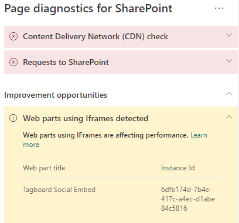

# Optimize iFrames in SharePoint modern and classic publishing site pages

iFrames can be useful for previewing rich content such as videos or other media. However, because iFrames load a separate page within the SharePoint site page, content loaded in the iFrame could contain large images, videos or other elements that can contribute to overall page load times and that you cannot control on the page. This article will help you understand how to determine how iFrames in your pages affect user perceived latency, and how to remediate common issues.

>[!NOTE]
>For more information about performance in SharePoint modern sites, see [Performance in the modern SharePoint experience](/sharepoint/modern-experience-performance).

## Use the Page Diagnostics for SharePoint tool to analyze web parts using iFrames

The Page Diagnostics for SharePoint tool is a browser extension for the new [Microsoft Edge](https://www.microsoft.com/edge) and Chrome browsers that analyzes both SharePoint in Microsoft 365 modern portal and classic publishing site pages. The tool provides a report for each analyzed page showing how the page performs against a defined set of performance criteria. To install and learn about the Page Diagnostics for SharePoint tool, visit [Use the Page Diagnostics tool for SharePoint](page-diagnostics-for-spo.md).

>[!NOTE]
>The Page Diagnostics tool only works for SharePoint in Microsoft 365, and cannot be used on a SharePoint system page.

When you analyze a SharePoint site page with the Page Diagnostics for SharePoint tool, you can see information about web parts containing iFrames in the _Diagnostic tests_ pane. The baseline metric is the same for modern and classic pages.

Possible results include:

- **Attention required** (red): The page contains **three or more** web parts using iFrames
- **Improvement opportunities** (yellow): The page contains **one or two** web parts using iFrames
- **No action required** (green): The page contains no web parts using iFrames

If the **Web parts using iFrames detected** result appears in either the **Improvement opportunities** or **Attention required)** section of the results, you can click the result to see the web parts that contain iFrames.

## Remediate iFrame performance issues

Use the **Web parts using iFrames detected** result in the Page Diagnostic tool to determine which web parts contain iFrames and may be contributing to slow page load times.

iFrames are inherently slow because they load a separate external page including all associated content such as javascript, CSS and framework elements, potentially increasing the overhead of the site page by a factor of two or more.

Follow the guidance below to ensure optimal use of iFrames.

- When possible, use images instead of iFrames if the preview is small to begin with or non-interactive.
- If iFrames must be used, minimize the number and/or move them out of the viewport.
- Embedded Office files like Word, Excel and PowerPoint are interactive, but are slow to load. Image thumbnails with a link to the full document will often perform better.
- Embedded YouTube videos and Twitter feeds tend to perform better in iFrames, but use these kinds of embeds judiciously.
- Isolated web parts are a reasonable exception, but minimize their number and placement in the viewport.
- If an iFrame is located out of the viewport, consider using an _IntersectionObserver_ to delay rendering the iFrame until it comes into view.

Before you make page revisions to remediate performance issues, make a note of the page load time in the analysis results. Run the tool again after your revision to see if the new result is within the baseline standard, and check the new page load time to see if there was an improvement.

>[!NOTE]
>Page load time can vary based on a variety of factors such as network load, time of day, and other transient conditions. You should test page load time a few times before and after making changes to help you average the results.

## Related topics

[Tune SharePoint performance](tune-sharepoint-online-performance.md)

[Performance in the modern SharePoint experience](/sharepoint/modern-experience-performance)
