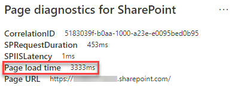

# Optimize images in SharePoint in Microsoft 365 modern site pages

This article will help you understand how to optimize images in SharePoint in Microsoft 365 modern site pages.

For information about optimizing images in classic publishing sites, see [Image optimization for SharePoint](image-optimization-for-sharepoint-online.md).

>[!NOTE]
>For more information about performance in SharePoint modern portals, see [Performance in the modern SharePoint experience](/sharepoint/modern-experience-performance).

## Use the Page Diagnostics for SharePoint tool to analyze image optimization

The Page Diagnostics for SharePoint tool is a browser extension for the new Microsoft Edge (https://www.microsoft.com/edge) and Chrome browsers that analyzes both SharePoint modern portal and classic publishing site pages for SharePoint in Microsoft 365. The tool provides a report for each analyzed page showing how the page performs against a defined set of performance criteria. To install and learn about the Page Diagnostics for SharePoint tool, visit [Use the Page Diagnostics tool for SharePoint](page-diagnostics-for-spo.md).

>[!NOTE]
>The Page Diagnostics tool only works for SharePoint in Microsoft 365, and cannot be used on a SharePoint system page.

When you analyze a SharePoint modern site with the Page Diagnostics for SharePoint tool, you can see information about large images in the _Diagnostic tests_ pane.

Possible results include:

- **Attention required** (red): The page contains **one or more** images over 300 KB in size
- **No action required** (green): The page contains no images over 300 KB in size

If the **Large images detected** result appears in the **Attention required** section of the results, you can click the result to see additional details.

## Remediate large image issues

If a page contains images over 300 KB in size, select the **Large images detected** result to see which images are too large. In modern SharePoint pages, renditions of images are automatically provided and sized depending on the size of the browser window and the resolution of the client monitor. You should always optimize images for web use prior to upload to SharePoint. Very large images will be automatically reduced in size and resolution which can result in unexpected rendering characteristics.

Before you make page revisions to remediate performance issues, make a note of the page load time in the analysis results. Run the tool again after your revision to see if the new result is within the baseline standard, and check the new page load time to see if there was an improvement.

>[!NOTE]
>Page load time can vary based on a variety of factors such as network load, time of day, and other transient conditions. You should test page load time a few times before and after making changes to help you average the results.

## Related articles

[Tune SharePoint performance](tune-sharepoint-online-performance.md)

[Performance in the modern SharePoint experience](/sharepoint/modern-experience-performance)

[Content delivery networks](content-delivery-networks.md)

[Use the Office 365 Content Delivery Network (CDN) with SharePoint](use-microsoft-365-cdn-with-spo.md)
