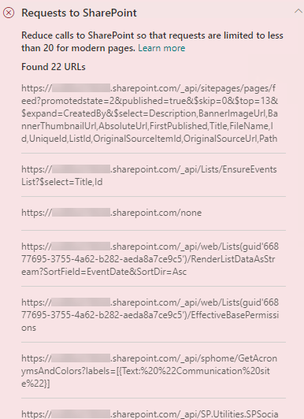

# Optimize page calls in SharePoint in Microsoft 365 modern and classic publishing site pages

Both SharePoint in Microsoft 365 modern and classic publishing sites contain links that load data from (or make calls to) SharePoint features and CDNs. The more calls made by a page, the longer the page takes to load. This is known as **end user perceived latency** or **EUPL**.

This article will help you understand how to determine the number and impact of calls to external endpoints from your modern and classic publishing site pages and how to limit their effect on end user perceived latency.

>[!NOTE]
>For more information about performance in SharePoint modern portals, see [Performance in the modern SharePoint experience](/sharepoint/modern-experience-performance).

## Use the Page Diagnostics for SharePoint tool to analyze page calls

The Page Diagnostics for SharePoint tool is a browser extension for Microsoft Edge and Chrome browsers that analyzes both SharePoint in Microsoft 365 modern portal and classic publishing site pages. The tool provides a report for each analyzed page showing how the page performs against a defined set of performance criteria. To install and learn about the Page Diagnostics for SharePoint tool, visit [Use the Page Diagnostics tool for SharePoint](page-diagnostics-for-spo.md).

>[!NOTE]
>The Page Diagnostics tool only works for SharePoint in Microsoft 365, and cannot be used on a SharePoint system page.

When you analyze a SharePoint site page with the Page Diagnostics for SharePoint tool, you can see information about external calls in the **Requests to SharePoint** result in the _Diagnostic tests_ pane. The line will appear in green if the site page contains fewer than the baseline number of calls, and red if the page exceeds the baseline number. The baseline number is different for modern and classic pages because classic site pages use HTTP1.1 and modern pages use HTTP2.0:

- Modern site pages should contain no more than **25** calls
- Classic publishing pages should contain no more than **6** calls

Possible results include:

- **Attention required** (red): The page exceeds the baseline number of calls
- **No action required** (green): The page contains fewer than the baseline number of calls

If the **Requests to SharePoint** result appears in the **Attention required** section, you can click the result for details, including the total number of calls on the page and a list of the URLs.

## Remediate performance issues related to too many calls on a page

If a page contains too many calls, you can use the list of URLs in the **Requests to SharePoint** results to determine whether there are any repeated calls, calls that should be batched, or calls that return data that should be cached.

**Batching REST calls** can help to reduce performance overhead. For more information about API call batching, see [Make batch requests with the REST APIs](/sharepoint/dev/sp-add-ins/make-batch-requests-with-the-rest-apis).

**Using a cache** to store the results of an API call can improve the performance of a warm request by allowing the client to use the cached data instead of making an additional call for each subsequent page load. There are multiple ways to approach this solution depending on the business requirement. Typically if the data will be the same for all users, using a middle-tier caching service like [_Azure Redis_ cache](https://azure.microsoft.com/services/cache/) is a great option to significantly reduce API traffic against a site, as the users would request the data from the caching service instead of directly from SPO. The only SPO calls needed would be to refresh the middle-tier's cache. If the data will fluctuate on an individual user basis, it may be best to implement a client side cache, like LocalStorage or even a Cookie. This will still reduce call volumes by eliminating subsequent requests made by the same user for the cache duration, but will be less efficient than a dedicated caching service. PnP allows you to use LocalStorage with little additional development required.

Before you make page revisions to remediate performance issues, make a note of the page load time in the analysis results. Run the tool again after your revision to see if the new result is within the baseline standard, and check the new page load time to see if there was an improvement.

>[!NOTE]
>Page load time can vary based on a variety of factors such as network load, time of day, and other transient conditions. You should test page load time a few times before and after making changes to help you average the results.

## Related topics

[Tune SharePoint performance](tune-sharepoint-online-performance.md)

[Performance in the modern SharePoint experience](/sharepoint/modern-experience-performance)

[Content delivery networks](content-delivery-networks.md)

[Use the Microsoft 365 Content Delivery Network (CDN) with SharePoint](use-microsoft-365-cdn-with-spo.md)
