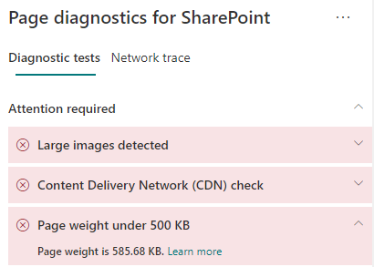

# Optimize page weight in SharePoint modern site pages

SharePoint modern site pages contain serialized code that is required to render page content of the page, including images, text, objects in the content area underneath navigation/command bars and other HTML code that forms the framework of the page. Page weight is a measurement of this HTML code, and should be limited to ensure optimal page load times.

This article will help you understand how to reduce page weight in your modern site pages.

>[!NOTE]
>For more information about performance in SharePoint modern portals, see [Performance in the modern SharePoint experience](/sharepoint/modern-experience-performance).

## Use the Page Diagnostics for SharePoint tool to analyze page weight

The Page Diagnostics for SharePoint tool is a browser extension for the new Microsoft Edge (https://www.microsoft.com/edge) and Chrome browsers that analyzes both SharePoint modern portal and classic publishing site pages. The tool provides a report for each analyzed page showing how the page performs against a defined set of performance criteria. To install and learn about the Page Diagnostics for SharePoint tool, visit [Use the Page Diagnostics tool for SharePoint](page-diagnostics-for-spo.md).

>[!NOTE]
>The Page Diagnostics tool only works for SharePoint in Microsoft 365, and cannot be used on a SharePoint system page.

When you analyze a SharePoint site page with the Page Diagnostics for SharePoint tool, you can see information about page in the **Page weight under 500KB** result of the _Diagnostic tests_ pane. The result will appear in green if the page weight is under the baseline value, and red if the page weight exceeds the baseline value.

Possible results include:

- **Attention required** (red): Page weight exceeds 500KB
- **No action required** (green): Page weight is under 500KB

If the **Page weight under 500KB** result appears in the **Attention required** section, you can click the result for details.

## Remediate page weight issues

If page weight exceeds 500KB, you can improve overall page load time by reducing the number of web parts and limiting page content to an appropriate degree.

General guidance for reducing page weight includes:

- Limit the page content to a reasonable amount and use multiple pages for related content.
- Minimize the use of web parts that have large property bags.
- Use non-interactive rollup views when possible.
- Optimize image sizes by sizing images appropriately, using compressed image formats and ensuring that they are downloaded from a CDN.

You can find additional guidance for limiting page weight in the following article:

- [Optimize page performance in SharePoint](/sharepoint/dev/general-development/optimize-page-performance-in-sharepoint)

Before you make page revisions to remediate performance issues, make a note of the page load time in the analysis results. Run the tool again after your revision to see if the new result is within the baseline standard, and check the new page load time to see if there was an improvement.

>[!NOTE]
>Page load time can vary based on a variety of factors such as network load, time of day, and other transient conditions. You should test page load time a few times before and after making changes to help you average the results.

## Related topics

[Tune SharePoint performance](tune-sharepoint-online-performance.md)

[Performance in the modern SharePoint experience](/sharepoint/modern-experience-performance)

[Content delivery networks](content-delivery-networks.md)

[Use the Office 365 Content Delivery Network (CDN) with SharePoint](use-microsoft-365-cdn-with-spo.md)
