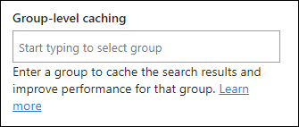

# Optimize search requests in SharePoint in Microsoft 365 modern site pages 

SharePoint in Microsoft 365 modern site pages contain links that load data from (or make calls to) from Search backend. The more search requests made by a page, the longer the page takes to load, and the longer the end user has to wait to get search results back.  

This article will help you understand how to determine the number and impact of search requests from your modern site pages and how to limit their effect on end user perceived latency.

>[!NOTE]
>For more information about performance in SharePoint in Microsoft 365 modern portals, see [Performance in the modern SharePoint experience](/sharepoint/modern-experience-performance).

## Use the Page Diagnostics for SharePoint tool to analyze search requests made on a page

The Page Diagnostics for SharePoint tool is a browser extension for the new Microsoft Edge (https://www.microsoft.com/edge) and Chrome browsers that analyzes both SharePoint in Microsoft 365 modern portal and classic publishing site pages. The tool provides a report for each analyzed page showing how the page performs against a defined set of performance criteria. To install and learn about the Page Diagnostics for SharePoint tool, visit [Use the Page Diagnostics tool for SharePoint in Microsoft 365](./page-diagnostics-for-spo.md).

>[!NOTE]
> The Page Diagnostics tool only works for SharePoint in Microsoft 365, and cannot be used on a SharePoint system page.

When you analyze a SharePoint site page with the Page Diagnostics for SharePoint tool, you can see information about search requests in the **Number of search requests on a page** result in the Diagnostic tests pane. The line will appear in green if the site page contains fewer than the baseline number of search requests, and red if the page exceeds the baseline number.

- Modern site pages should contain no more than **3** search requests

Possible results include:

- **Attention required** (red): The page exceeds the baseline number of search requests 
- **No action required** (green): The page contains fewer than the baseline number of search requests

>[!NOTE]
>The Page Diagnostics tool will only count non-cached search requests. To learn more about search requests caching please see the “**Remediate performance issues related to too many search requests on a page**” section below.

If the **Search Requests to SharePoint** result appears in the **Attention required** section, you can click the result for details, including the total number of search requests on the page and a list of the originators of these search requests.

**Attention Required**

## Remediate performance issues related to too many search requests on a page

If a page contains too many search requests, you can use the list of URLs in the **Search Requests to SharePoint** results to determine whether there are any repeated search calls and what web parts the search requests are coming from.

**Using a cache** to store the results of a search request for all members of a selected group can improve the performance of a warm request by allowing the client to use the cached search results instead of making an additional search request for each subsequent page load. 

## Configure Events or Highlighted Content Web Parts to use caching of search results

It is recommended to enable group-level caching of search requests on Events or Highlighted Content web parts, especially for popular home pages or on category pages that are starting points for navigating to more detailed pages. After being enabled, the web part will first look in the cache for existing search results that match the query and the security group(s). If it doesn't find any search results in the cache, it will look in the search index.

1. Go to the site page that contains an Events or Highlighted Content web part and select **Edit**.

2. Select the Events or Highlighted Content web part and then select **Edit web part** :::image type="icon" source="../media/modern-portal-optimization/edit-web-part-icon.png":::

3. In the web part settings pane, scroll to the **Group-level caching** setting. 

4. Specify the security group(s) by entering a group name or email. The search results will be cached for all users who belong to the same security group(s) and improve page performance.

   

5. Republish your SharePoint site page.

>[!NOTE]
>Please see the articles on [Events](https://support.microsoft.com/office/5fe4da93-5fa9-4695-b1ee-b0ae4c981909) and [Highlighted Content](https://support.microsoft.com/office/e34199b0-ff1a-47fb-8f4d-dbcaed329efd) web parts for more information.

## Related topics

[Tune SharePoint in Microsoft 365 performance](tune-sharepoint-online-performance.md)

[Performance in the modern SharePoint experience](/sharepoint/modern-experience-performance)

[Content delivery networks](content-delivery-networks.md)

[Use the Office 365 Content Delivery Network (CDN) with SharePoint in Microsoft 365](use-microsoft-365-cdn-with-spo.md)