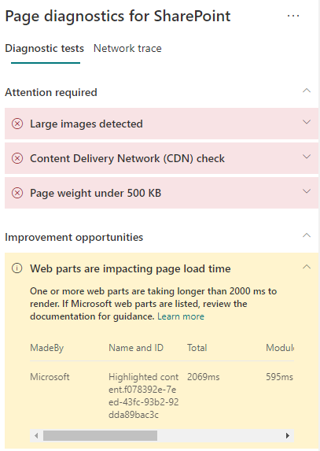

# Optimize web part performance in SharePoint modern site pages

SharePoint modern site pages contain web parts that can contribute to overall page load times. This article will help you understand how to determine how web parts in your pages affect user perceived latency, and how to remediate common issues.

> [!NOTE]
> For more information about performance in SharePoint modern portals, see [Performance in the modern SharePoint experience](/sharepoint/modern-experience-performance).

## Use the Page Diagnostics for SharePoint tool to analyze web parts

The Page Diagnostics for SharePoint tool is a browser extension for the new Microsoft Edge (https://www.microsoft.com/edge) and Chrome browsers that analyzes both SharePoint modern portal and classic publishing site pages. The tool provides a report for each analyzed page showing how the page performs against a defined set of performance criteria. To install and learn about the Page Diagnostics for SharePoint tool, visit [Use the Page Diagnostics tool for SharePoint](page-diagnostics-for-spo.md).

> [!NOTE]
> The Page Diagnostics tool only works for SharePoint in Microsoft 365, and cannot be used on a SharePoint system page.

When you analyze a SharePoint site page with the Page Diagnostics for SharePoint tool, you can see information about web parts that exceed the baseline metric in the **Web parts are impacting page load time** result in the _Diagnostic tests_ pane.

Possible results include:

- **Attention required** (red): Any _custom_ web part that is visible in the viewport (screen visible portion of the page, which is loaded first) that takes longer than **two** seconds to load. Any _custom_ web parts outside of the viewport that take longer than **four** seconds to load. Total load time is displayed in test results and is broken down by module load, lazy load, init, and render.
- **Improvement opportunities** (yellow): Items that might be impacting page load time are shown in this section and should be reviewed and monitored. This might include "out of the box" (OOTB) Microsoft web parts. Results for any Microsoft web parts shown in this section are automatically reported to Microsoft, so **no action is required**. You should only log a support ticket for investigation if you're experiencing slow performance on the page and **all Microsoft web parts** on the page appear in the results in the **Improvement opportunities** section. A future Page Diagnostics for SharePoint tool update will further break down the results based on the specific configuration of the Microsoft web part.
- **No action required** (green): No web part is taking longer than **two** seconds to return data.

If the **Web parts are impacting page load time** result appears in either the **Attention required** or **Improvement opportunities** section of the results, select the result to see details about which web parts are loading slowly. Future updates to the Page Diagnostics for SharePoint tool might include updates to analysis rules, so please ensure you always have the latest version of the tool.

Information available in the results includes:

- **Made by** shows whether the web part is custom or Microsoft OOTB.
- **Name and ID** shows identifying information that can help you find the web part on the page.
- **Total** shows the total time for the web part to module load, initialize and render. It's the total relative time taken by the web part to render on the page, from beginning to the end.
- **Module Load** shows the time taken to download, evaluate, and load the extensions JavaScript and CSS files. It will then start the Init process.
- **Lazy Load** shows the time for deferred loading of web parts not seen in the main section of the page. There are certain conditions where there are too many web parts to render, and they're queued to render to minimize the page load time.
- **Init** shows the time taken for the web part to initialize the data.

  It's an asynchronous call and init time is the calculation of time for the onInit function when the returned promise is resolved.

- **Render** shows the time taken to render the UI (user interface) once the module load and Init are complete.

  It's the JavaScript execution time to mount the DOM in the document (page).
  Rendering of asynchronous resources, for example, images, might take additional time to complete.

This information is provided to help designers and developers troubleshoot issues. This information should be provided to your design and development team.

## Remediate web part performance issues

Follow the guidance in this section to identify and remediate performance issues with web parts listed in the **Web parts are impacting page load time** results.

There are three categories of possible causes for poor web part performance. Use the following information to determine which issues apply to your scenario and remediate them.

- Web part script size and dependencies
  - Optimize the initial script that renders the mainline scenario for _view mode only_.
  - Move the less frequent scenarios and edit mode code (like the property pane) to separate chunks using the _import()_ statement.
  - Review dependencies of the _package.json_ file to remove any dead code completely. Move any test/build only dependencies to devDependencies.
  - Use of the Office 365 CDN is required for optimal static resource download. Public CDN origins are preferable for _js/css_ files. For more information about using the Office 365 CDN, see [Use the Office 365 Content Delivery Network (CDN) with SharePoint](use-microsoft-365-cdn-with-spo.md).
  - Reuse frameworks like _React_ and _Fabric imports_ that come as part of the SharePoint Framework (SPFx). For more information, see [Overview of the SharePoint Framework](/sharepoint/dev/spfx/sharepoint-framework-overview).
  - Ensure that you're using the latest version of the SharePoint Framework, and upgrade to new versions as they become available.
- Data fetching/caching
  - If the web part relies on extra server calls to fetch data for display, ensure those server APIs are fast and/or implement client side caching (such as using _localStorage_ or _IndexedDB_ for larger sets).
  - If multiple calls are required to render critical data, consider batching on the server or other methods of consolidating requests to a single call.
  - Alternatively, if some elements of data require a slower API, but aren't critical to initial rendering, decouple these to a separate call that is executed after critical data is rendered.
  - If multiple parts use the same data, utilize a common data layer to avoid duplicate calls.
- Rendering time
  - Any media sources like images and videos should be sized to the limits of the container, device and/or network to avoid downloading unnecessary large assets. For more information about content dependencies, see [Use the Office 365 Content Delivery Network (CDN) with SharePoint](use-microsoft-365-cdn-with-spo.md).
  - Avoid API calls that cause reflow, complex CSS rules or complicated animations. For more information, see [Minimizing browser reflow](https://developers.google.com/speed/docs/insights/browser-reflow).
  - Avoid use of chained long running tasks. Instead, break long running tasks apart into separate queues. For more information, see [Optimize JavaScript Execution](https://developers.google.com/web/fundamentals/performance/rendering/optimize-javascript-execution).
  - Reserve corresponding space for asynchronously rendering media or visual elements to avoid skipped frames and stuttering (also known as _jank_).
  - If a certain browser doesn't support a feature used in rendering, either load a polyfill or exclude running dependent code. If the feature isn't critical,
dispose resources such as event handlers to avoid memory leaks.

Before you make page revisions to remediate performance issues, make a note of the page load time in the analysis results. Run the tool again after your revision to see if the new result is within the baseline standard, and check the new page load time to see if there was an improvement.

>[!NOTE]
>Page load time can vary based on a variety of factors such as network load, time of day, and other transient conditions. You should test page load time a few times before and after making changes to help you average the results.

## Related articles

[Tune SharePoint performance](tune-sharepoint-online-performance.md)

[Performance in the modern SharePoint experience](/sharepoint/modern-experience-performance)

[Content delivery networks](content-delivery-networks.md)

[Use the Office 365 Content Delivery Network (CDN) with SharePoint](use-microsoft-365-cdn-with-spo.md)
