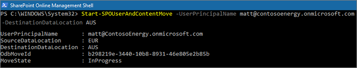

# Move a OneDrive site to a different geo location 

With OneDrive geo move, you can move a user's OneDrive to a different geo location. OneDrive geo move is performed by the SharePoint Online administrator or the Microsoft 365 global administrator. Before you start a OneDrive geo move, be sure to notify the user whose OneDrive is being moved and recommend they close all files for the duration of the move. (If the user has a document open using the Office client during the move, then upon move completion the document will need to be saved to the new location.) The move can be scheduled for a future time, if desired.

The OneDrive service uses Azure Blob Storage to store content. The Storage blob associated with the user's OneDrive will be moved from the source to destination geo location within 40 days of destination OneDrive being available to the user. The access to the user's OneDrive will be restored as soon as the destination OneDrive is available.

During OneDrive geo move window (about 2-6 hours) the user's OneDrive is set to read-only. The user can still access their files via the OneDrive sync client or their OneDrive site in SharePoint Online. After OneDrive geo move is complete, the user will be automatically connected to their OneDrive at the destination geo location when they navigate to OneDrive in the Microsoft 365 app launcher. The sync client will automatically begin syncing from the new location.

The procedures in this article require the [Microsoft SharePoint Online PowerShell Module](https://www.microsoft.com/download/details.aspx?id=35588).

## Communicating to your users

When moving OneDrive sites between geo locations, it's important to communicate to your users what to expect. This can help reduce user confusion and calls to your help desk. Email your users before the move and let them know the following information:

- When the move is expected to start and how long it is expected to take
- What geo location their OneDrive is moving to, and the URL to access the new location
- They should close their files and not make edits during the move.
- File permissions and sharing will not change as a result of the move.
- What to expect from the [user experience in a multi-geo environment](multi-geo-user-experience.md)

Be sure to send your users an email when the move has successfully completed informing them that they can resume working in OneDrive.

## Scheduling OneDrive site moves

You can schedule OneDrive site moves in advance (described later in this article). We recommend that you start with a small number of users to validate your workflows and communication strategies. Once you are comfortable with the process, you can schedule moves as follows:

- You can schedule up to 4,000 moves at a time.
- As the moves begin, you can schedule more, with a maximum of 4,000 pending moves in the queue and any given time.
- The maximum size of a OneDrive that can be moved is 1 terabyte (1 TB).

## Moving a OneDrive site

To perform a OneDrive geo move, the tenant administrator must first set the user's Preferred Data Location (PDL) to the appropriate geo location. Once the PDL is set, wait for at least 24 hours for the PDL update to sync across the geo locations before starting the OneDrive geo move.

When using the geo move cmdlets, connect to SPO Service at the user's current OneDrive geo location, using the following syntax:

`Connect-SPOService -url https://<tenantName>-admin.sharepoint.com`

For example: To move OneDrive of user 'Matt@contosoenergy.onmicrosoft.com', connect to EUR SharePoint Admin center as the user's OneDrive is in EUR geo location:

`Connect-SPOSservice -url https://contosoenergyeur-admin.sharepoint.com`

## Validating the environment

Before you start a OneDrive geo move, we recommend that you validate the environment.

To ensure that all geo locations are compatible, run:

`Get-SPOGeoMoveCrossCompatibilityStatus`

You will see a list of your geo locations and whether content can be moved between will be denoted as "Compatible". If the command returns "Incompatible" please retry validating the status at a later date.

If a OneDrive contains a subsite, for example, it cannot be moved. You can use the Start-SPOUserAndContentMove cmdlet with the -ValidationOnly parameter to validate if the OneDrive is able to be moved:

`Start-SPOUserAndContentMove -UserPrincipalName <UPN> -DestinationDataLocation <DestinationDataLocation> -ValidationOnly`

This will return Success if the OneDrive is ready to be moved or Fail if there is a legal hold or subsite that would prevent the move. Once you have validated that the OneDrive is ready to move, you can start the move.

## Start a OneDrive geo move

To start the move, run:  

`Start-SPOUserAndContentMove -UserPrincipalName <UserPrincipalName> -DestinationDataLocation <DestinationDataLocation>`

Using these parameters:

-   _UserPrincipalName_ – UPN of the user whose OneDrive is being moved.

-   _DestinationDataLocation_ – Geo-Location where the OneDrive needs to be moved. This should be same as the user's preferred data location.

For example, to move the OneDrive of matt@contosoenergy.onmicrosoft.com from EUR to AUS, run:

`Start-SPOUserAndContentMove -UserPrincipalName matt@contosoenergy.onmicrosoft.com -DestinationDataLocation AUS`

To schedule a geo move for a later time, use one of the following parameters:

-   _PreferredMoveBeginDate_ – The move will likely begin at this specified time. Time must be specified in Coordinated Universal Time (UTC).

-   _PreferredMoveEndDate_ – The move will likely be completed by this specified time, on a best effort basis. Time must be specified in Coordinated Universal Time (UTC). 

## Cancel a OneDrive geo move 

You can stop the geo move of a user's OneDrive, provided the move is not in progress or completed by using the cmdlet:

`Stop-SPOUserAndContentMove – UserPrincipalName <UserPrincipalName>`

Where _UserPrincipalName_ is the UPN of the user whose OneDrive move you want to stop.

## Determining current status

You can check the status of a OneDrive geo move in or out of the geo that you're connected to by using the Get-SPOUserAndContentMoveState cmdlet.

The move statuses are described in the following table.

<table>
<thead>
<tr class="header">
<th align="left"><strong>Status</strong></th>
<th align="left"><strong>Description</strong></th>
</tr>
</thead>
<tbody>
<tr class="odd">
<td align="left">NotStarted</td>
<td align="left">The move has not started.</td>
</tr>
<tr class="even">
<td align="left">InProgress (<em>n</em>/4)</td>
<td align="left">The move is in progress in one of the following states: Validation (1/4), Backup (2/4), Restore (3/4), Cleanup (4/4).</td>
</tr>
<tr class="odd">
<td align="left">Success</td>
<td align="left">The move has completed successfully.</td>
</tr>
<tr class="even">
<td align="left">Failed</td>
<td align="left">The move failed.</td>
</tr>
</tbody>
</table>

To find the status of a specific user's move, use the UserPrincipalName parameter:

`Get-SPOUserAndContentMoveState -UserPrincipalName <UPN>`

To find the status of all of the moves in or out of the geo location that you're connected to, use the MoveState parameter with one of the following values: NotStarted, InProgress, Success, Failed, All.

`Get-SPOUserAndContentMoveState -MoveState <value>`

You can also add the `-Verbose` parameter for more verbose descriptions of the move state.

## User Experience

Users of OneDrive should notice minimal disruption if their OneDrive is moved to a different geo location. Aside from a brief read-only state during the move, existing links and permissions will continue to work as expected once the move is completed.

### OneDrive for Business

While the move is in progress the user's OneDrive is set to read-only. Once the move is completed, the user is directed to their OneDrive in the new geo location when they navigate to OneDrive the Microsoft 365 app launcher or a web browser.

### Permissions on OneDrive content

Users with permissions to OneDrive content will continue to have access to the content during the move and after it's complete.

### OneDrive Sync Client 

The OneDrive sync client will automatically detect and seamlessly transfer syncing to the new OneDrive location once the OneDrive geo move is complete. The user does not need to sign-in again or take any other action.  (Version 17.3.6943.0625 or later of the sync client required.)

If a user updates a file while the OneDrive geo move is in progress, the sync client will notify them that file uploads are pending while the move is underway.

### Sharing links 

Upon OneDrive geo move completion, the existing shared links for the files that were moved will automatically redirect to the new geo location.

### OneNote Experience 

OneNote win32 client and UWP (Universal) App will automatically detect and seamlessly sync notebooks to the new OneDrive location once OneDrive geo move is complete. The user does not need to sign-in again or take any other action. The only visible indicator to the user is notebook sync would fail when OneDrive geo move is in progress. This experience is available on the following OneNote client versions:

-   OneNote win32 – Version 16.0.8326.2096 (and later)

-   OneNote UWP – Version 16.0.8431.1006 (and later)

-   OneNote Mobile App – Version 16.0.8431.1011 (and later)

### Teams app

Upon OneDrive geo move completion, users will have access to their OneDrive files on the Teams app. Additionally, files shared via Teams chat from their OneDrive prior to geo move will continue to work after move is complete.

### OneDrive for Business Mobile App (iOS) 

Upon OneDrive geo move completion, the user would need to sign out and sign in again on the iOS Mobile App to sync to the new OneDrive location.

### Existing followed groups and sites

Followed sites and groups will show up in the user's OneDrive regardless of their geo location. Sites and groups hosted in another geo location will open in a separate tab.

### Delve Geo URL updates

Users will be sent to the Delve geo corresponding to their PDL only after their OneDrive has been moved to the new geo.
