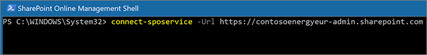
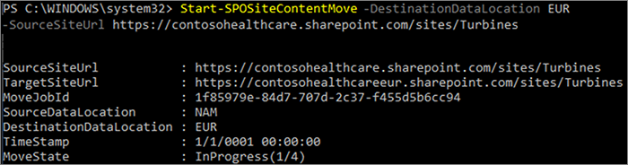

# Move a SharePoint site to a different geo location

With SharePoint site geo move, you can move SharePoint sites to other geo locations within your multi-geo environment.

The following types of site can be moved between geo locations:

- Microsoft 365 Group-connected sites
- Modern sites without a Microsoft 365 Group association
- Classic SharePoint sites
- Communication sites

You must be a Global Administrator or SharePoint Administrator to move a site between geo locations.

There is a read-only window during the SharePoint site geo move of approximately 4-6 hours, depending on site contents.

## Best practices

- Try a SharePoint site move on a test site to get familiar with the procedure.
- Validate whether the site can be moved prior to scheduling or performing the move.
- When possible schedule cross-geo sites moves for outside business hours to reduce user impact.
- Communicate with impacted users prior to the sites move.

## Communicating to your users

When moving SharePoint sites between geo locations, it's important to communicate to the sites' users (generally anyone with the ability to edit the site) what to expect. This can help reduce user confusion and calls to your help desk. Email your sites' users before the move and let them know the following information:

- When the move is expected to start and how long it is expected to take
- What geo location their site is moving to, and the URL to access the new location
- They should close their files and not make edits during the move.
- File permissions and sharing will not change because of the move.
- What to expect from the user experience in a multi-geo environment

Be sure to send your sites' users an email when the move has successfully completed informing them that they can resume working on their sites.

## Scheduling SharePoint site moves

You can schedule SharePoint site moves in advance (described later in this article). You can schedule moves as follows:

- You can schedule up to 4,000 moves at a time.
- As the moves begin, you can schedule more, with a maximum of 4,000 pending moves in the queue and any given time.

To schedule a SharePoint site geo move for a later time, include one of the following parameters when you start the move:

- `PreferredMoveBeginDate` – The move will likely begin at this specified time.
- `PreferredMoveEndDate` – The move will likely be completed by this specified time, on a best effort basis.

Time must be specified in Coordinated Universal Time (UTC) for both parameters.

## Moving the site

SharePoint site geo move requires that you connect and perform the move from the SharePoint Admin URL in the geo location where the site is.

For example, if the site URL is <https://contosohealthcare.sharepoint.com/sites/Turbines>, connect to the SharePoint Admin URL at <https://contosohealthcare-admin.sharepoint.com>:

```powershell
Connect-SPOService -Url https://contosohealthcare-admin.sharepoint.com
```



### Validating the environment

We recommend that before scheduling any site move, you perform a validation to ensure that the site can be moved.

We do not support moving sites with:

- Business Connectivity Services
- InfoPath forms
- Information Rights Management (IRM) templates applied

To ensure all geo locations are compatible, run `Get-SPOGeoMoveCrossCompatibilityStatus`. This will display all your geo locations and whether the environment is compatible with the destination geo location.

To perform a validation-only check on your site, use `Start-SPOSiteContentMove` with the `-ValidationOnly` parameter to validate if the site is able to be moved. For example:

```PowerShell
Start-SPOSiteContentMove -SourceSiteUrl <SourceSiteUrl> -ValidationOnly -DestinationDataLocation <DestinationLocation>
```

This will return *Success* if the site is ready to be moved or *Fail* if any of blocked conditions are present.

### Start a SharePoint site geo move for a site with no associated Microsoft 365 Group

By default, initial URL for the site will change to the URL of the destination geo location. For example:

<https://Contoso.sharepoint.com/sites/projectx> to <https://ContosoEUR.sharepoint.com/sites/projectx>

For sites with no Microsoft 365 Group association, you can also rename the site by using the `-DestinationUrl` parameter. For example:

<https://Contoso.sharepoint.com/sites/projectx> to <https://ContosoEUR.sharepoint.com/sites/projecty>

To start the site move, run:

```powershell
Start-SPOSiteContentMove -SourceSiteUrl <siteURL> -DestinationDataLocation <DestinationDataLocation> -DestinationUrl <DestinationSiteURL>
```



### Start a SharePoint site geo move for a Microsoft 365 Group-connected site

To move an Office 365 Group-connected site, the Global Administrator or SharePoint Administrator must first change the Preferred Data Location (PDL) attribute for the Office 365 Group.

To set the PDL for a Microsoft 365 Group:

```PowerShell
Set-SPOUnifiedGroup -PreferredDataLocation <PDL> -GroupAlias <GroupAlias>
Get-SPOUnifiedGroup -GroupAlias <GroupAlias>
```

Once you have updated the PDL, you can start the site move:

```PowerShell
Start-SPOUnifiedGroupMove -GroupAlias <GroupAlias> -DestinationDataLocation <DestinationDataLocation>
```

## Cancel a SharePoint site geo move

You can stop a SharePoint site geo move, provided the move is not in progress or completed by using the `Stop-SPOSiteContentMove` cmdlet.

## Determining the status of a SharePoint site geo move

You can determine the status of a site move in our out of the geo that you are connected to by using the following cmdlets:

- [Get-SPOSiteContentMoveState](/powershell/module/sharepoint-online/get-spositecontentmovestate) (non-Group-connected sites)
- [Get-SPOUnifiedGroupMoveState](/powershell/module/sharepoint-online/get-spounifiedgroupmovestate) (Group-connected sites)

Use the `-SourceSiteUrl` parameter to specify the site for which you want to see move status.

The move statuses are described in the following table.

****

|Status|Description|
|---|---|
|Ready to Trigger|The move has not started.|
|Scheduled|The move is in queue but has not yet started.|
|InProgress (n/4)|The move is in progress in one of the following states: Validation (1/4), Backup (2/4), Restore (3/4), Cleanup (4/4).|
|Success|The move has completed successfully.|
|Failed|The move failed.|
|

You can also apply the `-Verbose` option to see additional information about the move.

## User experience

Site users should notice minimal disruption when their site is moved to a different geo location. Aside from a brief read-only state during the move, existing links and permissions will continue to work as expected once the move is completed.

### Site

While the move is in progress the site is set to read-only. Once the move is completed, the user is directed to the new site in the new geo location when they click on bookmarks or other links to the site.

### Permissions

Users with permissions to site will continue to have access to the site during the move and after it's complete.

### Sync Client

The sync client will automatically detect and seamlessly transfer syncing to the new site location once the site move is complete. The user does not need to sign in again or take any other action. (Version 17.3.6943.0625 or later of the sync client required.)

If a user updates a file while the move is in progress, the sync client will notify them that file uploads are pending while the move is underway.

### Sharing links

When the SharePoint site geo move completes, the existing shared links for the files that were moved will automatically redirect to the new geo location.

### Most Recently Used files in Office (MRU)

The MRU service is updated with the site url and its content URLs once the move completes. This applies to Word, Excel, and PowerPoint.

### OneNote experience

OneNote win32 client and UWP (Universal) App will automatically detect and seamlessly sync notebooks to the new site location once site move is complete. The user does not need to sign in again or take any other action. The only visible indicator to the user is notebook sync would fail when site move is in progress. This experience is available on the following OneNote client versions:

- OneNote win32 – Version 16.0.8326.2096 (and later)
- OneNote UWP – Version 16.0.8431.1006 (and later)
- OneNote Mobile App – Version 16.0.8431.1011 (and later)

### Teams (applicable to Microsoft 365 Group connected sites)

When the SharePoint site geo move completes, users will have access to their Microsoft 365 Group site files on the Teams app. Additionally, files shared via Teams chat from their site prior to geo move will continue to work after move is complete.

### SharePoint Mobile App (iOS/Android)

The SharePoint Mobile App is cross geo compatible and able to detect the site's new geo location.

### SharePoint workflows

SharePoint 2013 workflows need to be republished after the site move. SharePoint 2010 workflows should continue to function normally.

### Apps

If you are moving a site with apps, you must re-instantiate the app in the site's new geo location as the app and its connections may not be available in the destination geo location.

### Flow

In most cases Flows will continue to work after a SharePoint site geo move. We recommend that you test them once the move has completed.

### PowerApps

PowerApps need to be recreated in the destination location.

### Data movement between geo locations

SharePoint uses Azure Blob storage for its content, while the metadata associated with sites and its files is stored within SharePoint. After the site is moved from its source geo location to its destination geo location, the service will also move its associated Blob Storage. Blob Storage moves complete in approximately 40 days.