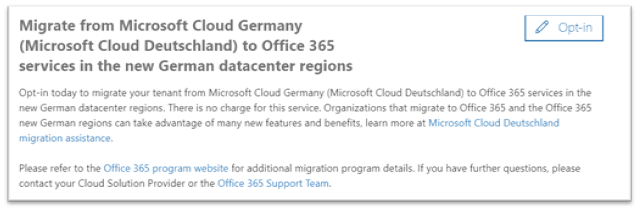
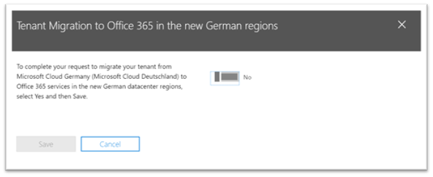
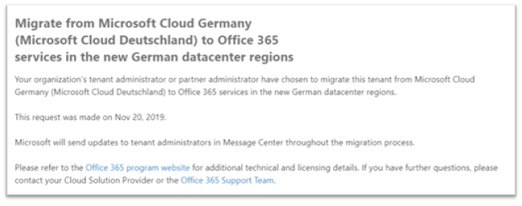

# How to opt-in for migration from Microsoft Cloud Germany (Microsoft Cloud Deutschland) to Office 365 services in the new German datacenter regions

>[!Note]
>This article only applies to Microsoft Cloud Germany (Microsoft Cloud Deutschland) customers.
>

## How to request migration

Eligible customers with service provisioned in Microsoft Cloud Germany (Microsoft Cloud Deutschland) will see a page in the Microsoft 365 admin center that will allow a customer tenant administrator to opt-in for migration.

To access the page in the Microsoft 365 admin center, in the navigation pane on the left, expand **Settings** and then click **Organization Profile**.

On the **Organization Profile** page, scroll down to the **Migrate from Microsoft Cloud Germany (Microsoft Cloud Deutschland) to Office 365 services in the new German datacenter regions** section.

If your organization wishes to migrate your service from Microsoft Cloud Germany (Microsoft Cloud Deutschland) to Office 365 services in the new German datacenter regions, click **Opt-in**.
 

A new section will appear on the right side of your screen to accept your confirmation. Select the toggle button to **Yes**, and then click **Save**.
 

Once an administrator has opted-in on behalf of your tenant then all administrators will see the confirmation in **Migrate from Microsoft Cloud Germany (Microsoft Cloud Deutschland) to Office 365 services in the new German datacenter regions** section, including the date of opt-in. Administrators will also receive a confirmation in Message Center of the Microsoft 365 admin center. 
 

## What happens after opting-in for migration?

Migrations will begin in early 2021 for organizations that opt-in to the Microsoft-driven approach and will be complete before the Microsoft Cloud Germany (Microsoft Cloud Deutschland) retirement date on October 29, 2021.  As a result of the migration, core customer data and subscriptions are moved to the new German regions.  Microsoft will send updates throughout the migration process in Message Center.  Please refer to articles referenced below to learn more.

## What happens if the customer tenant administrator does not opt-in for migration in Admin Center?

The Online Services Terms have changed to include terms that will enable Microsoft to migrate your Microsoft 365, Dynamics 365 and Power BI data and subscriptions from Microsoft Cloud Deutschland to a new data center. These terms take effect on any Microsoft Cloud Germany (Microsoft Cloud Deutschland) subscription renewed since May 1, 2020.  The customer tenant administrator will receive a notice in e-mail and Message Center advising that opt-in to migration will happen automatically opt in for a Microsoft-assisted migration. This notice will be sent at least 30 days prior to the automatic opt-in.  After migration opt-in all communications and status updates are sent to customer tenant administrators in Message Center.

Customer and partner tenant administrators are encouraged to opt-in for migration in Admin Center so the migration process can begin as soon as possible.

## Next step

[Understand the customer experience during the migration](ms-cloud-germany-transition-experience.md)

## More information

Getting started:

- [Migration from Microsoft Cloud Deutschland to Office 365 services in the new German datacenter regions](ms-cloud-germany-transition.md)
- [Microsoft Cloud Deutschland Migration Assistance](https://aka.ms/germanymigrateassist)
- [Customer experience during the migration](ms-cloud-germany-transition-experience.md)

Moving through the transition:

- [Migration phases actions and impacts](ms-cloud-germany-transition-phases.md)
- [Additional pre-work](ms-cloud-germany-transition-add-pre-work.md)
- Additional information for [services](ms-cloud-germany-transition-add-general.md), [devices](ms-cloud-germany-transition-add-devices.md), [experiences](ms-cloud-germany-transition-add-experience.md), and [AD FS](ms-cloud-germany-transition-add-adfs.md).

Cloud apps:

- [Dynamics 365 migration program information](https://aka.ms/d365ceoptin)
- [Power BI migration program information](https://aka.ms/pbioptin)
- [Getting started with your Microsoft Teams upgrade](https://aka.ms/SkypeToTeams-Home)
