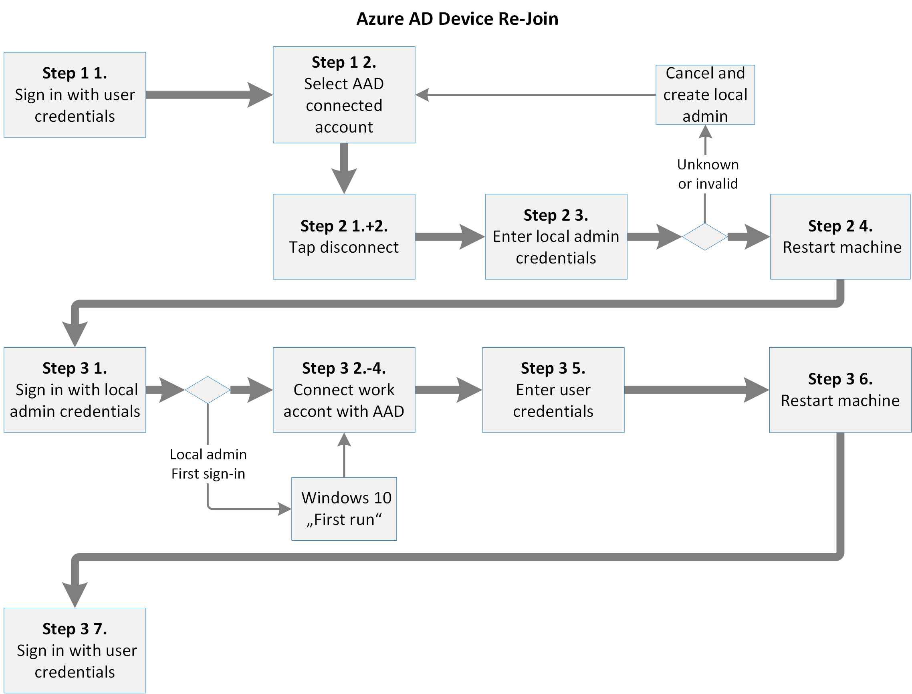
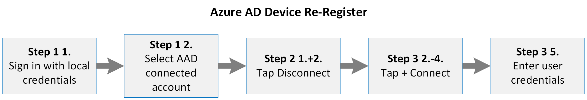

# Additional device information for the migration from Microsoft Cloud Deutschland

Azure AD joined and registered devices connected to Microsoft Cloud Deutschland must be migrated after phase 9 and before phase 10. The migration of a device depends on the devices type, operating system and Azure AD relation. 

## Azure AD Joined Windows 10 devices
If a Windows 10 device is Azure AD joined, it must be disconnected from Azure AD and must be connected again. 

[  ](../media/ms-cloud-germany-migration-opt-in/AAD-ReJoin-flow.png#lightbox)


If the user is an administrator on the Windows 10 device, the user can unregister the device from Azure AD and re-join it again in three steps. 

### Step 1: Determine if the device is Azure ID joined
1.	Sign in with your work account.
2.	Go to **Settings** > **Accounts** > **Access Work Or School**. 
3.	Look for an account in the list with **connected to […]‘s Azure AD**. 
4.	If a connected account exists, proceed with Step 2. 
### Step 2: Disconnect the device from Azure AD
1.	Click **Disconnect** on the connected work or School Account. 
2.	Confirm the disconnect twice. 
3.	Enter a local administrator username and password. The device is disconnected.
4.	Restart the device.
### Step 3: Join the device to Azure AD
1.	Sign in with the credentials of the local administrator.
2.	Go to **Settings** > **Accounts** > **Access Work Or School**.
3.	Click **Connect**.
4.	**IMPORTANT**: Click **Join to Azure AD**.
5.	Enter the e-mail address and password of your work account. The device is connected.
6.	Restart the device.
7.	Sign in with the email address and password of your work account.

If the user is not an administrator of the device, an Azure AD global administrator can create the local administrator account on the device following this configuration path and unjoin the device:

*Settings > Accounts > Other Accounts > Credentials unknown > Add user without Microsoft-Account*

For re-joining, the credentials of any work account from your organization can be used in this step. 

Please consider that the work account used to join the device will be automatically promoted as an Administrator of the device.
Any other work account from the organization can sign in to the device, but has no administrator privileges.

## Azure AD registered (workplace-joined) Windows 10 devices
If a Windows 10 device is Azure AD registered, it needs to be disconnected from the Azure AD and connected again.

[  ](../media/ms-cloud-germany-migration-opt-in/AAD-ReJoin-flow.png#lightbox)

### Step 1: Determine if the device is Azure ID registered
1.	Sign in with your user.
2.	Go to **Settings** > **Accounts** > **Access Work Or School**. 
3.	Discover your work account in the list and check if it is **connected to […]‘s Azure AD**.

    If your work account is in the list but NOT connected to an Azure AD, proceed with step 2.

    Otherwise, your device is an Azure AD joined device and you have to refer to [Azure AD Joined Windows 10 devices](#azure-ad-joined-windows-10-devices).

### Step 2: Disconnect the device from Azure AD
1.	Click on your work account. The buttons *Info* and *Disconnect* appear.
2.	Click **Disconnect**. 
3.	Confirm account removal from the device by clicking **Yes**.
### Step 3: Connect the device to Azure AD
1.	Click **Connect**.
2.	Enter the email address of your work account and click **Next**.
3.	Enter the password of your work account and click **Sign in**.
4.	Confirm by clicking **Done**. Your work account is listed again.

## Android

For Android, users will need to unregister and re-register their devices. This can be done via the Microsoft Authenticator app or the Company Portal app. 

- From the Microsoft Authenticator app, users can go to **Settings > Device Registration**. From there users can unregister and re-register their device.
 
- From the Company Portal, users can go to **Devices** tab and remove the device. After that, re-enroll the device by using Company Portal.
 
- Users can also unregister and re-register by removing the account from the account settings page and then re-adding the work account.

To unregister and re-register the device on Android by using the Microsoft Authenticator app:

1.	Open the Microsoft Authenticator app and go to **Settings**.
2.	Select **Device registration**.
3.	Unregister the device by selecting **Unregister**.
4.	For **Device registration**, re-register the device by typing your email address, and then select **Register**.

To unregister and re-register an Android device with the Android Settings page:

1.	Open **Device Settings** and go to **Accounts**.
2.	Select the work account that you want to re-register and select **Remove account**.
3.	After the account is removed, from the **Accounts** page, select **Add Account > Work account**.
4.	For **Workplace Join**, type your email address and select **Join** to complete registering the device.

To unregister and re-register the device on Android from Company Portal:

1.	Launch Company Portal and go to **Devices** tab.
2.	Select the device to see the device details.
3.	From the ellipses (three dots) menu, select **Remove Device**, and complete the removal by confirming in the dialog.
4.	You should now be logged out of the Company Portal app. Select **Sign in** to re-register the device.

For more information about any actions required during the migration phase of this workload, or impact to administration or usage, review the information about Azure Active Directory (Azure AD) in [Additional Azure AD information for the migration from Microsoft Cloud Deutschland](ms-cloud-germany-transition-azure-ad.md).

## iOS

On iOS devices, a user will need to manually remove any cached accounts from the Microsoft Authenticator, unregister the device, and sign out from any native apps on the device.

### Step 1: If present, remove the account from the Microsoft Authenticator app

1. Tap the account in the Microsoft Authenticator app.
2. Tap the **Settings** icon in the top-right corner. If you don't see the **Settings** icon, you might not be using the latest version of Microsoft Authenticator.
3. Tap the **Remove account** button.
4. Tap **All apps on this device**.
 
### Step 2: Unregister the device from the Microsoft Authenticator app

1. Tap the menu icon in the top-right corner.
2. Tap **Settings** and then **Device Registration**.
4. If your account is shown, tap **Unregister device** and **Continue** in the dialog. You should see no account after that.
 
### Step 3: Sign out from individual apps if necessary

Users can go to individual apps like Outlook, Teams, and OneDrive, and remove accounts from those apps.

## Frequently asked questions

**How can I tell if my organization is affected?**

Administrators should check `https://portal.microsoftazure.de` to determine if they have any Azure AD registered or Azure AD joined devices. If your organization has Azure AD registered or Azure AD joined devices, your organization has to follow the instructions on this page.

**When do my users re-register their devices?**

It's critical to your success that you only unregister and re-register your devices after [phase 9](ms-cloud-germany-transition-phases.md#phase-9--10-azure-ad-finalization) has been completed. You must finish the re-registration before phase 10 starts, otherwise you could lose access to your device.

**How do I know that all my devices are registered in the public cloud?**

To check whether your devices are registered in the public cloud, you should export and download the list of devices from the Azure AD portal to an Excel spreadsheet. Then, filter the devices that are registered (by using the _registeredTime_ column) after the date when your organization has passed [phase 9 of the migration process](ms-cloud-germany-transition-phases.md#phase-9--10-azure-ad-finalization).

**Do I still need to add the DNS name as stated in this [Create DNS records for Microsoft using Windows-based DNS](https://docs.microsoft.com/en-us/microsoft-365/admin/dns/create-dns-records-using-windows-based-dns?view=o365-worldwide#add-two-cname-records-for-mobile-device-management-mdm-for-microsoft)

This DNS entry is no longer needed for re-registering your device. 

## Additional considerations

> [!IMPORTANT]
> The Intune service principal will be enabled after [phase 3 of the migration process](ms-cloud-germany-transition-phases.md#phase-3-subscription-transfer), which implies the activation of Azure AD Device Registration. If you blocked Azure AD Device Registration before migration, you must disable the Intune service principal with PowerShell to disable Azure AD Device Registration with the Azure AD portal again. You can disable the Intune service principal with this command in the Azure Active Directory PowerShell for Graph module.

```powershell
Get-AzureADServicePrincipal -All:$true |Where-object -Property AppId -eq "0000000a-0000-0000-c000-000000000000" | Set-AzureADServicePrincipal -AccountEnabled:$false
```

## More information

Getting started:

- [Migration from Microsoft Cloud Deutschland to Office 365 services in the new German datacenter regions](ms-cloud-germany-transition.md)
- [Microsoft Cloud Deutschland Migration Assistance](https://aka.ms/germanymigrateassist)
- [How to opt-in for migration](ms-cloud-germany-migration-opt-in.md)
- [Customer experience during the migration](ms-cloud-germany-transition-experience.md)

Moving through the transition:

- [Migration phases actions and impacts](ms-cloud-germany-transition-phases.md)
- [Additional pre-work](ms-cloud-germany-transition-add-pre-work.md)
- Additional information for [Azure AD](ms-cloud-germany-transition-azure-ad.md), [devices](ms-cloud-germany-transition-add-devices.md), [experiences](ms-cloud-germany-transition-add-experience.md), and [AD FS](ms-cloud-germany-transition-add-adfs.md).

Cloud apps:

- [Dynamics 365 migration program information](/dynamics365/get-started/migrate-data-german-region)
- [Power BI migration program information](/power-bi/admin/service-admin-migrate-data-germany)
- [Getting started with your Microsoft Teams upgrade](/microsoftteams/upgrade-start-here)
