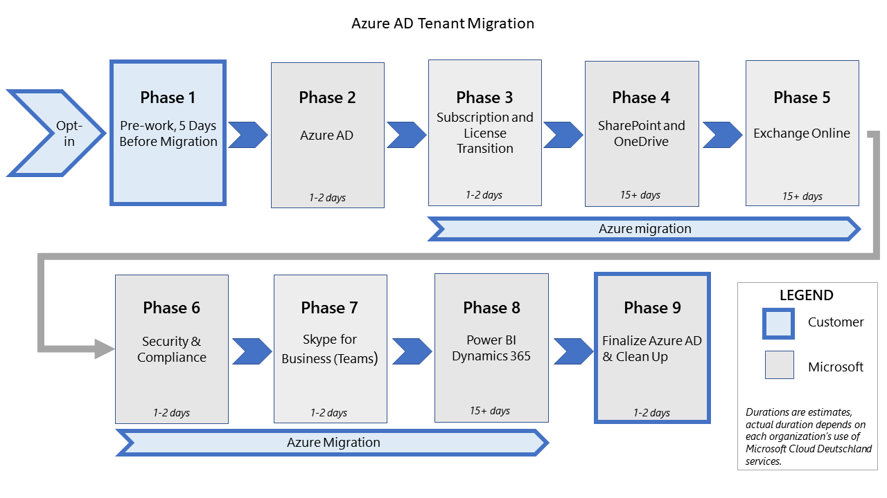

# Migration from Microsoft Cloud Deutschland to Office 365 services in the new German datacenter regions

> [!NOTE]
> This article only applies to eligible Microsoft Cloud Deutschland customers.

In August 2018, Microsoft announced our intention to deliver the complete Microsoft cloud – Azure, Office 365, Dynamics 365, and Power Platform – from new cloud regions in Germany to better enable the digital transformation of our customers. In August 2019, we announced we are now in the process of opening of the new cloud regions in Germany. We have since announced the availability of Azure, Office 365, Dynamics 365, and Power Platform.

The new regions are designed to address the evolving needs of German customers with greater flexibly, the latest intelligent cloud services, and full connectivity to our Microsoft 365 services cloud network as well as customer data residency within Germany.

## How to migrate to the new German datacenter regions

Existing Microsoft Cloud Deutschland customers can now begin to migrate their Office 365, Dynamics 365 Customer Engagement, and Power Platform customers. The first step is to [opt-in to a Microsoft-led migration](./ms-cloud-germany-migration-opt-in.md) to our new German datacenter regions.

For organizations who opt-in to the Microsoft-driven approach, migrations are expected to begin in early 2021 and will be completed by October 29, 2021. As a result of the migration, core customer data and subscriptions are moved to the new German regions.

This article provides an overview of the Microsoft-driven approach for the migration, clarity on the experiences for both users and admins during and after migration, and actions that may be required for customers based on which workloads you utilize.

The following services will be migrated as part of the Microsoft-driven approach:

- Azure Active Directory (Azure AD)
- Exchange Online
- Exchange Online Protection
- SharePoint Online
- OneDrive for Business
- Skype for Business Online\*\*
- Office 365 Groups
- Dynamics 365 / Power Platform\*\*\*

\*\*During the migration from Microsoft Cloud Deutschland to the German datacenter regions, existing Skype for Business Online customers will transition to Microsoft Teams. See [Getting started with your Microsoft Teams upgrade](/microsoftteams/upgrade-start-here) for more information.

\*\*\*Prerequisites and impact of migration for these services are described in the [Dynamics 365 Customer engagement](/dynamics365/get-started/migrate-data-german-region) article.

Office 365 Video is being retired on March 1, 2021. If you choose to migrate your Office 365 tenant to the new German datacenter regions, Office 365 Video will not be supported after the SharePoint Online migration is completed. For more information, see [Microsoft Cloud Deutschland timeline](/stream/migrate-from-office-365#microsoft-cloud-deutschland-timeline).

## How is the migration organized?

This figure shows the ten phases of migration to the new German datacenters.

These phases start when you [opt-in for migration](./ms-cloud-germany-migration-opt-in.md). Most of the migration phases are executed as back-end service operations with minimal customer interaction required and are executed one phase after the other. The start for additional customer-led tasks and overall migration status will be communicated through the Message center of the Microsoft 365 admin center during the migration process. Example of tasks may include customer-managed DNS updates, reconfiguration of hybrid setup for Exchange hybrid customers, or Azure migration.

Migration does not immediately begin when opt-in occurs. Your organization is added to the list of tenants that are scheduled for later migration. You can begin the pre-work phases now as these are critical to ensure successful migration and usage upon completion:

- [Migration phases actions and impacts](ms-cloud-germany-transition-phases.md)
- [Additional pre-work](ms-cloud-germany-transition-add-pre-work.md)

One week prior to the start of the tenant migration, you will receive notice in the Message center service as a final warning that all prerequisites must be complete.

The migration will move of your Azure AD tenant from the sovereign Germany Azure AD service to the Office 365 services instance of Azure AD in the EU region.

The next phase is the migration of your tenant&#39;s subscriptions and user licenses from Germany-specific products to global products.

Once all steps are completed including customer Azure migration, your tenant is finalized in the Office 365 services service and migration is marked complete. At this point, the final update to Message center is provided to you. The tenant is now a fully global Office 365 organization.

You are notified of migration progress with Message center posts. The posts will occur at specific milestones and will provide guidance as to progress of a step as well as important information for customers to act on based on the process requirements. Message center notifications are provided at the following milestones:

- Start of migration (5 business days before Azure AD migration begins)
- Azure AD migration complete
- Subscription and license migration complete
- SharePoint migration complete
- Exchange migration complete
- Skype for Business complete
- Dynamics complete
- Power BI complete
- Final cutover of services is complete

After the final cutover of Azure AD to the worldwide service, it is expected all clients and applications are fully transitioned to use the correct endpoints. There is a 30-day window after the final cutover where it may be possible to continue to obtain Azure AD tokens from the Microsoft Cloud Deutschland service. When the 30-day window expires, clients and applications will no longer be able to access the Azure AD endpoints of Microsoft Cloud Deutschland. Applications or user access will fail from this point. You must ensure all users and applications are migrated to the correct endpoints before this time window closes. 

## Moving to the new German datacenter regions

Existing Microsoft Cloud Deutschland customers can now begin to migrate their Office 365, Dynamics 365 Customer Engagement, and Power Platform services. The first step is to [opt-in to a Microsoft-led migration](./ms-cloud-germany-migration-opt-in.md) to our new German datacenter regions. When you renew your subscription, you automatically opt-in for a Microsoft-assisted migration. Microsoft will notify customer tenant administrators with e-mail and in the Message center of the Microsoft 365 admin center when this has happened. However, if you prefer to start the process now, you can [opt-in](./ms-cloud-germany-migration-opt-in.md) directly in Microsoft 365 admin center today. Migrations are expected to begin in early 2021 and will be completed by October 29, 2021. 

As a result of the migration, core customer data and subscriptions are moved to the new German datacenter regions.

> [!NOTE]
> This article includes guidance for the migration of Office 365 services only. If you are running additional Azure workloads in Microsoft Cloud Deutschland, see the [Migration guidance for Azure Germany](/azure/germany/germany-migration-main).

## How to prepare for migration to Office 365 services in the new German datacenter regions

The first step is to notify Microsoft so that we have your permission to migrate your subscription and data from Microsoft Cloud Deutschland to Office 365 services in the new German datacenter regions. Please refer to the [opt-in process](./ms-cloud-germany-migration-opt-in.md) for instructions and note that:

- All migrating customers need to verify connectivity to the Office 365 Services [Office 365 URLs and IP addresses](urls-and-ip-address-ranges.md), which include the new German datacenter regions. Inaction may result in service and client failure.
- Review the list of [pre-work](ms-cloud-germany-transition-add-pre-work.md) activities to ensure your organization is informed and prepared for the changes.
- You should review the Office 365 platform service description to understand which features and services will become available to your organization following the migration to the German region.
- Trial subscriptions will not be migrated and will block migration of all paid subscriptions. You must cancel any trials or convert to paid subscriptions before migration begins.

## Where do I go from here?

Review the following Frequently Asked Questions section.

## Frequently Asked Questions

### Is migration required?

Microsoft offers Office 365 tenant migration from Microsoft Cloud Deutschland to Office 365 services in the new German datacenter regions at no additional charge. While we do strongly recommend that you opt-in to migrate to the new German datacenter regions, we will continue to provide the necessary security updates to the Microsoft Cloud Deutschland region.

Office 365 services in the new German datacenter regions:

- Offer market competitive pricing for [Azure](https://azure.microsoft.com/pricing/calculator/), [Office 365](https://www.microsoft.com/microsoft-365/business/compare-more-office-365-for-business-plans), [Dynamics 365 Customer Engagement](https://dynamics.microsoft.com/pricing/), and [Power BI](https://powerbi.microsoft.com/pricing/).
- Are connected to Microsoft&#39;s global network, offering hundreds of network edge sites, peering locations, and egress points to deliver a robust user experience anywhere in the world.
- Help you meet local customer data residency requirements within Germany.
- Deliver our full-featured global cloud offering with the latest versions of our services and new capabilities including Microsoft Teams and Multi-Geo in Office 365. Compare products by region for [Azure](https://azure.microsoft.com/global-infrastructure/services/?products=all&amp;regions=germany-non-regional,germany-central,germany-north,germany-northeast,germany-west-central), [Office 365](o365-data-locations.md), and [Dynamics 365](/dynamics365/get-started/availability).
- Offer full functionality, enterprise-grade security, and comprehensive features to help customers meet compliance and regulatory requirements.
- Are accessible through existing online services contracts.

### What is the service availability between the different Office 365 cloud service offerings?
<h2 id="serv-avail"></h2>

The following 15 services are available in the Microsoft Cloud Deutschland cloud service offering. We are not adding new services to Microsoft Cloud Deutschland.

1. Exchange Online
2. Customer Lockbox (Exchange Online)
3. Groups (Modern groups)
4. Delve Profile
5. Exchange Online Protection
6. Defender for Office 365
7. Advanced eDiscovery
8. Advance Data Governance
9. SharePoint Online
10. Customer Lockbox (SharePoint Online)
11. OneDrive for Business
12. Skype for Business Online
13. Word Online, Excel Online, PowerPoint, OneNote, Visio Online
14. Office 365 Pro Plus
15. Outlook Mobile

There are currently 39 services available as part of Office 365 services in the new German datacenter regions. New features and services will be available consistent with global Office 365 services on an ongoing basis.

1. Exchange Online
2. Customer Lockbox for Exchange Online
3. Microsoft 365 groups
4. Delve Profile
5. MyAnalytics
6. Workplace Analytics
7. Exchange Online Protection
8. Defender for Office 365
9. Advanced eDiscovery
10. Advanced Security Management
11. Information Protection for Office 365 
12. Advance Data Governance
13. SharePoint Online
14. Customer Lockbox for SharePoint Online
15. OneDrive for Business
16. Microsoft Stream
17. Skype for Business (will migrate to Microsoft Teams during the migration)
18. Cloud PBX
19. PSTN Conferencing
20. PSTN calling
21. Microsoft Teams
22. Admin Reports / Usage Reports
23. Office for the web
24. Planner
25. Sway
26. Microsoft 365 Apps
27. Outlook Mobile
28. Enterprise Mobility + Security (EMS) E3 (Azure AD Premium P1, Intune, and Rights Management Service)
29. Yammer Enterprise
30. Microsoft Forms
31. Power Automate for Office 365
32. Power Virtual Agents for Office 365
33. PowerApps for Office 365
34. Microsoft Bookings
35. To-Do
36. Whiteboard
37. Microsoft StuffHub
38. Microsoft Kaizala Pro
39. Lists

### When will migration happen?

**Azure**

If you are an Azure customer only, you can begin [migrating](/azure/germany/germany-migration-main) your Azure resources to another region today. 

If you have Azure with Office 365, Dynamics 365, or Power BI, you must follow the migration process to ensure successful migration AzureAD before you begin the self-directed Azure migration. You must complete the Azure migration before the service closure in order to maintain your Azure workloads with your AzureAD, and Office 365 organization.

**Office 365**

[Opt-in](./ms-cloud-germany-migration-opt-in.md) to the Microsoft-driven migration today. When we are ready to start your migration, we will inform you through the Message center in the Microsoft 365 admin center.

**Dynamics 365 and Power BI**

Opt-in to the Microsoft-driven migration for [Dynamics 365 Customer Engagement](/dynamics365/get-started/migrate-data-german-region) and [Power BI](/power-bi/admin/service-admin-migrate-data-germany) today. When we are ready to start your migration, we will inform you through the Message center in the Microsoft 365 admin center.

### Will the price change for the Office 365 services that I use?

Yes. Pricing in Microsoft&#39;s global cloud regions (including the new datacenter regions) is generally lower.

### During the subscription migration, what SKUs and Licenses will be applied to my organization and users?

During the migration from Microsoft Cloud Deutschland to the Office 365 services, the Germany service-specific SKUs are replaced with global versions of the same or similar SKU. For the majority of cases, the SKU in Office 365 services is the same however there are few replacements where the SKU in Germany is no longer available in the Office 365 services. If you wish to update the SKU assigned to your organization after the migration is complete, contact your seller to add or modify the services assigned.

| Microsoft Cloud Deutschland - Product SKU (DE) | Microsoft Cloud Global - Product SKU (WW) |
| --- | --- |
| Customer Lockbox\_DE (LOCKBOX\_DE) | Customer Lockbox (LOCKBOX) |
| Dynamics 365 Enterprise Edition - Additional Database Storage\_DE (CRMSTORAGE\_DE) | Dynamics 365 Enterprise Edition - Additional Database Storage (CRMSTORAGE) |
| Dynamics 365 Enterprise Edition - Additional Non-Production Instance\_DE (CRMTESTINSTANCE\_DE) | Dynamics 365 Enterprise Edition - Additional Non-Production Instance (CRMTESTINSTANCE) |
| Dynamics 365 for Customer Service Enterprise Edition\_DE (DYN365\_ENTERPRISE\_CUSTOMER\_SERVICE\_DE) | Dynamics 365 for Customer Service Enterprise Edition (DYN365\_ENTERPRISE\_CUSTOMER\_SERVICE) |
| Dynamics 365 for Sales Enterprise Edition\_DE (DYN365\_ENTERPRISE\_SALES\_DE) | Dynamics 365 for Sales Enterprise Edition (DYN365\_ENTERPRISE\_SALES) |
| Dynamics 365 for Team Members Enterprise Edition\_DE (DYN365\_ENTERPRISE\_TEAM\_MEMBERS\_DE) | Dynamics 365 for Team Members Enterprise Edition (DYN365\_ENTERPRISE\_TEAM\_MEMBERS) |
| Dynamics 365 Plan 1 Enterprise Edition\_DE (DYN365\_ENTERPRISE\_PLAN1\_DE) | Dynamics 365 Plan 1 Enterprise Edition (DYN365\_ENTERPRISE\_PLAN1) |
| ECAL Services (EOA, EOP, DLP)\_DE (ECAL\_SERVICES\_DE) | ECAL Services (EOA, EOP, DLP) (ECAL\_SERVICES) |
| Enterprise Mobility + Security E3\_DE (EMS\_DE) | Enterprise Mobility + Security E3 (EMS) |
| Exchange Online (Plan 1)\_DE (EXCHANGESTANDARD\_DE) | Exchange Online (Plan 1) (EXCHANGESTANDARD) |
| Exchange Online (Plan 2)\_DE (EXCHANGEENTERPRISE\_DE) | Exchange Online (Plan 2) (EXCHANGEENTERPRISE) |
| Exchange Online Archiving for Exchange Online\_DE (EXCHANGEARCHIVE\_ADDON\_DE) | Exchange Online Archiving for Exchange Online (EXCHANGEARCHIVE\_ADDON) |
| Exchange Online Archiving for Exchange Server\_DE (EXCHANGEARCHIVE\_DE) | Exchange Online Archiving for Exchange Server (EXCHANGEARCHIVE) |
| Exchange Online Essentials\_DE (EXCHANGE\_S\_ESSENTIALS\_DE) | Exchange Online Essentials (EXCHANGE\_S\_ESSENTIALS) |
| Exchange Online Kiosk\_DE (EXCHANGEDESKLESS\_DE) | Exchange Online Kiosk (EXCHANGEDESKLESS) |
| Exchange Online Protection\_DE (EOP\_ENTERPRISE\_DE) | Exchange Online Protection (EOP\_ENTERPRISE) |
| Microsoft 365 Business Standard (O365\_BUSINESS\_PREMIUM) | Microsoft 365 Business Standard (O365\_BUSINESS\_PREMIUM) |
| Microsoft Dynamics CRM Online Instance\_DE (CRMINSTANCE\_DE) | Microsoft Dynamics CRM Online Instance (CRMINSTANCE) |
| Office 365 A1 for faculty\_DE (STANDARDWOFFPACK\_FACULTY\_DE) | Office 365 A1 for faculty (STANDARDWOFFPACK\_FACULTY) |
| Office 365 A1 for students\_DE (STANDARDWOFFPACK\_STUDENT\_DE) | Office 365 A1 for students (STANDARDWOFFPACK\_STUDENT) |
| Office 365 Advanced Compliance\_DE (EQUIVIO\_ANALYTICS\_DE) | Microsoft 365 E5 Compliance (INFORMATION\_PROTECTION\_COMPLIANCE) |
|Microsoft Defender for Office 365 (Plan 1)\_DE (ATP\_ENTERPRISE\_DE) |Microsoft Defender for Office 365 (Plan 1) (ATP\_ENTERPRISE) |
| Office 365 Business Essentials\_DE (O365\_BUSINESS\_ESSENTIALS\_DE) | Microsoft 365 Business Basic (O365\_BUSINESS\_ESSENTIALS) |
| Office 365 Business Premium\_DE (O365\_BUSINESS\_PREMIUM\_DE) | Microsoft 365 Business Standard (O365\_BUSINESS\_PREMIUM) |
| Office 365 Business\_DE (O365\_BUSINESS\_DE) | Microsoft 365 Apps for business (O365\_BUSINESS) |
| Office 365 E1\_DE (STANDARDPACK\_DE) | Office 365 E1 (STANDARDPACK) |
| Office 365 E3 without ProPlus\_DE (ENTERPRISEPACKWITHOUTPROPLUS\_DE) | Office 365 E3 without ProPlus (ENTERPRISEPACKWITHOUTPROPLUS) |
| Office 365 E3\_DE (ENTERPRISEPACK\_DE) | Office 365 E3 (ENTERPRISEPACK) |
| Office 365 Enterprise E1\_DE (STANDARDPACK\_DE) | Office 365 Enterprise E1 (STANDARDPACK) |
| Office 365 Enterprise E3\_DE (ENTERPRISEPACK\_DE) | Office 365 Enterprise E3 (ENTERPRISEPACK) |
| Office 365 Extra File Storage\_DE (SHAREPOINTSTORAGE\_DE) | Office 365 Extra File Storage (SHAREPOINTSTORAGE) |
| Office 365 F1\_DE (DESKLESSPACK\_DE) | Office 365 F1 (DESKLESSPACK) |
| Office 365 ProPlus for Faculty\_DE (OFFICESUBSCRIPTION\_FACULTY\_DE) | Office 365 ProPlus for Faculty (OFFICESUBSCRIPTION\_FACULTY) |
| Office 365 ProPlus for Students\_DE (OFFICESUBSCRIPTION\_STUDENT\_DE) | Office 365 ProPlus for Students (OFFICESUBSCRIPTION\_STUDENT) |
| Office 365 ProPlus\_DE (OFFICESUBSCRIPTION\_DE) | Office 365 ProPlus (OFFICESUBSCRIPTION) |
| OneDrive for Business (Plan 1)\_DE (WACONEDRIVESTANDARD\_DE) | OneDrive for Business (Plan 1) (WACONEDRIVESTANDARD) |
| OneDrive for Business (Plan 2)\_DE (WACONEDRIVEENTERPRISE\_DE) | OneDrive for Business (Plan 2) (WACONEDRIVEENTERPRISE) |
| Power BI Pro for faculty\_DE (POWER\_BI\_PRO\_FACULTY\_DE) | Power BI Pro for faculty (POWER\_BI\_PRO\_FACULTY) |
| Power BI Pro\_DE (POWER\_BI\_PRO\_DE) | Power BI Pro (POWER\_BI\_PRO) |
| Project Online Essentials\_DE (PROJECTESSENTIALS\_DE) | Project Online Essentials (PROJECTESSENTIALS) |
| Project Online Premium\_DE (PROJECTPREMIUM\_DE) | Project Online Premium (PROJECTPREMIUM) |
| Project Online Professional\_DE (PROJECTPROFESSIONAL\_DE) | Project Online Professional (PROJECTPROFESSIONAL) |
| Project Plan 3\_DE (PROJECTPROFESSIONAL\_DE) | Project Plan 3 (PROJECTPROFESSIONAL) |
| Office 365 E4\_DE (ENTERPRISEWITHSCAL\_DE) | Office 365 E3 (ENTERPRISEPACK) |
| SharePoint Online (Plan 1)\_DE (SHAREPOINTSTANDARD\_DE) | SharePoint Online (Plan 1) (SHAREPOINTSTANDARD) |
| SharePoint Online (Plan 2)\_DE (SHAREPOINTENTERPRISE\_DE) | SharePoint Online (Plan 2) (SHAREPOINTENTERPRISE) |
| Skype for Business Online (Plan 1)\_DE (MCOIMP\_DE) | Office 365 E1 (STANDARDPACK) |
| Skype for Business Online (Plan 1)\_DE (MCOIMP\_DE) | Skype for Business Online (Plan 1) (MCOIMP) |
| Skype for Business Online (Plan 2)\_DE (MCOSTANDARD\_DE) | Skype for Business Online (Plan 2) (MCOSTANDARD) |
| Skype for Business Plus CAL\_DE (MCOPLUSCAL\_DE) | Skype for Business Plus CAL (MCOPLUSCAL) |
| Visio Online Plan 1 for faculty\_DE (VISIOONLINE\_PLAN1\_FAC\_DE) | Visio Online Plan 1 for faculty (VISIOONLINE\_PLAN1\_FAC) |
| Visio Online Plan 1\_DE (VISIOONLINE\_PLAN1\_DE) | Visio Online Plan 1 (VISIOONLINE\_PLAN1) |
| Visio Online Plan 2 for faculty\_DE (VISIOCLIENT\_FACULTY\_DE) | Visio Online Plan 2 for faculty (VISIOCLIENT\_FACULTY) |
| Visio Online Plan 2\_DE (VISIOCLIENT\_DE) | Visio Online Plan 2 (VISIOCLIENT) |
| Visio Plan 1\_DE (VISIOONLINE\_PLAN1\_DE) | Visio Plan 1 (VISIOONLINE\_PLAN1) |
| Visio Plan 2\_DE (VISIOCLIENT\_DE) | Visio Plan 2 (VISIOCLIENT) |
|||

### How do I get help from Microsoft to migrate to a new region or answer support questions?

If you have questions, you can contact us or your partner:

- For Azure, you can submit [new support requests](https://portal.microsoftazure.de/#blade/Microsoft_Azure_Support/HelpAndSupportBlade/newsupportrequest) in the Azure portal.
- For Office 365, you may submit questions using the &quot;Need Help?&quot; link of the [Microsoft 365 admin center](https://portal.office.de/).
- If you are Dynamics 365 Customer Engagement and Power BI customer and also have Office 365, you may submit questions using the &quot;Need Help?&quot; link of the [Microsoft 365 admin center](https://portal.office.de/). Dynamics 365 Customer Engagement support options are located [here](/dynamics365/get-started/support/). Power BI support options are located [here](https://powerbi.microsoft.com/support/).

### My customer already has a M365 tenant in the global Microsoft cloud in addition to a Microsoft Cloud Deutschland tenant. Can these two tenants be merged into one as part of the migration?

No, there is no tenant merge capability. Tenants will remain separate and unique as every tenant has its own namespace and unique ID. Microsoft will migrate a Microsoft Cloud Deutschland tenant to the global cloud if desired or else the customer can cancel and abandon it.

### What actions are required to be done by most end users as part of the migration?
The migration is designed to have minimal impact to end users/customers.
- Ensure that Office applications are running latest available versions. 
- Customers using Skype for Business will transition to Teams as part of the migration and may need to [download and install Teams](/deployoffice/teams-install) on devices.
- End users may need to log out of the Office applications and log back in once the migration is complete. 
- Customers running the OneDrive Sync client need to log out of their workstation and log in again to allow OneDrive Sync client to log in to the global Azure Active Directory service.
- Be aware of new global URLs once migration is complete, notably Outlook Web Access (example: use outlook.office365.com). SharePoint Online clients will continue to successfully connect to the MCD namespace using the existing URL (example: contoso.sharepoint.de).

### Which customers are affected by the Azure Active Directory migration? 

All customers of Office365 depend on Azure Active Directory to authenticate and store critical service components needed for operation of Microsoft hosted services. 

### What are the impacts of the Azure Active Directory Migration?

The initial migration of Azure Active Directory in the early phase has no impact to the customer experience. After the final migration stage all services for the customer tenant are fully in the global service. After this final stage the Azure Active Directory service in Microsoft Cloud Deutschland may no longer accept authorization requests or provide access tokens to Office services.

### What does it mean to ensure network connectivity to [Office 365 services URLs and IP addresses](./urls-and-ip-address-ranges.md)?

This article describes the necessary URLs and IP addresses required for proper function of the global service to ensure a good customer experience. In relatively rare cases, some customers attempt to configure network perimeter security in such a way to minimize traffic flows and have restricted access to services to those only as part of the Microsoft Cloud Deutschland service IP ranges.

### How do I manage the DNS changes for Exchange Online so mail will continue to flow?

Microsoft-managed IP ranges and DNS zones are transitioned during and as part of the migration to the global service. 

Customer-managed DNS zones such as custom domain MX records are the responsibility of the customer, however, to simplify this migration the customer managed MX record points to an Office 365 service endpoint in the office.de zone and Microsoft manages the migration of this service endpoint automatically.

### How do I manage the DNS changes for Skype for Business? 
 
All Skype For Business customers in will transition to Microsoft Teams. The transition of customer Skype DNS zones is not required in the migration to Teams. Customers will be able to sign-into Teams immediately with all functionality after migration.
 

### Will Outlook for iOS and Android work after the migration? 

Yes. Microsoft’s recommendation is all customers run the latest available versions of Office clients including Outlook for iOS and Android clients. Upon completion of the migration to the Office 365 global service, all Office clients will need to log out and log back in to obtain a new Azure Active Directory access token from the global service. 

## Next step

[Opt-in for migration](ms-cloud-germany-migration-opt-in.md)

## More information

Getting started:

- [Microsoft Cloud Deutschland Migration Assistance](https://aka.ms/germanymigrateassist)
- [How to opt-in for migration](ms-cloud-germany-migration-opt-in.md)
- [Customer experience during the migration](ms-cloud-germany-transition-experience.md)

Moving through the transition:

- [Migration phases actions and impacts](ms-cloud-germany-transition-phases.md)
- [Additional pre-work](ms-cloud-germany-transition-add-pre-work.md)
- Additional information for [Azure AD](ms-cloud-germany-transition-azure-ad.md), [devices](ms-cloud-germany-transition-add-devices.md), [experiences](ms-cloud-germany-transition-add-experience.md), and [AD FS](ms-cloud-germany-transition-add-adfs.md).

Cloud apps:

- [Dynamics 365 migration program information](/dynamics365/get-started/migrate-data-german-region)
- [Power BI migration program information](/power-bi/admin/service-admin-migrate-data-germany)
- [Getting started with your Microsoft Teams upgrade](/microsoftteams/upgrade-start-here)
