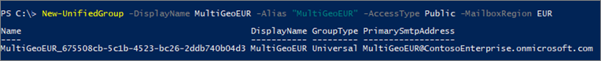

# Create a Microsoft 365 Group with a specific preferred data location

When users in a multi-geo environment create a Microsoft 365 Group, the group preferred data location (PDL) is automatically set to that of the user. Global, SharePoint, and Exchange Administrators can create groups in any region they select. 

If you need to create a group with a specific PDL, you can do that using from the SharePoint admin center or through the Exchange Online New-UnifiedGroup Microsoft PowerShell cmdlet. When you do this, both the group mailbox and SharePoint site associated with the group will be provisioned in the specified PDL.

To create a Microsoft 365 Group with the PDL that you specify, go to the SharePoint admin center in the geo location where you want to create the group site.

For example:

If you want to create a group site in your Australia location, you can go to https://ContosoAUS-admin.sharepoint.com/_layouts/15/online/AdminHome.aspx#/siteManagement

1. Select **+ Create**.
2. Follow the process to create a group site.

Your group site will be provisioned in the geo location corresponding to the SharePoint admin center from which you initiated the site creation request. 

Using Exchange PowerShell 

Connect to Exchange Online PowerShell and pass the parameter *-MailBoxRegion* with the geo location code.

For example: 

```PowerShell
New-UnifiedGroup -DisplayName MultiGeoEUR -Alias "MultiGeoEUR" -AccessType Public -MailboxRegion EUR 
```



Note that SharePoint group site provisioning is on-demand. The site will be provisioned the first time a group owner or member attempts to access it.

## Geo location codes

[!INCLUDE [Microsoft 365 Multi-Geo locations](../includes/microsoft-365-multi-geo-locations.md)]

## Related topics

[Connect to Exchange Online PowerShell](/powershell/exchange/connect-to-exchange-online-powershell)
