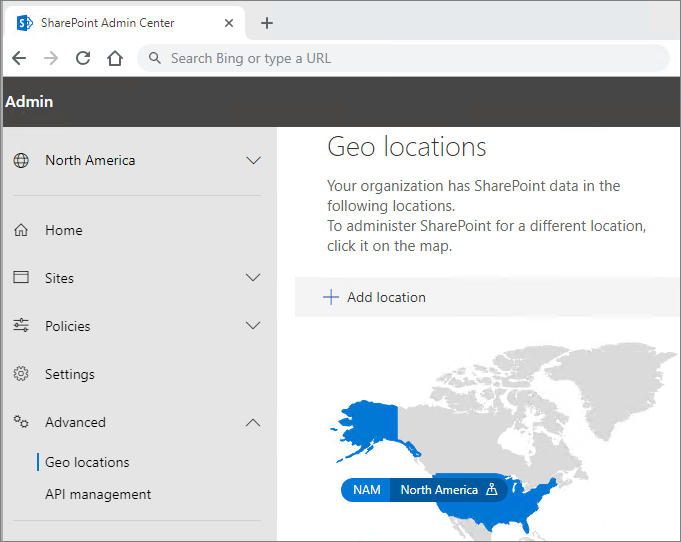

# Multi-Geo Capabilities in OneDrive and SharePoint Online

Multi-Geo capabilities in OneDrive and SharePoint Online enables control of shared resources like SharePoint team sites and Microsoft 365 Group mailboxes stored at rest in a country or region.

Each user, Group mailbox, and SharePoint site has a Preferred Data Location (PDL) which denotes the geo location where related data is to be stored. Users' personal data (Exchange mailbox and OneDrive) along with any Microsoft 365 Groups or SharePoint sites that they create can be stored in the specified geo location to meet data residency requirements. You can [specify different administrators for each geo location](add-a-sharepoint-geo-admin.md).

Users get a seamless experience when using Microsoft 365 services, including Office applications, OneDrive, and Search. See [User experience in a multi-geo environment](multi-geo-user-experience.md) for details.

## OneDrive

Each user's OneDrive can be provisioned in or [moved by an administrator](move-onedrive-between-geo-locations.md) to a satellite location in accordance with the user's PDL. Personal files are then kept in that geo location, though they can be shared with users in other geo locations.

## SharePoint Sites and Groups

Management of the Multi-Geo feature is available through the SharePoint admin center. Detailed information can be found in the [corresponding blog post](https://techcommunity.microsoft.com/t5/Office-365-Blog/Now-available-Multi-Geo-in-SharePoint-and-Office-365-Groups/ba-p/263302).

When a user creates a SharePoint group-connected site in a multi-geo environment, their PDL is used to determine the geo location where the site and its associated Group mailbox is created. (If the user's PDL value hasn't been set, or has been set to geo location that hasn't been configured as a satellite location, then the site and mailbox are created in the central location.)

Microsoft 365 services other than Exchange, OneDrive, and SharePoint are not Multi-Geo. However, Microsoft 365 Groups that are created by these services will be stamped with the PDL of the creator and their Exchange Group mailbox and SharePoint O365 Group Site provisioned in the corresponding geo. 

## Managing the multi-geo environment

Setting up and managing your multi-geo environment is done through the SharePoint admin center. 

(Some actions, such as moving a SharePoint site or a OneDrive site require Microsoft PowerShell.)

## See also

[Multi-Geo in SharePoint and Microsoft 365 Groups](https://techcommunity.microsoft.com/t5/Office-365-Blog/Now-available-Multi-Geo-in-SharePoint-and-Office-365-Groups/ba-p/263302)

[Administering a multi-geo environment](administering-a-multi-geo-environment.md)

[SharePoint storage quotas in multi-geo environments](sharepoint-multi-geo-storage-quota.md)

[Administering Exchange Online mailboxes in a multi-geo environment](administering-exchange-online-multi-geo.md)
