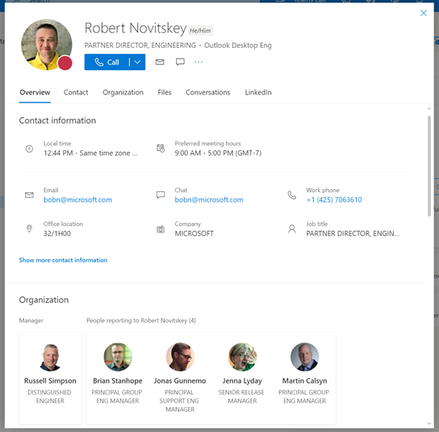

# Microsoft 365 Multi-Tenant Organization People Search Private Preview

## Overview

The Private Preview program is designed to offer select customers the opportunity to try out the multi-tenant people search feature. You can then validate the scenario and provide feedback to the product development team. The purpose of this article is to:

- Give an overview of the feature.
- Define use cases that we currently support as part of the preview.
- Provide instructions on how you can configure this feature and test it.

## Feature Overview

The MTO People Search is a collaboration feature that enables search and discovery of people across multiple tenants. A tenant admin can enable a Cross-Tenant synchronization will allow users to be synced into another tenant and be discoverable in the global address list. Once enabled, users will be able to search and discover synced user profiles from the other tenant and view their corresponding people card.

> *Fig 1. AAD sync illustration*

### Example

Cameron from Fabrikam has been synced to the target tenant, Woodgrove. Megan from Woodgrove would like to search and view Cameron's people card in Teams. After Cameron has been synced, Megan can search and discover Cameron's people card in any of the Microsoft 365 apps.

> *Fig 2 User is able to view a limited people card*

### In Tenant view of People Card

### Known Limitations

- The teams audio and video call buttons will direct the call to the users Home tenant instance (Fabrikam) and not the Target tenant teams instance (Woodgrove).

- The current experience provides limited information on the people card (basic contact information, job title and office location).

### Prerequisites

To test the MTO people search scenario, it is assumed that you already have the following settings:

- Two Azure AD/Microsoft 365 tenants

- The tenants are enabled for Private Preview of Cross Tenant Synchronization

- Provisioned users from Home to target tenants. [Instructions to enable Tenant-to-Tenant sync](https://github.com/ArvindHarinder1/CrossTenantSynchronization/blob/main/CrossTenantSynchronization.md)

### Use Cases

Multi-tenant organization people search is supported across a range of scenarios and Microsoft 365 applications. Some of the scenarios you can test and validate are described below:

1. **Microsoft Outlook (OWA, Desktop and Mobile)**

   - <alice@fabrikam.com> searches for "Bob" on the centralized search bar in OWA and gets the results and can view Bobs people card with limited profile information.
   - <alice@fabrikam.com> types in "Bob" in the To line of the email and can send an email to Bob after getting the results for <bob@woodgrove.ms>.
   - <alice@fabrikam.com> \@mentions "Bob" in the body of the email and can get the result for <bob@woodgrove.ms>.
   - <alice@fabrikam.com> types in "Bob" in the cc line of the email and can get the result for <bob@woodgrove.ms>.
   - Alice can hover and/or click on Bob's facepile to view Bob's limited people card.

2. **Microsoft OneDrive/Sharepoint**

   - <alice@fabrikam.com> searches for "Bob" in the centralized search bar on SharePoint and can get the result for <bob@woodgrove.ms>.
   - Alice can hover and/or click on Bob's facepile to view Bob's limited people card.
   - Alice can share and collaborate on Office documents with Bob.

3. **Microsoft Teams (Web, Desktop or Mobile App)**

   - <alice@fabrikam.com> searches for "Bob" on the Teams people picker and can view Bob's limited people card.
   - <alice@fabrikam.com> searches for "Bob" on the Teams power bar and can view Bob's limited people card Team membership.

4. **Bing for Business**

   - <alice@fabrikam.com> searches for "Bob" on the search bar and can view Bob's limited people card (<bob@woodgrove.ms>).

### Key Terminology

- Home tenant: The tenant you want to search from. The direction of the search is *outbound*.

- Resource tenant: The tenant you want to search in. The direction of the search is *inbound*.

- A tenant can be both home and resource tenant simultaneously.

- Home tenant admin: The IT admin in the home tenant.

- Cross-Tenant synchronization is a feature enables multi-tenant organizations to grant users access to applications in other tenants within the organization. It achieves this result by synchronizing internal member users from a home tenant into a resource tenant as external B2B users.

## Contact Us

You can contact the Cross Tenant People Search team via email at [MTOPeopleSearchPreview@service.microsoft.com](mailto:MTOPeopleSearchPreview@service.microsoft.com).
