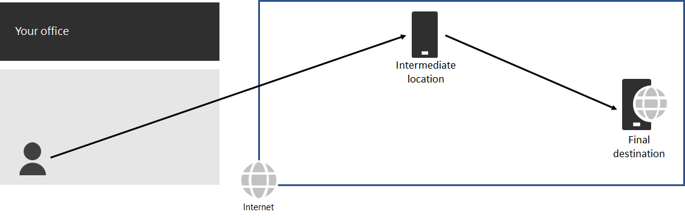

# Step 3: Avoid network hairpins

*This step is required and applies to both the E3 and E5 versions of Microsoft 365 Enterprise*

A [network hairpin](https://docs.microsoft.com/office365/enterprise/office-365-network-connectivity-principles#BKMK_P3) happens when traffic bound for a destination is first directed to another intermediate location, such as an on-premises security stack, cloud access broker, or cloud-based web gateway. Here is an example.

A network hairpin could also be caused by poor routing on the Internet due to network service providers. 

A hairpin adds latency and can potentially redirect traffic to a geographically distant location.

To optimize performance for traffic to Microsoft 365 cloud-based services, check whether the ISP providing the local Internet connection has a direct peering relationship with the Microsoft Global Network in close proximity to that location. These connections do not have hairpins.

If you use cloud-based network or security services for your Microsoft 365 traffic, ensure that the hairpinning effect is evaluated and its impact on performance is understood. Examine the following:

- The number and locations of your service providers through which the traffic is forwarded in relationship to your branch offices and Microsoft Global Network peering points 
- The quality of the network peering relationship of the service provider with your ISP and Microsoft 
- The performance impact of backhauling in the service provider infrastructure

Whenever possible, configure your edge routers to send trusted Microsoft 365 traffic directly, instead of proxying or tunneling through a third-party cloud or cloud-based network security vendor that processes your Internet traffic. 

As an interim checkpoint, you can see the [exit criteria](networking-exit-criteria.md#crit-networking-step3) for this step.

## Next step

|||
|:-------|:-----|
||[Configure traffic bypass](networking-configure-proxies-firewalls.md)|
