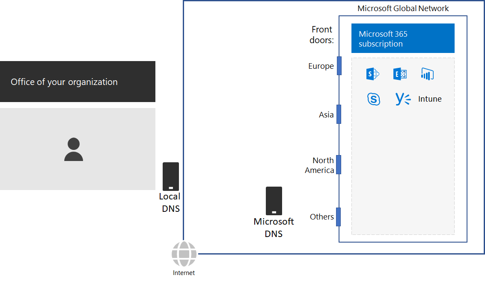
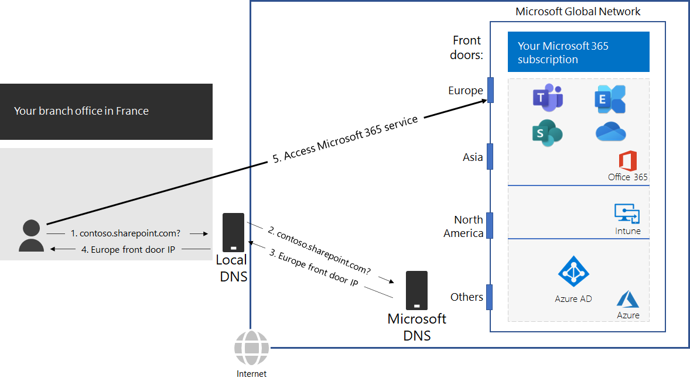

# Step 2: Configure local Internet connections for each office

*This step is required and applies to both the E3 and E5 versions of Microsoft 365 Enterprise*

In Step 2, you ensure that each of your offices have local Internet connections and use local DNS servers. Both of these elements are required to reduce connection latency and ensure that on-premises client computers make connections to the nearest point of entry to Microsoft 365 cloud-based services.

In traditional networks for large organizations, Internet traffic travels across the network backbone to a central Internet connection. This does not work well for optimizing performance to a globally distributed Software-as-a-Service (SaaS) infrastructure, which includes the Office 365 and Intune products in Microsoft 365.

The Microsoft Global Network includes a *Distributed Service Front Door* infrastructure, a highly available and scalable network edge with geographically distributed locations. It terminates end user connections at a front door server and efficiently routes end user traffic within the Microsoft Global Network.

For the best performance, on-premises clients should access a front door location that is geographically closest to them, rather than sending the traffic over a network backbone and to the front door that is closest to the organization’s central Internet connection.

Here’s an example.

When a user in the Paris branch office wants to access a SharePoint Online site:

1. It sends a DNS query to resolve a name, such as contoso.sharepoint.com. 
2. The DNS server provided by the ISP forwards that query to a Microsoft DNS server.
3. Microsoft’s DNS servers match the source IP address of the forwarded DNS query to the region of the world assigned that address. The Microsoft DNS server responds with the IP address of the nearest Microsoft Network front door in Europe.
4. The ISP DNS server sends that IP address to the user.
5. The user initiates a connection to the SharePoint server through the Europe front door.

To direct a client request to the geographically nearest front door, Microsoft’s DNS servers use the DNS queries corresponding the client’s initial connection request. Therefore, for the lowest network latency:

- All offices of your organization should have local Internet connections for [Optimize](https://docs.microsoft.com/office365/enterprise/office-365-network-connectivity-principles#new-office-365-endpoint-categories) category network traffic.
- Each local Internet connection should be using a regionally local DNS server for outbound Internet traffic from that location.

For more information, see [Egress network connections locally](https://docs.microsoft.com/office365/enterprise/office-365-network-connectivity-principles#egress-network-connections-locally). 

As an interim checkpoint, you can see the [exit criteria](networking-exit-criteria.md#crit-networking-step2) for this step.

## Next step

|||
|:-------|:-----|
||[Avoid network hairpins](networking-avoid-network-hairpins.md)|
