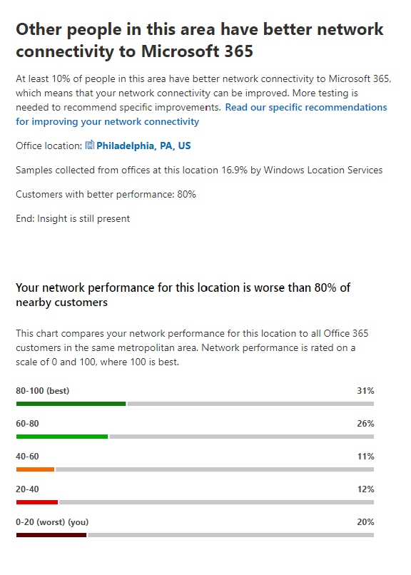
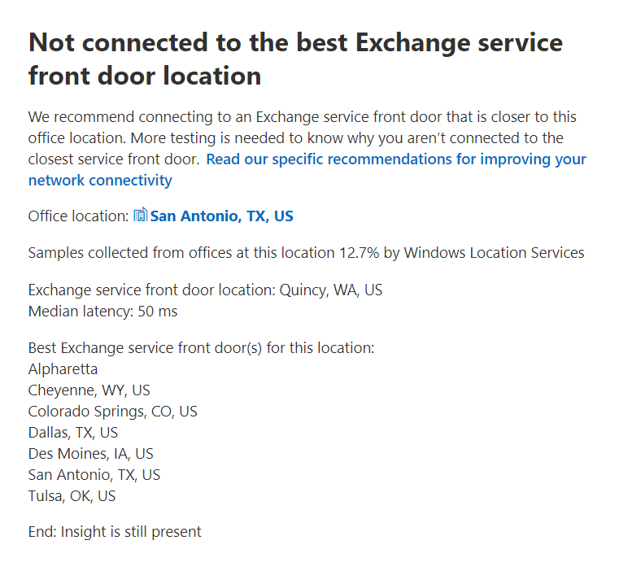

# Microsoft 365 Network Insights

**Network insights** are performance metrics collected from your Microsoft 365 tenant, and available to view only by administrative users in your tenant. Insights are displayed in the Microsoft 365 Admin Center at <https://portal.microsoft.com/adminportal/home#/networkperformance>.

Insights are intended to help in designing network perimeters for your office locations. Each insight provides live details about the performance characteristics for a specific common issue for each geographic location where users are accessing your tenant.

These are network insights that may be shown for each office location:

- [Backhauled network egress](#backhauled-network-egress)
- [Network intermediary device](#network-intermediary-device)
- [Better performance detected for customers near you](#better-performance-detected-for-customers-near-you)
- [Use of a non-optimal Exchange Online service front door](#use-of-a-non-optimal-exchange-online-service-front-door)
- [Use of a non-optimal SharePoint Online service front door](#use-of-a-non-optimal-sharepoint-online-service-front-door)
- [Low download speed from SharePoint front door](#low-download-speed-from-sharepoint-front-door)
- [China user optimal network egress](#china-user-optimal-network-egress)

These are tenant-level network insights that may be shown for the tenant:

- [Exchange sampled connections affected by connectivity issues](#exchange-sampled-connections-affected-by-connectivity-issues)
- [SharePoint sampled connections affected by connectivity issues](#sharepoint-sampled-connections-affected-by-connectivity-issues)

These insights also appear in the productivity score pages.

## Backhauled network egress

This insight displays if the network insights service detects that the distance from a given user location to the network egress is greater than 500 miles (800 kilometers). This may indicate that Microsoft 365 traffic is being backhauled to a common Internet edge device or proxy.

This insight is abbreviated as "Egress" in some summary views.

:::image type="content" alt-text="Screenshot shows the insight for backhauled network egress." source="../media/m365-mac-perf/m365-mac-perf-insights-detail-backhauled.png":::

### What does this mean?

This identifies that the distance between the office location and the network egress is more than 500 miles (800 kilometers). The office location is identified by an obfuscated client machine location and the network egress location is identified by using reverse IP Address to location databases. The office location may be inaccurate if Windows Location Services is disabled on machines. The network egress location may be inaccurate if the reverse IP address database information is inaccurate.

Details for this insight include:

- Office location
- Estimated percentage of total tenant user at the location
- Current network egress location
- Relevance of the egress location
- Distance between the location and the current egress point
- The date the condition was first detected
- The date the condition was resolved

### What should I do?

We recommend network egress as close as possible to the office location. Microsoft 365 traffic should route optimally to Microsoft's global network and to the nearest Microsoft 365 service front door. Having close network egress to users office locations also allows for improved performance as Microsoft expands both network points of presence and Microsoft 365 service front doors in the future.

For more information about how to resolve this issue, see [Egress network connections locally](microsoft-365-network-connectivity-principles.md#egress-network-connections-locally) in [Microsoft 365 Network Connectivity Principles](microsoft-365-network-connectivity-principles.md).

## Network intermediary device

This insight displays if we detected devices between your users and Microsoft's network. We recommend that latency-sensitive Microsoft 365 network traffic bypass such devices. This recommendation is additionally described in [Microsoft 365 Network Connectivity Principles](microsoft-365-network-connectivity-principles.md).

One network intermediary insight we show is SSL break and inspection when network intermediary devices intercept and decrypt critical Microsoft 365 network endpoints for Exchange, SharePoint, and Teams.

### What does this mean?

Network intermediary devices such as proxy servers, VPNs, and data loss prevention devices can affect performance and stability of Microsoft 365 clients where traffic is intermediated.

### What should I do?

Configure the network intermediary device that was detected to bypass processing for Microsoft 365 network traffic.

## Better performance detected for customers near you

This insight displays if the network insights service detects that a significant number of customers in your metro area have better performance than users at this office location.

This insight is abbreviated as "Peers" in some summary views.

> [!div class="mx-imgBorder"]
> 

### What does this mean?

This insight examines the aggregate performance of Microsoft 365 customers in the same city as this office location. This insight displays if the average latency of your users is 10% greater than the average latency of neighboring tenants.

### What should I do?

There could be many reasons for this condition, including latency in your corporate network or ISP, bottlenecks, or architecture design issues. Examine the latency between each hop in the route between your office network and the current Microsoft 365 front door. For more information, see [Microsoft 365 Network Connectivity Principles](microsoft-365-network-connectivity-principles.md).

## Use of a non-optimal Exchange Online service front door

This insight displays if the network insights service detects that users in a specific location aren't connecting to an optimal Exchange Online service front door.

This insight is abbreviated as "Routing" in some summary views.

> [!div class="mx-imgBorder"]
> 

### What does this mean?

We list Exchange Online service front doors that are suitable for use from the office location city. If the current test shows use of an Exchange Online service front door not on this list, then we make this recommendation.

### What should I do?

Network backhaul might cause use of a non-optimal Exchange Online service front door, in which case we recommend local and direct network egress. If you have implemented a remote DNS Recursive Resolver server, we recommend aligning the server configuration with the network egress.

## Use of a non-optimal SharePoint Online service front door

This insight displays if the network insights service detects that users in a specific location aren't connecting to the closest SharePoint Online service front door.

This insight is abbreviated as "Afd" in some summary views.

:::image type="content" alt-text="Screenshot of a summary view for a non-optimal SPO front door usage." source="../media/m365-mac-perf/m365-mac-perf-insights-detail-front-door-spo.png":::

### What does this mean?

We identify the SharePoint Online service front door that the test client is connecting to, and then we compare the office location city to the expected SharePoint Online service front door for that city. If the test client service front door and the expected service front door match, we recommend connecting to a SharePoint service front door closer to the office location.

### What should I do?

Network backhaul before the corporate network egress could cause non-optimal SharePoint Online service front door use. If so, try local and direct network egress. Non-optimal SharePoint Online service front door use could also be caused by a remote DNS Recursive Resolver server, in which case we recommend aligning the DNS Recursive Resolver server with the network egress.

## Low download speed from SharePoint front door

This insight displays if the network insights service detects that bandwidth between the specific office location and SharePoint Online is less than 1 MBps.

This insight is abbreviated as "Throughput" in some summary views.

### What does this mean?

The download speed that a user can get from SharePoint Online and OneDrive for Business service front doors is measured in megabytes per second (MBps). If this value is less than 1 MBps, then we provide this insight.

### What should I do?

To improve download speeds, your organization might need to increase bandwidth. Alternatively, network congestion might exist between computers at the office location and the SharePoint Online service front door. This condition restricts the download speed available to users even if sufficient bandwidth is available.

## China user optimal network egress

This insight displays if your organization has users in China connecting to your Microsoft 365 tenant in other geographic locations.

### What does this mean?

If your organization has private WAN connectivity, we recommend configuring a network WAN circuit from your office locations in China that have network egress to the Internet in any of the following locations:

- Hong Kong Special Administrative Region
- Japan
- Taiwan
- South Korea
- Singapore
- Malaysia

Internet egress farther away from users than these locations reduces performance, and egress in China may cause high latency and connectivity issues due to cross-border congestion.

### What should I do?

For more information about how to mitigate performance issues related to this insight, see [Microsoft 365 global tenant performance optimization for China users](microsoft-365-networking-china.md).

## Exchange sampled connections affected by connectivity issues

This insight shows when 50% or more of the sampled connections are affected. The impact is defined by the Exchange assessment being below 60% for each sample.

### What does this mean?

This insight indicates that most of your users likely experience issues with Outlook connecting to Exchange Online. The percentage of samples represents the percentage of users below 60 points.

### What should I do?

Enable office location network connectivity visibility if you haven't already done so. Identify which offices are affected by poor network connectivity and find ways to improve the network perimeter at each that connects the users to Microsoft's network.

## SharePoint sampled connections affected by connectivity issues

This insight shows when 50% or more of the sampled connections are affected. The impact is defined by the SharePoint assessment being below 40% for each sample.

### What does this mean?

This insight indicates that most of your users are likely experiencing issues with SharePoint and OneDrive. The percentage of samples represents the percentage of users who show below 40 points.

### What should I do?

Enable office location network connectivity visibility if you haven't already done so. Identify which offices are affected by poor network connectivity and find ways to improve the network perimeter at each that connects the users to Microsoft's network.

## Related topics

[Network connectivity in the Microsoft 365 Admin Center](office-365-network-mac-perf-overview.md)

[Microsoft 365 network assessment](office-365-network-mac-perf-score.md)

[Microsoft 365 network connectivity test tool](office-365-network-mac-perf-onboarding-tool.md)

[Microsoft 365 Network Connectivity Location Services](office-365-network-mac-location-services.md)
