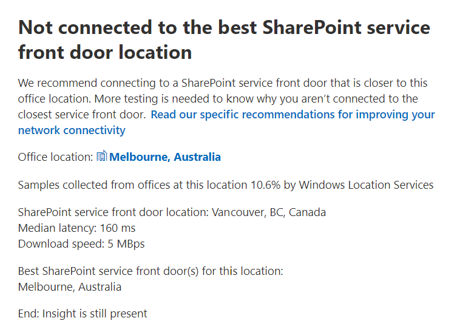

# Microsoft 365 Network Insights

**Network insights** are performance metrics collected from your Microsoft 365 tenant, and available to view only by administrative users in your tenant. Insights are displayed in the Microsoft 365 Admin Center at <https://portal.microsoft.com/adminportal/home#/networkperformance>.

Insights are intended to help in designing network perimeters for your office locations. Each insight provides live details about the performance characteristics for a specific common issue for each geographic location where users are accessing your tenant.

There are six specific network insights that may be shown for each office location:

- [Backhauled network egress](#backhauled-network-egress)
- [Network intermediary device are affecting your network](#network-intermediary-devices-are-affecting-your-network)
- [Other people in this area have better network connectivity to Microsoft 365](#other-people-in-this-area-have-better-network-connectivity-to-Microsoft-365)
- [Not connected to the best Exchange service front door location](#not-connected-to-the-best-Exchange-service-front-door-location)
- [Not connected to the best SharePoint service front door location](#not-connected-to-the-best-SharePoint-service-front-door-location)
- [Poor connectivity to Microsoft Teams](#poor-connectivity-to-Microsoft-Teams)
- [Low download speed from SharePoint front door](#low-download-speed-from-sharepoint-front-door)
- [China user optimal network egress](#china-user-optimal-network-egress)

There are two tenant level network insights that may be shown for the tenant. These also appear in the productivity score pages:

- [Exchange sampled connections impacted by connectivity issues](#exchange-sampled-connections-impacted-by-connectivity-issues)
- [SharePoint sampled connections impacted by connectivity issues](#sharepoint-sampled-connections-impacted-by-connectivity-issues)

## Backhauled network egress

This insight will be displayed if the network insights service detects that the distance from a given user location to the network egress is greater than 500 miles (800 kilometers), indicating that Microsoft 365 traffic is being backhauled to a common Internet edge device or proxy.

This insight is abbreviated as "Egress" in some summary views.

[!div class="mx-imgBorder"]

### What does this mean?

This identifies that the distance between the office location and the network egress is more than 500 miles (800 kilometers). The office location is identified by an obfuscated client machine location and the network egress location is identified by using reverse IP Address to location databases. The office location may be inaccurate if Windows Location Services is disabled on machines. The network egress location may be inaccurate if the reverse IP Address database information is inaccurate.

Details for this insight include the office location, estimated percentage of total tenant user at the location, the current network egress location, relevance of the egress location, the distance between the location and the current egress point, the date the condition was first detected, and the date the condition was resolved.

### What should I do?

For this insight, we would recommend network egress closer to the office location so that connectivity can route optimally to Microsoft's global network and to the nearest Microsoft 365 service front door. Having close network egress to users office locations also allows for improved performance in the future as Microsoft expands both network points of presence and Microsoft 365 service front doors in the future.

For more information about how to resolve this issue, see [Egress network connections locally](microsoft-365-network-connectivity-principles.md#egress-network-connections-locally) in [Office 365 Network Connectivity Principles](microsoft-365-network-connectivity-principles.md).

## Network intermediary devices are affecting your network

This insight will be displayed if we detected devices between your users and Microsoft's network which may impact the Office 365 user experience. It is recommended that these be bypassed for specific Microsoft 365 network traffic that is destined for Microsoft datacenters. This recommendation is additionally described in [Microsoft 365 Network Connectivity Principles](microsoft-365-network-connectivity-principles.md). 

One network intermediary insight we show is SSL break and inspection when critical Office 365 network endpoints for Exchange, SharePoint and Teams are intercepted and decrypted by network intermediary devices.

### What does this mean?

Network intermediary devices such as proxy servers, VPNs, and data loss prevention devices can affect performance and stability of Microsoft 365 clients where traffic is intermediated.

### What should I do?

Configure the network intermediary device that was detected to bypass processing for Microsoft 365 network traffic.

## Other people in this area have better network connectivity to Microsoft 365 

This insight will be displayed if the network insights service detects that a significant number of customers in your metro area have better performance than users in your organization at this office location.

This insight is abbreviated as "Peers" in some summary views.

### What does this mean?

This insight examines the aggregate performance of Microsoft 365 customers in the same city as this office location. This insight is displayed if the average latency of your users is 10% greater than the average latency of neighboring tenants.

### What should I do?

There could be many reasons for this condition, including latency in your corporate network or ISP, bottlenecks, or architecture design issues. Examine the latency between each hop in the route between your office network and the current Microsoft 365 front door. For more information, see [Microsoft 365 Network Connectivity Principles](microsoft-365-network-connectivity-principles.md).

## Not connected to the best Exchange service front door location 

This insight will be displayed if the network insights service detects that users in a specific location are not connecting to an optimal Exchange Online service front door.

This insight is abbreviated as "Routing" in some summary views.

### What does this mean?

We list Exchange Online service front doors which are suitable for use from the office location city with good performance. If the current test shows use of an Exchange Online service front door not on this list, then we call out this recommendation.

### What should I do?

Use of a non-optimal Exchange Online service front door could be caused by network backhaul before the corporate network egress in which case we recommend local and direct network egress. It could also be caused by use of a remote DNS Recursive Resolver server in which case we recommend aligning the DNS Recursive Resolver server with the network egress.

## Not connected to the best SharePoint service front door location 

This insight will be displayed if the network insights service detects that users in a specific location are not connecting to the closest SharePoint Online service front door.

This insight is abbreviated as "Afd" in some summary views.

### What does this mean?

We identify the SharePoint Online service front door that the test client is connecting to. Then for the office location city we compare that to the expected SharePoint Online service front door for that city. If it doesn't match, then we make this recommendation.

### What should I do?

Use of a non-optimal SharePoint Online service front door could be caused by network backhaul before the corporate network egress in which case we recommend local and direct network egress. It could also be caused by use of a remote DNS Recursive Resolver server in which case we recommend aligning the DNS Recursive Resolver server with the network egress.

## Poor connectivity to Microsoft Teams

This insight will be displayed if the network insights service detects that some users are experiencing poor call quality in Microsoft Teams.

### What does this mean?

This tests for UDP connectivity to the Microsoft Teams service front door. If this is blocked then Microsoft Teams may still work using TCP, but audio and video will be impaired.

### What should I do?

Unblock, improve, or upgrade your network perimeter and internet connectivity so that it meets the Teams UDP media requirements. See [Microsoft Teams Media connectivity](https://docs.microsoft.com/en-us/Microsoft-365/Enterprise/office-365-network-mac-perf-onboarding-tool?view=o365-worldwide#media-connectivity-audio-video-and-application-sharing).

## Low download speed from SharePoint front door

This insight will be displayed if the network insights service detects that bandwidth between the specific office location and SharePoint Online is less than 1 MBps.

This insight is abbreviated as "Throughput" in some summary views.

### What does this mean?

The download speed that a user can get from SharePoint Online and OneDrive for Business service front doors is measured in megabytes per second (MBps). If this value is less than 1 MBps then we provide this insight.

### What should I do?

To improve download speeds, bandwidth may need to be increased. Alternatively, there may be network congestion between user machines at the office location and the SharePoint Online service front door. This is sometimes called congestive loss and it restricts the download speed available to users even if sufficient bandwidth is available.

## China user optimal network egress

This insight will be displayed if your organization has users in China connecting to your Microsoft 365 tenant in other geographic locations. 

### What does this mean?

If your organization has private WAN connectivity, we recommend configuring a network WAN circuit from your office locations in China that has network egress to the Internet in any of the following locations:

- Hong Kong
- Japan
- Taiwan
- South Korea
- Singapore
- Malaysia

Internet egress further away from users than these locations will reduce performance, and egress in China may cause high latency and connectivity issues due to cross-border congestion.

### What should I do?

For more information about how to mitigate performance issues related to this insight, see [Microsoft 365 global tenant performance optimization for China users](microsoft-365-networking-china.md).

## Exchange sampled connections impacted by connectivity issues

This insight will show when 50% or more of the sampled connections are impacted. The impact is defined by the Exchange assessment being below 60% for each sample.

### What does this mean?

It is an indication that the majority of your users are likely to be experiencing user experience issues with Outlook connecting to Exchange Online. The percentage of samples likely represents the percentage of users who show below 60 points.  

### What should I do?

Enable office location network connectivity visibility if you have not already done so. You want to identify which offices are impacted by poor network connectivity that is impacting Exchange and find ways to improve the network perimeter at each that connects the users to Microsoft's network.

## SharePoint sampled connections impacted by connectivity issues

This insight will show when 50% or more of the sampled connections are impacted. The impact is defined by the SharePoint assessment being below 40% for each sample.

### What does this mean?

It is an indication that the majority of your users are likely to be experiencing user experience issues with SharePoint and OneDrive. The percentage of samples likely represents the percentage of users who show below 40 points.  

### What should I do?

Enable office location network connectivity visibility if you have not already done so. You want to identify which offices are impacted by poor network connectivity that is impacting SharePoint and find ways to improve the network perimeter at each that connects the users to Microsoft's network.

## Related topics

[Network connectivity in the Microsoft 365 Admin Center](office-365-network-mac-perf-overview.md)

[Microsoft 365 network assessment](office-365-network-mac-perf-score.md)

[Microsoft 365 network connectivity test tool](office-365-network-mac-perf-onboarding-tool.md)

[Microsoft 365 Network Connectivity Location Services](office-365-network-mac-location-services.md)
