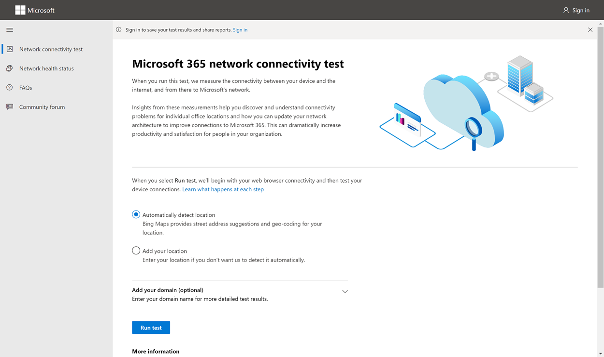
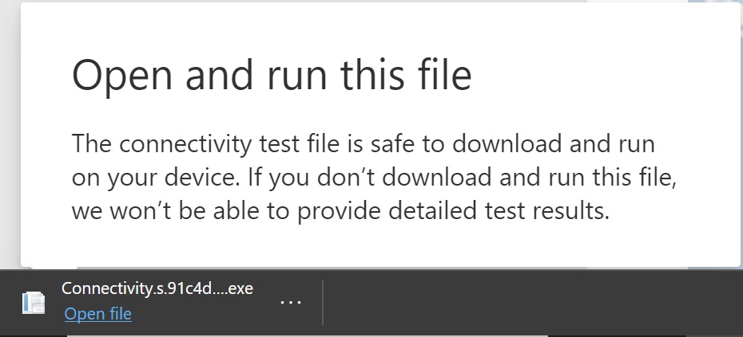
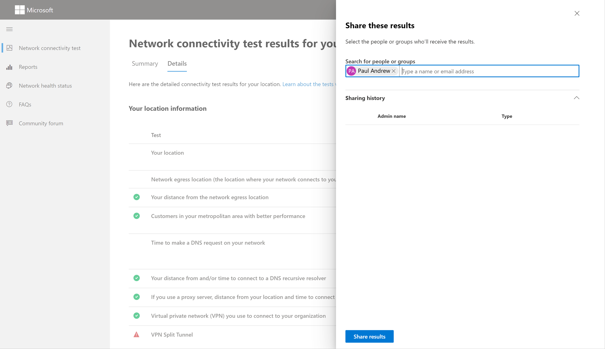
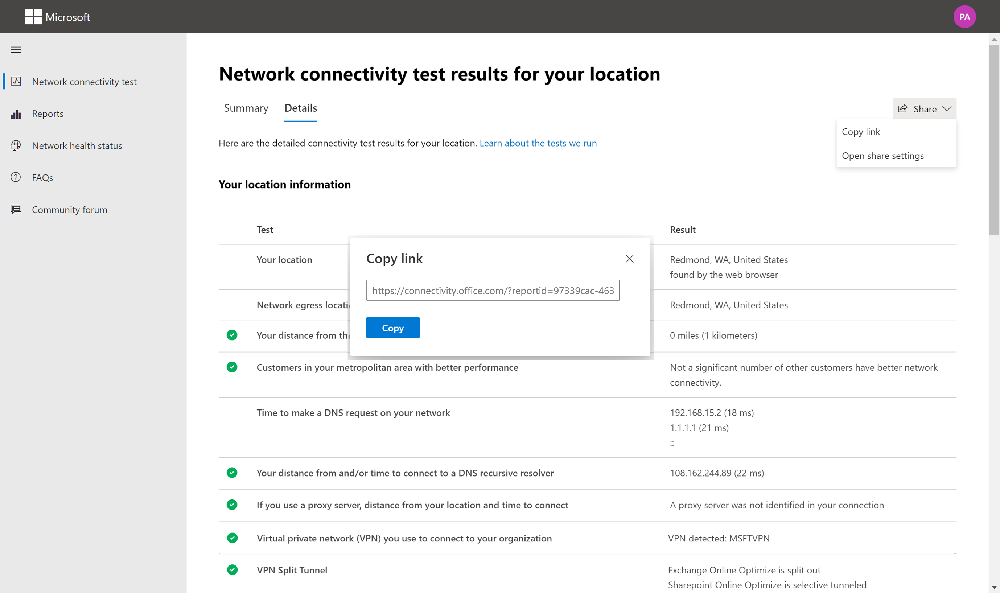
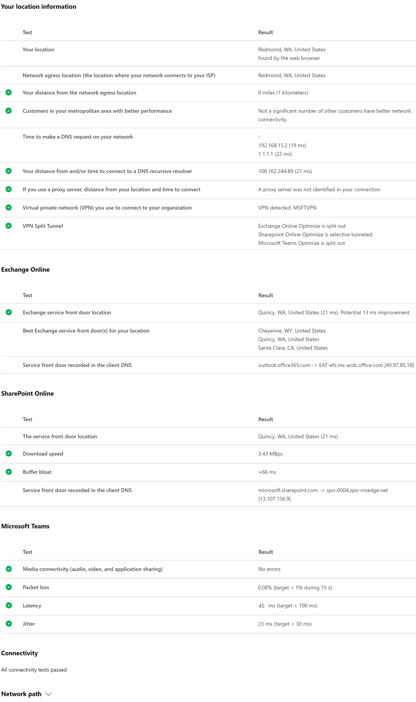
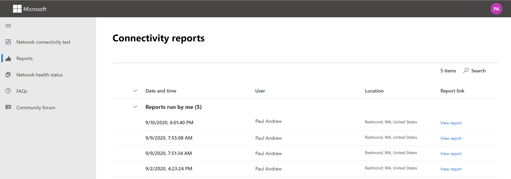
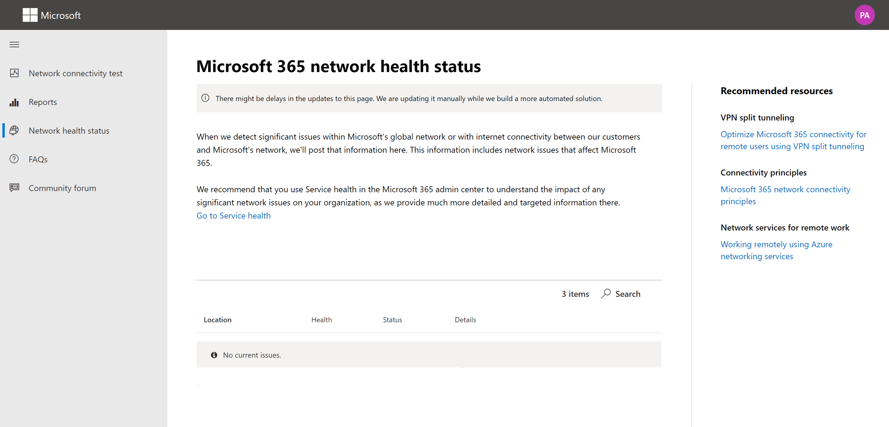
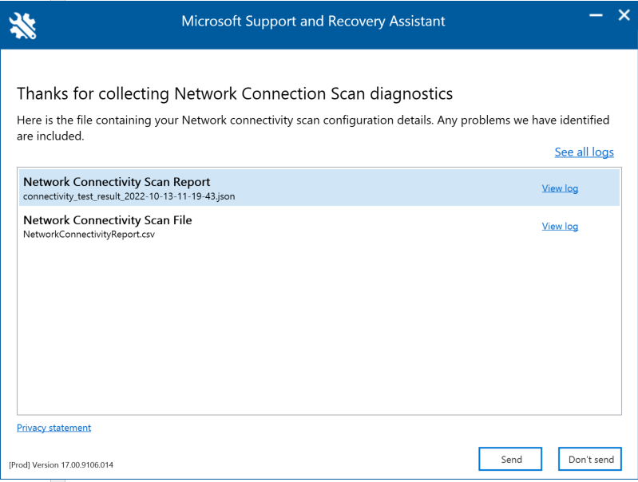
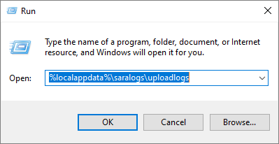
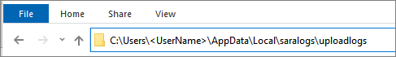

# Microsoft 365 network connectivity test tool

The Microsoft 365 network connectivity test tool is located at <https://connectivity.office.com>. It's an adjunct tool to the network assessment and network insights available in the Microsoft 365 admin center under the **Health | Connectivity** menu.

> [!IMPORTANT]
> It's important to sign in to your Microsoft 365 tenant as all test reports are shared with your administrator and uploaded to the tenant while you are signed in.

> [!div class="mx-imgBorder"]
> 

>[!NOTE]
>The network connectivity test tool supports tenants in WW Commercial but not GCC Moderate, GCC High, DoD or China.

Network insights in the Microsoft 365 Admin Center are based on regular in-product measurements for your Microsoft 365 tenant, aggregated each day. In comparison, network insights from the Microsoft 365 network connectivity test are run locally in the tool.

In-product testing is limited, and running tests local to the user collects more data resulting in deeper insights. Network insights in the Microsoft 365 Admin Center will show that there's a networking problem at a specific office location. The Microsoft 365 connectivity test can help to identify the root cause of that problem and provide a targeted performance improvement action.

We recommend that these insights be used together where networking quality status can be assessed for each office location in the Microsoft 365 Admin Center and more specifics can be found after deployment of testing based on the Microsoft 365 connectivity test.

## What happens at each test step

### Office location identification

When you click the *Run test* button, we show the running test page and identify the office location. You can type in your location by city, state, and country/region or choose to have it detected for you. If you detect the office location, the tool requests the latitude and longitude from the web browser and limits the accuracy to 300 meters by 300 meters before use. It's not necessary to identify the location more accurately than the building to measure network performance.

### JavaScript tests

After office location identification, we run a TCP latency test in JavaScript and we request data from the service about in-use and recommended Microsoft 365 service front door servers. When these tests are completed, we show them on the map and in the details tab where they can be viewed before the next step.

### Download the advanced tests client application

Next, we start the download of the advanced tests client application. We rely on the user to launch the client application and they must also have .NET 6.0 Runtime installed.

There are two parts to the Microsoft 365 network connectivity test: the web site <https://connectivity.office.com> and a downloadable Windows client application that runs advanced network connectivity tests. Most of the tests require the application to be run. It will populate results back into the web page as it runs.

You'll be prompted to download the advanced client test application from the web site after the web browser tests have completed. Open and run the file when prompted.

> [!div class="mx-imgBorder"]
> 

### Start the advanced tests client application

Once the client application starts, the web page will update to show this result. Test data will start to be received to the web page. The page updates each time new-data is received and you can review the data as it arrives.

### Advanced tests completed and test report upload

When the tests are completed, the web page and the advanced tests client will both show that. If the user is signed in, the test report will be uploaded to the customer's tenant.

## Sharing your test report

The test report requires authentication to your Microsoft 365 account. Your administrator selects how you can share your test report. The default settings allow for sharing of your reports with other user within your organization and the ReportID link is not available. Reports will expire by default after 90 days.

### Sharing your report with your administrator

If you're signed in when a test report occurs, the report is shared with your administrator.

### Sharing with your Microsoft account team, support or other personnel

Test reports (excluding any personal identification) are shared with Microsoft employees. This sharing is enabled by default and can be disabled by your administrator in the **Health | Network Connectivity** page in the Microsoft 365 Admin Center.

### Sharing with other users who sign in to the same Microsoft 365 tenant

You can choose users to share your report with. Being able to choose is enabled by default, but it can be disabled by your administrator.

> [!div class="mx-imgBorder"]
> 

### Sharing with anyone using a ReportID link

You can share your test report with anyone by providing access to a ReportID link. This link generates a URL that you can send to someone so that they can bring up the test report without signing in. This sharing is disabled by default and must be enabled by your administrator.

> [!div class="mx-imgBorder"]
> 

## Network Connectivity Test Results

The results are shown in the **Summary** and **Details** tabs. The summary tab shows a map of the detected network perimeter and a comparison of the network assessment to other Microsoft 365 customers nearby. It also allows for sharing of the test report. Here's what the summary results view looks like:

> [!div class="mx-imgBorder"]
> 

Here's an example of the details tab output. On the details tab we show a green circle check mark if the result was compared favorably. We show a red triangle exclamation point if the result exceeded a threshold indicating a network insight. The following sections describe each of the details tab results rows and explain the thresholds used for network insights.

> [!div class="mx-imgBorder"]
> 

### Your location information

This section shows test results related to your location.

#### Your location

The user location is detected from the users web browser. It can also be typed in at the user's choice. It's used to identify network distances to specific parts of the enterprise network perimeter. Only the city from this location detection and the distance to other network points are saved in the report.

The user office location is shown on the map view.

#### Network egress location (the location where your network connects to your ISP)

We identify the network egress IP address on the server side. Location databases are used to look up the approximate location for the network egress. These databases typically have an accuracy of about 90% of IP addresses. If the location looked up from the network egress IP address isn't accurate, this would lead to a false result. To validate if this error is occurring for a specific IP address, you can use publicly accessible network IP address location web sites to compare against your actual location.

#### Your distance from the network egress location

We determine the distance from that location to the office location. This is shown as a network insight if the distance is greater than **500 miles** (800 kilometers) since that is likely to increase the TCP latency by more than 25 ms and may affect user experience.

The map shows the network egress location in relation to the user office location indicating the network backhaul inside of the enterprise WAN.

Implement local and direct network egress from user office locations to the Internet for optimal Microsoft 365 network connectivity. Improvements to local and direct egress are the best way to address this network insight.

#### Proxy server information

We identify whether proxy server(s) are configured on the local machine to pass Microsoft 365 network traffic in the **Optimize** category. We identify the distance from the user office location to the proxy servers.

The distance is tested first by ICMP ping. If that fails, we test with TCP ping and finally we look up the proxy server IP address in an IP address location database. We show a network insight if the proxy server is further than **500 miles** (800 kilometers) away from the user office location.

#### Virtual private network (VPN) you use to connect to your organization

This test detects if you're using a VPN to connect to Microsoft 365. A passing result will show if you have no VPN, or if you have a VPN with recommended split tunnel configuration for Microsoft 365.

#### VPN Split Tunnel

Each **Optimize** category route for Exchange Online, SharePoint Online, and Microsoft Teams is tested to see if It's tunneled on the VPN. A split out workload avoids the VPN entirely. A tunneled workload is sent over the VPN. A selective tunneled workload has some routes sent over the VPN and some split out. A passing result will show if all workloads are split out or selective tunneled.

#### Customers in your metropolitan area with better performance

Network latency between the user office location and the Exchange Online service is compared to other Microsoft 365 customers in the same metro area. A network insight is shown if 10% or more of customers in the same metro area have better performance. This means their users will have better performance in the Microsoft 365 user interface.

This network insight is generated on the basis that all users in a city have access to the same telecommunications infrastructure and the same proximity to Internet circuits and Microsoft's network.

#### Time to make a DNS request on your network

This shows the DNS server configured on the client machine that ran the tests. It might be a DNS Recursive Resolver server however this is uncommon. It's more likely to be a DNS forwarder server, which caches DNS results and forwards any uncached DNS requests to another DNS server.

This is provided for information only and does not contribute to any network insight.

#### Your distance from and/or time to connect to a DNS recursive resolver

The in-use DNS Recursive Resolver is identified by making a specific DNS request and then asking the DNS Name Server for the IP Address that it received the same request from. This IP Address is the DNS Recursive Resolver and it will be looked up in IP Address location databases to find the location. The distance from the user office location to the DNS Recursive Resolver server location is then calculated. This is shown as a network insight if the distance is greater than **500 miles** (800 kilometers).

The location looked up from the network egress IP Address may not be accurate and this would lead to a false result from this test. To validate if this error is occurring for a specific IP Address, you can use publicly accessible network IP Address location web sites.

This network insight will specifically impact the selection of the Exchange Online service front door. To address this insight local and direct network egress should be a pre-requisite and then DNS Recursive Resolver should be located close to that network egress.

### Exchange Online

This section shows test results related to Exchange Online.

#### Exchange service front door location

The in-use Exchange service front door is identified in the same way that Outlook does this and we measure the network TCP latency from the user location to it. The TCP latency is shown and the in-use Exchange service front door is compared to the list of best service front doors for the current location. This is shown as a network insight if one of the best Exchange service front door(s) isn't in use.

Not using one of the best Exchange service front door(s) could be caused by network backhaul before the corporate network egress in which case we recommend local and direct network egress. It could also be caused by use of a remote DNS recursive resolver server in which case we recommend aligning the DNS recursive resolver server with the network egress.

We calculate a potential improvement in TCP latency (ms) to the Exchange service front door. This is done by looking at the tested user office location network latency and subtracting the network latency from the current location to the closets Exchange service front door. The difference represents the potential opportunity for improvement.

#### Best Exchange service front door(s) for your location

This lists the best Exchange service front door locations by city for your location.

#### Service front door recorded in the client DNS

This shows the DNS name and IP Address of the Exchange service front door server that you were directed to. It's provided for information only and there's no associated network insight.

### SharePoint Online

This section shows test results related to SharePoint Online and OneDrive.

#### The service front door location

The in-use SharePoint service front door is identified in the same way that the OneDrive client does and we measure the network TCP latency from the user office location to it.

#### Download speed

We measure the download speed for a 15 Mb file from the SharePoint service front door. The result is shown in megabytes per second to indicate what size file in megabytes can be downloaded from SharePoint or OneDrive in **one second**. The number should be similar to one tenth of the minimum circuit bandwidth in megabits per second. For example if you have a 100mbps internet connection, you may expect 10 megabytes per second (10 MBps).

#### Buffer bloat

During the 15Mb download we measure the TCP latency to the SharePoint service front door. This is the latency under load and it's compared to the latency when not under load. The increase in latency when under load is often attributable to consumer network device buffers being loaded (or bloated). A network insight is shown for any bloat of 100ms or more.

#### Service front door recorded in the client DNS

This shows the DNS name and IP Address of the SharePoint service front door server that you were directed to. It's provided for information only and there's no associated network insight.

### Microsoft Teams

This section shows test results related to Microsoft Teams.

#### Media connectivity (audio, video, and application sharing)

This tests for UDP connectivity to the Microsoft Teams service front door. If this is blocked, then Microsoft Teams may still work using TCP, but audio and video will be impaired. Read more about these UDP network measurements, which also apply to Microsoft Teams at [Media Quality and Network Connectivity Performance in Skype for Business Online](/skypeforbusiness/optimizing-your-network/media-quality-and-network-connectivity-performance).

#### Packet loss

Shows the UDP packet loss measured in a 10-second test audio call from the client to the Microsoft Teams service front door. This should be lower than **1.00%** for a pass.

#### Latency

Shows the measured UDP latency, which should be lower than **100ms**.

#### Jitter

Shows the measured UDP jitter, which should be lower than **30ms**.

#### Connectivity

We test for HTTP connectivity from the user office location to all of the required Microsoft 365 network endpoints. These are published at [https://aka.ms/o365ip](./urls-and-ip-address-ranges.md). A network insight is shown for any required network endpoints, which cannot be connected to.

Connectivity may be blocked by a proxy server, a firewall, or another network security device on the enterprise network perimeter. Connectivity to TCP port 80 is tested with an HTTP request and connectivity to TCP port 443 is tested with an HTTPS request. If there's no response the FQDN is marked as a failure. If there's an HTTP response code 407 the FQDN is marked as a failure. If there's an HTTP response code 403 then we check the Server attribute of the response and if it appears to be a proxy server we mark this as a failure. You can simulate the tests we perform with the Windows command-line tool curl.exe.

We test the SSL certificate at each required Microsoft 365 network endpoint that is in the optimize or allow category as defined at [https://aka.ms/o365ip](./urls-and-ip-address-ranges.md). If any tests do not find a Microsoft SSL certificate, then the encrypted network connected must have been intercepted by an intermediary network device. A network insight is shown on any intercepted encrypted network endpoints.

Where an SSL certificate is found that isn't provided by Microsoft, we show the FQDN for the test and the in-use SSL certificate owner. This SSL certificate owner may be a proxy server vendor, or it may be an enterprise self-signed certificate.

#### Network path

This section shows the results of an ICMP traceroute to the Exchange Online service front door, the SharePoint Online service front door, and the Microsoft Teams service front door. It's provided for information only and there's no associated network insight. There are three traceroutes provided. A traceroute to _outlook.office365.com_, a traceroute to the customers SharePoint front end or to _microsoft.sharepoint.com_ if one was not provided, and a traceroute to _world.tr.teams.microsoft.com_.

## Connectivity reports

When you are signed in you can review previous reports that you have run. You can also share them or delete them from the list.

> [!div class="mx-imgBorder"]
> 

## Network health status

This shows any significant health issues with Microsoft's global network, which might impact Microsoft 365 customers.

> [!div class="mx-imgBorder"]
> 

## Testing from the Command Line

We provide a command line executable that can be used by your remote deployment and execution tools and run the same tests as are available in the Microsoft 365 network connectivity test tool web site.

The command line test tool can be downloaded here: [Command Line Tool](https://connectivity.office.com/api/AnonymousConnectivityTest/DownloadStandAloneRichClient)

You can run it by double clicking the executable in Windows File Explorer, or you can start it from a command prompt, or you can schedule it with task scheduler.

The first time you launch the executable you will be prompted to accept the end user license agreement (EULA) before testing is performed. If you have already read and accepted the EULA you can create an empty file called Microsoft-365-Network-Connectivity-Test-EULA-accepted.txt in the current working directory for the executable process when it is launched. To accept the EULA you can type 'y' and press enter in the command line window when prompted.

The executable accepts the following  command line parameters:
- -h to show a link to this help documentation
- -testlist &lt;test&gt; Specifies tests to run. By default only basic tests are run. Valid test names include: all, dnsConnectivityPerf, dnsResolverIdentification, bufferBloat, traceroute, proxy, vpn, skype, connectivity, networkInterface
- -filepath &lt;filedir&gt; Directory path of test result files. Allowed value is absolute or relative path of an accessible directory
- -city &lt;city&gt; For the city, state, and country/region fields the specified value will be used if provided. If not provided then Windows Location Services (WLS) will be queried. If WLS fails the location will be detected fromthe machines network egress 
- -state &lt;state&gt;
- -country &lt;country&gt; 
- -proxy &lt;account&gt; &lt;password&gt; Proxy account name and password can be provided if you require a proxy to access the Internet

### Results
Output of results are written to a JSON file in a folder called TestResults which is created in the current working directory of the process unless it already exists. The filename format for the output is connectivity_test_result_YYYY-MM-DD-HH-MM-SS.json. The results are in JSON nodes that match the output shown on the web page for the Microsoft 365 network connectivity test tool web site. A new result file is created each time you run it and the standalone executable does not upload results to your Microsoft tenant for viewing in the Admin Center Network Connectivity pages. Front door codes, longitudes, and latitudes are not included in the result file.

### Launching from Windows File Explorer
You can simply double click on the executable to start the testing and a command prompt window will appear.

### Launching from the Command Prompt
On a CMD.EXE command prompt window you can type the path and name of the executable to run it. The filename is Microsoft.Connectivity.Test.exe

### Launching from Windows Task Scheduler
In Windows Task Scheduler you can add a task to launch the standalone test executable. You should specify the current working directory of the task to be where you have created the EULA accepted file since the executable will block until the EULA is accepted. You cannot interactively accept the EULA if the process is started in the background with no console.

### More details on the standalone executable
The commandline tool uses Windows Location Services to find the users City State Country/region information for determining some distances. If Windows Location Services is disabled in the control panel then user location based assessments will be blank. In Windows Settings "Location services" must be on and "Let desktop apps access your location" must also be on.

The commandline tool will attempt to install the .NET Framework if it is not already installed. It will also download the main testing executable from the Microsoft 365 network connectivity test tool and launch that.

## Test using the Microsoft Support and Recovery Assistant

[Microsoft Support and Recovery Assistant](https://aka.ms/SaRA_home) (Assistant) automates all the steps required to execute the command-line version of the Microsoft 365 network connectivity test tool on a user’s machine and creates a report similar to the one created by the web version of the connectivity test tool. Note, the Assistant runs the command line version of Microsoft 365 network connectivity test tool to produce the same JSON result file, but the JSON file is converted into .CSV file format.  

[Download and Run the Assistant Here](https://aka.ms/SaRA-NetworkConnectivity-Learn)

### Viewing Test Results

Reports can be accessed in the following ways:

The reports will be available on the below screen once the Assistant has finished scanning the user's machine. To access these reports, simply click on the &#8220;View log&#8221; option to view them.

> [!div class="mx-imgBorder"]
> 

Connectivity test results and Telemetry data are collected and uploaded to the **uploadlogs** folder. To access this folder, use one of the following methods:

- Open Run (**Windows logo key + R**), and run the **%localappdata%/saralogs/uploadlogs** command as follows:

> [!div class="mx-imgBorder"]
> 

- In File Explorer, type C:\Users\<UserName>\AppData\Local\saralogs\uploadlogs and press **Enter** as follows:

> [!div class="mx-imgBorder"]
> 

**Note:** &lt;UserName&gt; is the user's Windows profile name.
To view the information about the test results and telemetry, double-click and open the files.

> [!div class="mx-imgBorder"]
> 

### Types of result files

Microsoft Support and Recovery Assistant creates 2 files:

1. Network Connectivity Report (CSV)
This report runs the raw JSON file against a rule engine to make sure defined thresholds are being met and if they are not met a &#8220;warning&#8221; or &#8220;error&#8221; is displayed in the output column of the CSV file. You can view the NetworkConnectivityReport.csv file to be informed about any detected issues or defects. Please see [What happens at each test step](office-365-network-mac-perf-onboarding-tool.md#what-happens-at-each-test-step) for details on each test and the thresholds for warnings.

1. Network Connectivity Scan Report (JSON)
This file provides the raw output test results from the command-line version of the Microsoft 365 network connectivity test tool (MicrosoftConnectivityTest.exe).

## FAQ

Here are answers to some of our frequently asked questions.

### What is required to run the advanced test client?

The advanced test client requires .NET 6.0 Runtime. If you run the advanced test client without that installed you will be directed to [the .NET 6.0 installer page](https://dotnet.microsoft.com/en-us/download/dotnet/6.0/runtime?utm_source=getdotnetcore). Be sure to install from the Run desktop apps column for Windows. Administrator permissions on the machine are required to install .NET 6.0 Runtime.

The advanced test client uses SignalR to communicate to the web page. For this you must ensure that TCP port 443 connectivity to **connectivity.service.signalr.net** is open. This URL isn't published in the <https://aka.ms/o365ip> because that connectivity isn't required for a Microsoft 365 client application user.

### What is Microsoft 365 service front door?

The Microsoft 365 service front door is an entry point on Microsoft's global network where Office clients and services terminate their network connection. For an optimal network connection to Microsoft 365, It's recommended that your network connection is terminated into the closest Microsoft 365 front door in your city or metro.

> [!NOTE]
> Microsoft 365 service front door has no direct relationship to the **Azure Front Door Service** product available in the Azure marketplace.

### What is the best Microsoft 365 service front door?

A best Microsoft 365 service front door (formerly known as an optimal service front door) is one that is closest to your network egress, generally in your city or metro area. Use the Microsoft 365 network performance tool to determine location of your in-use Microsoft 365 service front door and the best service front door(s). If the tool determines your in-use front door is one of the best ones, then you should expect great connectivity into Microsoft's global network.

### What is an internet egress location?

The internet egress Location is the location where your network traffic exits your enterprise network and connects to the Internet. This is also identified as the location where you have a Network Address Translation (NAT) device and usually where you connect with an Internet Service Provider (ISP). If you see a long distance between your location and your internet egress location, then this may identify a significant WAN backhaul.

## Related topics

[Network connectivity in the Microsoft 365 Admin Center](office-365-network-mac-perf-overview.md)

[Microsoft 365 network performance insights](office-365-network-mac-perf-insights.md)

[Microsoft 365 network assessment](office-365-network-mac-perf-score.md)

[Microsoft 365 Network Connectivity Location Services](office-365-network-mac-location-services.md)
