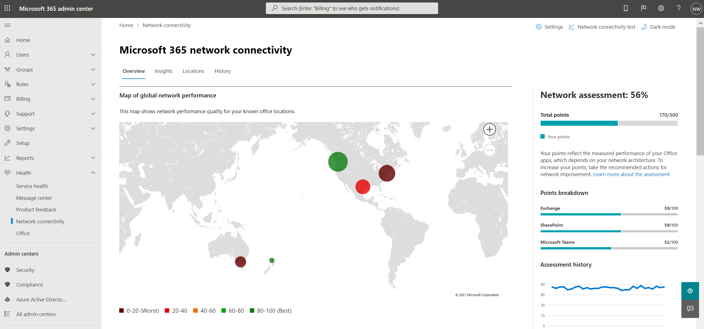
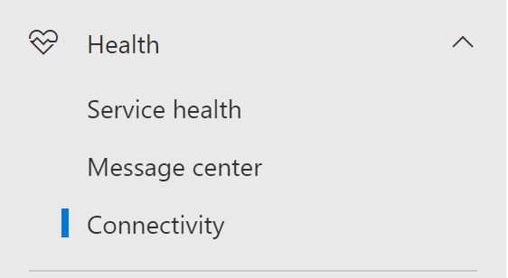
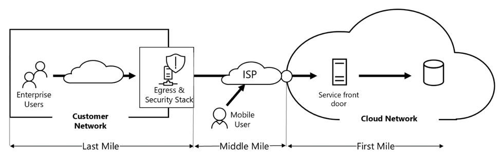
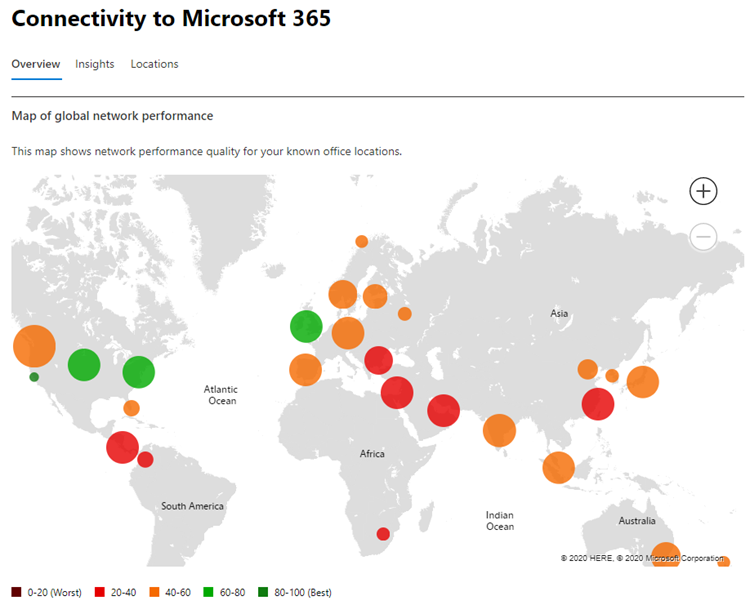
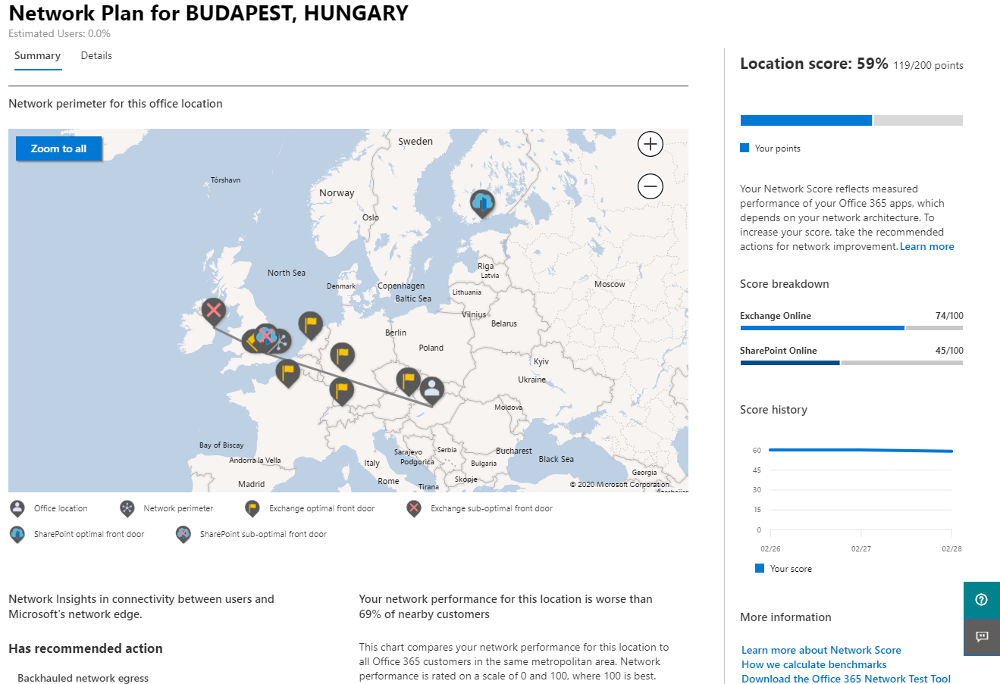
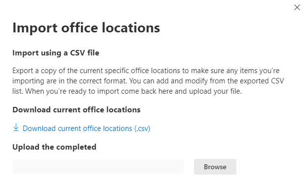
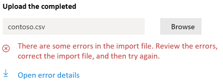
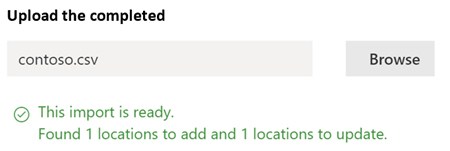

# Network connectivity in the Microsoft 365 Admin Center

The Microsoft 365 Admin Center now includes aggregated network connectivity metrics collected from your Microsoft 365 tenant and available to view only by administrative users in your tenant.

> [!div class="mx-imgBorder"]
> 

**Network assessments** and **network insights** are displayed in the Microsoft 365 Admin Center under **Health | Network connectivity**.

> [!div class="mx-imgBorder"]
> 

>[!NOTE]
>Network connectivity in the Admin Center supports tenants in WW Commercial and Germany but not GCC Moderate, GCC High, DoD or China.

When you first navigate to the network performance page, you will have to configure your locations in order to see the map of global network performance, a network assessment scoped to the entire tenant, percentage of your users working remotely vs onsite, and a list of current issues to take action on and/or to research further. From the overview pane, you can drill down to view specific network performance metrics and issues by location. For more information, see [Network performance overview in the Microsoft 365 Admin Center](#network-connectivity-overview-in-the-microsoft-365-admin-center).

You may be asked to join the public preview for this feature on behalf of your organization. Acceptance usually happens immediately, after which you would see the network connectivity page.

To access the network connectivity page, you must be an administrator for the organization within Microsoft 365. The Report Reader administrative role will have read access to this information. To configure locations and other elements of network connectivity an administrator must be part of a server administrator role such as the Service support admin role.

## Pre-requisites for network connectivity assessments to appear

To get started, turn on your location opt-in setting to automatically collect data from devices using Windows Location Services, go to your Locations list to add or upload location data, or run the Microsoft 365 network connectivity test from your office locations. Whilst network connectivity can be evaluated across the organization, any network design improvements will need to be done for specific office locations. Network connectivity information is provided for each office location once those locations can be determined. There are three options for getting network assessments from your office locations:

### 1. Enable Windows Location Services

For this option, you must have at least two computers running at each office location that support the pre-requisites. OneDrive for Windows version must be up-to-date and installed on each computer. For more information on OneDrive versions, see the [OneDrive release notes](https://support.office.com/article/onedrive-release-notes-845dcf18-f921-435e-bf28-4e24b95e5fc0). Network measurements are planned to be added to other Office 365 client applications in the near future.

Windows Location Service must be consented on the machines. You can test this by running the **Maps** app and locating yourself. It can be enabled on a single machine with **Settings | Privacy | Location** where the setting _Allow apps to access your location_ must be enabled. Windows Location Services consent can be deployed to PCs using MDM or Group Policy with the setting _LetAppsAccessLocation_.

You do not need to add locations in the Admin Center with this method as they are automatically identified at the city resolution. Multiple office locations within the same city will not be shown when using Windows Location Services. Location information is rounded to the nearest 300 meters by 300 meters so that more precise location information is not accessed.

The machines should have Wi-Fi networking rather than an ethernet cable. Machines with an ethernet cable do not have accurate location information.

Measurement samples and office locations should start to appear 24 hours after these pre-requisites have been met.

### 2. Add locations and provide LAN subnet information

For this option, neither Windows Location Services nor Wi-Fi are required. Your OneDrive for Windows version must be up-to-date and installed on at least one computer at the location.

You also need to add locations in the **Locations page** or to import them from a CSV file. The locations added must include your office LAN subnet information.

This option allows you to have multiple offices defined within a city.

All test measurements from client machines include the LAN subnet information, which is correlated with the office location details that you have entered. Measurement samples and office locations should start to appear 24 hours after these pre-requisites have been met.

### 3. Manually gather test reports with the Microsoft 365 network connectivity test tool

For this option, you need to identify a person at each location. Ask them to browse to [Microsoft 365 network connectivity test](https://connectivity.office.com) on a Windows machine on which they have administrative permissions. On the web site, they need to sign in to their Office 365 account for the same organization that you want to see the results. Then they should click **Run test**. During the test there is a downloaded Connectivity test EXE. They need to open and execute that. Once the tests are completed, the test result is uploaded to the Admin Center.

Test reports are linked to a location if it was added with LAN subnet information, otherwise they are shown at the city location only.

Measurement samples and office locations should start to appear 2-3 minutes after a test report is completed. For more information, see [Microsoft 365 network connectivity test (preview)](office-365-network-mac-perf-onboarding-tool.md).

## How do I use this information?

**Network insights**, their related performance recommendations and network assessments are intended to help in designing network perimeters for your office locations. Each insight provides details about the performance characteristics for a specific common networking issue for each geographic location where users are accessing your tenant. **Performance recommendations** for each network insight offer specific network architecture design changes you can make to improve user experience related to Microsoft 365 network connectivity. The network assessment shows how network connectivity impacts user experience, allowing for comparison of different user location network connections.

**Network assessments** distill an aggregate of many network performance metrics into a snapshot of your enterprise network health, represented by a points value from 0 - 100. Network assessments are scoped to both the entire tenant and for each geographic location from which users connect to your tenant, providing Microsoft 365 administrators with an easy way to instantly grasp a gestalt of the enterprise's network health and quickly drill down into a detailed report for any global office location.

Complex enterprises with multiple office locations and non-trivial network perimeter architectures can benefit from this information either during their initial onboarding to Microsoft 365 or to remediate network performance issues discovered with usage growth. This is usually not necessary for small businesses using Microsoft 365, or any enterprises who already have simple and direct network connectivity. Enterprises with over 500 users and multiple office locations are expected to benefit the most.

>[!IMPORTANT]
>Network insights, performance recommendations and assessments in the Microsoft 365 Admin Center is currently in preview status, and is only available for Microsoft 365 tenants that have been enrolled in the feature preview program.

## Enterprise network connectivity challenges

> [!div class="mx-imgBorder"]
> 

Many enterprises have network perimeter configurations which have grown over time and are primarily designed to accommodate employee Internet web site access where most web sites are not known in advance and are untrusted. The prevailing and necessary focus is avoiding malware and phishing attacks from these unknown web sites. This network configuration strategy, while helpful for security purposes, can lead to degradation of Microsoft 365 user performance and user experience.

## How we can solve these challenges

Enterprises can improve general user experience and secure their environment by following [Office 365 connectivity principles](./microsoft-365-network-connectivity-principles.md) and by using the Microsoft 365 Admin Center network connectivity feature. In most cases, following these general principles will have a significant positive impact on end-user latency, service reliability and overall performance of Microsoft 365.

Microsoft is sometimes asked to investigate network performance issues with Microsoft 365 for large enterprise customers, and these frequently have a root cause related to the customer's network perimeter infrastructure. When a common root cause of a customer network perimeter issue is found we seek to identify simple test measurements that identifies it. A test with a measurement threshold that identifies a specific problem is valuable because we can test the same measurement at any location, tell whether this root cause is present there and share it as a network insight with the administrator.

Some network insights will merely indicate a problem that needs further investigation. A network insight where we have enough tests to show a specific remediation action to correct the root cause is listed as a **recommended action**. These recommendations, based on live metrics that reveal values that fall outside a predetermined threshold, are much more valuable than general best practice advice since they are specific to your environment and will show the actual improvement once the recommended changes have been made.

## Network connectivity overview in the Microsoft 365 Admin Center

Microsoft has existing network measurements from several Office desktop and web clients which support the operation of Microsoft 365. These measurements are now being used to provide network architecture design insights and a network assessment which are shown in the **Network connectivity** page in the Microsoft 365 Admin Center.

By default, approximate location information associated with the network measurements identify the city where client devices are located. The network assessment at each location is shown with color and the relative number of users at each location is represented by the size of the circle.

> [!div class="mx-imgBorder"]
> 

The overview page also shows the network assessment for the customer as a weighted average across all office locations.

> [!div class="mx-imgBorder"]
> 

You can view a table view of the locations where they can be filtered, sorted, and edited in the **Locations** tab. Locations with specific recommendations may also include an estimated potential latency improvement. This is calculated by taking the median latency of your organization users at the location and subtracting the median latency for all organizations in the same city.

> [!div class="mx-imgBorder"]
> 

## Remote worker assessment and user connection metrics

We classify network traffic logs as remote or onsite users and show their percentages in the user connection metrics section of the overview pane. For cities where you have remote users, you will find the location specific remote network assessment score when you open that location’s page. The locations list will have both office locations and remote worker cities, which can be filtered and sorted. We provide the remote worker assessment score, with points breakdown for Exchange, SharePoint and Teams.

Home user networking insights are aggregated and reported at a city level and limited to cities with a minimum of 5 remote employees. We are not identifying individual employees working from home.

Locations are auto classified as onsite or remote, however, you have the option to enter all your onsite egress IP addresses manually to ensure a 100% classification. If you decide to go this route, you will have to check the **Enter all onsite egress IP addresses manually** checkbox in the Locations Settings flyout after adding all your egress IP addresses. When this is done, all network traffic logs from egress IP addresses you have marked as onsite will always be classified as offices and every other egress IP address will be classified as remote.

## Specific office location network performance summary and insights

Selecting an office location opens a location-specific summary page showing details of the network egress that has been identified from measurements for that office location.

> [!div class="mx-imgBorder"]
> 

A map of the perimeter network for your organization users at the location is shown with some or all of these elements:

- **Office location** - The office location for the page you are looking at
- **Network perimeter** - The location of the source IP Address for connections from the office location. This depends on the accuracy of geo-IP location databases
- **Exchange optimal service front door** - One of the recommended Exchange service front doors that users in this office location should connect to
- **Exchange sub-optimal front door** - An Exchange service front door that users are connected to, but is not recommended
- **SharePoint optimal service front door** - One of the recommended SharePoint service front doors that users in this office location should connect to
- **SharePoint sub-optimal service front door** - A SharePoint service front door that users are connected to, but is not recommended
- **DNS recursive resolver server** - The location from a geo IP database of the detected DNS recursive resolver used for Exchange Online (if available)
- **Your proxy server** - The location from a geo IP database of the detected proxy server (if available) 

The office location summary page additionally shows the location's network assessment, network assessment history, a comparison of this location's assessment to other customers in the same city, and a list of specific insights and recommendations that you can undertake to improve network performance and reliability.

Comparisons between customers in the same city are based on the expectation that all customers have equal access to network service providers, telecommunications infrastructure, and nearby Microsoft network points of presence.

Location names can be customized when adding a new location or editing an existing location in the location flyout. This provides you with the flexibility to customize your location names at any time. Also, when adding LAN subnets directly in the location flyout, we show a drop-down list of soft-matched LAN subnets that you can select from. Circuit names for specific office egress IP addresses can be added and edited as well.

The details tab on the office location page shows the specific measurement results that were used to come up with any insights, recommendations, and the network assessment. This is provided so that network engineers can validate the recommendations and factor in any constraints or specifics in their environment. You will also find the estimated number of users for collected samples at that office locations as well as the remote workers in that city.

> [!div class="mx-imgBorder"]
> 

## Sharing network assessment data with Microsoft

By default, the network assessments for your organization and the network insights are shared with Microsoft employees. This does not include any personal data from your staff but only the specific network assessment metrics and network insights shown in the admin center for your office locations. It also does not include your office location names or street addresses so you would need to tell them the city and support ID of the office you want to discuss. If this is turned off, the Microsoft engineers that you are discussing your network connectivity with cannot view any of this information. Enabling this setting only shares future data starting the day after you enable it.

## CSV Import for LAN subnet office locations

For LAN subnet office identification, you need to add each location in advance. Instead of adding individual office locations in the **Locations** tab you can import them from a CSV file. You may be able to obtain this data from other places you have stored it such as the Call Quality Dashboard or Active Directory Sites and Services

In the CSV file, a discovered city location shows in the userEntered column as blank, and a manually added office location shows as 1.

1. In the main _Connectivity to Microsoft 365_ window, click the **Locations** tab.

1. Click the **Import** button just above the locations list. The **Import office locations** flyout will appear.

   > [!div class="mx-imgBorder"]
   > 

1. Click the **Download current office locations (.csv)** link to export the current locations list to a CSV file, and save it to your local hard disk. This will provide you with a correctly formatted CSV with column headings to which you can add locations. You can leave the existing exported locations as they are; they will not be duplicated when you import the updated CSV. If you wish to change the address of an existing location, it will be updated when you import the CSV. You cannot change the address of a discovered city.

1. Open the CSV and add your locations by filling out the following fields on a new line for each location you want to add. Leave all other fields blank; values you enter in other fields will be ignored.

   1. **userEntered** (required): Must be 1 for a new LAN Subnet office location being added
   1. **Name** (required): The name of the office location
   1. **Address** (required): The physical address of the office
   1. **Latitude** (optional): Populated from Bing maps lookup of the address if blank
   1. **Longitude** (optional): Populated from Bing maps lookup of the address if blank
   1. **Egress IP Address ranges 1-5** (optional): For each range, enter the circuit name followed by a space separated list of valid IPv4 or IPv6 CIDR addresses. These values are used to differentiate multiple office locations where you use the same LAN subnet IP Addresses. Egress IP Address ranges all must be /24 network size and the /24 is not included in the input.
   1. **LanIps** (required): List the LAN subnet ranges in use at this office location. LAN subnet IDs need to have a CIDR network size included where the network size can be between /8 and /29. Multiple LAN subnet ranges can be separated by a comma or a semicolon.
   
1. When you have added your office locations and saved the file, click the **Browse** button next to the **Upload the completed** field and select the saved CSV file.

1. The file will be automatically validated. If there are validation errors, you will see the error message: _There are some errors in the import file. Review the errors, correct the import file, and then try again._ Click the link **Open error details** for a list of specific field validation errors.

   > [!div class="mx-imgBorder"]
   > 

1. If there are no errors in the file, you will see the message: _The report is ready. Found x locations to add and x locations to update._ Click the **Import** button to upload the CSV.

   > [!div class="mx-imgBorder"]
   > 

## FAQ

### What is a Microsoft 365 service front door?

The Microsoft 365 service front door is an entry point on Microsoft's global network where Office clients and services terminate their network connection. For an optimal network connection to Microsoft 365, it is recommended that your network connection is terminated into the closest Microsoft 365 front door.

>[!NOTE]
>Microsoft 365 service front door has no direct relationship to the Azure Front Door Service product available in the Azure marketplace.

### What is an optimal Microsoft 365 service front door?

An optimal Microsoft 365 service front door is one that is closest to your network egress, generally in your city or metro area. Use the [Microsoft 365 connectivity test tool (preview)](office-365-network-mac-perf-onboarding-tool.md) to determine the location of your in-use Microsoft 365 service front door and optimal service front door. If the tool determines your in-use front door is optimal, you are optimally connecting to Microsoft's global network.

### What is an internet egress location?

The internet egress location is the location where your network traffic exits your enterprise network and connects to the Internet. This is also identified as the location where you have a Network Address Translation (NAT) device and usually where you connect with an Internet Service Provider (ISP). If you see a long distance between your location and your internet egress location, this may indicate a significant WAN backhaul.

### What license is needed for this capability?

You require a  license that provides access to the Microsoft 365 admin center.

## Related topics

[Microsoft 365 network insights (preview)](office-365-network-mac-perf-insights.md)

[Microsoft 365 network assessment (preview)](office-365-network-mac-perf-score.md)

[Microsoft 365 connectivity test tool (preview)](office-365-network-mac-perf-onboarding-tool.md)

[Microsoft 365 Network Connectivity Location Services (preview)](office-365-network-mac-location-services.md)
