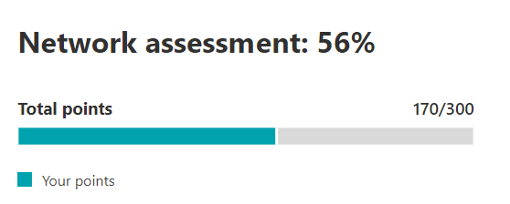
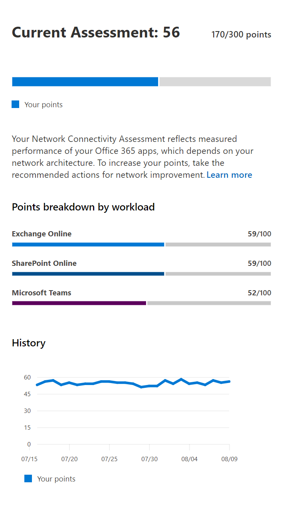

# Microsoft 365 network assessment

In the Microsoft 365 Admin Center's network connectivity, **network assessments** distill an aggregate of many network performance metrics into a snapshot of your enterprise network perimeter health. A network assessment tells you how much the customer responsible network design is impacting Office 365 user experience. Network assessments are scoped to both the entire tenant and to each geographic location from which users connect to your tenant. The assessments provide Microsoft 365 administrators with an easy way to instantly get a sense of the enterprise's network health and quickly drill down into a detailed report for any global office location.

The network assessment points value is from 0 to 100 and is an average of TCP latency, download speed, and UDP connection quality metrics. These metrics are compiled once a day. Performance metrics for Microsoft-owned networks are excluded from these measurements to ensure that assessment results are unambiguous and specific to the corporate network.

> [!div class="mx-imgBorder"]
> 

A very low network assessment value suggests that Microsoft 365 clients will have significant problems connecting to the tenant or maintaining a responsive user experience. A high value indicates a properly configured network with few ongoing performance issues. A value of 80% represents a healthy baseline, above which you should not expect to receive regular user complaints about Microsoft 365 connectivity or responsiveness due to network performance. As iterative network connectivity improvements are made, this value will increase along with user experience.

| Network assessment | Expected user experience |
| :----------------- | :----------------------- |
| 100                | Best                     |
| 80                 | Meets recommendations    |
| 60                 | Acceptable               |
| 40                 | Users may experience issues |
| 20                 | Users may complain       |
| 0                  | Network problems a common topic of discussion |

## Network assessment panel

Each network assessment, whether scoped to the tenant or to a specific office location, shows a panel with details about the assessment. This panel shows a bar chart of the assessment both as a percentage and as the total points for each component workload including only workloads where measurement data was received. For an office location network assessment, we also show a comparison to the percent of Microsoft 365 customers in each of five quintiles that reported data in the same city as your office location.

> [!div class="mx-imgBorder"]
> 

The **Assessment breakdown** in the panel shows the assessment for each of the component workloads.

The **Assessment history** shows the past 30 days of the assessment and the benchmark. You can also report on the metrics history for any office location for up to two years using the history tab. The history tab allows you to select your attributes to report on. By choosing a report time frame, you can highlight the impact of a network update project and see the improvement to your network assessment.

## Tenant network assessments and office location network assessments

A network assessment measures the design of the network perimeter of an office location to Microsoft's network. Improvements to the network perimeter are  best done at each office location.

We show a network assessment value for the whole Microsoft 365 tenant on the network performance overview page. This value is a weighted average of the network assessments for all office locations. There is also a specific network assessment value for each detected office location on that location's summary page.

## Exchange Online

For Exchange Online, the TCP latency from the client machine to the Exchange service front door is measured. This latency can be impacted by the distance the network travels over the customers LAN and WAN. It can also be impacted by network intermediary devices or services, which delay the connectivity or cause packets to be resent. And it is impacted by how far away the nearest Exchange service front door is. The median (also known as the 50th percentile or P50 measure) is taken for all measurements over the previous three days.

The Exchange Online assessment is made using the following table. Any TCP latency number between the thresholds are assigned points linearly within the band.

| TCP Latency   | Points |
| :------------ | :----- |
| 10 ms or less  | 100    |
| 25 ms          | 80     |
| 100 ms         | 60     |
| 200 ms         | 40     |
| 300 ms         | 20     |
| 350 ms or more | 0      |

## SharePoint Online

For SharePoint Online the download speed available for a user to access a document from SharePoint or OneDrive is measured. This can be impacted by the bandwidth available on network circuits between the client machine and Microsoft's network. It is also often impacted by network congestion that exists in bottlenecks in complex network devices or in poor coverage Wi-Fi areas. The download speed is measured in megabytes per second, which is approximately one tenth of a circuits rated megabits per second. The MegaByte per second unit is helpful because you can directly see what size file can be downloaded in 1 second. The 25th percentile (also known as the P25 measure) is taken for all measurements over the previous three days. This 25th percentile helps reduce the impact of varying congestion over time.

The SharePoint Online assessment is made using the following table. Any download speed number between the thresholds are assigned points linearly within the band.

| Download speed | Points |
| :------------- | :----- |
| 20MBps or more | 100    |
| 14MBps         | 80     |
| 8MBps          | 60     |
| 4MBps          | 40     |
| 2MBps          | 20     |
| 0MBps          | 0      |

## Microsoft Teams

For Microsoft Teams the Network quality is measured as UDP latency, UDP jitter, and UDP packet loss. UDP is used for call and conferencing audio and video media connectivity for Microsoft Teams. This can be impacted by the same factors as for latency and download speed in addition to connectivity gaps in a network's UDP support since UDP is configured separately to the more common TCP protocol. The median (also known as the 50th percentile or P50 measure) is taken for all measurements over the previous three days.

We calculate a mean opinion score from these UDP measurements for a scale from one to five. Then we map that to the 0-100 points scale for the Microsoft Teams network assessment.  Overall good is over 87.5 points and overall bad is below 50 points.

## Understanding test sampling

Network test sampling does not include user or device identities and hence the size of offices and number of users in them is estimated. We use the number of test results from Exchange tests and the number of tests from SharePoint tests to do this. If no samples are received for the office location then summary assessment information is still shown for up to 60 days but detail information is not shown and that includes the estimated number users.

## Related topics

[Network connectivity in the Microsoft 365 Admin Center](office-365-network-mac-perf-overview.md)

[Microsoft 365 network performance insights](office-365-network-mac-perf-insights.md)

[Microsoft 365 network connectivity test tool](office-365-network-mac-perf-onboarding-tool.md)

[Microsoft 365 Network Connectivity Location Services](office-365-network-mac-location-services.md)
