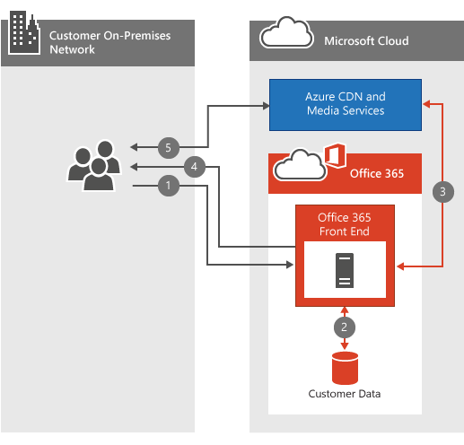

# Office 365 Video networking Frequently Asked Questions

The Office 365 Video repository and streaming services make storing and streaming videos within your organization simple. There's a lot of great [information about Office 365 Video](https://support.office.com/article/Find-help-about-Office-365-Video-b435f99a-f47e-4ebd-a946-f5c965844f50); this networking FAQ is designed to answer the most common questions around bandwidth planning, encryption, and how the service leverages [Content Delivery Networks](content-delivery-networks.md) (CDNs).
  
If you don't already have a thorough understanding of what happens when a video is uploaded or played back, have a look at this video we put together, [What happens to a video file when uploaded to Office 365 Video](https://www.youtube.com/watch?v=HXSZ0jYBKlM).
  
## What are the Office 365 Video bandwidth requirements?

There are a numerous [supported video formats](https://support.office.com/article/dd1af01c-fd8e-4640-b17b-93ee02b9b817) that can be uploaded to Office 365. Each video file is then encoded to a standard format with several different video qualities for playback. Office 365 Video uses adaptive bitrate streaming to select the best video playback quality based on the available network bandwidth and size of the video player. To do this, the player initially requests the lowest playback quality. The service then begins sending 2-second video segments to the video player. The player can then request higher or lower playback quality based on how quickly each segment is delivered.
  
The adaptive bitrate streaming does all this in the background while the video plays with the least amount of disruption or buffering. During video playback, the video player allows the viewer to manually override the automatic playback quality, to select a specific video playback quality.
  
Here's a quick table that outlines the network requirements for each of the video playback qualities. The minimum bandwidth per person needed to play a video is 802Kbps.
  
| Playback Quality | Network Speed |
|:-----|:-----|
|288p    |802Kbps    |
|360p    |1.2 Mbps    |
|576p    |2.5 Mbps    |
|720p    |3.8 Mbps    |

([Back to top](office-365-video-networking-faq.md))
  
## How do Content Delivery Networks (CDNs) help video playback?

If several people from the same organization within the same geographic location are streaming the same video(s), CDNs will store a copy of these videos in a location closer to that geographic region. With the video stored, or cached at the closest location, each person streams the video from the location closest to them instead of a location further away. Office 365 Video uses Azure Media Services to manage what is cached in the Azure CDNs, and for how long. Azure Media Services can use any of the [Azure CDN locations](/azure/cdn/cdn-pop-locations) to cache video fragments and manifests for a few days. If people in your organization continue to watch the cached videos they'll stay in the cache. If no one accesses the video for several days, the video will eventually drop be dropped from the cache. The next time someone attempts to watch the video it's once again cached at the nearest CDN location.
  
Everyone who attempts to watch the video while the content is cached at a nearby CDN benefits from the video being closer, and in most cases less hops, away. This improves video playback speed; however, it doesn't change the network requirement to play the video.
  
> [!NOTE]
> There are some circumstances, such as our capacity limit being reached, where the video may be removed before the three days has been reached.
  
([Back to top](office-365-video-networking-faq.md))
  
## Can I cache the videos locally for faster playback?

Yes. Office 365 won't prevent you from using a local CDN or a caching proxy to bring video or other Office 365 content into your local network for faster access. There are several ways to implement a local caching solution on your network, the most common method is to use a proxy solution that caches content locally. Once a proxy or private CDN has cached the video fragments and manifests, future requests for those files that route through the proxy or private CDN are pulled from the local cache and not pulled from an internet location. Consider network bandwidth, capacity, and video playback concurrency during the planning of a solution like this.
  
([Back to top](office-365-video-networking-faq.md))
  
## How videos are encrypted and secured?

Office 365 Video knows how important it is to keep your data secure and private. [Microsoft Trust Center](https://products.office.com/business/office-365-trust-center-welcome) describes our commitment to the privacy and security of your content. With video playback, speed is important for a good experience; however, we don't compromise your security or privacy in exchange for speed. Here's how we accommodate speed, security and privacy.
  
When you or someone in your organization uploads a new video, that video is transcoded, encrypted with AES-128 encryption, and stored in Azure Media Services. This means the videos are encrypted both in transit and at rest.
  
When someone in your organization attempts to watch a new video, they follow these steps:
  
1. Ask SharePoint Online if they have permission to view the video.

2. SharePoint Online uses the file permissions to determine if the person can watch the video.

3. If they're allowed, SharePoint Online retrieves a token from Azure to give to the video player.

4. The video player then uses the token to request the decryption key from Azure.

5. With the decryption key in hand, the video player is able to stream the video.

  
([Back to top](office-365-video-networking-faq.md))
  
## What are the requirements to playback Office 365 Video?

Office 365 Video supported operating systems and web browsers are the same as the SharePoint Online requirements in [Office 365 system requirements](https://support.office.com/article/Office-365-system-requirements-719254c0-2671-4648-9c84-c6a3d4f3be45). Depending on which operating system and web browser configuration you have will determine the specific needs of the video player. Here's more information on [video playback requirements](https://support.office.com/article/ca1cc1a9-a615-46e1-b6a3-40dbd99939a6).
  
([Back to top](office-365-video-networking-faq.md))
  
## I can't get Office 365 video to work, where should I start?

Troubleshooting connectivity to Office 365 Video involves troubleshooting your network, your ISP(s), and your configuration of Office 365. The first place to start is the service health dashboard. This will tell you of Office 365 Video is having a problem or not. If everything looks great there, here's some additional resources to help you.
  
- Make sure you can connect to the [network endpoints required for Office 365 Video](https://support.office.com/article/Office-365-URLs-and-IP-address-ranges-8548a211-3fe7-47cb-abb1-355ea5aa88a2).

- Check your network connectivity using our [Office 365 network troubleshooting guide](https://support.office.com/article/Office-365-performance-tuning-and-troubleshooting-Admin-and-IT-Pro-1492cb94-bd62-43e6-b8d0-2a61ed88ebae).

- See our [best practices for using Office 365 on a slow network](https://support.office.com/article/Best-practices-for-using-Office-365-on-a-slow-network-fd16c8d2-4799-4c39-8fd7-045f06640166).

- [Find help about Office 365 Video configuration](https://support.office.com/article/Find-help-about-Office-365-Video-b435f99a-f47e-4ebd-a946-f5c965844f50).

([Back to top](office-365-video-networking-faq.md))
  
## Office 365 Video resources

Here's a few other resources to help you successfully deploy and use Office 365 Video:
  
[Find help about Office 365 Video configuration](https://support.office.com/article/Find-help-about-Office-365-Video-b435f99a-f47e-4ebd-a946-f5c965844f50)
  
[Meet Office 365 Video](https://support.office.com/article/Meet-Office-365-Video-ca1cc1a9-a615-46e1-b6a3-40dbd99939a6)
  
[Create and manage a channel in Office 365 Video](https://support.office.com/article/Create-and-manage-a-channel-in-Office-365-Video-1fede4cc-13c0-435a-b585-e7fbf1c83bb2)
  
[Manage your Office 365 Video portal](https://support.office.com/article/Manage-your-Office-365-Video-portal-c059465b-eba9-44e1-b8c7-8ff7793ff5da)
  
[Video formats that work in Office 365 Video](https://support.office.com/article/Video-formats-that-work-in-Office-365-Video-dd1af01c-fd8e-4640-b17b-93ee02b9b817)
  
([Back to top](office-365-video-networking-faq.md))
  
Here's a short link you can use to come back: [https://aka.ms/video365networkfaq]()