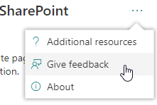
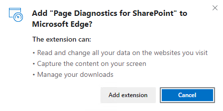
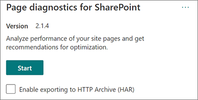
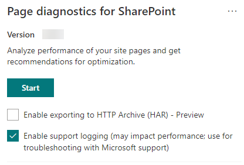

# Use the Page Diagnostics for SharePoint tool

This article describes how to use the **Page Diagnostics for SharePoint tool** to analyze SharePoint in Microsoft 365 modern and classic site pages against a predefined set of performance criteria.

The Page Diagnostics for SharePoint tool can be installed for:

- [**Microsoft Edge** extension)](https://microsoftedge.microsoft.com/addons/detail/ocemkolpnamjcacndljdfmhlpcaoipji)
- [**Chrome** extension)](https://chrome.google.com/webstore/detail/inahogkhlkbkjkkaleonemeijihmfagi)

> [!TIP]
> Version **2.0.0** and later includes support for modern pages in addition to classic site pages. If you are unsure which version of the tool you are using, you can select the **About** link or the ellipses (...) to verify your version. **Always update to the latest version** when using the tool.

The Page Diagnostics for SharePoint tool is a browser extension for the new Microsoft Edge (https://www.microsoft.com/edge) and Chrome browsers that analyzes both SharePoint in Microsoft 365 modern portal and classic publishing site pages.

> [!IMPORTANT]
> This tool only works for SharePoint in Microsoft 365, and can’t be used on a SharePoint system page or on a SharePoint App page. The App page type is designed to be used for specific business applications within SharePoint in Microsoft 365 and not for portals. The tool is designed to optimize portal pages and Teams site pages.

The tool generates a report for each analyzed page showing how the page performs against a predefined set of rules and displays detailed information when results for a test fall outside the baseline value. SharePoint administrators and designers can use the tool to troubleshoot performance issues and to ensure that new pages are optimized prior to publishing.

The Page Diagnostics tool is designed to analyze SharePoint site pages only, not system pages such as *allitems.aspx* or *sharepoint.aspx*. If you attempt to run the tool on a system page or any other nonsite page, you'll receive an error message advising that the tool can’t be run for that type of page.

> [!div class="mx-imgBorder"]
> 

This isn't an error in the tool as there's no value in assessing libraries or system pages. Navigate to a SharePoint site page to use the tool. If this error occurs on a SharePoint page, check the master page to ensure that the SharePoint metatags haven't been removed.

To provide feedback about the tool, select the ellipsis at the top right corner of the tool and then select **Give feedback**.

> [!div class="mx-imgBorder"]
> 
  
## Install the Page Diagnostics for SharePoint tool

The installation procedure in this section works for both the Chrome and Microsoft Edge browsers.

> [!IMPORTANT]
> Microsoft does not read data or page content that is analyzed by the Page Diagnostics for SharePoint tool, and we do not capture any personal information, website or download information. The only identifiable information logged to Microsoft by the tool is the tenant name, counts of rules that have failed and the date and time the tool was run. This information is used by Microsoft to better understand modern portal and publishing site usage trends and common performance issues.

1. Install the Page Diagnostics for SharePoint tool for **Microsoft Edge** [(Edge extension)](https://microsoftedge.microsoft.com/addons/detail/ocemkolpnamjcacndljdfmhlpcaoipji) or **Chrome** [(Chrome extension)](https://chrome.google.com/webstore/detail/inahogkhlkbkjkkaleonemeijihmfagi). Review the User Privacy Policy provided on the description page in the store. When adding the tool to your browser, you'll see the following permissions notice.

    > [!div class="mx-imgBorder"]
    > 

    This notice is in place because a page may contain content from locations outside of SharePoint depending on the web parts and customizations on the page. This means that the tool will read the requests and responses when the start button is clicked and only for the active SharePoint tab where the tool is running. This information is captured locally by the web browser and is available to you via the **Export to JSON** or **Export to HAR** button in the tool's _Network trace_ tab. **The information is not sent to or captured by Microsoft.** (The tool respects the Microsoft privacy policy accessible [here](https://go.microsoft.com/fwlink/p/?linkid=857875).)

    The _Manage your downloads_ permission covers use of the tool's **Export to JSON** functionality. Follow your company's own privacy guidelines before sharing the JSON file outside of your organization, as the results contain URLs and that can be classified as PII (Personally Identifiable Information).
1. If you want to use the tool in Incognito or InPrivate mode, follow the procedure for your browser:
    1. In Microsoft Edge, navigate to **Extensions** or type _edge://extensions_ in the URL bar and select **Details** for the extension. In the extension settings, select the checkbox for **allow in InPrivate**.
    1. In Chrome, navigate to **Extensions** or type _chrome://extensions_ in the URL bar and select **Details** for the extension. In the extension settings, select the slider for **allow in Incognito**.
1. Navigate to the SharePoint site page on SharePoint that you would like to review. We've allowed for "delay loading" of items on pages; therefore, the tool won't stop automatically (this is by design to accommodate all page load scenarios). To stop collection, select **Stop**. Make sure that the page load has completed before you stop data collection or you'll only capture a partial trace.
1. Click on the extension's toolbar button  to load the tool and you'll be presented with the following extension popup window:

    

Select **Start** to begin collecting data for analysis.

## What you'll see in the Page Diagnostics for SharePoint tool

1. Click the ellipses (...) in the top right corner of the tool to find the following links:
   1. The **Additional resources** link provides general guidance and details regarding the tool including a link back to this article.
   1. The **Give feedback** link provides a link to the _SharePoint Sites and Collaboration User Voice_ site.
   1. The **About** link includes the currently installed version of the tool and a direct link to the tool's third party notice.  
1. The **Correlation ID, SPRequestDuration, SPIISLatency**, **Page load time**, and **URL** details are informational and can be used for a few purposes.

    > [!div class="mx-imgBorder"]
    > 

   - **CorrelationID** is an important element when working with Microsoft Support as it allows them to gather more diagnostic data for the specific page.
   - **SPRequestDuration** is the time taken for SharePoint to process the page. Structural navigation, large images, lots of API calls could all contribute to longer durations.
   - **SPIISLatency** is the time in milliseconds taken for SharePoint begin loading the page. This value doesn't include the time taken for the web application to respond.
   - **Page load time** is the total time recorded by the page from the time of the request to the time the response was received and rendered in the browser. This value is affected by various factors including network latency, the performance of the computer and the time it takes for the browser to load the page.
   - The **Page URL** (Uniform Resource Locator) is the web address of the current page.

1. The [**Diagnostic tests**](#how-to-use-the-diagnostic-tests-tab) tab displays the analysis results in three categories; **No action required**, **Improvement opportunities** and **Attention required**. Each test result is represented by an item in one of these categories as described in the following table:

    |Category  |Color  |Description  |
    |---------|---------|---------|
    |**Attention required** |Red |Test result falls outside the baseline value and is affecting page performance. Follow remediation guidance.|
    |**Improvement opportunities** |Yellow |Test result falls outside the baseline value and could be contributing to performance issues. Test-specific criteria may apply.|
    |**No action required** |Green |Test result falls within the test's baseline value.|

    > [!div class="mx-imgBorder"]
    > 

1. A [**Network trace**](#how-to-use-the-network-trace-tab-and-how-to-export-a-har-file) tab provides details about page build requests and responses.

## How to use the Diagnostic tests tab

When you analyze a SharePoint modern portal page or classic publishing site page with the Page Diagnostics for SharePoint tool, results are analyzed using predefined rules that compare results against baseline values and displayed in the **Diagnostic tests** tab. Rules for certain tests may use different baseline values for modern portal and classic publishing sites depending on how specific performance characteristics differ between the two.

Test results that appear in the **Improvement opportunities** or **Attention required** categories indicate areas that should be reviewed against recommended practices, and can be selected to display additional information about the result. Details for each item include a _Learn more_ link, which will take you directly to the appropriate guidance related to the test. Test results that appear in the **No action required** category indicate compliance with the relevant rule and don't display additional details when selected.

The information in the Diagnostics tests tab won't tell you how to design pages, but will highlight factors that may impact page performance. Some page functionality and customizations have an unavoidable impact on page performance, and should be reviewed for potential remediation or omission from the page if their impact is substantial.

Red or yellow results may also indicate web parts that refresh data too frequently. For example, corporate news isn't updated every second but custom web parts are often built to fetch the latest news every second instead of implementing caching elements that could improve the overall user experience. Keep in mind when including web parts on a page that there are often simple ways to reduce their performance impact by evaluating the value of each available parameter to ensure it's set appropriately for its intended purpose.

>[!NOTE]
>Classic team sites that don't have the publishing feature enabled cannot make use of CDNs. When you run the tool on these sites, the CDN test is expected to fail and can be ignored, but all of the remaining tests are applicable. The additional functionality of the SharePoint publishing feature can increase page load times, so it should not be enabled just to allow CDN functionality.

>[!IMPORTANT]
>Test rules are added and updated regularly so please refer to the latest version of the tool for details about current rules and specific information included in test results. You can verify the version by managing your extensions and the extension will advise whether an update is available.

## How to use the Network Trace tab and how to export a HAR file

The **Network Trace** tab provides detailed information about both requests to build the page and the responses received from SharePoint.

1. **Look for item load times flagged as red**. Each request and response is color coded to indicate its impact on overall page performance using the following latency metrics:
    - Green: \< 500 ms
    - Yellow: 500-1000 ms
    - Red: \> 1000 ms

    > [!div class="mx-imgBorder"]
    > 

    In the image shown above, the red item pertains to the default page. It will always show red unless the page loads in \< 1000 ms (less than 1 second).

2. **Test item load times**. In some cases there will be no time or color indicator because the items have already been cached by the browser. To test this correctly, open the page, clear browser cache, and then click **Start** as that will force a "cold" page load and be a true reflection of the initial page load. This should then be compared to the "warm" page load as that will also help determine what items are being cached on the page.

3. **Share relevant details with others who can help investigate issues**. To share the details or information provided in the tool with your developers or a technical support person, using the **Enable exporting to HTTP Archive (HAR)** is the recommended approach.

   > [!div class="mx-imgBorder"]
   > 

Exporting should be enabled prior to clicking Start, which will then enable debug mode in your browser. This generates an HTTP Archive file (HAR) which can then be accessed through the "Network Trace" tab. Click the "Export to HAR" button to download the file to your computer and you can then share it accordingly. The file can be opened in various debug tools, like F12 Developer Tools and Fiddler.

> [!div class="mx-imgBorder"]
> 

> [!IMPORTANT]
> These results contain URLs and that can be classified as PII (Personally Identifiable Information). Make sure to follow your organization's guidelines before distributing that information.

## Engaging with Microsoft Support

We've included a **Microsoft Support level feature** that should only be utilized when working directly on a support case. Utilizing this feature will provide no benefit to you when used without support team engagement, and can make the page perform significantly slower. There's no additional information when using this feature in the tool as the additional information is added to the logging in the service.

No change is visible except that you'll be notified that you have enabled it and your page performance will be degraded by 2-3 times slower performance whilst enabled. It will only be relevant for the particular page and that active session. For this reason, this should be used sparingly and only when actively engaged with support.

### To enable the Microsoft Support level feature

1. Open the Page Diagnostics for SharePoint tool.
2. On your keyboard, press **ALT-Shift-L**. This will display the **Enable support logging** check box.
3. Select the check box, and then click **Start** to reload the page and generate verbose logging.

   > [!div class="mx-imgBorder"]
   > 
  
    You should note the CorrelationID (displayed at the top of the tool) and provide it to your support representative to enable them to gather additional information about the diagnostic session.

## Related articles

[Tune SharePoint performance](tune-sharepoint-online-performance.md)

[Performance in the modern SharePoint experience](/sharepoint/modern-experience-performance)

[Content delivery networks](content-delivery-networks.md)

[Use the Office 365 Content Delivery Network (CDN) with SharePoint](use-microsoft-365-cdn-with-spo.md)
