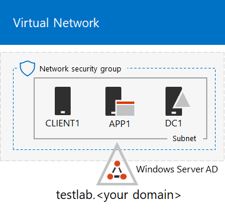
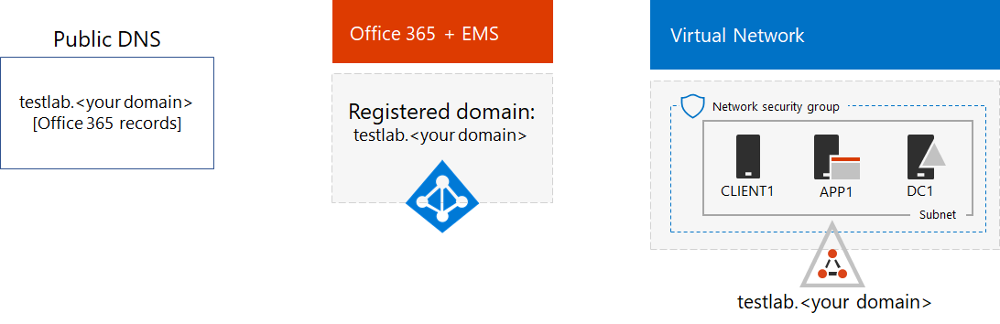

# Password hash synchronization for your Microsoft 365 test environment

*This Test Lab Guide can be used for both Microsoft 365 Enterprise and Office 365 Enterprise test environments.*

Many organizations use Azure AD Connect and password hash synchronization to synchronize the set of accounts in their on-premises Active Directory Domain Services (AD DS) forest to the set of accounts in the Azure AD tenant of their Microsoft 365 or Office 365 subscription. This article describes how you can add password hash synchronization to your Microsoft 365 test environment, resulting in the following configuration:
  

  
There are two phases to setting up this test environment:
  
1. Create the Microsoft 365 simulated enterprise test environment.
2. Install and configure Azure AD Connect on APP1.
    
> [!TIP]
> Click [here](media/m365-enterprise-test-lab-guides/Microsoft365EnterpriseTLGStack.pdf) for a visual map to all the articles in the Microsoft 365 Enterprise Test Lab Guide stack.
  
## Phase 1: Create the Microsoft 365 simulated enterprise test environment

Follow the instructions in [simulated enterprise base configuration for Microsoft 365](simulated-ent-base-configuration-microsoft-365-enterprise.md). Here is your resulting configuration.
  

  
This configuration consists of: 
  
- Microsoft 365 E5 or Office 365 E5 trial or paid subscriptions.
- A simplified organization intranet connected to the Internet, consisting of the DC1, APP1, and CLIENT1 virtual machines in an Azure virtual network. DC1 is a domain controller for the testlab.\<your public domain name> AD DS domain.

## Phase 2: Create and register the testlab domain

In this phase you add a public DNS domain and add it to your subscription.

First, work with your public DNS registration provider to create a new public DNS domain name based on your current domain name and add it to your subscription. We recommend using the name **testlab.**\<your public domain>. For example, if your public domain name is **<span>contoso</span>.com**, add the public domain name **<span>testlab</span>.contoso.com**.
  
Next, you add the **testlab.**\<your public domain> domain to your Microsoft 365 or Office 365 trial or paid subscription by going through the domain registration process. This consists of adding additional DNS records to the **testlab.**\<your public domain> domain. For more information, see [Add a domain to Office 365](https://docs.microsoft.com/office365/admin/setup/add-domain). 

Here is your resulting configuration.
  

  
This configuration consists of:

- Microsoft 365 E5 or Office 365 E5 trial or paid subscriptions with the DNS domain testlab.\<your public domain name> registered.
- A simplified organization intranet connected to the Internet, consisting of the DC1, APP1, and CLIENT1 virtual machines on a subnet of an Azure virtual network.

Notice how the testlab.\<your public domain name> is now:

- Supported by public DNS records.
- Registered in your Microsoft 365 or Office 365 subscriptions.
- The AD DS domain on your simulated intranet.
     
## Phase 3: Install Azure AD Connect on APP1

In this phase, you install and configure the Azure AD Connect tool on APP1, and then verify that it works.
  
First, you install and configure Azure AD Connect on APP1.

1. From the [Azure portal](https://portal.azure.com), sign in with your global administrator account, and then connect to APP1 with the TESTLAB\\User1 account.
    
2. From the desktop of APP1, open an administrator-level Windows PowerShell command prompt, and then run these commands:
    
   ```powershell
   Set-ItemProperty -Path "HKLM:\SOFTWARE\Microsoft\Active Setup\Installed Components\{A509B1A7-37EF-4b3f-8CFC-4F3A74704073}" -Name "IsInstalled" -Value 0
   Set-ItemProperty -Path "HKLM:\SOFTWARE\Microsoft\Active Setup\Installed Components\{A509B1A8-37EF-4b3f-8CFC-4F3A74704073}" -Name "IsInstalled" -Value 0
   Stop-Process -Name Explorer -Force
   ```

3. From the task bar, click **Internet Explorer** and go to [https://aka.ms/aadconnect](https://aka.ms/aadconnect).
    
4. On the Microsoft Azure Active Directory Connect page, click **Download**, and then click **Run**.
    
5. On the **Welcome to Azure AD Connect** page, click **I agree**, and then click **Continue**.
    
6. On the **Express Settings** page, click **Use express settings**.
    
7. On the **Connect to Azure AD** page, type your global administrator account name in **Username,** type its password in **Password**, and then click **Next**.
    
8. On the **Connect to AD DS** page, type **TESTLAB\\User1** in **Username,** type its password in **Password**, and then click **Next**.
    
9. On the **Ready to configure** page, click **Install**.
    
10. On the **Configuration complete** page, click **Exit**.
    
11. In Internet Explorer, go to the Microsoft 365 admin center ([https://portal.microsoft.com](https://portal.microsoft.com)).
    
12. In the left navigation, click **Users > Active users**.
    
    Note the account named **User1**. This account is from the TESTLAB AD DS domain and is proof that directory synchronization has worked.
    
13. Click the **User1** account, and then click **Licenses and apps**.
    
14. In **Product licenses**, select your location (if needed), disable the **Office 365 E5** license and enable the **Microsoft 365 E5** license. 

15. Click **Save** at the bottom of the page, and then click **Close**.
    
Next, you test the ability to sign in to your subscription with the <strong>user1@testlab.</strong>\<your domain name> user name of the User1 account.

1. From APP1, sign out, and then sign in again, this time specifying a different account.

2. When prompted for a user name and password, specify <strong>user1@testlab.</strong>\<your domain name> and the User1 password. You should successfully sign in as User1. 
 
Notice that although User1 has domain administrator permissions for the TESTLAB AD DS domain, it is not a global administrator. Therefore, you will not see the **Admin** icon as an option. 

Here is your resulting configuration.


This configuration consists of: 
  
- Microsoft 365 E5 or Office 365 E5 trial or paid subscriptions with the DNS domain TESTLAB.\<your domain name> registered.
- A simplified organization intranet connected to the Internet, consisting of the DC1, APP1, and CLIENT1 virtual machines on a subnet of an Azure virtual network. Azure AD Connect runs on APP1 to synchronize the TESTLAB AD DS domain to the Azure AD tenant of your Microsoft 365 or Office 365 subscription periodically.
- The User1 account in the TESTLAB  AD DS domain has been synchronized with the Azure AD tenant.

## Next step

Explore additional [identity](m365-enterprise-test-lab-guides.md#identity) features and capabilities in your test environment.

## See also

[Microsoft 365 Enterprise Test Lab Guides](m365-enterprise-test-lab-guides.md)

[Deploy Microsoft 365 Enterprise](deploy-microsoft-365-enterprise.md)

[Microsoft 365 Enterprise documentation](https://docs.microsoft.com/microsoft-365-enterprise/)


