# Performance troubleshooting plan for Office 365

Do you need to know the steps to take to identify and fix lags, hangs, and slow performance between SharePoint Online, OneDrive for Business, Exchange Online, or Skype for Business Online, and your client computer? Before you call support, this article can help you troubleshoot Office 365 performance issues and even fix some of the most common issues.

This article is actually a sample action plan that you can use to capture valuable data about your performance issue as it's happening. Some top issues are also included in this article.

If you're new to network performance and want to make a long term plan to monitor performance between your client machines and Office 365, take a look at [Office 365 performance tuning and troubleshooting - Admin and IT Pro](performance-tuning-using-baselines-and-history.md).

## Sample performance troubleshooting action plan

This action plan contains two parts; a preparation phase, and a logging phase. If you have a performance problem right now, and you need to do data collection, you can start using this plan right away.

### Prepare the client computer

- Find a client computer that can reproduce the performance problem. This computer will be used during troubleshooting.
- Write down the steps that cause the performance problem to happen so you're ready when it comes time to test.
- Install tools for gathering and recording information:
  - Install [Netmon 3.4](https://www.microsoft.com/download/details.aspx?id=4865) (or use an equivalent network tracing tool).
  - Install the free Basic Edition of [HTTPWatch](https://www.httpwatch.com/download/) (or use an equivalent network Tracing tool).
  - Use a screen recorder or run the Steps Recorder (PSR.exe) that comes with Windows Vista and later, in order to keep a record of the steps you take during testing.

### Log the performance issue

- Close all extraneous Internet browsers.
- Start the Steps Recorder, or another screen recorder.
- Start your Netmon capture (or network tracing tool).
- Clear your DNS cache on the client computer from the command line by typing ipconfig /flushdns.
- Start a new browser session and turn on HTTPWatch.
- Optional: If you're testing Exchange Online, run the Exchange Client Performance Analyzer tool from the Office 365 admin console.
- Reproduce the exact steps that cause the performance issue.
- Stop your Netmon or other tool's trace.
- At the command line, run a trace route to your Office 365 subscription by typing the following command and then pressing ENTER:

  ``` cmd
  tracert <subscriptionname>.onmicrosoft.com
  ```

- Stop the Steps Recorder and save the video. Be sure to include the date and time of the capture and whether it demonstrates good or bad performance.
- Save the trace files. Again, be sure to include the date and time of the capture and whether it demonstrates good or bad performance.

If you're not familiar with running the tools mentioned in this article, don't worry because we provide those steps next. If you're accustomed to doing this kind of network capturing, you can skip to [How to collect baselines](performance-tuning-using-baselines-and-history.md#how-to-collect-baselines), which describes filtering and reading the logs.

### Flush the DNS Cache first

Why? By flushing out the DNS cache, you're starting your tests with a clean slate. By clearing the cache, you're resetting the DNS resolver contents to the most up-to-date entries. Remember that a flush doesn't remove HOST file entries. If you use HOST file entries extensively, you should copy those entries out to a file in another directory and then empty the HOST file.

#### Flush your DNS resolver cache

1. Open the command prompt, (either **Start** \> **Run** \> **cmd** or **Windows key** \> **cmd**).
2. Type the following command and press ENTER:

    ``` cmd
    ipconfig /flushdns
    ```

## Netmon

Microsoft's Network Monitoring tool ([Netmon](https://www.microsoft.com/download/details.aspx?id=4865)) analyzes packets, that is traffic, that passes between computers on networks. By using Netmon to trace traffic with Office 365 you can capture, view, and read packet headers, identify intervening devices, check important settings on network hardware, look for dropped packets, and follow the flow of traffic between computers on your corporate network and Office 365. Because the actual body of the traffic is encrypted, that is, it(travels on port 443 via SSL/TLS, you can't read the files being sent. Instead, you get an unfiltered trace of the path that the packet takes which can help you track down the problem behavior.

Be sure you don't apply a filter at this time. Instead, run through the steps and demonstrate the problem before stopping the trace and saving.

After you install Netmon 3.4, open the tool and take these steps:

### Take a Netmon trace and reproduce the issue

1. Launch Netmon 3.4.
There are three panes on the **Start** page: **Recent Captures**, **Select Networks**, and the **Getting Started with Microsoft Network Monitor 3.4. Notice**. The Select Networks panel will also give you a list of the default networks from which you can capture. Be sure that network cards are selected here.

2. Click **New Capture** at the top of the **Start** page. This adds a new tab beside the **Start** page tab called **Capture 1**.
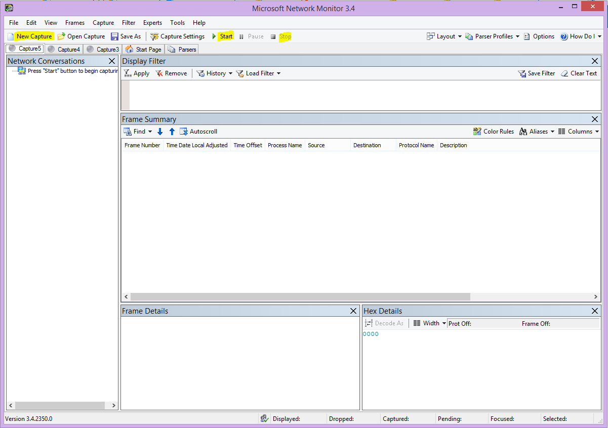

3. To take a simple capture, click **Start** on the toolbar.

4. Reproduce the steps that present a performance issue.

5. Click **Stop** \> **File** \> **Save As**. Remember to give the date and time with the time zone and to mention if it demonstrates bad or good performance.

## HTTPWatch

[HTTPWatch](https://www.httpwatch.com/download/) comes in charged, and a free edition. The free Basic Edition covers everything you need for this test. HTTPWatch monitors network traffic and page load time right from your browser window. HTTPWatch is a plug-in to Internet Explorer that graphically describes performance. The analysis can be saved and viewed in HTTPWatch Studio.

> [!NOTE]
> If you use another browser, such as Firefox, Google Chrome, or if you can't install HTTPWatch in Internet Explorer, open a new browser window and press F12 on your keyboard. You should see the Developer Tool pop-up at the bottom of your browser. If you use Opera, press CTRL+SHIFT+I for Web Inspector, then click the **Network** tab and complete the testing outlined below. The information will be slightly different, but load times will still be displayed in milliseconds. > HTTPWatch is also very useful for issues with SharePoint Online page load times.

### Run HTTPWatch and reproduce the issue

HTTPWatch is a browser plug-in, so exposing the tool in the browser is slightly different for each version of Internet Explorer. Typically, you can find HTTPWatch under the Commands bar in the Internet Explorer browser. If you don't see the HTTPWatch plug-in in your browser window, check the version of your browser by clicking **Help** \> **About**, or in later versions of Internet Explorer, click the gear symbol and **About Internet Explorer**. To launch the **Commands** bar, right-click the menu bar in Internet Explorer and click **Commands bar**.

In the past, HTTPWatch has been associated with both the Commands and the Explorer bars, so once you install, if you don't immediately see the icon (even after reboot) check **Tools**, and your toolbars for the icon. Remember that toolbars can be customized and options can be added to them.

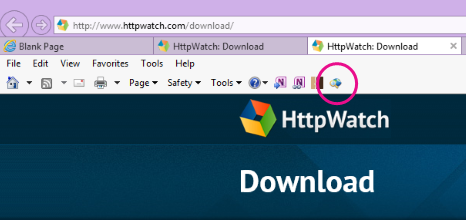

1. Launch HTTPWatch in an Internet Explorer browser window. It will appear docked to the browser at the bottom of that window. Click **Record**.

2. Reproduce the exact steps involved in the performance issue. Click the **Stop** button in HTTPWatch.

3. **Save** the HTTPWatch or **Send by Email**. Remember to name the file so that it includes date and time information and an indication of whether your Watch contains a demonstration of good or bad performance.

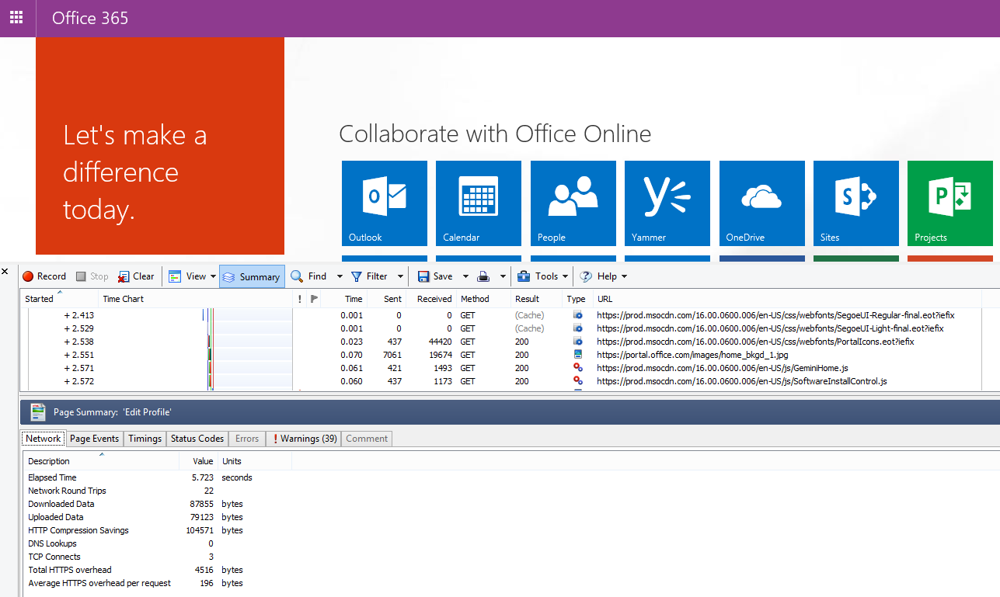

This screenshot is from the Professional version of HTTPWatch. You can open traces taken in the Basic Version on a computer with a Professional version and read it there. Extra information may be available from the trace through that method.

## Problem Steps Recorder

Steps Recorder, or PSR.exe, allows you to record issues as they're occurring. It's a very useful tool and simple to run.

### Run Problem Steps Recorder (PSR.exe) to record your work

1. Either use **Start** \> **Run** \> type **PSR.exe** \> **OK**, or, click the **Windows Key** \> type **PSR.exe** \> and then press ENTER.

2. When the small PSR.exe window appears, click **Start Record** and reproduce the steps that reproduce the performance issue. You can add comments as needed, by clicking **Add Comments**.

3. Click **Stop Record** when you've completed the steps. If the performance issue is a page render, wait for the page to render before you stop the recording.

4. Click **Save**.

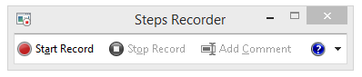

The date and time is recorded for you. This links your PSR to your Netmon trace and HTTPWatch in time, and helps with precision troubleshooting. The date and time in the PSR record can show that a minute passed between the login and browsing of the URL and the partial render of the admin site, for example.

## Read your traces

It isn't possible to teach everything about network and performance troubleshooting that someone would need to know via an article. Getting good at performance takes experience, and knowledge of how your network works and usually performs. But it's possible to round up a list of top issues and show how tools can make it easier for you to eliminate the most common problems.

If you want to pick up skills reading network traces for your Office 365 sites, there's no better teacher than creating traces of page loads regularly and gaining experience reading them. For example, when you have a chance, load an Office 365 service and trace the process. Filter the trace for DNS traffic, or search the FrameData for the name of the service you browsed. Scan the trace to get an idea of the steps that occur when the service loads. This will help you learn what normal page load should look like, and in the case of troubleshooting, particularly around performance, comparing good to bad traces can teach you a lot.

Netmon uses Microsoft Intellisense in the Display filter field. Intellisense, or intelligent code completion, is that trick where you type in a period and all available options are displayed in a drop-down selection box. For example, you're worried about TCP window scaling, you can find your way to a filter (such as  `.protocol.tcp.window < 100`) by this means.

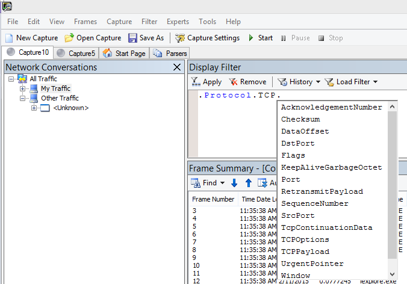

Netmon traces can have a lot of traffic in them. If you aren't experienced with reading them, it's likely you'll be overwhelmed opening the trace the first time. The first thing to do is separate the signal from the background noise in the trace. You tested against Office 365, and that's the traffic you want to see. If you're used to navigating through traces, you may not need this list.

Traffic between your client and Office 365 travels via TLS, which means that the body of the traffic will be encrypted and not readable in a generic Netmon trace. Your performance analysis doesn't need to know the specifics of the information in the packet. It is, however, very interested in packet headers and the information that they contain.

### Tips to get a good trace

- Know the value of the IPv4 or IPv6 address of your client computer. You can get this from the command prompt by typing **IPConfig** and then pressing ENTER. Knowing this address will let you tell at a glance whether the traffic in the trace directly involves your client computer. If there's a known proxy, ping it and get its IP address as well.

- Flush your DNS resolver cache and, if possible, close all browsers except the one in which you're running your tests. If you aren't able to do this, for instance, if support is using some browser-based tool to see your client computer's desktop, be prepared to filter your trace.

- In a busy trace, locate the Office 365 service that you're using. If you've never or seldom seen your traffic before, this is a helpful step in separating the performance issue from other network noise. There are a few ways to do this. Directly before your test, you can use _ping_ or _PsPing_ against the URL of the specific service (`ping outlook.office365.com` or `psping -4 microsoft-my.sharepoint.com:443`, for example). You can also easily find that ping or PsPing in a Netmon trace (by its process name). That will give you a place to start looking.

If you're only using Netmon tracing at the time of the problem, that's okay too. To orient yourself, use a filter like `ContainsBin(FrameData, ASCII, "office")` or `ContainsBin(FrameData, ASCII, "outlook")`. You can record your frame number from the trace file. You may also want to scroll the _Frame Summary_ pane all the way to the right and look for the Conversation ID column. There's a number indicated there for the ID of this specific conversation that you can also record and look at in isolation later. Remember to remove this filter before applying any other filtering.

> [!TIP]
> Netmon has a lot of helpful built-in filters. Try the **Load Filter** button at the top of the _Display_ filter pane.

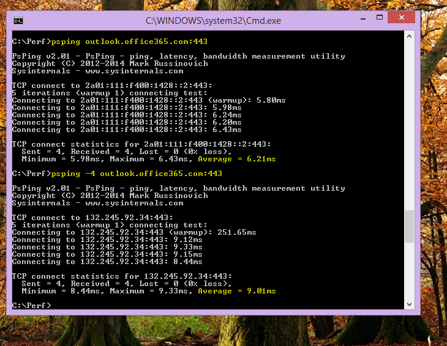

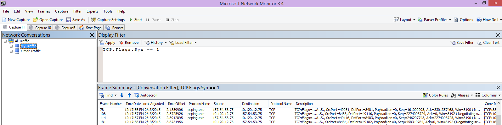

Get familiar with your traffic, and learn to locate the information you need. For example, learn to determine which packet in the trace has the first reference to the Office 365 service you're using (like "Outlook").

Taking Office 365 Outlook Online as an example, the traffic begins something like this:

- DNS Standard Query and DNS Response for outlook.office365.com with matching QueryIDs. It's important to note the time offset for this turn-around, and where in the world the Office 365 Global DNS sends the request for name resolution. Ideally, as locally as possible, rather than halfway across the world.

- An HTTP GET Request whose status report Moved Permanently (301)

- RWS Traffic including RWS Connect requests and Connect replies. (This is Remote Winsock making a connection for you.)

- A TCP SYN and TCP SYN/ACK conversation. Many settings in this conversation impact your performance.

- Then a series of TLS:TLS traffic, which is where the TLS handshake and TLS certificate conversations take place. (Remember the data is encrypted via SSL/TLS.)

All parts of the traffic are important and connected, but small portions of the trace contain information important in terms of performance troubleshooting, so we'll focus on those areas. Also, since we've done enough Office 365 performance troubleshooting at Microsoft to compile a Top Ten list of common problems, we'll focus on those issues and how to use the tools we have to root them out next.

If you haven't installed them already, the matrix below makes use of several tools where ever possible. Links are provided to the installation points. The list includes common network tracing tools like [Netmon](https://www.microsoft.com/download/details.aspx?id=4865) and [Wireshark](https://www.wireshark.org/), but use any tracing tool you're comfortable with, and in which you're accustomed to filtering network traffic. When you're testing, remember:

- *Close your browsers, and test with only one browser running*  - This will reduce the overall traffic you capture. It makes for a less busy trace.
- *Flush your DNS resolver cache on the client computer*  - This will give you a clean slate when you start to take your capture, for a cleaner trace.

## Common issues

Some common issues you may face and how to find them in your Network trace.

### TCP Windows Scaling

Found in the SYN - SYN/ACK. Legacy or aging hardware may not take advantage of TCP windows scaling.  Without proper TCP windows scaling settings, the default 16-bit buffer in TCP headers fills in milliseconds.  Traffic can’t continue to send until the client receives an acknowledgment that the original data has been received, causing delays.

#### Tools

- Netmon
- Wireshark

#### What to look for

Look for the SYN - SYN/ACK traffic in your network trace.  In Netmon, use a filter like  `tcp.flags.syn == 1`. This filter is the same in Wireshark.

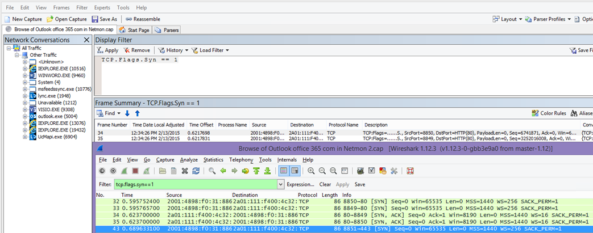

Notice that for every SYN there's a source port (SrcPort) number that is matched in the destination port (DstPort) of the related Acknowledgment (SYN/ACK).

To see the Windows Scaling value that is used by your network connection, expand first the SYN, and then the related SYN/ACK.

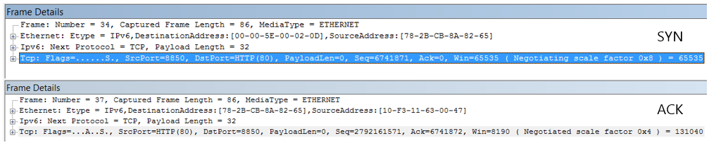

### TCP Idle Time Settings

Historically, most perimeter networks are configured for transient connections, meaning idle connections are generally terminated. Idle TCP sessions can be terminated by proxies and firewalls at greater than 100 to 300 seconds. This is problematic for Outlook Online because it creates and uses long-term connections, whether they're idle or not.

When connections are terminated by proxy or firewall devices, the client isn't informed, and an attempt to use Outlook Online will mean a client computer will try, repeatedly, to revive the connection before making a new one. You may see hangs in the product, prompts, or slow performance on page load.

#### Tools

- Netmon
- Wireshark

#### What to look for

In Netmon, look at the Time Offset field for a round-trip. A round-trip is the time between client sending a request to the server and receiving a response back. Check between the Client and the egress point (ex. Client --\> Proxy), or the Client to Office 365 (Client --\> Office 365). You can see this in many types of packets.

As an example, the filter in Netmon may look like  `.Protocol.IPv4.Address == 10.102.14.112 AND .Protocol.IPv4.Address == 10.201.114.12`, or, in Wireshark,  `ip.addr == 10.102.14.112 &amp;&amp; ip.addr == 10.201.114.12`.

> [!TIP]
> Don't know if the IP address in your trace belongs to your DNS server? Try looking it up at the command line. Click **Start** \> **Run** \> and type **cmd**, or press **Windows Key** \> and type **cmd**. At the prompt, type  `nslookup <the IP address from the network trace>`. To test, use nslookup against your own computer's IP address. > To see a list of Microsoft's IP ranges, see [Office 365 URLs and IP address ranges](./urls-and-ip-address-ranges.md).

If there's a problem, expect long Time Offsets to appear, in this case (Outlook Online), particularly in TLS:TLS packets that show the passage of Application Data (for example, in Netmon you can find application data packets via  `.Protocol.TLS AND Description == "TLS:TLS Rec Layer-1 SSL Application Data"`). You should see a smooth progression in the time across the session. If you see long delays when refreshing your Outlook Online, this could be caused by a high degree of resets being sent.

### Latency/Round Trip Time

Latency is a measure that can change a lot depending on many variables, such upgrading aging devices, adding a large number of users to a network, and the percentage of overall bandwidth consumed by other tasks on a network connection.

There are bandwidth calculators for Office 365 available from this [Network planning and performance tuning for Office 365](network-planning-and-performance.md) page.

Need to measure the speed of your connection, or your ISP connection's bandwidth? Try this site (or sites like it): [Speedtest Official Site](https://www.speedtest.net/), or query your favorite search engine for the phrase **speed test**.

#### Tools

- Ping
- PsPing
- Netmon
- Wireshark

#### What to look for

To track latency in a trace, you'll benefit from having recorded the client computer IP address and the IP address of the DNS server in Office 365. This is for easier trace filtering. If you connect through a proxy, you will need your client computer IP address, the proxy/egress IP address, and the Office 365 DNS IP address, to make the work easier.

A ping request sent to outlook.office365.com will tell you the name of the datacenter receiving the request, even if ping  *may*  not be able to connect to send the trademark consecutive ICMP packets. If you use PsPing (a free tool for download), and specific the port (443) and perhaps to use IPv4 (-4) you will get an average round-trip-time for packets sent. This will work this for other URLs in the Office 365 services, like `psping -4 yourSite.sharepoint.com:443`. In fact, you can specify a number of pings to get a larger sample for your average, try something like `psping -4 -n 20 yourSite-my.sharepoint.com:443`.

> [!NOTE]
> PsPing doesn't send ICMP packets. It pings with TCP packets over a specific port, so you can use any one you know to be open. In Office 365, which uses SSL/TLS, try attaching port :443 to your PsPing.

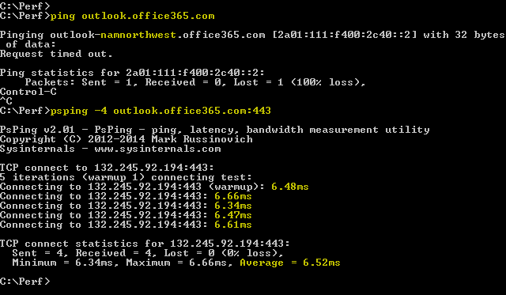

If you loaded the slow performing Office 365 page while doing a network trace, you should filter a Netmon or Wireshark trace for `DNS`. This is one of the IPs we're looking for.

Here are the steps to take to filter your Netmon to get the IP address (and take a look at DNS Latency). This example uses outlook.office365.com, but may also use the URL of a SharePoint Online tenant (hithere.sharepoint.com for example).

1. Ping the URL `ping outlook.office365.com` and, in the results, record the name and IP address of the DNS server the ping request was sent to.
2. Network trace opening the page, or doing the action that gives you the performance problem, or, if you see a high latency on the ping, itself, network trace it.
3. Open the trace in Netmon and filter for DNS (this filter also works in Wireshark, but is sensitive to case `-- dns`). Since you know the name of the DNS server from your ping you may also filter more speedily in Netmon like this: `DNS AND ContainsBin(FrameData, ASCII, "namnorthwest")`, which looks like this in Wireshark dns and frame contains "namnorthwest".<br/>Open the response packet and, in the Netmon **Frame Details** window, click **DNS** to expand for more information. In the DNS information you'll find the IP address of the DNS server the request went to in Office 365. You'll need this IP address for the next step (the PsPing tool). Remove the filter, right-click on the DNS Response in Netmon (**Frame Summary** \> **Find Conversations** \> **DNS**) to see the DNS Query and Response side-by-side.
4. In Netmon, also note the Time Offset  column between the DNS Request and Response. In the next step, the easy-to-install and use [PsPing](/sysinternals/downloads/psping) tool comes in very handy, both because ICMP is often blocked on Firewalls, and because PsPing elegantly tracks latency in milliseconds. PsPing completes a TCP connection to an address and port (in our case open port 443).
5. Install PsPing.
6. Open a command prompt (Start \> Run \> type cmd, or Windows Key \> type cmd) and change directory to the directory where you installed PsPing to run the PsPing command. In my examples you can see I made a 'Perf' folder on the root of C. You can do the same for quick access.
7. Type the command so that you're making your PsPing against the IP address of the Office 365 DNS server from your earlier Netmon trace, including the port number, like `psping -n 20 132.245.24.82:445`. This will give you a sampling of 20 pings and average the latency when PsPing stops.

If you're going to Office 365 through a proxy server, the steps are a little different. You would first PsPing to your proxy server to get an average latency value in milliseconds to proxy/egress and back, and then either run PsPing on the proxy, or on a computer with a direct Internet connection to get the missing value (the one to Office 365 and back).

If you choose to run PsPing from the proxy, you'll have two millisecond values: Client computer to proxy server or egress point, and proxy server to Office 365. And you're done! Well, recording values, anyway.

If you run PsPing on another client computer that has a direct connection to the Internet, that is, without a proxy, you will have two millisecond values: Client computer to proxy server or egress point, and client computer to Office 365. In this case, subtract the value of client computer to proxy server or egress point from the value of client computer to Office 365, and you will have the RTT numbers from your client computer to the proxy server or egress point, and from proxy server or egress point to Office 365.

However, if you can find a client computer in the impacted location that is directly connected, or bypasses the proxy, you may choose to see if the issue reproduces there to begin with, and test using it thereafter.

Latency, as seen in a Netmon trace, those extra milliseconds can add up, if there are enough of them in any given session.

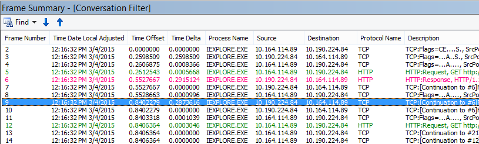

> [!NOTE]
> Your IP address may be different than the IPs shown here, for example, your ping may return something more like 157.56.0.0/16 or a similar range. For a list of ranges used by Office 365, check out [Office 365 URLs and IP address ranges](./urls-and-ip-address-ranges.md).

Remember to expand all the nodes (there's a button at the top for this) if you want to search for, for example, 132.245.

### Proxy Authentication

This only applies to you if you're going through a proxy server. If not, you can skip these steps. When working properly, proxy authentication should take place in milliseconds, consistently. You shouldn't see intermittent bad performance during peak usage periods (for example).

If Proxy authentication is on, each time you make a new TCP connection to Office 365 to get information, you need to pass through an authentication process behind the scenes. So, for example, when switching from Calendar to Mail in Outlook Online, you will authenticate. And in SharePoint Online, if a page displays media or data from multiple sites or locations, you will authenticate for each different TCP connection that is needed in order to render the data.

In Outlook Online, you may experience slow load times whenever you switch between Calendar and your mailbox, or slow page loads in SharePoint Online. However, there are other symptoms not listed here.

Proxy authentication is a setting on your egress proxy server. If it is causing a performance issue with Office 365, you must consult your networking team.

#### Tools

- Netmon
- Wireshark

#### What to look for

Proxy authentication takes place whenever a new TCP session must be spun up, commonly to request files or info from the server, or to supply info. For example, you may see proxy authentication around HTTP GET or HTTP POST requests. If you want to see the frames where you are authenticating requests in your trace, add the 'NTLMSSP Summary' column to Netmon and filter for  `.property.NTLMSSPSummary`. To see how long the authentication is taking, add the Time Delta column.

To add a column to Netmon:

1. Right-click on a column such as **Description**.
2. Click **Choose Columns**.
3. Locate _NTLMSSP Summary_ and _Time Delta_ in the list and click **Add**.
4. Move the new columns into place before or behind the _Description_ column so you can read them side-by-side.
5. Click **OK**.

Even if you don't add the column, the Netmon filter will work. But your troubleshooting will be much easier if you can see what stage of authentication you're in.

When looking for instances of Proxy Authentication, be sure to study all frames where there is an NTLM Challenge, or an Authenticate Message is present. If necessary, right-click the specific piece of traffic and Find Conversations \> TCP. Be aware of the Time Delta values in these Conversations.

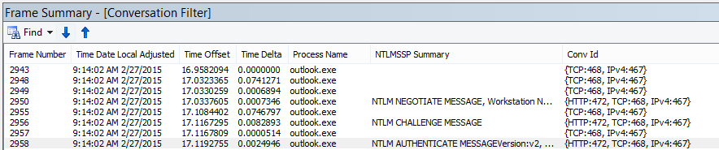

A four second delay in proxy authentication as seen in Wireshark. The **Time delta from previous displayed frame** column was made via right-clicking the field of the same name in the frame details and selecting Add as Column.  <br/> 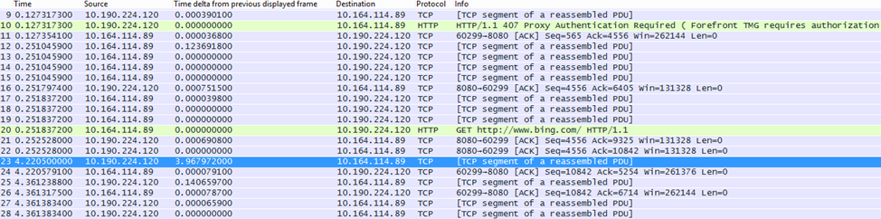

### DNS Performance

Name resolution works best and most quickly when it takes place as close to the client's country/region as possible.

If DNS name resolution is taking place overseas, it can add seconds to page loads. Ideally, name resolution happens in under 100ms. If not, you should do further investigation.

> [!TIP]
> Not sure how Client Connectivity works in Office 365? Take a look at the Client Connectivity Reference document [here](/previous-versions//dn741250(v=technet.10)).

#### Tools

- Netmon
- Wireshark
- PsPing

#### What to look for

Analyzing DNS performance is typically another job for a network trace. However, PsPing is also helpful in ruling in, or out, a possible cause.

DNS traffic is based on TCP and UDP requests and responses are clearly marked with an ID that will help to match a specific request with its specific response. You'll see DNS traffic when, for example, SharePoint Online uses a network name or URL on a web page. As a rule of thumb, most of this traffic, except when transferring Zones, runs over UDP.

In both Netmon and Wireshark, the most basic filter that will let you look at DNS traffic is simply `dns`. Be sure to use lower case when specifying the filter. Remember to flush your DNS resolver cache before you begin to reproduce the issue on your client computer. For example, if you have a slow SharePoint Online page load for the Home page, you should close all browsers, open a new browser, start tracing, flush your DNS resolver cache, and browse to your SharePoint Online site. Once the entire page resolves, you should stop and save the trace.

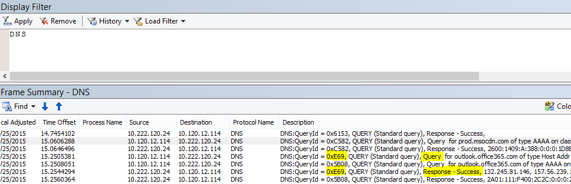

You want to look at the time offset here. And it may be helpful to add the **Time Delta** column to Netmon which you can do by completing these steps:

1. Right-click on a column such as **Description**.
2. Click **Choose Columns**.
3. Locate _Time Delta_ in the list and click **Add**.
4. Move the new column into place before or behind the _Description_ column so you can read them side-by-side.
5. Click **OK**.

If you find a query of interest, consider isolating it by right-clicking that query in the frame details panel, choosing **Find Conversations** \> **DNS**. Notice that the Network Conversations panel jumps right to the specific conversation in its log of UDP traffic.

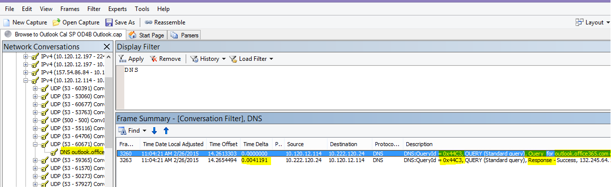

In Wireshark you can make a column for DNS time. Take your trace (or open a trace) in Wireshark and filter by `dns`, or, more helpfully,  `dns.time`. Click on any DNS query, and, in the panel showing details, expand the  `Domain Name System (response)` details. You'll see a field for time (for example, `[Time: 0.001111100 seconds]`. Right-click this time and select **Apply as Column**. This will give you a **Time** column for quicker sorting of your trace. Click on the new column to sort by descending values to see which DNS call took the longest to resolve.

[A browse of SharePoint Online filtered in Wireshark by (lowercase) dns.time, with the time from the details made into a column and sorted ascending.](../media/1439dcc2-12ff-4ee2-9ef3-1484cf79c384.PNG)

If you would like to do more investigation of the DNS resolution time, try a PsPing against the DNS port used by TCP (for example,  `psping <IP address of DNS server>:53`) . Do you still see a performance issue? If you do, then the problem is more likely to be a broader network issue than an issue of specific the DNS application you're hitting to do resolution. It's also worth mentioning, again, that a ping to outlook.office365.com will tell you where DNS name resolution for Outlook Online is taking place (for example, outlook-namnorthwest.office365.com).

If the issue looks to be DNS specific, it may be necessary to contact your IT department to look at DNS configurations and DNS Forwarders to further investigate this issue.

### Proxy Scalability

Services like Outlook Online in Office 365 grant clients multiple long-term connections. Therefore, each user may use more connections that require a longer life.

#### Tools

Math

#### What to look for

There is no network trace or troubleshooting tool specific to this. Instead, it's based upon bandwidth calculations given limitations and other variables.

### TCP Max Segment Size

Found in the SYN - SYN/ACK.  Do this check in any performance network trace you've taken to ensure that TCP packets are configured to carry the maximum amount of data possible.

The goal is to see an MSS of 1460 bytes for transmission of data. If you're behind a proxy, or you are using a NAT, remember to run this test from client to proxy/egress/NAT, and from proxy/egress/NAT to Office 365 for best results! These are different TCP sessions.

#### Tools

Netmon

#### What to look for

TCP Max Segment Size (MSS) is another parameter of the three-way handshake in your network trace, that means you'll find the data you need in the SYN - SYN/ACK packet. MSS is actually pretty simple to see.

Open any performance network trace you have and find the connection you're curious about, or that demonstrates the performance problem.

> [!NOTE]
> If you are looking at a trace and need to find the traffic relevant to your conversation, filter by the IP of the Client, or the IP of the proxy server or egress point, or both. Going directly, you will need to ping the URL that you're testing for the IP address of Office 365 in the trace, and filter by it.

Looking at the trace second-hand? Try using filters to orient yourself. In Netmon, run a search based on the URL, such as `Containsbin(framedata, ascii, "sphybridExample")`, take note of the frame number.

In Wireshark use something like  `frame contains "sphybridExample"`. If you notice that you've found Remote Winsock (RWS) traffic (it may appear as a [PSH, ACK] in Wireshark), remember that RWS connects can be seen shortly before relevant SYN - SYN/ACKs, as discussed earlier.

At this point, you can record the frame number, drop the filter, click **All Traffic** in the Network Conversations window in Netmon to look at the nearest SYN.

Importantly, if you didn't receive any of the IP address information at the time of the trace, finding your URL in the trace (part of `sphybridExample-my.sharepoint.com`, for example), will give you IP addresses to filter by.

Locate the connection in the trace that you're interested in seeing. You may do this by either scanning the trace, by filtering by IP addresses, or by selecting specific Conversation IDs using the Network Conversations window in Netmon. Once you've found the SYN packet, expand TCP (in Netmon), or Transmission Control Protocol (in Wireshark) in the Frame Details panel. Expand TCP Options and MaxSegmentSize. Locate the related SYN-ACK frame and Expand TCP Options and MaxSegmentSize. The smaller of the two values will be your Maximum Segment Size. In this picture, I make use of the built-in Column in Netmon called TCP Troubleshoot.

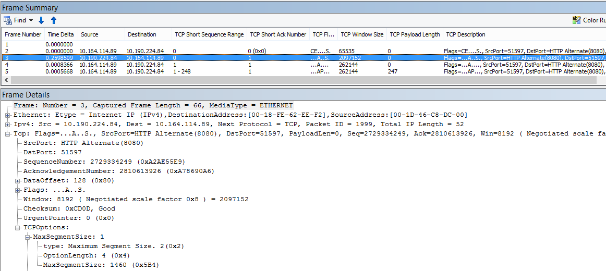

The built-in column is at the top of the **Frame Details** panel. (To switch back to your normal view, click **Columns** again, and then choose **Time Zone**.)

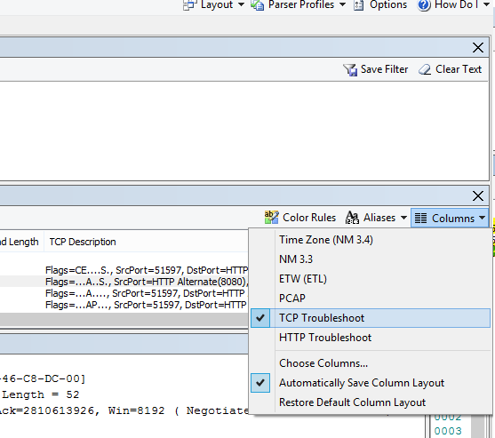

Here's a filtered trace in Wireshark. There is a filter specific to the MSS value (`tcp.options.mss`). The frames of a SYN, SYN/ACK, ACK handshake are linked at the bottom of the Wireshark equivalent to Frame Details (so frame 47 ACK, links to 46 SYN/ACK, links to 43 SYN) to make this kind of work easier.

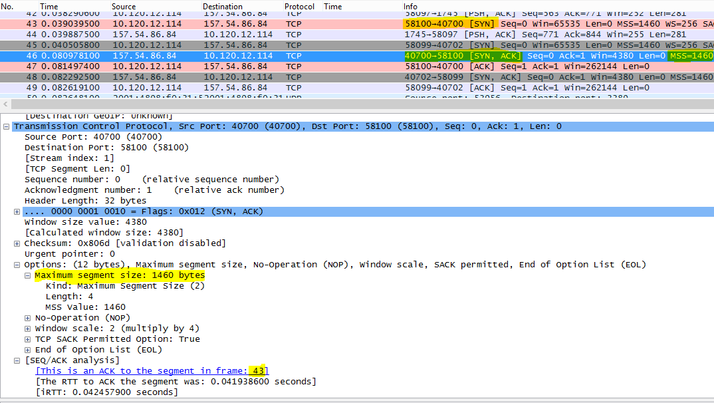

If you need to check **Selective Acknowledgment** (next topic in this matrix), don't close your trace!

### Selective Acknowledgment

Found in the SYN - SYN/ACK. Must be reported as Permitted in both SYN and SYN/ACK. Selective Acknowledgment (SACK) allows for smoother retransmission of data when a packet or packets go missing. Devices can disable this feature, which can lead to performance problems.

If you're behind a proxy, or you are using a NAT, remember to run this test from client to proxy/egress/NAT, and from proxy/egress/NAT to Office 365 for best results! These are different TCP sessions.

#### Tools

Netmon

#### What to look for

Selective Acknowledgment (SACK) is another parameter in the SYN-SYN/ACK handshake. You can filter your trace for SYN - SYN/ACK many ways.

Locate the connection in the trace that you're interested in seeing either by scanning the trace, filtering by IP addresses, or by clicking a Conversation ID using the Network Conversations window in Netmon. Once you've found the SYN packet, expand TCP in Netmon, or Transmission Control Protocol in Wireshark in the Frame Details section. Expand TCP Options and then SACK. Locate the related SYN-ACK frame and Expand TCP Options and its SACK field. Make certain SACK is permitted in both SYN and SYN/ACK. Here are SACK values as seen in both Netmon and Wireshark.

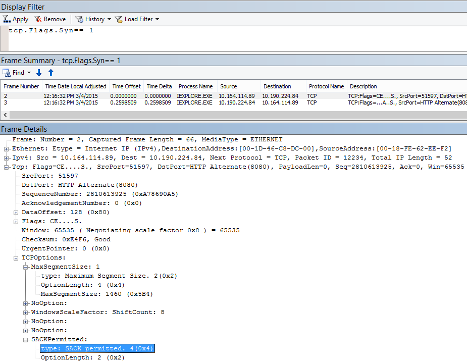


### DNS Geolocation

Where in the world Office 365 tries to resolve your DNS call affects your connection speed.

In Outlook Online, after the first DNS lookup is completed, the location of that DNS will be used to connect to your nearest datacenter. You will be connected to an Outlook Online CAS server, which will use the backbone network to connect to the datacenter (dC) where your data is stored. This is faster.

When accessing SharePoint Online, a user traveling abroad will be directed to their active datacenter -- that's the dC whose location is based on their SPO tenant's home-base (so, a dC in the USA if the user if USA-based).

Lync online has active nodes in more than one dC at a time. When requests are sent for Lync online instances, Microsoft's DNS will determine where in the world the request came from, and return IP addresses from the nearest regional dC where Lync online is active.

> [!TIP]
> Need to know more about how clients connect to Office 365? Take a look at the [Client Connectivity](/previous-versions//dn741250(v=technet.10)) reference article (and its helpful graphics).

#### Tools

- Ping
- PsPing

#### What to look for

Requests for name resolution from the client's DNS servers to Microsoft's DNS servers should in most cases result in Microsoft DNS returning the IP address of a regional datacenter (dC). What does this mean for you? If your headquarters are in Bangalore, India, but you are traveling in the United States, when your browser makes a request for Outlook Online, Microsoft's DNS servers should hand you IP addresses to datacenters in the United States -- a regional datacenter. If mail is needed from Outlook, that data will travel across Microsoft's quick backbone network between the datacenters.

DNS works fastest when name resolution is done as close to the user location as possible. If you're in Europe, you want to go to a Microsoft DNS in Europe, and (ideally) deal with a datacenter in Europe. Performance from a client in Europe going to DNS and a datacenter in America will be slower.

Run the Ping tool against outlook.office365.com to determine where in the world your DNS request is being routed. If you are in Europe, you should see a reply from something like outlook-emeawest.office365.com. In the Americas, expect something like outlook-namnorthwest.office365.com.

Open the command prompt on the client computer (via Start \> Run \> cmd or Windows key \> type cmd). Type ping outlook.office365.com and press ENTER. Remember, to specify -4 if you want to specify to ping via IPv4. You may fail to get a reply from the ICMP packets, but you should see the name of the DNS to which the request was routed. If you want to see the latency numbers for this connection try PsPing to the IP address of the server that is returned by ping.

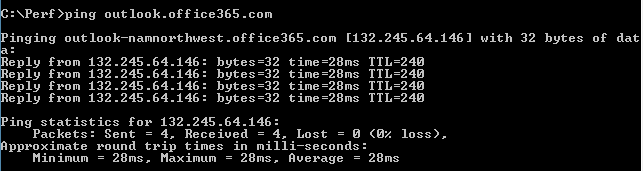

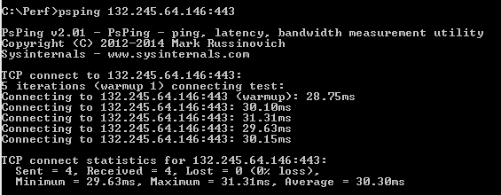

### Office 365 Application Troubleshooting

#### Tools

- Netmon
- HTTPWatch
- F12 Console in the browser

We don't cover tools used in application-specific troubleshooting in this network-specific article. But you'll find resources you  *can*  use [on this page](https://support.office.com/article/Network-planning-and-performance-tuning-for-Office-365-e5f1228c-da3c-4654-bf16-d163daee8848).

## Related Topics

[Managing Office 365 endpoints](https://support.office.com/article/99cab9d4-ef59-4207-9f2b-3728eb46bf9a)

[Office 365 endpoints FAQ](https://support.office.com/article/d4088321-1c89-4b96-9c99-54c75cae2e6d)