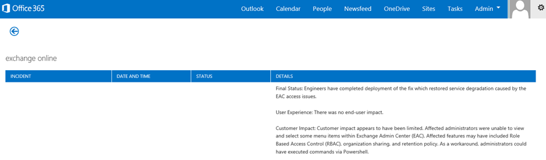
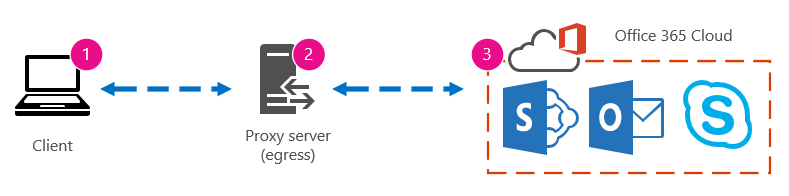
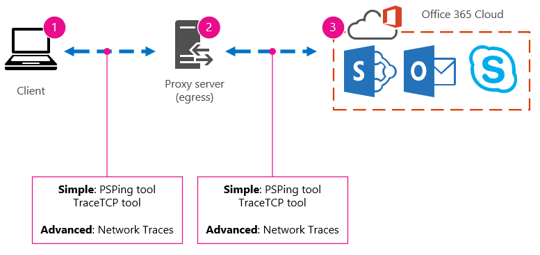
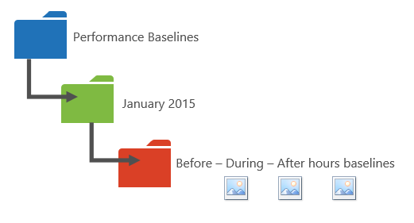
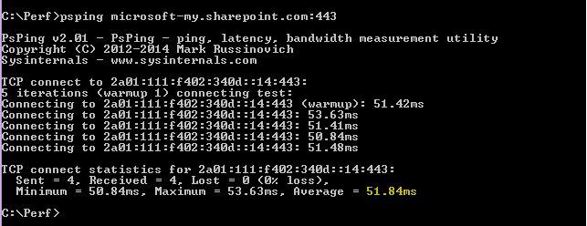
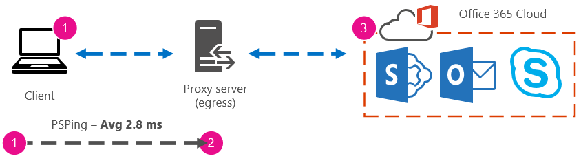
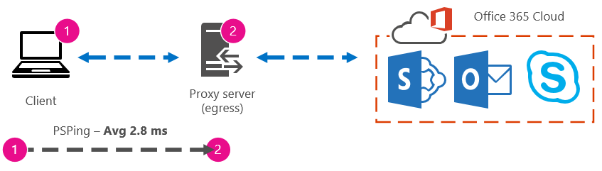
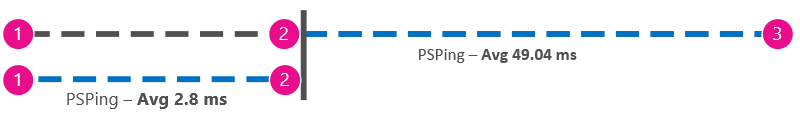

# Office 365 performance tuning using baselines and performance history

There are some simple ways to check the connection performance between Office 365 and your business that will let you establish a rough baseline of your connectivity. Knowing the performance history of your client computer connections can help you detect emerging issues early, identify, and predict problems.
  
If you're not used to working on performance issues, this article is designed to help you consider some common questions. How do you know the problem you're seeing is a performance issue and not an Office 365 service incident? How can you plan for good performance, long term? How can you keep an eye on performance? If your team or clients are seeing slow performance while using Office 365, and you wonder about any of these questions, read on.
  
> [!IMPORTANT]
> **Have a performance issue between your client and Office 365 right now?** Follow the steps outlined in the [Performance troubleshooting plan for Office 365](performance-troubleshooting-plan.md). 
    
## Something you should know about Office 365 performance

Office 365 lives inside a high-capacity, dedicated Microsoft network that is monitored by automation and real people. Part of maintaining the Office 365 cloud is performance tuning and streamlining where possible. Since clients of the Office 365 cloud have to connect across the Internet, there's ongoing effort to fine-tune the performance across Office 365 services too.

Performance improvements never really stop in the cloud, so neither does experience with keeping the cloud healthy and quick. Should you have a performance issue connecting from your location to Office 365, it's best not to start with or wait on a Support case. Instead, you should begin investigating the problem from 'the inside out'. That is, start inside of your network, and work your way out to Office 365. Before you open a case with Support, you can gather data and take actions that will explore, and may resolve, the problem.
  
> [!IMPORTANT]
> Be aware of capacity planning and limits in Office 365. That information will put you ahead of the curve when trying to resolve a performance issue. Here's a link to the [Microsoft 365 and Office 365 service descriptions](/office365/servicedescriptions/office-365-service-descriptions-technet-library). This is a central hub, and all the services offered by Office 365 have a link that goes to their own Service Descriptions from here. That means, should you need to see the standard limits for SharePoint Online, for example, you would click [SharePoint Online Service Description](/office365/servicedescriptions/sharepoint-online-service-description/sharepoint-online-service-description) and locate its [SharePoint Online Limits section](/office365/servicedescriptions/sharepoint-online-service-description/sharepoint-online-limits).
  
Make sure you go into your troubleshooting with the understanding that performance is a sliding scale. It's not about achieving an idealized value and maintaining it permanently. Occasional high-bandwidth tasks like on-boarding a large number of users, or doing large data migrations will be stressful, so *plan* for performance impacts then. You should have a rough idea of your performance targets, but many variables play into performance, so performance varies.
  
Performance troubleshooting isn't about meeting specific goals and maintaining those numbers indefinitely, it's about improving existing activities, given all the variables. 
  
## Okay, what does a performance problem look like?

First, you need to make sure that what you are experiencing is indeed a performance issue and not a service incident. A performance problem is different from a service incident in Office 365. Here's how to tell them apart.
  
Service Incidents happen when the Office 365 service itself is having issues. You may see red or yellow icons under **Current health** in the Microsoft 365 admin center. You may notice performance on client computers connecting to Office 365 is slow. For example, if Current health reports a red icon and you see **Investigating** beside Exchange, you might then also get calls from people in your organization who complain that client mailboxes using Exchange Online are slow. In that case, it's reasonable to assume that your Exchange Online performance was a victim of Service issues.
  

  
At this point, you, the Office 365 admin, should check **Current health** and then **View details and history**, often, to keep up to date on maintenance on the system. The **Current health** dashboard was made to update you about changes to, and problems in, the service. The notes and explanations written to health history, admin to admin, are there to help you gauge, and to keep you posted about ongoing work.
  

  
A performance issue isn't a service incident, even though incidents can cause slow performance. A performance issue looks like this:
  
- A performance issue occurs no matter what the admin center **Current health** is reporting for the service.
    
-  A behavior that used to flow takes a long time to complete or never completes.
    
- You can replicate the problem too, or know it will happen if you do the right series of steps.
    
-  If the problem is intermittent, there can still be a pattern. For example, you know that by 10:00 AM you'll have calls from users who can't always access Office 365. The calls will end around noon.
    
This list probably sounds familiar; maybe too familiar. Once you're aware it's a performance problem, the question becomes, "What do you do next?" The rest of this article helps you determine exactly that.
  
## How to define and test the performance problem

Performance issues often emerge over time, so it can be challenging to define the actual problem. Create a good problem statement with a good idea of issue context, and then you need to repeatable testing steps. Here are some examples of problems statements that don't provide enough information:
  
- Switching from my Inbox to my Calendar used to be something I didn't notice, and now it's a coffee-break. Can you make it act like it used to?
    
- Uploading my files to SharePoint Online is taking forever. Why is it slow in the afternoon, but any other time, it's fast? Can't it just be fast?
    
There are several large challenges posed by the problem statements above. Specifically, too many ambiguities to deal with. For example:
  
- It's unclear how switching between Inbox and Calendar used to act on the laptop.
    
- When the user says, "Can't it just be fast", what's "fast"?
    
- How long is "forever"? Is that several seconds? Or many minutes? Or could the user take lunch and the action would finish up 10 minutes after they got back?
    
The admin and troubleshooter can't be aware of the *details* of the problem from general statements like these. For example, they don't know when the problem started happening. The troubleshooter might not know the user works from home and only ever sees slow switching while on their home network. Or that the user runs other RAM intensive applications on the local client. Admins may not know the user is running an older operating system or hasn't run recent updates.
  
When users report a performance problem, there's much information to collect. Getting and recording information is called scoping the issue. Here is a basic scoping list you can use to collect information about performance issues. This list is not exhaustive, but it's a place to start:
  
- On what date did the issue happen, and around what time of day or night?
    
- What kind of client computer were you using, and how does it connect to the business network (VPN, Wired, Wireless)?
    
- Were you working remotely or were you in the office?
    
- Did you try the same actions on another computer and see the same behavior?
    
- Walk through the steps that are giving you the trouble so that you can write the actions you take down.
    
- How slow in seconds or minutes is the performance?
    
- Where in the world are you located?
    
Some of these questions are more obvious than others. Most everyone will understand a troubleshooter needs the exact steps to reproduce the issue. After all, how else can you record what's wrong, and how else can you test if the issue is fixed? Less obvious are things like "What date and time did you see the issue?", and "Where in the world are you located?", information that can be used in tandem. Depending on when the user was working, a few hours of time difference may mean maintenance is already underway on parts of your company's network. For instance, your company has a hybrid implementation, like a hybrid SharePoint Search, which can query search indexes in both SharePoint Online and an On-premises SharePoint Server 2013 instance, updates may be underway in the on-premises farm. If your company is all in the cloud, system maintenance may include adding or removing network hardware, rolling out updates that are company-wide, or making changes to DNS, or other core infrastructure.
  
When you're troubleshooting a performance problem, it's a bit like a crime scene, you need to be precise and observant to draw any conclusions from the evidence. In order to do this, you must get a good problem statement by gathering evidence. It should include the computer's context, the user's context, when the problem began, and the exact steps that exposed the performance issue. This problem statement should be, and stay, the topmost page in your notes. By walking through the problem statement again after you work on the resolution, you are taking the steps to test and prove whether the actions you take have resolved the issue. This is critical to knowing when your work, there, is done.
  
## Do you know how performance used to look when it was good?

If you're unlucky, nobody knows. Nobody had numbers. That means nobody can answer the simple question "About how many seconds did it used to take to bring up an Inbox in Office 365?", or "How long did it used to take when the Executives had a Lync Online meeting?", which is a common scenario for many companies.
  
What's missing here is a performance baseline?
  
Baselines give you a context for your performance. You should take a baseline occasionally to frequently, depending on the needs of your company. If you are a larger company, your Operations team may take baselines for your on-premises environment already. For example, if you patch all the Exchange servers on the first Monday of the month, and all your SharePoint servers on the third Monday, your Operations team probably has a list of tasks and scenarios it runs post-patching, to prove that critical functions are operational. For example, opening the Inbox, clicking Send/Receive, and making sure the folders update, or, in SharePoint, browsing the main page of the site, going into the enterprise Search page, and doing a search that returns results.
  
If your applications are in Office 365, some of the most fundamental baselines you can take measure the time (in milliseconds) from a client computer inside your network, to an egress point, or the point where you leave your network and go out to Office 365. Here are some helpful baselines that you can investigate and record:
  
- Identify the devices between your client computer and your egress point, for example, your proxy server.
    
  - You have to know your devices so that you have context (IP addresses, type of device, et cetera) for performance problems that arise.
    
  - Proxy servers are common egress points, so you can check your web browser to see what proxy server it is set to use, if any.
    
  - There are third-party tools that can discover and map your network, but the safest way to know your devices is to ask a member of your network team.
    
- Identify your Internet service provider (ISP), write down their contact information, and ask how many circuits how much bandwidth you have.
    
- Inside your company, identify resources for the devices between your client and the egress point, or identify an emergency contact to talk to about networking issues.
    
Here are some baselines that simple testing with tools can calculate for you:
  
- Time from your client computer to your egress point in milliseconds
    
- Time from your egress point to Office 365 in milliseconds
    
- Location in the world of the server that resolves the URLS for Office 365 when you browse
    
- The speed of your ISP's DNS resolution in milliseconds, inconsistencies in packet arrival (network jitter), upload, and download times in milliseconds
    
If you're unfamiliar with how to carry out these steps, we'll go into more detail in this article. 
  
## What is a baseline?

You'll know the impact when it goes bad, but if you don't know your historical performance data, it's not possible to have a context for how bad it may have become, and when. So without a baseline, you're missing the key clue to solve the puzzle: the picture on the puzzle box. In performance troubleshooting, you need a point of  *comparison*. Simple performance baselines aren't difficult to take. Your Operations team can be tasked with carrying these out on a schedule. For example, let's say your connection looks like this: 
  

  
That means you've checked with your network team and found out that you leave your company for the Internet through a proxy server, and that proxy handles all the requests your client computer sends to the cloud. In this case, you should draw a simplified version of your connection that lists all the intervening devices. Now, insert tools that you can use to test the performance between the client, the egress point (where you leave your network for the Internet), and the Office 365 cloud.
  

  
The options are listed as **Simple** and **Advanced** because of the amount of expertise you need in order to find the performance data. A network trace will take much time, compared to running command-line tools like PsPing and TraceTCP. These two command-line tools were chosen because they don't use ICMP packets, which will be blocked by Office 365, and because they give the time in milliseconds that it takes to leave the client computer, or proxy server (if you have access) and arrive at Office 365. Each individual hop from one computer to another will end up with a time value, and that's great for baselines! Just as importantly, these command-line tools allow you to add a port number onto the command, this is useful because Office 365 communicates over port 443, which is the port used by Secure Sockets Layer and Transport Layer Security (SSL and TLS). However, other third-party tools may be better solutions for your situation. Microsoft doesn't support all of these tools, so if, for some reason, you can't get PsPing and TraceTCP working, move on to a network trace with a tool like Netmon. 
  
You can take a baseline before business hours, again during heavy use, and then again after hours. This means you may have a folder structure that looks a bit like this in the end:
  

  
You should also pick a naming convention your files. Here are some examples:
  
- Feb_09_2015_9amPST_PerfBaseline_Netmon_ClientToEgress_Normal
    
- Jan_10_2015_3pmCST_PerfBaseline_PsPing_ClientToO365_bypassProxy_SLOW
    
- Feb_08_2015_2pmEST_PerfBaseline_BADPerf
    
- Feb_08_2015_8-30amEST_PerfBaseline_GoodPerf
    
There are lots of different ways to do this, but using the format **\<dateTime\>\<what's happening in the test\>** is a good place to start. Being diligent about this will help a lot when you are trying to troubleshoot issues later. Later, you'll be able to say "I took two traces on February 8, one showed good performance and one showed bad, so we can compare them". This is helpful for troubleshooting. 
  
You need to have an organized way to keep your historical baselines. In this example, the simple methods produced three command-line outputs and the results were collected as screenshots, but you may have network capture files instead. Use the method that works best for you. Store your historical baselines and refer to them at points where you notice changes in the behavior of online services. 
  
## Why collect performance data during a pilot?

There is no better time to start making baselines than during a pilot of the Office 365 service. Your office may have thousands of users, hundreds of thousands, or it may have five, but even with a few users, you can perform tests to measure fluctuations in performance. In the case of a large company, a representative sample of several hundred users piloting Office 365 can be projected outward to several thousands so you know where issues might arise before they happen.
  
In the case of a small company, where on-boarding means that all users go to the service at the same time and there is no pilot, keep performance measures so that you have data to show to anyone who may have to troubleshoot a badly performing operation. For example, if you notice that all of a sudden you can walk around your building in the time it takes to upload a medium-sized graphic where it used to happen quickly.
  
## How to collect baselines

For all troubleshooting plans you need to identify these things at a minimum:
  
- The client computer you're using (the type of computer or device, an IP address, and the actions that caused the issue)
    
- Where the client computer is located in the world (for example, whether this user on a VPN to the network, working remotely, or on the company intranet)
    
- The egress point the client computer uses from your network (the point at which traffic leaves your business for an ISP or the Internet)
    
 You can find out the layout of your network from the network administrator. If you're on a small network, take a look at the devices connecting you to the Internet, and call your ISP if you have questions about the layout. Create a graphic of the final layout for your reference. 
  
This section is broken into simple command-line tools and methods, and more advanced tools options. We'll cover simple methods first. But if you've got a performance problem right now, you should jump to advanced methods and try out the sample performance-troubleshooting action plan.
  
### Simple methods

The objective of these simple methods is to learn to take, understand, and properly store simple performance baselines over time so that you are informed about Office 365 performance. Here's the simple diagram for simple, as you've seen before:
  

  
> [!NOTE]
> TraceTCP is included in this screen shot because it's a useful tool for showing, in milliseconds, how long a request takes to process, and how many network hops, or connections from one computer to the next, that the request takes to reach a destination. TraceTCP can also give the names of servers used during hops, which can be useful to a Microsoft Office 365 troubleshooter in Support. > TraceTCP commands can be very simple, such as: >  `tracetcp.exe outlook.office365.com:443`> Remember to include the port number in the command! > [TraceTCP](https://simulatedsimian.github.io/tracetcp_download.html) is a free download, but relies on Wincap. Wincap is a tool that is also used and installed by Netmon. We also use Netmon in the advanced methods section. 
  
 If you have multiple offices, you'll need to keep a set of data from a client in each of those locations as well. This test measures latency, which, in this case, is a number value that describes the amount of time between a client sending a request to Office 365, and Office 365 responding to the request. The testing originates inside your domain on a client computer, and looks to measure a round trip from inside your network, out through an egress point, across the Internet to Office 365, and back. 
  
There are a few ways to deal with the egress point, in this case, the proxy server. You can either trace from 1 to 2 and then 2 to 3, and then add the numbers in milliseconds to get a final total to the edge of your network. Or, you can configure the connection to bypass the proxy for Office 365 addresses. In a larger network with a firewall, reverse proxy, or some combination of the two, you may need to make exceptions on the proxy server that will allow traffic to pass for a lot of URLs. For the list of endpoints used by Office 365, see [Office 365 URLs and IP address ranges](https://support.office.com/article/8548a211-3fe7-47cb-abb1-355ea5aa88a2). If you have an authenticating proxy, begin by testing exceptions for the following:
  
- Ports 80 and 443
    
- TCP and HTTPs
    
- Connections that are outbound to any of these URLs:
    
- \*.microsoftonline.com
    
- \*.microsoftonline-p.com
    
- \*.sharepoint.com
    
- \*.outlook.com
    
- \*.lync.com
    
- osub.microsoft.com
    
All users need to be allowed to get to these addresses without any proxy interference or authentication. On a smaller network, you should add these to your proxy bypass list in your web browser. 
  
To add these to your proxy bypass list in Internet Explorer, go to **Tools** \> **Internet Options** \> **Connections** \> **LAN settings** \> **Advanced**. The advanced tab is also where you will find your proxy server and proxy server port. You may need to click the checkbox **Use a proxy server for your LAN**, to access the **Advanced** button. You'll want to make sure that **Bypass proxy server for local addresses** is checked. Once you click **Advanced**, you'll see a text box where you can enter exceptions. Separate the wildcard URLs listed above with semi-colons, for example:
  
\*.microsoftonline.com; \*.sharepoint.com
  
Once you bypass your proxy, you should be able to use ping or PsPing directly on an Office 365 URL. The next step will be to test ping **outlook.office365.com**. Or, if you're using PsPing or another tool that will let you supply a port number to the command, PsPing against **portal.microsoftonline.com:443** to see the average round-trip time in milliseconds. 
  
The round-trip time, or RTT, is a number value that measures how long it takes to send an HTTP request to a server like outlook.office365.com and get a response back that acknowledges the server knows that you did it. You'll sometimes see this abbreviated as RTT. This should be a relatively short amount of time.
  
You have to use [PSPing](/sysinternals/downloads/psping) or another tool that does not use ICMP packets that are blocked by Office 365 in order to do this test. 
  
 **How to use PsPing to get an overall round trip time in milliseconds directly from an Office 365 URL**
  
1. Run an elevated command prompt by completing these steps:
    
1. Click **Start**.
    
2. In the **Start Search** box, type cmd, and then press CTRL+SHIFT+ENTER.
    
3. If the **User Account Control** dialog box appears, confirm that the action it displays is what you want, and then click **Continue**.
    
2. Navigate to the folder where the tool (in this case PsPing) is installed and test these Office 365 URLs:
    
  - psping admin.microsoft.com:443
    
  - psping microsoft-my.sharepoint.com:443
    
  - psping outlook.office365.com:443
    
  - psping www.yammer.com:443
    
    
  
Be sure to include the port number of 443. Remember that Office 365 works on an encrypted channel. If you PsPing without the port number, your request will fail. Once you've pinged your short list, look for the Average time in milliseconds (ms). That is what you want to record!
  

  
If you're not familiar with proxy bypass, and prefer to take things step by step, you need to first find out the name of your proxy server. In Internet Explorer, go to **Tools** \> **Internet Options** \> **Connections** \> **LAN settings** \> **Advanced**. The **Advanced** tab is where you will see your proxy server listed. Ping that proxy server at a command prompt by completing this task: 
  
 **To ping the proxy server and get a round trip value in milliseconds for stage 1 to 2**
  
1. Run an elevated command prompt by completing these steps:
    
1. Click **Start**.
    
2. In the **Start Search** box, type cmd, and then press CTRL+SHIFT+ENTER.
    
3. If the **User Account Control** dialog box appears, confirm that the action it displays is what you want, and then click **Continue**.
    
2. Type ping \<the name of the proxy server your browser uses, or the IP address of the proxy server\> and then press ENTER. If you have PsPing, or some other tool, installed, you can choose to use that tool instead. 
    
    Your command may look like any of these examples: 
    
  - ping ourproxy.ourdomain.industry.business.com
    
  - ping 155.55.121.55
    
  - ping ourproxy
    
  - psping ourproxy.ourdomain.industry.business.com:80
    
  - psping 155.55.121.55:80
    
  - psping ourproxy:80
    
3. When the trace stops sending test packets, you'll get a small summary that lists an average, in milliseconds, and that's the value you are after. Take a screenshot of the prompt and save it using your naming convention. At this point it may also help to fill in the diagram with the value.
    
Maybe you've taken a trace in the early morning, and your client can get to the proxy (or whatever egress server exits to the Internet) quickly. In this case, your numbers may look like this:
  

  
If your client computer is one of the select few with access to the proxy (or egress) server, you can run the next leg of the test by remotely connecting to that computer, running the command prompt to PsPing to an Office 365 URL from there. If you don't have access to that computer, you can contact your network resources for help with the next leg and get exact numbers that way. If that's not possible, take a PsPing against the Office 365 URL in question and compare it to the PsPing or Ping time against your proxy server. 
  
For example, if you have 51.84 milliseconds from the client to the Office 365 URL, and you have 2.8 milliseconds from the client to the proxy (or egress point), then you have 49.04 milliseconds from the egress to Office 365. Likewise, if you have a PsPing of 12.25 milliseconds from the client to the proxy during the height of the day, and 62.01 milliseconds from the client to the Office 365 URL, then your average value for the proxy egress to the Office 365 URL is 49.76 milliseconds.
  

  
In terms of troubleshooting, you may find something interesting just from keeping these baselines. For example, if you find that you generally have about 40 milliseconds to 59 milliseconds of latency from the proxy or egress point to the Office 365 URL, and have a client to proxy or egress point latency of about 3 milliseconds to 7 milliseconds (depending on the amount network traffic you're seeing during that time of day) then you will surely know something is problematic if your last three client to proxy or egress baselines show a latency of 45 milliseconds.
  
### Advanced methods

If you really want to know what is happening with your Internet requests to Office 365, you need to become familiar with network traces. It does not matter which tools you prefer for these traces, HTTPWatch, Netmon, Message Analyzer, Wireshark, Fiddler, Developer Dashboard tool or any other will do as long as that tool can capture and filter network traffic. You'll see in this section that it's beneficial to run more than one of these tools to get a more complete picture of the problem. When you're testing, some of these tools also act as proxies in their own right. Tools used in the companion article, [Performance troubleshooting plan for Office 365](performance-troubleshooting-plan.md), include [Netmon 3.4](https://www.microsoft.com/download/details.aspx?id=4865), [HTTPWatch](https://www.httpwatch.com/download/), or [WireShark](https://www.wireshark.org/).
  
Taking a performance baseline is the simple part of this method, and many of the steps are the same as when you troubleshoot a performance issue. The more advanced methods of creating baselines for performance require you to take and store network traces. Most of the examples in this article use SharePoint Online, but you should develop a list of common actions across the Office 365 services to which you subscribe to test and record. Here is a baseline example:
  
- Baseline list for SPO - ** Step 1: ** Browse the home page of the SPO website and do a network trace. Save the trace. 
    
- Baseline list for SPO - **Step 2:** Search for a term (such as your company name) via Enterprise Search and do a network trace. Save the trace. 
    
- Baseline list for SPO - **Step 3:** Upload a large file to a SharePoint Online document library and do a network trace. Save the trace. 
    
- Baseline list for SPO - **Step 4:** Browse the home page of the OneDrive website and do a network trace. Save the trace. 
    
This list should include the most important common actions that users take against SharePoint Online. Notice that the last step, to trace going to OneDrive for Business, builds-in a comparison between the load of the SharePoint Online home page (which is often customized by companies) and OneDrive for Business home page, which is seldom customized. This is a basic test when it comes to a slow-loading SharePoint Online site. You can build a record of this difference into your testing.
  
If you are in the middle of a performance problem, many of the steps are the same as when taking a baseline. Network traces become critical, so we'll handle  *how*  to take the important traces next. 
  
To tackle a performance problem,  *right now*, you need to be taking a trace at the time you are experiencing the performance issue. You need to have the proper tools available to gather logs, and you need an action plan, that is, a list of troubleshooting actions to take to gather the best information that you can. The first thing to do is record the date and time of the test so that the files can be saved in a folder that reflect the timing. Next, narrow down to the problem steps themselves. These are the exact steps you will use for testing. Don't forget the basics: if the issue is only with Outlook, make sure to record that the problem behavior happens in only one Office 365 service. Narrowing down the scope of this issue will help you to focus on something you can resolve. 
  
## See also

[Managing Office 365 endpoints](https://support.office.com/article/99cab9d4-ef59-4207-9f2b-3728eb46bf9a)