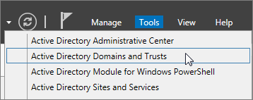
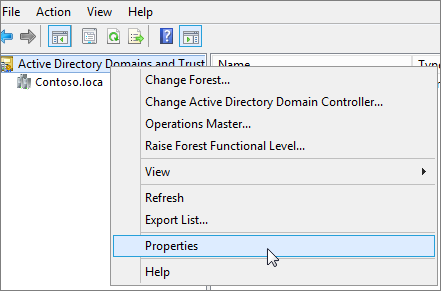
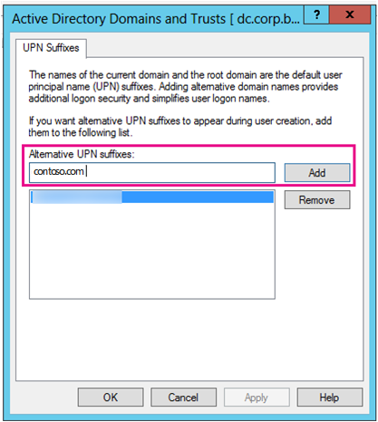
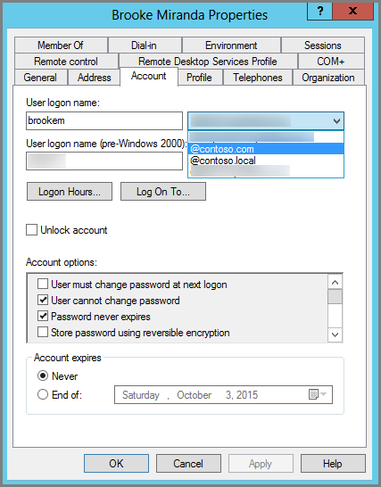

# Prepare a nonroutable domain for directory synchronization

When you synchronize your on-premises directory with Microsoft 365, you have to have a verified domain in Microsoft Entra ID. Only the User Principal Names (UPNs) that are associated with the on-premises Active Directory Domain Services (AD DS) domain are synchronized. However, any UPN that contains a nonroutable domain, such as `.local` (example: billa@contoso.local), is synchronized to an `.onmicrosoft.com` domain (example: billa@contoso.onmicrosoft.com).

If you currently use a `.local` domain for your user accounts in AD DS, we recommend that you change them to use a verified domain. For example, billa@contoso.com, in order to properly synchronize with your Microsoft 365 domain.
  
## What if I only have a `.local` on-premises domain?

You use Microsoft Entra Connect for synchronizing your AD DS to the Microsoft Entra tenant of your Microsoft 365 tenant. For more information, see [Integrating your on-premises identities with Microsoft Entra ID](/azure/architecture/reference-architectures/identity/azure-ad).
  
Microsoft Entra Connect synchronizes your users' UPN and password so that users can sign in with the same credentials they use on-premises. However, Microsoft Entra Connect only synchronizes users to domains that are verified by Microsoft 365. Microsoft Entra ID verifies the domain, as it manages Microsoft 365 identities. In other words, the domain has to be a valid Internet domain (such as, .com, .org, .NET, .us). If your internal AD DS only uses a nonroutable domain (for example, `.local`), this can't possibly match the verified domain you have for your Microsoft 365 tenant. You can fix this issue by either changing your primary domain in your on-premises AD DS, or by adding one or more UPN suffixes.
  
### Change your primary domain

Change your primary domain to a domain you've verified in Microsoft 365, for example, contoso.com. Every user that has the domain `contoso.local` is then updated to contoso.com. This is an involved process, however, and an easier solution is described in the following section.
  
### Add UPN suffixes and update your users to them

You can solve the `.local` problem by registering new UPN suffix or suffixes in AD DS to match the domain (or domains) you verified in Microsoft 365. After you register the new suffix, you update the user UPNs to replace the `.local` with the new domain name, for example, so that a user account looks like billa@contoso.com.
  
After you update the UPNs to use the verified domain, you're ready to synchronize your on-premises AD DS with Microsoft 365.
  
#### Step 1: Add the new UPN suffix
  
1. On the AD DS domain controller, in the Server Manager choose **Tools** \> **Active Directory Domains and Trusts**.

    **Or, if you don't have Windows Server 2012**

    Press **Windows key + R** to open the **Run** dialog, and then type in Domain.msc, and then choose **OK**.

    
  
2. In the **Active Directory Domains and Trusts** window, right-click **Active Directory Domains and Trusts**, and then choose **Properties**.

    
  
3. On the **UPN Suffixes** tab, in the **Alternative UPN Suffixes** box, type your new UPN suffix or suffixes, and then choose **Add** \> **Apply**.

    
  
    Choose **OK** when you're done adding suffixes.

#### Step 2: Change the UPN suffix for existing users

1. On the AD DS domain controller, in the Server Manager choose **Tools** \> **Active Directory Users and Computers**.

    **Or, if you don't have Windows Server 2012**

    Press **Windows key + R** to open the **Run** dialog, and then type in Dsa.msc, and then select **OK**

2. Select a user, right-click, and then choose **Properties**.

3. On the **Account** tab, in the UPN suffix drop-down list, choose the new UPN suffix, and then choose **OK**.

    
  
4. Complete these steps for every user.

### Use PowerShell to change the UPN suffix for all of your users

If you have numerous user accounts to update, it's easier to use PowerShell. The following example uses the cmdlets [Get-ADUser](/previous-versions/windows/it-pro/windows-server-2008-R2-and-2008/ee617241(v=technet.10)) and [Set-ADUser](/previous-versions/windows/it-pro/windows-server-2008-R2-and-2008/ee617215(v=technet.10)) to change all contoso.local suffixes to contoso.com in AD DS.

For example, you could run the following PowerShell commands to update all contoso.local suffixes to contoso.com:

  ```powershell
  $LocalUsers = Get-ADUser -Filter "UserPrincipalName -like '*contoso.local'" -Properties userPrincipalName -ResultSetSize $null
  $LocalUsers | foreach {$newUpn = $_.UserPrincipalName.Replace("@contoso.local","@contoso.com"); $_ | Set-ADUser -UserPrincipalName $newUpn}
  ```

See [Active Directory Windows PowerShell module](/previous-versions/windows/it-pro/windows-server-2008-R2-and-2008/ee617195(v=technet.10)) to learn more about using Windows PowerShell in AD DS.
