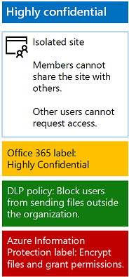

# Protect files with  Azure Information Protection

## Introduction

Use the steps in this article to configure Azure Information Protection (AIP) to provide encryption and permissions for files in a highly confidential SharePoint Online team site. 

The encryption and permissions protection travels with a file even when it is downloaded from the site. For more information about highly confidential SharePoint Online team sites, see [Secure SharePoint Online sites and files](secure-sharepoint-online-sites-and-files.md).

> [!NOTE]
> When Azure Information Protection encryption is applied to files stored in Office 365, the service cannot process the contents of these files. Co-authoring, eDiscovery, search, Delve, and other collaborative features do not work. Data Loss Prevention (DLP) policies can only work with the metadata (including Office 365 labels) but not the contents of these files (such as credit card numbers within files).

## Configure Azure Information Protection

First, follow the instructions in [Activate Azure RMS with the Office 365 admin center for your Office 365 subscription](https://docs.microsoft.com/information-protection/deploy-use/activate-office365).

Next, configure Azure Information Protection with a new scoped policy and sub-label for protection and permissions for your highly confidential SharePoint Online team site by following these steps:

1. Sign in to the **Office 365 portal** with an account that has the Security Administrator or Company Administrator role. For help, see [Where to sign in to Office 365](https://support.office.com/Article/Where-to-sign-in-to-Office-365-e9eb7d51-5430-4929-91ab-6157c5a050b4).
2. In a separate tab of your browser, go to the Azure portal ([https://portal.azure.com](https://portal.azure.com/)).
3. If this is the first time you are configuring Azure Information Protection, see [these instructions](https://docs.microsoft.com/information-protection/deploy-use/configure-policy#to-access-the-azure-information-protection-blade-for-the-first-time).
4. In the list pane, click **More services**, type **information**, and click **Azure Information Protection**.
5. On the **Azure Information protection** blade, click **Scoped policies > + Add a new policy**.
6. Type a name for the new policy in **Policy name** and a description in **Description**.
7. Click **Select which users or groups get this policy > User/Groups**, and then select the site members access group for your highly sensitive SharePoint Online team site.
8. Click **Select > OK**.
9. For the **Highly Confidential** label, click the ellipses (…), and then click **Add a sub-label**.
10. Type a name for the sub-label in **Name** and a description of the label in **Description**.
11. In **Set permissions for documents and emails containing this label**, click **Protect**.
12. In the **Protection** section, click **Azure (cloud key)**.
13. On the **Protection** blade, under **Protection settings**, click **+ Add permissions**.
14. On the **Add permissions** blade, under **Specify users and groups**, click **+ Browse directory**.
15. On the **AAD Users and Groups** pane, select the site members access group for your highly sensitive SharePoint Online team site, and click **Select**.
16. Under **Choose permissions from the preset**, clear the **Print, Copy and extract content**, and **Forward** check boxes.
17. Click **OK** two times.
18. On the **Sub-label** blade, configure visual markings as needed, and then click **Save**.
19. Close the new scoped policy blade.
20. On the **Azure Information Protection – Scoped policies** blade, click **Publish**, and then click **Yes**.

This is the resulting configuration for your highly confidential SharePoint Online team site.

 

You are now ready to begin creating documents and protecting them with Azure Information Protection and your new label.

You must [install the Azure Information Protection client](https://docs.microsoft.com/information-protection/rms-client/install-client-app) on your device or Windows-based computer. You can script and automate the installation, or users can install the client manually. 

For more information, see the following resources:

* [The client side of Azure Information Protection](https://docs.microsoft.com/information-protection/rms-client/use-client)
* [Installing the Azure Information Protection client](https://docs.microsoft.com/information-protection/rms-client/client-admin-guide)
* [Download page for manual installation](https://www.microsoft.com/download/details.aspx?id=53018)

Once installed, your users run and then sign-in from an Office application (such as Microsoft Word) with their Office 365 account. A new **Information Protection** bar allows you to select the label. 

Make sure that your users know the SharePoint Online team site and which label to use to protect their highly confidential files.

>[!Note]
>If you have multiple highly sensitive SharePoint Online team sites, you should create multiple Azure Information Protection scoped policies with sub-labels with the above settings, with the permissions for each sub-label set to the site members access group of a specific SharePoint Online team site.
>

## Next steps

[Cloud adoption and hybrid solutions](https://technet.microsoft.com/library/dn262744.aspx)
