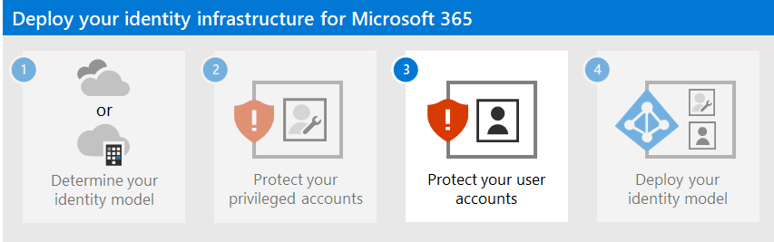

# Step 2. Protect your Microsoft 365 privileged accounts

*This article applies to both Microsoft 365 Enterprise and Office 365 Enterprise.*

Check out all of our small business content on [Small business help & learning](https://go.microsoft.com/fwlink/?linkid=2224585).

Security breaches of a Microsoft 365 tenant, including information harvesting and phishing attacks, are typically done by compromising the credentials of a Microsoft 365 privileged account. Security in the cloud is a partnership between you and Microsoft:
  
- Microsoft cloud services are built on a foundation of trust and security. Microsoft provides you security controls and capabilities to help you protect your data and applications.

- You own your data and identities and the responsibility for protecting them, the security of your on-premises resources, and the security of cloud components you control.

Microsoft provides capabilities to help protect your organization, but they're effective only if you use them. If you don't use them, you may be vulnerable to attack. To protect your privileged accounts, Microsoft is here to help you with detailed instructions to:
  
1. Create dedicated, privileged, cloud-based accounts and use them only when necessary.

2. Configure multi-factor authentication (MFA) for your dedicated Microsoft 365 privileged accounts and use the strongest form of secondary authentication.

3. Protect privileged accounts with Zero Trust identity and device access recommendations.

> [!NOTE]
> To secure your privileged roles, check out [Best practices for Microsoft Entra roles](/azure/active-directory/roles/best-practices) to secure privileged access to your tenant.

## 1. Create dedicated, privileged, cloud-based user accounts and use them only when necessary

Instead of using everyday user accounts that have been assigned administrator roles, create dedicated user accounts that have the admin roles in Microsoft Entra ID.

From this moment onward, you sign in with the dedicated privileged accounts only for tasks that require administrator privileges. All other Microsoft 365 administration must be done by assigning other administration roles to user accounts.
  
> [!NOTE]
> This does require additional steps to sign out as your everyday user account and sign in with a dedicated administrator account. But this only needs to be done occasionally for administrator operations. Consider that recovering your Microsoft 365 subscription after an administrator account breach requires a lot more steps.

You also need to create [emergency access accounts](/azure/active-directory/roles/security-emergency-access) to prevent being accidentally locked out of Microsoft Entra ID.

You can further protect your privileged accounts with Microsoft Entra Privileged Identity Management (PIM) for on-demand, just-in-time assignment of administrator roles.

## 2. Configure multi-factor authentication for your dedicated Microsoft 365 privileged accounts

Multi-factor authentication (MFA) requires additional information beyond the account name and password. Microsoft 365 supports these extra verification methods:
  
- The Microsoft Authenticator app
- A phone call
- A randomly generated verification code sent through a text message
- A smart card (virtual or physical) (requires federated authentication)
- A biometric device
- Oauth token

> [!NOTE]
> For organizations that must adhere to National Institute of Standards and Technology (NIST) standards, the use of a phone call or text message-based additional verification methods are restricted. Click [here](https://pages.nist.gov/800-63-FAQ/#q-b01) for the details.
>

If you're a small business that is using user accounts stored only in the cloud (the cloud-only identity model), [set up MFA](/office365/admin/security-and-compliance/set-up-multi-factor-authentication) to configure MFA using a phone call or a text message verification code sent to a smart phone for each dedicated privileged account.

If you're a larger organization that is using a Microsoft 365 hybrid identity model, you have more verification options. If you have the security infrastructure already in place for a stronger secondary authentication method, [set up MFA](../admin/security-and-compliance/set-up-multi-factor-authentication.md) and configure each dedicated privileged account for the appropriate verification method.
  
If the security infrastructure for the desired stronger verification method isn't in place and functioning for Microsoft 365 MFA, we strongly recommend that you configure dedicated privileged accounts with MFA using the Microsoft Authenticator app, a phone call, or a text message verification code sent to a smart phone for your privileged accounts as an interim security measure. Don't leave your dedicated privileged accounts without the extra protection provided by MFA.
  
For more information, see [MFA for Microsoft 365](../admin/security-and-compliance/multi-factor-authentication-microsoft-365.md).
  
## 3. Protect administrator accounts with Zero Trust identity and device access recommendations

To help ensure a secure and productive workforce, Microsoft provides a set of recommendations for [identity and device access](../security/office-365-security/zero-trust-identity-device-access-policies-overview.md). For identity, use the recommendations and settings in these articles:

- [Prerequisites](../security/office-365-security/zero-trust-identity-device-access-policies-prereq.md)
- [Common identity and device access policies](../security/office-365-security/zero-trust-identity-device-access-policies-common.md)

## Additional protections for enterprise organizations

Use these additional methods to ensure that your privileged account, and the configuration that you perform using it, are as secure as possible.
  
### Privileged access workstation

To ensure that the execution of highly privileged tasks is as secure as possible, use a privileged access workstation (PAW). A PAW is a dedicated computer that is only used for sensitive configuration tasks, such as Microsoft 365 configuration that requires a privileged account. Because this computer isn't used daily for Internet browsing or email, it's better protected from Internet attacks and threats.
  
For instructions on how to set up a PAW, see [Securing devices as part of the privileged access story](https://aka.ms/cyberpaw).

To enable Azure PIM for your Microsoft Entra tenant and administrator accounts, see the [steps to configure PIM](/azure/active-directory/active-directory-privileged-identity-management-configure).

To develop a comprehensive roadmap to secure privileged access against cyber attackers, see [Securing privileged access for hybrid and cloud deployments in Microsoft Entra ID](/azure/active-directory/admin-roles-best-practices).

### Privileged Identity Management

Rather than having your privileged accounts be permanently assigned an administrator role, you can use PIM to enable on-demand, just-in-time assignment of the administrator role when it's needed.
  
Your administrator accounts go from being permanent admins to eligible admins. The administrator role is inactive until someone needs it. You then complete an activation process to add the administrator role to the privileged account for a predetermined amount of time. When the time expires, PIM removes the administrator role from the privileged account.
  
Using PIM and this process significantly reduces the amount of time that your privileged accounts are vulnerable to attack and use by malicious users.

Using this feature requires either Microsoft Entra ID Governance or Microsoft Entra ID P2 subscriptions. To find the right license for your requirements, see [Compare generally available features of Microsoft Entra ID](https://www.microsoft.com/security/business/identity-access-management/azure-ad-pricing).

For information about licenses for users, see [License requirements to use Privileged Identity Management](/azure/active-directory/privileged-identity-management/subscription-requirements).
  
For more information, see:

- [Privileged Identity Management](/azure/active-directory/active-directory-privileged-identity-management-configure).
- [Securing privileged access for hybrid and cloud deployments in Microsoft Entra ID](/azure/active-directory/roles/security-planning)

### Privileged access management

Privileged access management is enabled by configuring policies that specify just-in-time access for task-based activities in your tenant. It can help protect your organization from breaches that may use existing privileged administrator accounts with standing access to sensitive data or access to critical configuration settings. For example, you could configure a privileged access management policy that requires explicit approval to access and change organization mailbox settings in your tenant.

In this step, you'll enable privileged access management in your tenant and configure privileged access policies that provide extra security for task-based access to data and configuration settings for your organization. There are three basic steps to get started with privileged access in your organization:

- Creating an approver's group
- Enabling privileged access
- Creating approval policies

Privileged access management enables your organization to operate with zero standing privileges and provide a layer of defense against vulnerabilities arising because of such standing administrative access. Privileged access requires approvals for executing any task that has an associated approval policy defined. Users needing to execute tasks included in the approval policy must request and be granted access approval.

To enable privileged access management, see [Get started with privileged access management](/microsoft-365/compliance/privileged-access-management-configuration).

For more information, see [Learn about privileged access management](/microsoft-365/compliance/privileged-access-management).

### Security information and event management (SIEM) software for Microsoft 365 logging

SIEM software run on a server performs real-time analysis of security alerts and events created by applications and network hardware. To allow your SIEM server to include Microsoft 365 security alerts and events in its analysis and reporting functions, integrate Microsoft Entra ID into your SEIM. See [Introduction to Azure Log Integration](/azure/security/security-azure-log-integration-overview).

## Next step

Continue with [Step 3](microsoft-365-secure-sign-in.md) to secure your user accounts.
