# Recover deleted items in a user mailbox

**This article is for administrators. Are you trying to recover deleted items in your own mailbox?** Try one of the following:
- [Recover deleted items in Outlook for Windows](https://support.office.com/article/49e81f3c-c8f4-4426-a0b9-c0fd751d48ce)
- [Recover deleted items or email in Outlook Web App](https://support.office.com/article/c3d8fc15-eeef-4f1c-81df-e27964b7edd4)
- [Restore deleted email messages in Outlook on the web](https://support.office.com/article/a8ca78ac-4721-4066-95dd-571842e9fb11)
- [Outlook.com](https://go.microsoft.com/fwlink/p/?LinkID=623435)
   
Did a user permanently delete items from their Outlook mailbox? The user wants them back but can't recover them. You may be able recover the purged items if they haven't been permanently removed from the user's mailbox. You do this by using the In-Place eDiscovery tool in Exchange Online to search for deleted email and other items—and such as contacts, calendar appointments, and tasks—in a user's mailbox. If you find the deleted items, you can export them to a PST file (also called an Outlook Data File), which the user can then use to restore the items back to their mailbox.
  
Here are the steps for recovering deleted items in a user's mailbox. How long will this take? The first time might take 20 or 30 minutes to complete all the steps, depending on how many items you're trying to recover.
  
> [!NOTE]
> You have to be an **Exchange administrator** or **Global administrator** in Microsoft 365 or be a member of the Organization Management role group in Exchange Online to perform the steps in this article. For more information, see [About Microsoft 365 admin roles](https://support.office.com/article/da585eea-f576-4f55-a1e0-87090b6aaa9d). 
  
## Step 1: Assign yourself eDiscovery permissions

The first step is to assign yourself the necessary permissions in Exchange Online so you can use the In-Place eDiscovery tool to search a user's mailbox. You only have to do this once. If you have to search another mailbox in the future, you can skip this step.
  
1. [Where to sign in to Microsoft 365 for business](https://support.microsoft.com/office/where-to-sign-into-microsoft-365-for-business-e9eb7d51-5430-4929-91ab-6157c5a050b4) with your work or school account. 
    
2. Select the app launcher icon  in the upper-left and click **Admin**.
    
3. In the left navigation in the Microsoft 365 admin center, expand **Admin centers**, and then click **Exchange**.
    
    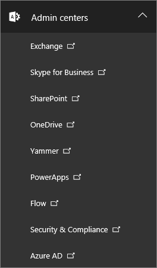
  
4. In the Exchange admin center, click **Permissions**, and then click **Admin roles**.
    
5. In the list view, select **Discovery Management**, and then click **Edit**.
    
    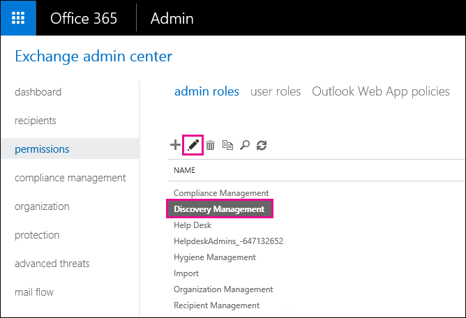
  
6. In **Role Group**, under **Members**, click **Add**.
    
7. In **Select Members**, select yourself from the list of names, click **Add**, and then click **OK**.
    
    > [!NOTE]
    > You can also add a group that you are a member of, such as Organization Management or TenantAdmins. If you add a group, other members of the group will be assigned the necessary permissions to run the In-Place eDiscovery tool. 
  
8. In **Role Group**, click **Save**.
    
9. Sign out of Microsoft 365.
    
    You have to sign out before you start the next step so the new permissions will take effect.
    
> [!CAUTION]
> Members of the Discovery Management role group can access sensitive message content. This includes searching all mailboxes in your organization, previewing the search results (and other mailbox items), copying the results to a discovery mailbox, and exporting the search results to a PST file. 
  
[Return to top](recover-deleted-items-in-a-mailbox.md)
  
## Step 2: Search the user's mailbox for deleted items

When you run an In-Place eDiscovery search, the Recoverable Items folder in the mailbox that you search is automatically included in the search. The Recoverable Items folder is where permanently deleted items are stored until they're purged (permanently removed) from the mailbox. So, if an item hasn't been purged, you should be able to find it by using the In-Place eDiscovery tool.
  
1. [Where to sign in to Microsoft 365 for business](https://support.microsoft.com/office/where-to-sign-into-microsoft-365-for-business-e9eb7d51-5430-4929-91ab-6157c5a050b4) with your work or school account. 
    
2. Select the app launcher icon  in the upper-left and click **Admin**.
    
3. In the left navigation in the Microsoft 365 admin center, expand **Admin**, and then click **Exchange**.
    
4. In the Exchange admin center, click **Compliance management**, click **In-Place eDiscovery &amp; Hold**, and then click **New**.
    
    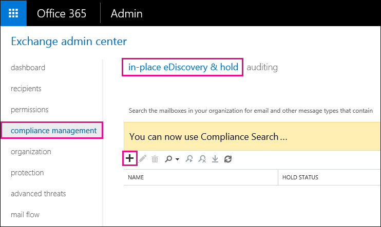
  
5. On the **Name and description** page, type a name for the search (such as the name of the user you're recovering email for), an optional description, and then click **Next**.
    
6. On the **Mailboxes** page, click **Specify mailboxes to search**, and then click **Add**.
    
    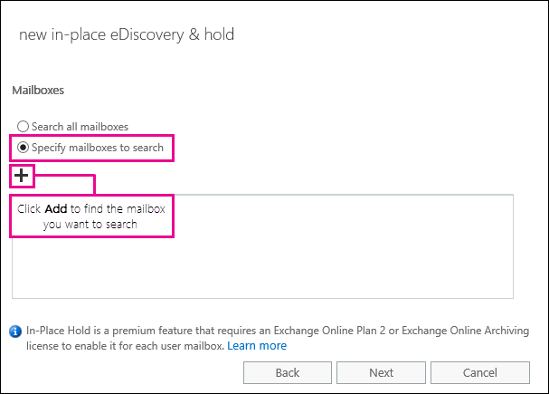
  
7. Find and select the name of the user that you're recovering the deleted email for, click **Add**, and then click **OK**.
    
8. Click **Next**.
    
    The **Search query** page is displayed. This is where you define the search criteria that will help you find the missing items in user's mailbox. 
    
9. On the **Search query** page, complete the following fields: 
    
  - **Include all content** Select this option to include all content in the user's mailbox in the search results. If you select this option, you can't specify additional search criteria. 
    
  - **Filter based on criteria** Select this option to specify the search criteria, including keywords, start and end dates, sender and recipient addresses, and message types. 
    
    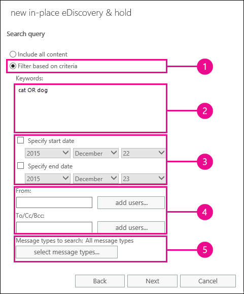
  
|**Field**|**Use this to...**|
|:-----|:-----|
|             |Specify keywords, date range, recipients, and message types.    |
|             |Search for messages with keywords or phrases, and use logical operators such as **AND** or **OR**.    |
|             |Search for messages sent or received within a date range.    |
|             |Search for messages received from or sent to specific people.    |
|             |Search for all message types or select specific ones.    |
   
   > [!TIP]
   >  Here are a few tips about how to build a search query to find missing items. Try to get as much information from the user to help you create a search query so you can find what you're looking for. If you are not sure how to find a missing message, consider using the **Include all content** option. The search results will include all items in the user's Recoverable Items folder, including the hidden folder (called the Purges folder) that contain items that have been purged by the user. Then you can go to Step 3, copy the results to a discovery mailbox, and look at the message in the hidden folder. If you know approximately when the missing message was originally sent or received by the user, use the **Specify start date** and **Specify end date** options to provide a date range. This will return all messages sent or received by the user within that date range. Specifying a date range is a really good way to narrow the search results. If you know who sent the missing email, use the **From** box to specify this sender. If you want to narrow the search results to different types of mailbox items, click **Select message types**, click **Select the message types to search**, and then choose a specific message type to search for. For example, you can search only for calendar items or contacts. Here's a screenshot of the different message types you can search for; the default is to search for all message types. 
  
   Click **Next** when you've completed the **Search query** page. 
    
10. On the **In-Place Hold settings** page, click **Finish** to start the search. To recover deleted email, there's no reason to place the user's mailbox on hold. 
    
    After you start the search, Exchange will display an estimate of the total size and number of items that will be returned by the search based on the criteria you specified.
    
11. Select the search you just created and click **Refresh** to update the information displayed in the details pane. The status of **Estimate Succeeded** indicates that the search has finished. Exchange also displays an estimate of the total number of items (and their size) found by the search based on the search criteria you specified in step 9. 
    
12. In the details pane, click **Preview search results** to view the items that were found. This might help you identify the item(s) that you're looking for. If you find the item(s) you're trying to recover, go to step 4 to export the search results to a PST file. 
    
    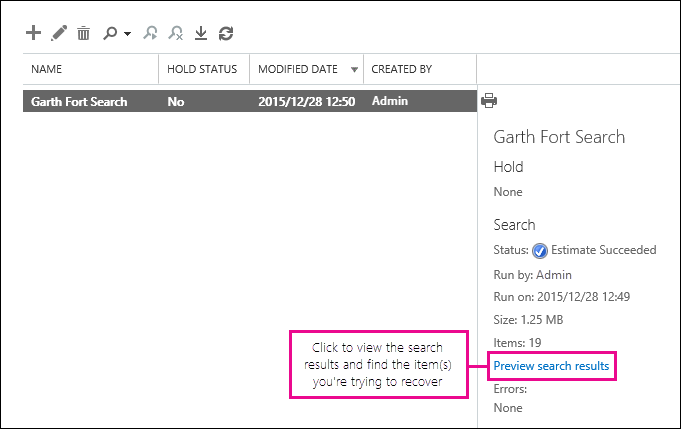
  
13. If you don't find what you're looking for, you can revise your search criteria by selecting the search, clicking **Edit**, and then clicking **Search query**. Change the search criteria and then rerun the search.
    
[Return to top](recover-deleted-items-in-a-mailbox.md)
  
## (Optional) Step 3: Copy the search results to a discovery mailbox

If you can't find an items by previewing the search results or if you want to see which items are in the user's Recoverable Items folder, then you can copy the search results to a special mailbox (called a discovery mailbox) and then open that mailbox in Outlook on the web to view the actual items. The best reason to copy the search results is so you can view the items in the user's Recoverable Items folder. More than likely, the item you're trying to recover is located in the Purges subfolder. 
  
1. In the Exchange admin center, go to **Compliance management** \> **In-Place eDiscovery &amp; Hold**.
    
2. In the list of searches, select the search that you created in Step 2.
    
3. Click **Search**, and then click **Copy search results** from the drop-down list. 
    
    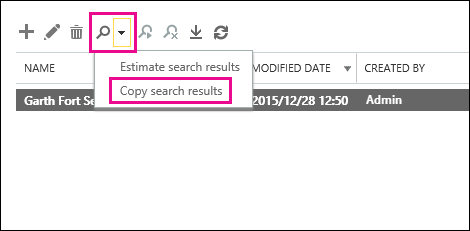
  
4. On the **Copy Search Results** page, click **Browse**.
    
    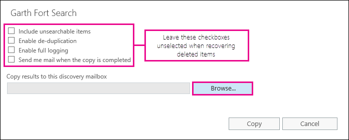
  
5. Under **Display Name**, click **Discovery Search Mailbox**, and then click **OK**.
    
    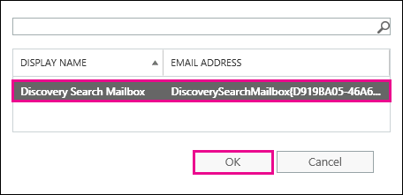
  
    > [!NOTE]
    > The Discovery Search Mailbox is a default discovery mailbox that is automatically created in your Microsoft 365 organization. 
  
6. Back on the **Copy Search Results** page, click **Copy** to start the process to copy the search results to the Discovery Search Mailbox. 
    
    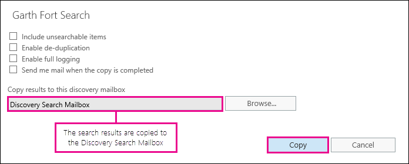
  
7. Click **Refresh** to update the information about the copying status that is displayed in the details pane. 
    
8. When the copying is complete, click **Open** to open the Discovery Search Mailbox to view the search results. 
    
    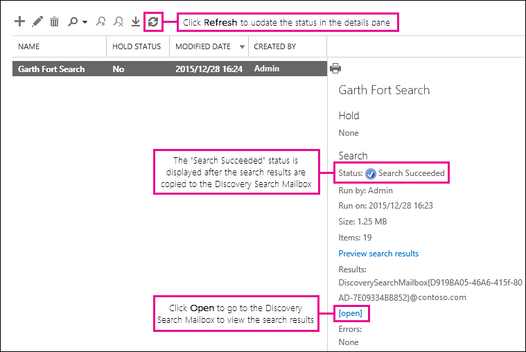
  
    The search results copied to the Discovery Search Mailbox are placed in a folder that has the same name as the In-Place eDiscovery search. You can click a folder to display the items in that folder.
    
    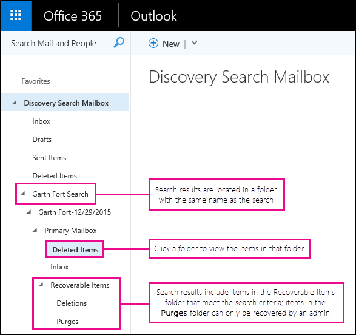
  
    When you run a search, the user's Recoverable Items folder is also searched. That means if items in the Recoverable Items folder meet the search criteria, they are included in the search results. Items in the Deletions folder are items that the user permanently deleted (by deleting an item from the Deleted Items folder or by selecting it and pressing **Shift+Delete**. A user can use the Recover Deleted Items tool in Outlook or Outlook on the web to recover items in the Deletions folder. Items in the Purges folder are items that the user purged by using the Recover Deleted Items tool or items they were automatically purged by a policy applied to the mailbox. In either case, only an admin can recover items in the Purges folder. 
    
    > [!TIP]
    > If a user can't find a deleted item using the Recoverable Items tool, but that item is still recoverable (meaning that it hasn't been permanently removed from the mailbox), it's more than likely located in the Purges folder. So, be sure to look in the Purges folder for the deleted item you're trying to recover for a user. 
  
[Return to top](recover-deleted-items-in-a-mailbox.md)
  
## Step 4: Export the search results to a PST file

After you find the item you're trying to recover for a user, the next step is to export the results from the search you ran in Step 2 to a PST file. The user will use this PST file in the next step to restore the deleted item to their mailbox.
  
1. In the Exchange admin center, go to **Compliance management** \> **In-Place eDiscovery &amp; Hold**.
    
2. In the list of searches, select the search that you created in Step 2.
    
3. Click **Export to a PST file**.
    
    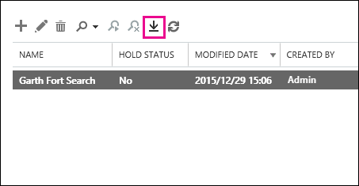
  
4. If you're prompted to install the eDiscovery Export Tool, click **Run**.
    
5. In the eDiscovery PST Export Tool, click **Browse** to specify the location where you want to download the PST file. 
    
    
  
    You can ignore the options to enable deduplication and include unsearchable items.
    
6. Click **Start** to download the PST file to your computer. 
    
    The **eDiscovery PST Export Tool** displays status information about the export process. When the export is complete, you can access the file in the location where it was downloaded. 
    
[Return to top](recover-deleted-items-in-a-mailbox.md)
  
## Step 5: Restore the recovered items to the user's mailbox

The final step is to use the PST file that was exported in step 4 to restore the recovered items to the user's mailbox. After you send the PST file to the user, the remainder of this step is performed by the user to open the PST file and then move the recovered items to another folder in their mailbox. For step-by-step instructions, you can also send the user a link to this topic: [Open and close Outlook Data Files (.pst)](https://support.office.com/article/381b776d-7511-45a0-953a-0935c79d24f2). Or you can send the user a link to the [Restore deleted items to a mailbox using a PST file](recover-deleted-items-in-a-mailbox.md#restoredeleteditems) section below and ask them to perform these steps. 
  
 **Send the PST file to the user**
  
The final step that you need to perform is sending the PST file that was exported in step 4 to the user. There are a few ways to do this:
  
- Attach the PST file to an email message. If Outlook is configured to block PST files, then you will have to zip the file and then attach it to the message. Here's how:
    
1. In Windows Explorer or File Explorer, browse to the PST file.
    
2. Right-click the file, and then select **Send to** \> **Compressed (zipped) folder**. Windows creates a new zip file and gives it an identical name as the PST file.
    
3. Attach the compressed PST file to an email message and send it to the user, who can then decompress the file just by clicking it.
    
- Copy the PST file to a shared folder that the user can access and retrieve it.
    
The steps in the next section are performed by the user to restore the deleted items to their mailbox.
  
 
**Restore deleted items to a mailbox using a PST file**
  
You have to use the Outlook desktop app to restore a deleted item by using a PST file. You can't use Outlook Web App or Outlook on the web to open a PST file.
  
1. In Outlook 2013 or Outlook 2016, click the **File** tab. 
    
2. Click **Open &amp; Export**, and then click **Open Outlook Data File**.
    
3. Browse to the location where you saved the PST file that your administrator sent.
    
4. Select the PST and then click **Open**.
    
    The PST file appears in the left-nav bar in Outlook.
    
    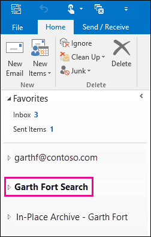
  
5. Click the arrows to expand the PST file and the folders under it to locate the item you want to recover.
    
    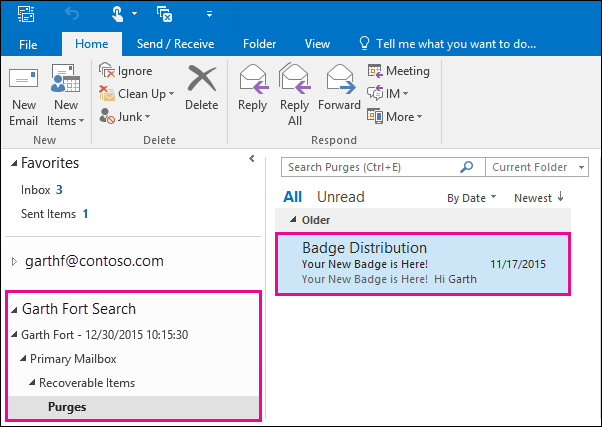
  
    > [!TIP]
    > Look in the Purges folder for the item you want to recover. This is a hidden folder that purged items are moved to. It's likely the item that your administrator recovered is in this folder. 
  
6. Right-click the item you want to recover and then click **Move** \> **Other Folder**.
    
    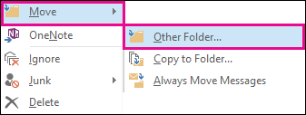
  
7. To move the item to your inbox, click **Inbox**, and then click **OK**.
    
    **Tip:** To recover other types of items, do one of the following: 
    
  - To recover a calendar item, right-click it, and then click **Move** \> **Other Folder** \> **Calendar**.
    
  - To recover a contact, right-click it, and then click **Move** \> **Other Folder** \> **Contacts**.
    
  - To recover a task, right-click it, and then click **Move** \> **Other Folder** \> **Tasks**.
    
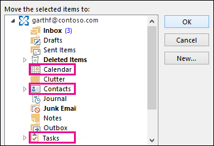
  
   > [!NOTE]
   > Calendar items, contacts, and tasks are located directly in the Purges folder, and not in a Calendar, Contacts, or Tasks subfolder. However, you can sort by **Type** to group similar types of items. 
    
8. When you're finished recovering deleted items, right-click the PST file in the left-nav bar and select **Close "name of PST file"**.
    
[Return to top](recover-deleted-items-in-a-mailbox.md)
  
## More information

- It might be possible for a user to recover a permanently deleted item if the deleted item retention period for the item hasn't expired. As an admin you may have specified how long items in the Recoverable Items folder are available for recovery. For example, there might be a policy that deletes anything that's been in a user's Deleted Items folder for 30 days, and another policy that lets users recover items in the Recoverable Items folder for up to another 14 days. However, after this 14 days, you may still be able to recover an item in a user's mailbox by using the procedures in this topic.
    
- Users can recover a deleted item if it hasn't been purged and if the deleted item retention period for that item hasn't expired. To help users recover deleted items in their mailbox, point them to one of the following topics:
    
  - [Recover deleted items in Outlook for Windows](https://support.office.com/article/49e81f3c-c8f4-4426-a0b9-c0fd751d48ce)
    
  - [Recover deleted items in Outlook 2010](https://support.office.com/article/cd9dfe12-8e8c-4a21-bbbf-4bd103a3f1fe)
    
  - [Recover deleted items or email in Outlook Web App](https://support.office.com/article/c3d8fc15-eeef-4f1c-81df-e27964b7edd4)
    
  - [Restore deleted email messages in Outlook on the web](https://support.office.com/article/a8ca78ac-4721-4066-95dd-571842e9fb11)
    
  - [Recover a deleted contact in Outlook](https://support.office.com/article/51c83288-6888-4dcd-8c99-4932daabf643)
    
  - [Restore deleted email messages in Outlook.com](https://go.microsoft.com/fwlink/p/?LinkID=623435)
    
[Return to top](recover-deleted-items-in-a-mailbox.md)
  

