## Request FastTrack assistance for Microsoft 365

The FastTrack request for assistance (RFA) form is now available in the [Microsoft 365 admin center](file:///C:/Users/Ashley.Earle/AppData/Local/Microsoft/Windows/INetCache/Content.Outlook/QWA5MSNR/admin.microsoft.com). Tenant admins use this form to request help from FastTrack specialists on their deployment and migration efforts. FastTrack assistance is available for tenants with 150 or more licenses from one of the [eligible plans](/microsoft-365/fasttrack/eligibility) from the following Microsoft product families: Microsoft 365, Office 365, Microsoft Viva, Enterprise Mobility & Security, and Windows 10/11.

__In this article__

·       How to submit an RFA in the admin center

·       How to find RFA details and status updates

How to submit an RFA in the admin center

1.     After signing into the [Microsoft 365 admin center](https://go.microsoft.com/fwlink/?linkid=2226341), select __Submit a new request__.  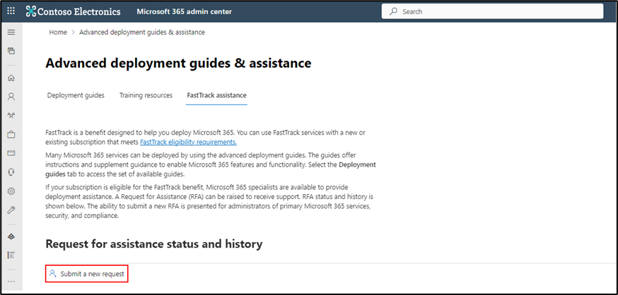

2.     Read the overview to see what information is needed for an RFA, and then select __Next__.

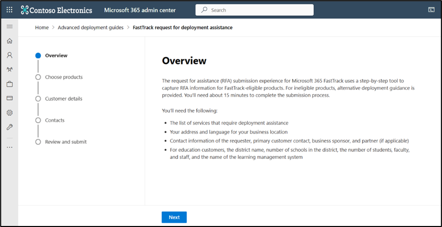

  
  
3.     Select the products for FastTrack assistance, your planned deployment date, and whether you would like assistance with any additional options (if applicable). 

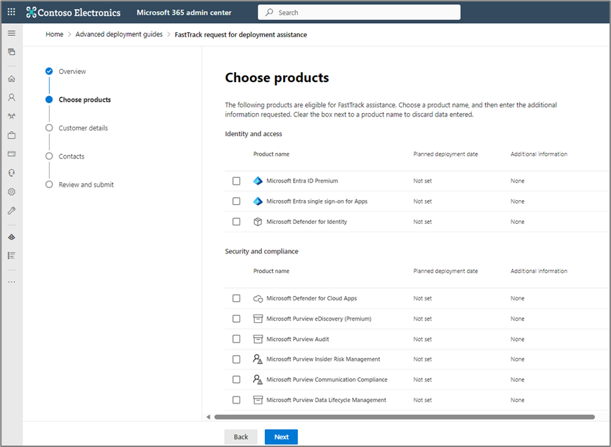

 

4.     On the __Customer details__ page, enter a unique project name, your organization’s service location, your preferred language, and any comments about the project.

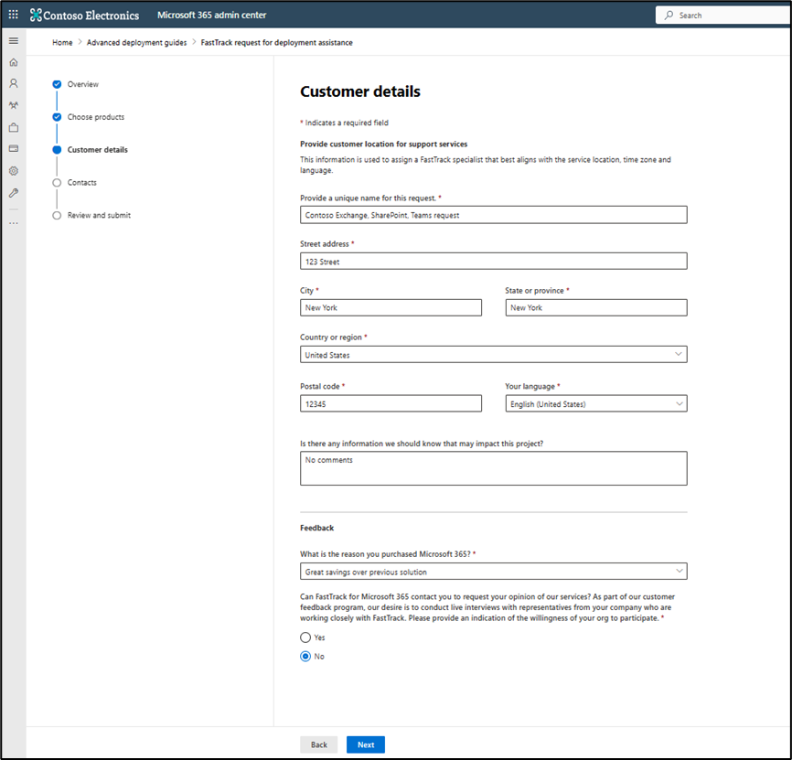

 

5.     On the __Contacts__ page, enter your phone number and confirm your title.

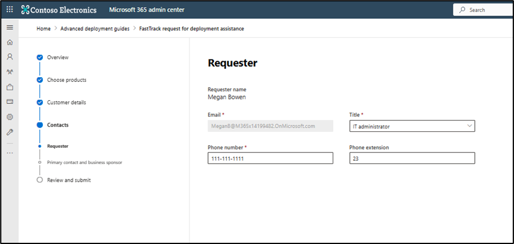

6.     Enter the primary contact and business sponsor for the request. If you’re also the primary contact, select the __Same as the requester__ checkbox.

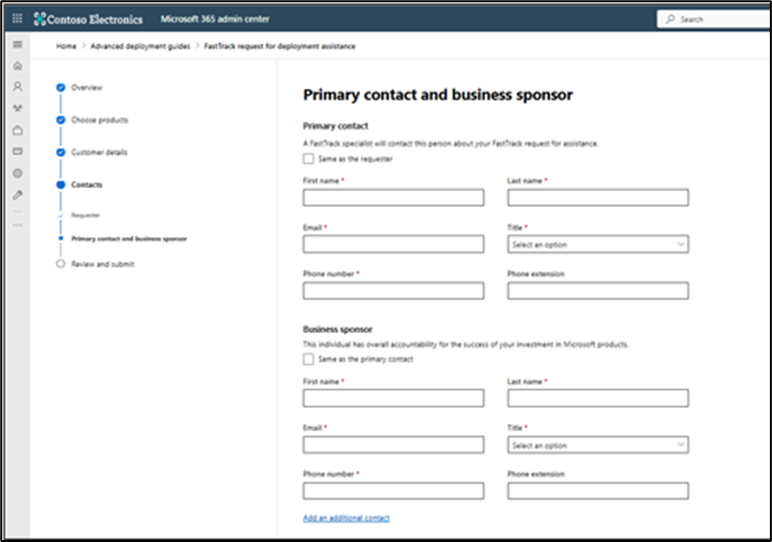

 

7.     On the __Review__ page, view your request’s information and make edits, if needed. Select the checkbox next to the acknowledgement message, and then select __Submit__. 

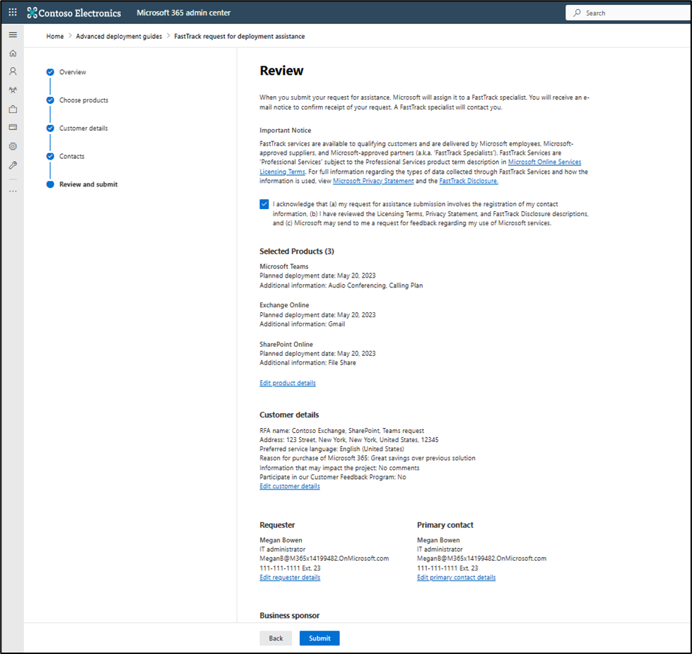

8.     After submission, receipt of your request will be confirmed, your RFA ID will be provided, and you’ll be given the option to provide feedback about your experience.

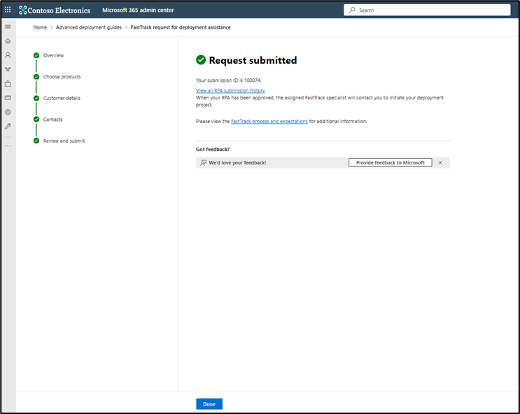

How to find RFA details and status updates

1.     After you submit your RFA, you can find your tenant’s RFA history on the __FastTrack assistance__ page.

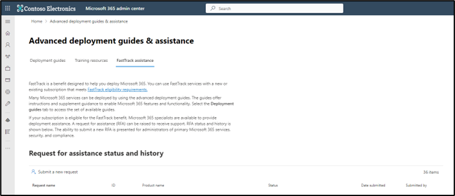

 

2.     Under __Request for assistance status and history__, you can find a list of all historical submissions for your tenant with the request name, requested products, status, submission date, and who submitted the request.

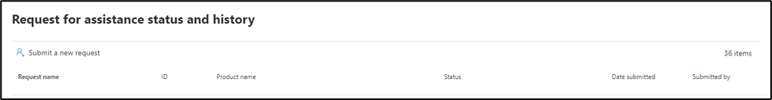

 

3.     Select an RFA to open a flyout window with the request details and status history.

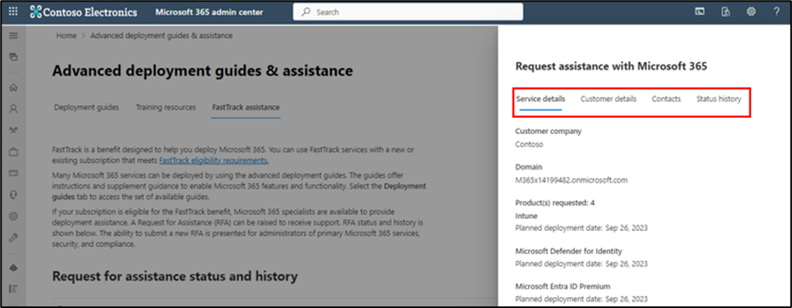

