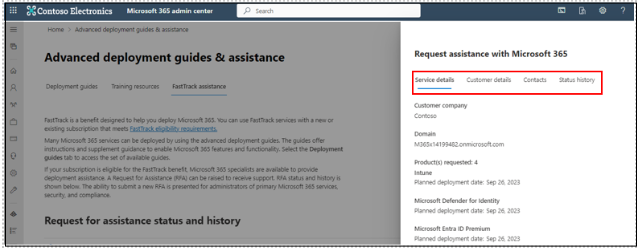

# Request FastTrack assistance for Microsoft 365

The FastTrack request for assistance (RFA) form is now available in the [Microsoft 365 admin center](https://go.microsoft.com/fwlink/?linkid=2226341). Tenant admins use this form to request help from FastTrack specialists on their deployment and migration efforts. FastTrack assistance is available for tenants with 150 or more licenses from one of the [eligible plans](/microsoft-365/fasttrack/eligibility) from the following Microsoft product families: Microsoft 365, Office 365, Microsoft Viva, Enterprise Mobility & Security, and Windows 10/11.

## How to submit an RFA in the admin center

1. After signing into the [Microsoft 365 admin center](https://go.microsoft.com/fwlink/?linkid=2226341), select **Submit a new request**:  

   :::image type="content" source="media/request-fasttrack-assistance-microsoft-365/fasttrack-submit-request.png" alt-text="Screenshot of the Microsoft 365 admin center page for submitting FastTrack requests for assistance.":::
   
2. Read the overview to see what information is needed for an RFA, and then select **Next**.

  

3. Select the products for FastTrack assistance, your planned deployment date, and whether you would like assistance with any additional options (if applicable). 

   

4. On the **Customer details** page, enter a unique project name, your organization's service location, your preferred language, and any comments about the project.

  

5. On the **Contacts** page, enter your phone number and confirm your title.

   

6. Enter the primary contact and business sponsor for the request. If you’re also the primary contact, select the **Same as the requester** checkbox.

   

7. On the **Review** page, view your request's information and make edits, if needed. Select the checkbox next to the acknowledgement message, and then select **Submit**. 

   

8. After submission, receipt of your request will be confirmed, your RFA ID will be provided, and you'll be given the option to provide feedback about your experience.

   

## How to find RFA details and status updates

1. After you submit your RFA, you can find your tenant's RFA history on the **FastTrack assistance** page.

   

2. Under **Request for assistance status and history**, you can find a list of all historical submissions for your tenant with the request name, requested products, status, submission date, and who submitted the request.

   

3. Select an RFA to open a flyout window with the request details and status history.

   
