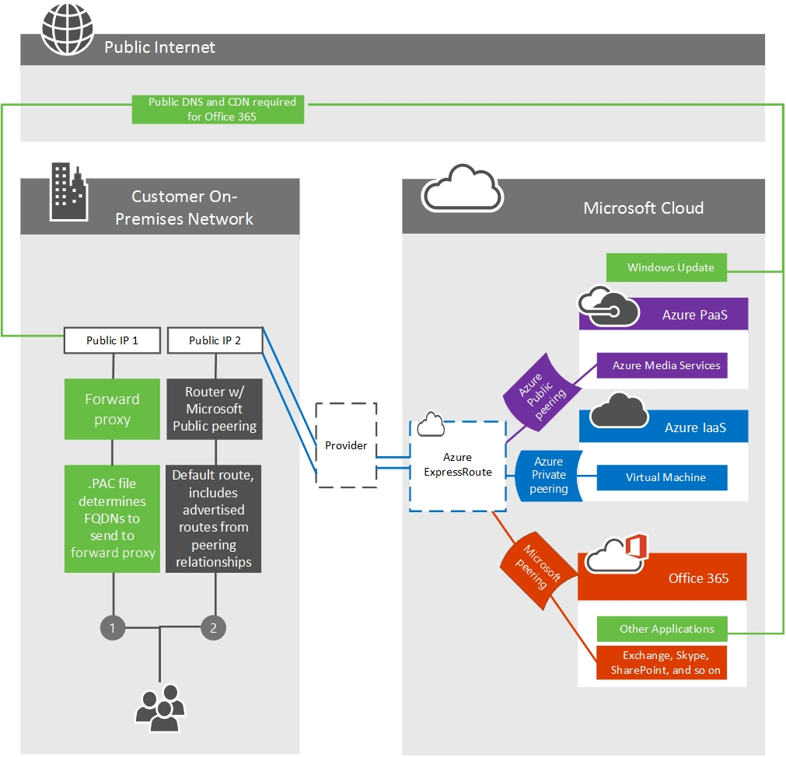
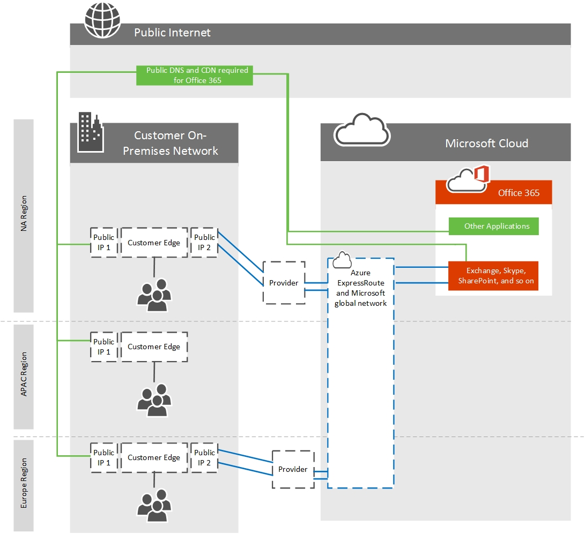

# Routing with ExpressRoute for Office 365

*This article applies to both Microsoft 365 Enterprise and Office 365 Enterprise.*

To properly understand routing traffic to Office 365 using Azure ExpressRoute, you'll need a firm grasp of the core [ExpressRoute routing requirements](/azure/expressroute/expressroute-routing) and the [ExpressRoute circuits and routing domains](/azure/expressroute/expressroute-circuit-peerings). These lay out the fundamentals for using ExpressRoute that Office 365 customers will rely on.
  
Some of the key items in the above articles that you'll need to understand include:
  
- ExpressRoute circuits aren't mapped to specific physical infrastructure, but are a logical connection made at a single peering location by Microsoft and a peering provider on your behalf.

- There's a 1:1 mapping between an ExpressRoute circuit and a customer s-key.

- Each circuit can support two independent peering relationships (Azure Private peering, and Microsoft peering); Office 365 requires Microsoft peering.

- Each circuit has a fixed bandwidth that is shared across all peering relationships.

- Any public IPv4 addresses and public AS numbers that will be used for the ExpressRoute circuit must be validated as being owned by you, or assigned exclusively to you by the owner of the address range.

- The virtual ExpressRoute circuits are redundant globally and will follow standard BGP routing practices. This is why we recommend two physical circuits per egress to your provider in an active/active configuration.

See the [FAQ page](/azure/expressroute/expressroute-faqs) for more information on services supported, costs, and configuration details. See the [ExpressRoute locations article](/azure/expressroute/expressroute-locations) for information on the list of connectivity providers offering Microsoft peering support. We've also recorded a 10-part [Azure ExpressRoute for Office 365 Training](https://channel9.msdn.com/series/aer) series on Channel 9 to help explain the concepts more thoroughly.
  
## Ensuring route symmetry

The Office 365 front-end servers are accessible on both the Internet and ExpressRoute. These servers will prefer to route back to on-premises over ExpressRoute circuits when both are available. Because of this, there is a possibility of route asymmetry if traffic from your network prefers to route over your Internet circuits. Asymmetrical routes are a problem because devices that perform stateful packet inspection can block return traffic that follows a different path than the outbound packets followed.
  
Regardless of whether you initiate a connection to Office 365 over the Internet or ExpressRoute, the source must be a publicly routable address. With many customers peering directly with Microsoft, having private addresses where duplication is possible between customers isn't feasible.
  
The following are scenarios where communications from Office 365 to your on-premises network will be initiated. To simplify your network design, we recommend routing these over the Internet path.
  
- SMTP services such as mail from an Exchange Online tenant to an on-premises host or SharePoint Online Mail sent from SharePoint Online to an on-premises host. SMTP protocol is used more broadly within Microsoft's network than the route prefixes shared over ExpressRoute circuits and advertising on-premises SMTP servers over ExpressRoute will cause failures with these other services.

- ADFS during password validation for signing in.

- [Exchange Server Hybrid deployments](/exchange/exchange-hybrid).

- [SharePoint federated hybrid search](/SharePoint/hybrid/display-hybrid-federated-search-results-in-sharepoint-online).

- [SharePoint hybrid BCS](/SharePoint/hybrid/deploy-a-business-connectivity-services-hybrid-solution).

- [Skype for Business hybrid](/skypeforbusiness/hybrid/plan-hybrid-connectivity?bc=%2fSkypeForBusiness%2fbreadcrumb%2ftoc.json&toc=%2fSkypeForBusiness%2ftoc.json) and/or [Skype for Business federation](/office365/servicedescriptions/skype-for-business-online-service-description/skype-for-business-online-features).

- [Skype for Business Cloud Connector](/skypeforbusiness/skype-for-business-hybrid-solutions/plan-your-phone-system-cloud-pbx-solution/plan-skype-for-business-cloud-connector-edition).

For Microsoft to route back to your network for these bi-directional traffic flows, the BGP routes to your on-premises devices must be shared with Microsoft. When you advertise route prefixes to Microsoft over ExpressRoute, you should follow these best practices:

1) Do not advertise the same public IP Address route prefix to the public Internet and over ExpressRoute. It is recommended that the IP BGP Route Prefix advertisements to Microsoft over ExpressRoute are from a range that is not advertised to the internet at all. If this is not possible to achieve due to the available IP Address space, then it is essential to ensure you advertise a more specific range over ExpressRoute than any internet circuits.

2) Use separate NAT IP pools per ExpressRoute circuit and separate to that of your internet circuits.

3) Be aware that any route advertised to Microsoft will attract network traffic from any server in Microsoft's network, not only those for which routes are advertised to your network over ExpressRoute. Only advertise routes to servers where routing scenarios are defined and well understood by your team. Advertise separate IP Address route prefixes at each of multiple ExpressRoute circuits from your network.
  
## Deciding which applications and features route over ExpressRoute

When you configure a peering relationship using the Microsoft peering routing domain and are approved for the appropriate access, you'll be able to see all PaaS and SaaS services available over ExpressRoute. The Office 365 services designed for ExpressRoute can be managed with [BGP communities](./bgp-communities-in-expressroute.md) or [route filters](/azure/expressroute/how-to-routefilter-portal).
  
Other applications such as Office 365 Video, is an Office 365 application; however, Office 365 Video is comprised of three different components, the portal, the streaming service, and the content delivery network. The portal lives within SharePoint Online, the streaming service lives within Azure Media Services, and the content delivery network lives within the Azure CDN. The following table outlines these components.

|**Component**|**Underlying application**|**Included in SharePoint Online BGP Community?**|**Use**|
|:-----|:-----|:-----|:-----|
|Office 365 Video portal    |SharePoint Online    |Yes    |Configuration, upload    |
|Office 365 Video streaming service    |Azure Media Services    |No    |Streaming service, used in the event the video is unavailable from the CDN    |
|Office 365 Video content delivery network    |Azure CDN    |No    |Primary source of video download/streaming. [Learn more about Office 365 video networking](https://support.office.com/article/Office-365-Video-networking-Frequently-Asked-Questions-FAQ-2bed67a1-4052-49ff-a4ce-b7e6530eb98e).    |

Each of the Office 365 features that are available using Microsoft peering are listed in the [Office 365 endpoints article](https://support.office.com/article/Office-365-URLs-and-IP-address-ranges-8548a211-3fe7-47cb-abb1-355ea5aa88a2) by application type and FQDN. The reason for using the FQDN in the tables is to allow customers to manage traffic using PAC files or other proxy configurations, see our guide to [managing Office 365 endpoints](./managing-office-365-endpoints.md) for example PAC files.
  
In some situations we've used a wildcard domain where one or more sub-FQDNs are advertised differently than the higher-level wildcard domain. This usually happens when the wildcard represents a long list of servers that are all advertised to ExpressRoute and the Internet, while a small subset of destinations is only advertised to the Internet, or the reverse. Refer to the tables below to understand where the differences are.
  
This table displays the wildcard FQDNs that are advertised to both the internet and Azure ExpressRoute alongside the sub-FQDNs that are advertised only to the internet.

|**Wildcard domain advertised to ExpressRoute and Internet circuits**|**Sub-FQDN advertised to Internet circuits only**|
|:-----|:-----|
|\*.microsoftonline.com    |click.email.microsoftonline.com    portal.microsoftonline.com    provisioningapi.microsoftonline.com    adminwebservice.microsoftonline.com    |
|\*.officeapps.live.com    |nexusRules.officeapps.live.com    nexus.officeapps.live.com    odc.officeapps.live.com    odc.officeapps.live.com    cdn.odc.officeapps.live.com    ols.officeapps.live.com    ocsredir.officeapps.live.com    ocws.officeapps.live.com    ocsa.officeapps.live.com    |

Usually PAC files are intended to send network requests to ExpressRoute advertised endpoints directly to the circuit and all other network requests to your proxy. If you're configuring a PAC file like this, compose your PAC file in the following order:
  
1. Include the sub-FQDNs from column two in the above table at the top of your PAC file, sending the traffic towards your proxy. We've built a sample PAC file for you to use in our article on [managing Office 365 endpoints](./managing-office-365-endpoints.md).

2. Include all FQDNs marked advertised to ExpressRoute in [this article](./urls-and-ip-address-ranges.md) below the first section, sending the traffic directly to your ExpressRoute circuit.

3. Include any other network endpoints or rules below these two entries, sending the traffic towards your proxy.

This table displays the wildcard domains that are advertised to Internet circuits only alongside the sub-FQDNs that are advertised to Azure ExpressRoute and Internet circuits. For your PAC file above, the FQDNs in column 2 in the below table are listed as being advertised to ExpressRoute in the link referenced, which means they would be included in the second group of entries in the file.

|**Wildcard domain advertised to Internet circuits only**|**Sub-FQDN advertised to ExpressRoute and Internet circuits**|
|:-----|:-----|
|\*.office.com    |\*.outlook.office.com    home.office.com    outlook.office.com    portal.office.com    
www.office.com
    |
|\*.office.net    |agent.office.net    |
|\*.office365.com    |outlook.office365.com    smtp.office365.com    |
|\*.outlook.com    |\*.protection.outlook.com    \*.mail.protection.outlook.com    autodiscover-\<tenant\>.outlook.com    |
|\*.windows.net    |login.windows.net    |

## Routing Office 365 traffic over the Internet and ExpressRoute

To route to the Office 365 application of your choosing, you'll need to determine a number of key factors.
  
1. How much bandwidth the application will require. Sampling existing usage is the only reliable method for determining this in your organization.

2. What egress location(s) you want the network traffic to leave your network from. You should plan to minimize the network latency for connectivity to Office 365 as this will impact performance. Because Skype for Business uses real-time voice and video, it is particularly susceptible to poor network latency.

3. If you want all or a subset of your network locations to use ExpressRoute.

4. What locations your chosen network provider offers ExpressRoute from.

Once you determine the answers to these questions, you can provision an ExpressRoute circuit that meets the bandwidth and location needs. For more network planning assistance, refer to the [Office 365 network tuning guide](./network-planning-and-performance.md) and the [case study on how Microsoft handles network performance planning](https://aka.ms/tunemsit).
  
### Example 1: Single geographic location
  
This example is a scenario for a fictitious company called Trey Research who has a single geographic location.
  
Employees at Trey Research are only allowed to connect to the services and websites on the internet that the security department explicitly allows on the pair of outbound proxies that sit between the corporate network and their ISP.
  
Trey Research plans to use Azure ExpressRoute for Office 365 and recognizes that some traffic such as traffic destined for content delivery networks won't be able to route over the ExpressRoute for Office 365 connection. Since all traffic already routes to the proxy devices by default, these requests will continue to work as before. After Trey Research determines they can meet the Azure ExpressRoute routing requirements, they proceed to create a circuit, configure routing, and linking the new ExpressRoute circuit to a virtual network. Once the fundamental Azure ExpressRoute configuration is in place, Trey Research uses the [#2 PAC file we publish](./managing-office-365-endpoints.md)  to route traffic with customer-specific data over the direct ExpressRoute for Office 365 connections.
  
As shown in the following diagram, Trey Research is able to satisfy the requirement to route Office 365 traffic over the internet and a subset of traffic over ExpressRoute using a combination of routing and outbound proxy configuration changes.
  
1. Using the [#2 PAC file we publish](./managing-office-365-endpoints.md) to route traffic through a separate internet egress point for Azure ExpressRoute for Office 365.

2. Clients are configured with a default route towards Trey Research's proxies.

In this example scenario, Trey Research is using an outbound proxy device. Similarly, customers who aren't using Azure ExpressRoute for Office 365 may want to use this technique to route traffic based on the cost of inspecting traffic destined for well-known high volume endpoints.
  
The highest volume FQDNs for Exchange Online, SharePoint Online, and Skype for Business Online are the following:
  

  
- outlook.office365.com, outlook.office.com

- \<tenant-name\>.sharepoint.com, \<tenant-name\>-my.sharepoint.com, \<tenant-name\>-\<app\>.sharepoint.com

- \*.Lync.com along with the IP ranges for non-TCP traffic

- \*broadcast.officeapps.live.com, \*excel.officeapps.live.com, \*onenote.officeapps.live.com, \*powerpoint.officeapps.live.com, \*view.officeapps.live.com, \*visio.officeapps.live.com, \*word-edit.officeapps.live.com, \*word-view.officeapps.live.com, office.live.com

Learn more about [deploying and managing proxy settings in Windows 8](/archive/blogs/deploymentguys/windows-8-supporting-proxy-services-with-static-configurations-web-hosted-pac-files-and-domain-policy-configured-proxy) and [ensuring Office 365 isn't throttled by your proxy](https://blogs.technet.com/b/onthewire/archive/2014/03/28/ensuring-your-office-365-network-connection-isn-t-throttled-by-your-proxy.aspx).
  
With a single ExpressRoute circuit, there is no high availability for Trey Research. In the event Trey's redundant pair of edge devices that are servicing the ExpressRoute connectivity fail, there is not an additional ExpressRoute circuit to failover to. This leaves Trey Research in a predicament as failing over to the internet will require manual reconfiguration and in some cases new IP addresses. If Trey wants to add high availability, the simplest solution is to add additional ExpressRoute circuits for each location and configure the circuits in an active/active manner.
  
## Routing ExpressRoute for Office 365 with multiple locations

The last scenario, routing Office 365 traffic over ExpressRoute is the foundation for even more complex routing architecture. Regardless of the number of locations, number of continents where those locations exist, number of ExpressRoute circuits, and so on, being able to route some traffic to the Internet and some traffic over ExpressRoute will be required.
  
The additional questions that must be answered for customers with multiple locations in multiple geographies include:
  
1. Do you require an ExpressRoute circuit in every location? If you're using Skype for Business Online or are concerned with latency sensitivity for SharePoint Online or Exchange Online, a redundant pair of active/active ExpressRoute circuits is recommended in each location. See the Skype for Business media quality and network connectivity guide for more details.

2. If an ExpressRoute circuit isn't available in a particular region, how should Office 365 destined traffic be routed?

3. What is the preferred method for consolidating traffic in the case of networks with many small locations?

Each of these presents a unique challenge that requires you to evaluate your own network and the options available from Microsoft.

|**Consideration**|**Network components to evaluate**|
|:-----|:-----|
|Circuits in more than one location    |We recommend a minimum of two circuits configured in an active/active manner.    Cost, latency, and bandwidth needs must be compared.    Use BGP route cost, PAC files, and NAT to manage routing with multiple circuits.    |
|Routing from locations without an ExpressRoute circuit    |We recommend egress and DNS resolution as close to the person initiating the request for Office 365.    DNS forwarding can be used to allow remote offices to discover the appropriate endpoint.    Clients in the remote office must have a route available that provides access to the ExpressRoute circuit.    |
|Small office consolidation    |Available bandwidth and data usage should be carefully compared.    |

> [!NOTE]
> Microsoft will prefer ExpressRoute over the internet if the route is available regardless of physical location.
  
Each of these considerations must be taken into account for each unique network. Below is an example.
  
### Example 2: Multi-geographic locations
  
This example is a scenario for a fictitious company called Humongous Insurance who has multiple geographic locations.
  
Humongous Insurance is geographically dispersed with offices all over the world. They want to implement Azure ExpressRoute for Office 365 to keep most their Office 365 traffic on direct network connections. Humongous Insurance also has offices on two additional continents. The employees in the remote office where ExpressRoute is not feasible will need to route back to one or both of the primary facilities to use an ExpressRoute connection.
  
The guiding principle is to get Office 365 destined traffic to a Microsoft datacenter as quickly as possible. In this example, Humongous Insurance must decide if their remote offices should route over the Internet to get to a Microsoft datacenter over any connection as quickly as possible or if their remote offices should route over an internal network to get to a Microsoft datacenter over an ExpressRoute connection as quickly as possible.
  
Microsoft's datacenters, networks, and application architecture are designed to take globally disparate communications and service them in the most efficient way possible. This is one of the largest networks in the world. Requests destined for Office 365 that remain on customer networks longer than necessary won't be able to take advantage of this architecture.
  
In Humongous Insurance's situation, they should proceed depending on the applications they intend to use over ExpressRoute. For example, if they're a Skype for Business Online customer, or plan to use ExpressRoute connectivity when connecting to external Skype for Business Online meetings, the design recommended in the Skype for Business Online media quality and network connectivity guide is to provision an additional ExpressRoute circuit for the third location. This may be more expensive from a networking perspective; however, routing requests from one continent to another before delivering to a Microsoft datacenter may cause a poor or unusable experience during Skype for Business Online meetings and communications.
  
If Humongous Insurance isn't using or doesn't plan to use Skype for Business Online in any way, routing Office 365 destined network traffic back to a continent with an ExpressRoute connection may be feasible though may cause unnecessary latency or TCP congestion. In both cases, routing Internet destined traffic to the Internet at the local site is recommended to take advantage of the content delivery networks that Office 365 relies on.
  

  
When Humongous Insurance is planning their multi-geography strategy, there are a number of things to consider around size of circuit, number of circuits, failover, and so on.
  
With ExpressRoute in a single location with multiple regions attempting to use the circuit, Humongous Insurance wants to ensure that connections to Office 365 from the remote office are sent to the Office 365 datacenter nearest headquarters and received by the headquarters location. To do this, Humongous Insurance implements DNS forwarding to reduce the number of round trips and DNS lookups required to establish the appropriate connection with the Office 365 environment closest to the headquarters internet egress point. This prevents the client from resolving a local front-end server and ensures the Front-End server the person connects to be near the headquarters where Humongous Insurance is peering with Microsoft. You can also learn to [Assign a Conditional Forwarder for a Domain Name](/previous-versions/windows/it-pro/windows-server-2008-R2-and-2008/cc794735(v=ws.10)).
  
In this scenario, traffic from the remote office would resolve the Office 365 front-end infrastructure in North America and use Office 365 to connect to the backend servers according to the architecture of the Office 365 application. For example, Exchange Online would terminate the connection in North America and those front-end servers would connect to the backend mailbox server wherever the tenant resided. All services have a widely distributed front door service comprised of unicast and anycast destinations.
  
If Humongous has major offices in multiple continents, a minimum of two active/active circuits per region are recommended in order to reduce latency for sensitive applications such as Skype for Business Online. If all offices are in a single continent, or is not using real-time collaboration, having a consolidated or distributed egress point is a customer-specific decision. When multiple circuits are available, BGP routing will ensure failover should any single circuit become unavailable.
  
Learn more about sample [routing configurations](/azure/expressroute/expressroute-config-samples-routing) and [https://azure.microsoft.com/documentation/articles/expressroute-config-samples-nat/](/azure/expressroute/expressroute-config-samples-nat).
  
## Selective routing with ExpressRoute

Selective routing with ExpressRoute may be needed for a variety of reasons, such as testing, rolling out ExpressRoute to a subset of users. There are various tools customers can use to selectively route Office 365 network traffic over ExpressRoute:
  
1. **Route filtering/segregation** - allowing the BGP routes to Office 365 over ExpressRoute to a subset of your subnets or routers. This selectively routes by customer network segment or physical office location. This is common for staggering rollout of ExpressRoute for Office 365 and is configured on your BGP devices.

2. **PAC files/URLs** - directing Office 365 destined network traffic for specific FQDNs to route on a specific path. This selectively routes by client computer as identified by [PAC file deployment](./managing-office-365-endpoints.md).

3. **Route filtering** - [Route filters](/azure/expressroute/how-to-routefilter-portal) are a way to consume a subset of supported services through Microsoft peering.

4. **BGP communities** - filtering based on [BGP community tags](./bgp-communities-in-expressroute.md) allows a customer to determine which Office 365 applications will traverse ExpressRoute and which will traverse the internet.

Here's a short link you can use to come back: [https://aka.ms/erorouting]()
  
## Related Topics

[Assessing Office 365 network connectivity](assessing-network-connectivity.md)
  
[Azure ExpressRoute for Office 365](azure-expressroute.md)
  
[Managing ExpressRoute for Office 365 connectivity](managing-expressroute-for-connectivity.md)
  
[Network planning with ExpressRoute for Office 365](network-planning-with-expressroute.md)
  
[Implementing ExpressRoute for Office 365](implementing-expressroute.md)
  
[Media Quality and Network Connectivity Performance in Skype for Business Online](https://support.office.com/article/5fe3e01b-34cf-44e0-b897-b0b2a83f0917)
  
[Optimizing your network for Skype for Business Online](https://support.office.com/article/b363bdca-b00d-4150-96c3-ec7eab5a8a43)
  
[ExpressRoute and QoS in Skype for Business Online](https://support.office.com/article/20c654da-30ee-4e4f-a764-8b7d8844431d)
  
[Call flow using ExpressRoute](https://support.office.com/article/413acb29-ad83-4393-9402-51d88e7561ab)
  
[Using BGP communities in ExpressRoute for Office 365 scenarios](bgp-communities-in-expressroute.md)
  
[Office 365 performance tuning using baselines and performance history](performance-tuning-using-baselines-and-history.md)
  
[Performance troubleshooting plan for Office 365](performance-troubleshooting-plan.md)
  
[Office 365 URLs and IP address ranges](https://support.office.com/article/8548a211-3fe7-47cb-abb1-355ea5aa88a2)
  
[Office 365 network and performance tuning](network-planning-and-performance.md)
