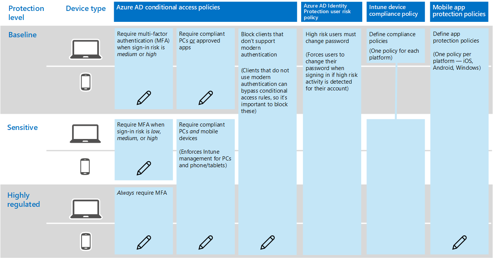

# Policy recommendations for securing email
This article describes how to implement the recommended identity and device access policies to protect organizational email and email clients that support Modern Authentication and Conditional Access. This guidance builds on the [Common identity and device access policies](identity-access-policies.md). 

These recommendations are based on three different tiers of security and protection for SharePoint files that can be applied based on the granularity of your needs: **baseline**, **sensitive**, and **highly regulated**. You can learn more about these security tiers, and the recommended client operating systems, referenced by these recommendations in the [recommended security policies and configurations introduction](microsoft-365-policies-configurations.md).

The following diagram illustrates the common idetnity and device access policies and indicates which policies need to be updated to secure email.

If you included Exchange Online and Outlook in the scope of the policies when you set them up, this work might already be complete. Reveiw the policies listed in the following table and either make the recommended additions, or confirm that these are already incluced. Each rule links to the associated configuration instructions in the [Common identity and device access policies](identity-access-policies.md) article. 

|Protection level|Policies|More information|
|:---------------|:-------|:----------------|
|**Baseline**|[Require MFA when sign-in risk is *medium* or *high*](#require-mfa-when-sign-in-risk-is-medium-or-high)| |
|        |[Block clients that don't support modern authentication](#block-clients-that-dont-support-modern-authentication)|Clients that do not use modern authentication can bypass conditional access rules, so it's important to block these.|
|        |[High risk users must change password](#high-risk-users-must-change-password)|Forces users to change their password when signing in if high risk activity is detected for their account.|
|        |[Define app protection policies](#define-app-protection-policies)|One policy per platform (iOS, Android, Windows).|
|        |[Define compliance policies](#define-compliance-policies)|One policy for each platform.|
|        |[Require compliant PCs *or* approved apps](#require-compliant-pcs-or-approved-apps)|Enforces Intune management of PCs but allows phones/tablets to be managed only with mobile app protection policies.|
|**Sensitive**|[Require MFA when sign-in risk is *low*, *medium* or *high*](#require-mfa-when-sign-in-risk-is-low-medium-or-high)| |
|         |[Require compliant PCs *and* mobile devices](#require-compliant-pcs-and-mobile-devices)|Enforces Intune management for PCs and phone/tablets.|
|**Highly regulated**|[*Always* requrie MFA](#always-require-mfa)|
| | |

<!---
This article describes recommended policies to help you secure organizational email and email clients that support Modern Authentication and Conditional Access. These recommendations are in addition to the [common identity and access policy recommendations](identity-access-policies.md).

The following recommendations are based on three different layers of security and protection for your email that can be applied based on the granularity of your needs:

- **Baseline**: Microsoft recommends you establish a minimum standard for protecting data, as well as the identities and devices that access your data. Microsoft provides strong default protection that meets the needs of many organizations. Some organizations require additional capabilities to meet their baseline requirements.
- **Sensitive**: Some customers have a subset of data that must be protected at higher levels. You can apply increased protection to specific data sets in your Office 365 environment. Microsoft recommends protecting identities and devices that access sensitive data with comparable levels of security. 
- **Highly regulated**: Some organizations may have a very small amount of data that is highly classified, trade secret, or regulated data. Microsoft provides capabilities to help organizations meet these requirements, including added protection for identities and devices.

See the [recommended security policies and configurations introduction](microsoft-365-policies-configurations.md) topic for more details.

> [!IMPORTANT]
> All security groups created as part of these recommendations must be created with Office features enabled. This is specifically important for the deployment of Azure Information Protection (AIP) when securing documents in SharePoint Online.
>
>
>

## Baseline
To create a new conditional access policy: 

1. Go to the [Azure portal](https://portal.azure.com), and sign in with your credentials. After you've successfully signed in, you see the Azure Dashboard.

2. Choose **Azure Active Directory** from the left menu.

3. Under the **Security** section, choose **Conditional access**.

4. Choose **New policy** as shown in the screen-shot below:

The following tables describe the appropriate settings necessary to express the policies required for each level of protection.

### Medium and above risk requires MFA

The following tables describes the conditional access policy settings to implement for this policy.

**Assignments**
|Type|Properties|Values|Notes|
|:---|:---------|:-----|:----|
|Users and groups|Include|Select users and groups – Select specific security group containing targeted users|Start with security group including pilot users.|
||Exclude|Exception security group; service accounts (app identities)|Membership modified on an as needed temporary basis|
|Cloud apps|Include|Select apps -  Select Office 365 Exchange Online||
|Conditions|Configured|Yes|Configure specific to your environment and needs|
|Sign-in risk|Risk level|High, medium|Check both|

**Access controls**
|Type|Properties|Values|Notes|
|:---|:---------|:-----|:----|
|Grant|Grant access|True|Selected|
||Require MFA|True|Check|
||Require compliant devices|False||
||Require domain joined devices|False||
||Require all the selected controls|True|Selected|

> [!NOTE]
> Be sure to enable this policy, by clicking **On**. Also consider using the [What if](https://docs.microsoft.com/en-us/azure/active-directory/active-directory-conditional-access-whatif) tool to test the policy

### Require a compliant or domain joined device

To create a conditional access policy for Exchange Online:

1. Go to the [Azure portal](https://portal.azure.com), and sign in with your credentials. After you've successfully signed in, you see the Azure Dashboard.

2. Choose **Azure Active Directory** from the left menu.

3. Under the **Security** section, choose **Conditional access**.

4. Choose **New policy**.

5. Enter a policy name, then choose the **Users and groups** you want to apply the policy for.

6. Choose **Cloud apps**.

7. Choose **Select apps**, select **Office 365 Exchange Online** from the **Cloud apps** list, click on **Select**. Once the **Office 365 Exchange Online** app is selected, click **Done**.

8. Choose **Grant** from the **Access controls** section.

9. Choose **Grant access**, select both **Require device to be marked as compliant** and **Require domain joined (Hybrid Azure AD)**, then choose **Select**.

10. Click **Create** to create the Exchange Online conditional access policy.

	> [!NOTE]
	> Beginning with Intune on Azure, you have to create all conditional access policies in the Azure Active Directory workload. Intune provides a link to Azure AD conditional access policies workload from its portal  for convenience.

	> [!IMPORTANT]
	> If you need assistance on migrating conditional access policies previously created in the Intune classic portal to the Intune on Azure portal, see the [reassign conditional access policies from Intune classic portal to the Azure portal](https://docs.microsoft.com/intune/conditional-access-intune-reassign) topic. 

### App-based conditional access for Exchange Online

You can add one more security layer by setting up an app-based conditional access policy for Exchange Online in the Intune on Azure portal. When you apply an app-based conditional access for Exchange Online you require users to use a specific app (E.g. Microsoft Outlook app) to access corporate e-mail.

To add an app-based conditional access policy:

1. Go to the [Azure portal](https://portal.azure.com), and sign in with your Intune credentials. After you've successfully signed in, you see the Azure Dashboard.

2. Choose **More services** from the left menu, then type: "**Intune**".

3. Choose **Intune App Protection**.

4. On the **Intune mobile application management** blade choose **All Settings**.

5. Choose **Exchange Online** under the **Conditional access** section.

6. Select **Allow apps that support Intune app policies**, then choose the app (E.g. Microsoft Outlook).

7. Choose **Restricted user groups**, click **Select groups**, select the user or group you want to apply the policy for, then click **Select**.

## Sensitive

### Low and above risk requires MFA
The following tables describes the conditional access policy settings to implement for low- and above-risk policies.

**Assignments**
|Type|Properties|Values|Notes|
|:---|:---------|:-----|:----|
|Users and groups|Include|Select users and groups – Select specific security group containing targeted users|Start with security group including pilot users|
||Exclude|Exception security group; service accounts (app identities)|Membership modified on an as needed temporary basis|
|Cloud apps|Include|Select apps -  Select Office 365 Exchange Online||
|Conditions|Configured|Yes|Configure specific to your environment and needs|
|Sign-in risk|Configured|Yes|Configure specific to your environment and needs|
||Risk level|Low, medium, high|Check all three|

**Access controls**
|Type|Properties|Values|Notes|
|:---|:---------|:-----|:----|
||Grant|Grant access|True|Selected|
||Require MFA|True|Check|
||Require compliant devices|False||
||Require domain joined device|False||
||Require all the selected controls|True|Selected|

> [!NOTE]
> Be sure to enable this policy, by clicking **On**. Also consider using the [What if](https://docs.microsoft.com/en-us/azure/active-directory/active-directory-conditional-access-whatif) tool to test the policy

### Require a compliant or domain joined device
(See baseline instructions)

### App-based conditional access for Exchange online

(See baseline instructions)

#### Apply to

Once the pilot project has been completed, these policies should be applied to users in your organization who require access to email considered sensitive.

## Highly regulated
### MFA required

The following tables describes the conditional access policy settings to implement for the highly regulated policy.

**Assignments**
|Type|Properties|Values|Notes|
|:---|:---------|:-----|:----|
|Users and groups|Include|Select users and groups – Select specific security group containing targeted users|Start with security group including pilot users|
||Exclude|Exception security group; service accounts (app identities)|Membership modified on an as needed temporary basis|
|Cloud apps|Include|Select apps -  Select Office 365 Exchange Online||

**Access controls**
|Type|Properties|Values|Notes|
|:---|:---------|:-----|:----|
|Grant|Grant access|True|Selected|
||Require MFA|True|Check|
||Require complaint devices|False|Check|
||Require domain joined device|False||
||Require all the selected controls|True|Selected|

> [!NOTE]
> Be sure to enable this policy, by clicking **On**. Also consider using the [What if](https://docs.microsoft.com/en-us/azure/active-directory/active-directory-conditional-access-whatif) tool to test the policy

### Require a compliant or domain joined device
(See baseline instructions)
### App-based conditional access for Exchange online
(See baseline instructions)
#### Apply to
Once the pilot project has been completed, these policies should be applied to users in your organization who require access to email considered highly regulated.

### High risk users policy
To ensure that all high-risk users compromised accounts are forced to perform a password change when signing-in, you must apply the following policy.

Log in to the [Microsoft Azure portal (http://portal.azure.com)](http://portal.azure.com/) with your administrator credentials, and then navigate to **Azure AD Identity Protection > User Risk Policy**.

**Assignments**
|Type|Properties|Values|Notes|
|:---|:---------|:-----|:----|
|Users|Include|All users|Selected|
||Exclude|None||
|Conditions|User risk|High|Selected|

**Controls**
|Type|Properties|Values|Notes|
|:---|:---------|:-----|:----|
||Access|Allow access|True|Selected|
||Access|Require password change|True|Check|

**Review:** not applicable

> [!NOTE]
> Be sure to enable this policy, by clicking **On**. Also consider using the [What if](https://docs.microsoft.com/en-us/azure/active-directory/active-directory-conditional-access-whatif) tool to test the policy

## Additional configurations
In addition to the above policies, you must configure the following Mobile Application and Device Management settings discussed in this section.

### Intune mobile application management

To ensure email is protected by the policy recommendations stated earlier for each security and data protection tier, you must create Intune app protection policies from within the Azure portal.

To create a new app protection policy, log in to the Microsoft Azure portal with your administer credentials, and then navigate to **Intune App Protection > App policy**.

Add a new policy (+Add) as shown in the following screen shot:

>[!NOTE]
>There are slight differences in the app protection policy options between iOS and Android. The below policy is specifically for Android.
>

The following tables describe the recommended Intune app protection policy settings:

**General**
|Type|Properties|Values|Notes|
|:---|:---------|:-----|:----|
|Email|Name|Secure email policy for Android|Enter a policy name|
||Description||Enter text that describes the policy|
||Platform|Android|There are slight differences in the app protection policy options between iOS and Android; this policy is specifically for Android|

**Apps**
|Type|Properties|Values|Notes|
|:---|:---------|:-----|:----|
|Applications|Apps|Outlook|Selected (list)|

**Settings**
|Type|Properties|Values|Notes|
|:---|:---------|:-----|:----|
|Data relocation|Prevent Android backup|Yes|On iOS this will specifically call out iTunes and iCloud|
|||Allow app to transfer data to other apps|Policy managed apps||
||Allow app to receive data to other apps|Policy managed apps||
||Prevent "Save As"|Yes||
||Restrict cut, copy, and paste with other apps|Policy managed apps||
||Restrict web content to display in the managed browser|No||
||Encrypt app data|Yes|On iOS select option: When device is locked|
||Disable contacts sync|No||
|Access|Require PIN for access|Yes||
||Number of attempts before PIN reset|3||
||Allow simple PIN|No||
||PIN length|6||
||Allow fingerprint instead of PIN|Yes||
||Require Corporate credentials for access|No||
||Block managed apps from running on jailbroken or rooted devices|Yes||
||Recheck the access requirement after (minutes)|30||
||Offline grace period|720||
||Offline interval (days) before app data is wiped|90||
||Block screen capture and Android assistant|No|On iOS this is not an available option|

When complete, remember to click "Create". Repeat the above steps and replace the selected platform (dropdown) with iOS. This creates two app policies, so once you create the policy, then assign groups to the policy and deploy it.

- See [how to create and assign app protection policies](https://docs.microsoft.com/intune/app-protection-policies) for more details.

### Intune mobile device management
You create the following device configuration profiles and device compliance policies by logging into the [Intune on Azure portal](https://portal.azure.com) with your Intune credentials.

#### iOS email profile
In the [Intune on Azure portal](https://portal.azure.com), you can create the following device configuration profiles at **Device configuration > Profiles > Create Profile > Platform (iOS) > Profile type (E-mail)**.

**Email profile**
|Type|Properties|Values|Notes|
|:---|:---------|:-----|:----|
|Exchange Active Sync|Host (#)|Outlook.office365.com||
||Account Name (#)|SecureEmailAccount|Admini choice|
||Username|User principal name|Selected – Drop down|
||Email address|Primary SMTP address|Selected – Drop down|
||Authentication method|Username and password|Selected – Drop down|
||Use S/MIME|False||
|Synchronization settings|Number of days of email to synchronize|Two weeks|Selected – Drop down|
||Use SSL|True|Check|
||Allow messages to be moved to other email accounts|False||
||Allow email to be sent from third party applications|True||
||Synchronize recently used email addresses|True|Check|

#### Android email profile
In the [Intune on Azure portal](https://portal.azure.com), you can create the following device configuration profiles at **Device configuration > Profiles > Create Profile > Platform (Android) > Profile type (E-mail)**.

**Email profile**
|Type|Properties|Values|Notes|
|:---|:---------|:-----|:----|
|Exchange Active Sync|Host (#)| Outlook.office365.com|
||Account Name (#)|SecureEmailAccount|Admini choice|
||Username|User principal name|Selected – Drop down|
||Email address|Primary SMTP address|Selected – Drop down|
||Authentication method|Username and password|Selected – Drop down|
||Use S/MIME|False||
|Synchronization settings|Number of days of email to synchronize|Two weeks|Selected – Drop down|
||Sync schedule|Not configured|Selected – Drop down|
||Use SSL|True|Check|
||Content type to synchronize|||
||Email|True|Check (locked)|
||Contacts|True|Check|
||Calenadr|True|Check|
||Tasks|True|Check|
||Notes|True|Check|

#### Android for work email profile
In the [Intune on Azure portal](https://portal.azure.com), you can create the following device configuration profiles at **Device configuration > Profiles > Create Profile > Platform (Android for Work) > Profile type (E-mail)**.

**Email profile**
|Type|Properties|Values|Notes|
|:---|:---------|:-----|:----|
|Exchange Active Sync|Host(#)| Outlook.office365.com|
||Account Name(#)|SecureEmailAccount|Admini choice|
||Username|User principal name|Selected – Drop down|
||Email address|Primary SMTP address|Selected – Drop down|
||Authentication method|Username and password|Selected – Drop down|
|Synchronization settings|Number of days of email to synchronize|Two weeks|Selected – Drop down|
||Use SSL|True|Check|

#### Device compliance policy
In the [Intune on Azure portal](https://portal.azure.com), you can create the following device compliance policies at **Device compliance > Policies > Create Policy > Platform (iOS, Android or others) > Settings**.

**System security**
|Type|Properties|Values|Notes|
|:---|:---------|:-----|:----|
|Password|Require a password to unlock mobile devices (...)|Yes|Selected – Drop down|
||Allow simple passwords (...)|No|Selected – Drop down|
||Minimum password length (...)|6|Selected – List|
|Advanced password settings|All|Not configured||
|Encryption|Require encryption on mobile device (...)|Yes|Selected – Drop down|
|Email profiles|Email account must be managed by Intune (iOS 8.0+)|Yes| Selected  – Drop down|
||Select (#)||Must select Email Configuration Policy for iOS: iOS Email Policy (see configuration policies above)|

**Device health**
|Type|Properties|Values|Notes|
|:---|:---------|:-----|:----|
|Windows decide health attestation|Require devices to be reported as healthy (Windows 10 Desktop and Mobile and later)|Yes||
|Device security settings|All|Not configured||
|Device threat protection|All|Not configured||
|Jailbreak|Device must not be jailbroken or rooted (iOS 8.0+, Android 4.0+)|Yes||

**Device properties**
|Type|Properties|Values|Notes|
|:---|:---------|:-----|:----|
|Operating system version|All|Not configured||

For all the above policies to be considered deployed, they must be targeted at user groups. You can do this by creating the policy (on Save) or later by selecting Manage Deployment in the Policy section (same level as Add).

## Remediating medium or high risk access events
If a user reports that they are now expected to perform MFA when this was previously not required, support can review their status from a risk perspective.  

Users within the organization with a Global Administrator or Security Administrator role can use Azure AD Identity Protection to review the risky events that contributed to the calculated risk score. If they identify some events that were flagged as suspicious, but are confirmed to be valid (such as a login from an unfamiliar location when an employee is on vacation), the administrator can resolve the event so it no longer contributes to the risk score.
--->

## Next steps

[Learn about policy recommendations for securing SharePoint Sites and files](sharepoint-file-access-policies.md)
