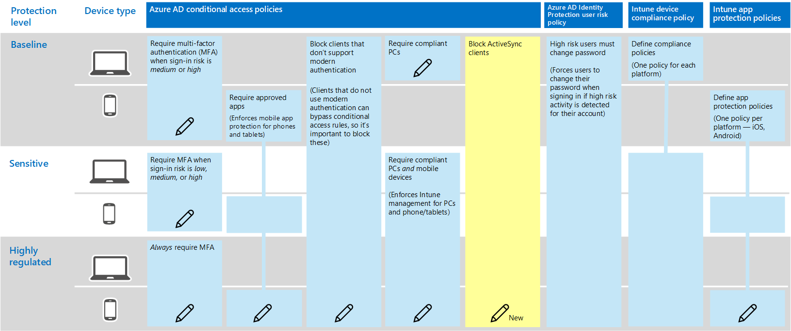

# Policy recommendations for securing email

This article describes how to implement the recommended identity and device access policies to protect organizational email and email clients that support modern authentication and conditional access. This guidance builds on the [Common identity and device access policies](identity-access-policies.md) and also includes a few additional recommendations.

These recommendations are based on three different tiers of security and protection that can be applied based on the granularity of your needs: **baseline**, **sensitive**, and **highly regulated**. You can learn more about these security tiers, and the recommended client operating systems, referenced by these recommendations in the [recommended security policies and configurations introduction](microsoft-365-policies-configurations.md).

These recommendations require your users to use modern email clients, including Outlook for iOS and Android on mobile devices. Outlook for iOS and Android provide support for the best features of Office 365. These mobile Outlook apps are also architected with security capabilities that support mobile use and work together with other Microsoft cloud security capabilities. For more information, see [Outlook for iOS and Android FAQ](https://docs.microsoft.com/exchange/clients-and-mobile-in-exchange-online/outlook-for-ios-and-android/outlook-for-ios-and-android-faq).

## Updating common policies to include email

The following diagram illustrates the common identity and device access policies and indicates which policies need to be updated to protect email. Note the addition of a new rule for Exchange Online to block ActiveSync clients. This forces the use of Outlook mobile.

If you included Exchange Online and Outlook in the scope of the policies when you set them up, you only need to create the new policy to block ActiveSync clients. Review the policies listed in the following table and either make the recommended additions, or confirm that these are already included. Each rule links to the associated configuration instructions in the [Common identity and device access policies](identity-access-policies.md) article.

|Protection level|Policies|More information|
|:---------------|:-------|:----------------|
|**Baseline**|[Require MFA when sign-in risk is *medium* or *high*](identity-access-policies.md#require-mfa-based-on-sign-in-risk)|Include Exchange Online in the assignment of cloud apps|
|        |[Block clients that don't support modern authentication](identity-access-policies.md#block-clients-that-dont-support-modern-authentication)|Include Exchange Online in the assignment of cloud apps|
|        |[Define app protection policies](identity-access-policies.md#high-risk-users-must-change-password)|Be sure Outlook is included in the list of apps. Be sure to update the policy for each platform (iOS, Android, Windows)|
|        |[Require approved apps](identity-access-policies.md#require-approved-apps)|Include Exchange Online in the list of cloud apps|
|        |[Require compliant PCs](identity-access-policies.md#require-compliant-pcs-but-not-compliant-phones-and-tablets)|Include Exchange Online in list of cloud apps|
|        |[Block ActiveSync clients](#block-activesync-clients)|Add this new policy| 
|**Sensitive**|[Require MFA when sign-in risk is *low*, *medium* or *high*](identity-access-policies.md#require-mfa-based-on-sign-in-risk)| Include Exchange Online in the assignment of cloud apps|
|         |[Require compliant PCs *and* mobile devices](identity-access-policies.md#require-compliant-pcs-and-mobile-devices)|Include Exchange Online in the list of cloud apps|
|**Highly regulated**|[*Always* require MFA](identity-access-policies.md#require-mfa-based-on-sign-in-risk)|Include Exchange Online in the assignment of cloud apps|

## Block ActiveSync clients

This policy prevents ActiveSync clients from bypassing other conditional access rules. The rule configuration applies only to ActiveSync clients. By selecting **Require approved client app**, this policy blocks ActiveSync clients. To configure this policy:

1. Go to the [Azure portal](https://portal.azure.com), and sign in with your credentials. After you've successfully signed in, you see the Azure dashboard.

2. Choose **Azure Active Directory** from the left menu.

3. Under the **Security** section, choose **Conditional access**.

4. Choose **New policy**.

5. Enter a policy name, then choose the **Users and groups** you want to apply the policy for.

6. Choose **Cloud apps**.

7. Choose **Select apps**, select **Office 365 Exchange Online**. Choose **Select** and **Done**.

8. Choose **Conditions**, and then choose **Client apps**.

9. For **Configure**, select **Yes**. Check only the following: **Mobile apps and desktop clients** and **Exchange ActiveSync clients**. Choose **Done**.

10. Choose **Grant** from the **Access controls** section.

11. Choose **Grant access**, select **Require approved client app**.  For multiple controls, select **Require the selected controls**, then choose **Select**.

12. Choose **Create**.

## Setup Office 365 message encryption

With the new Office 365 Message Encryption (OME) capabilities, which leverage the protection features in Azure Information Protection, your organization can easily share protected email with anyone on any device. Users can send and receive protected messages with other Office 365 organizations as well as non-customers using Outlook.com, Gmail, and other email services.

For more information, see [Set up new Office 365 Message Encryption capabilities](https://support.office.com/article/set-up-new-office-365-message-encryption-capabilities-7ff0c040-b25c-4378-9904-b1b50210d00e).

## Next steps

[Learn about policy recommendations for securing SharePoint Sites and files](sharepoint-file-access-policies.md)
