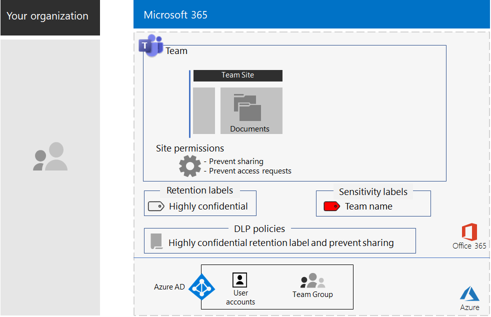
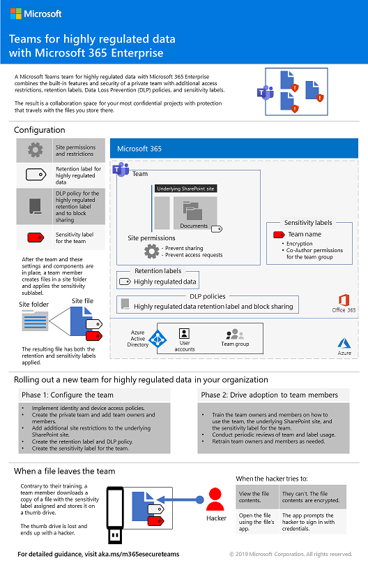
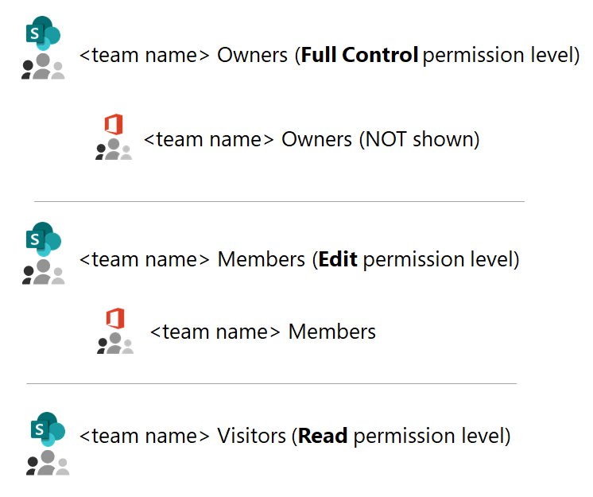
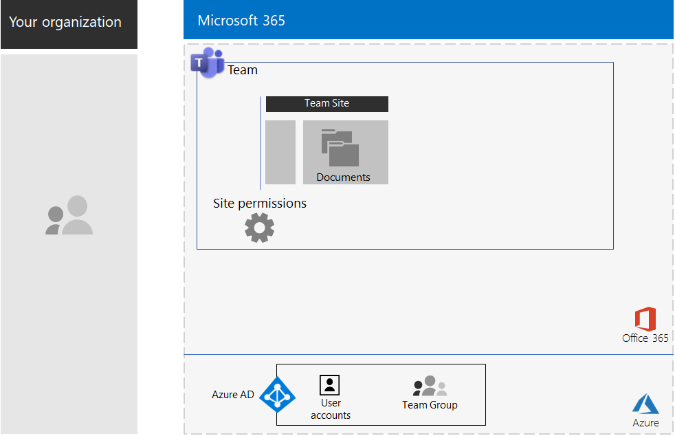
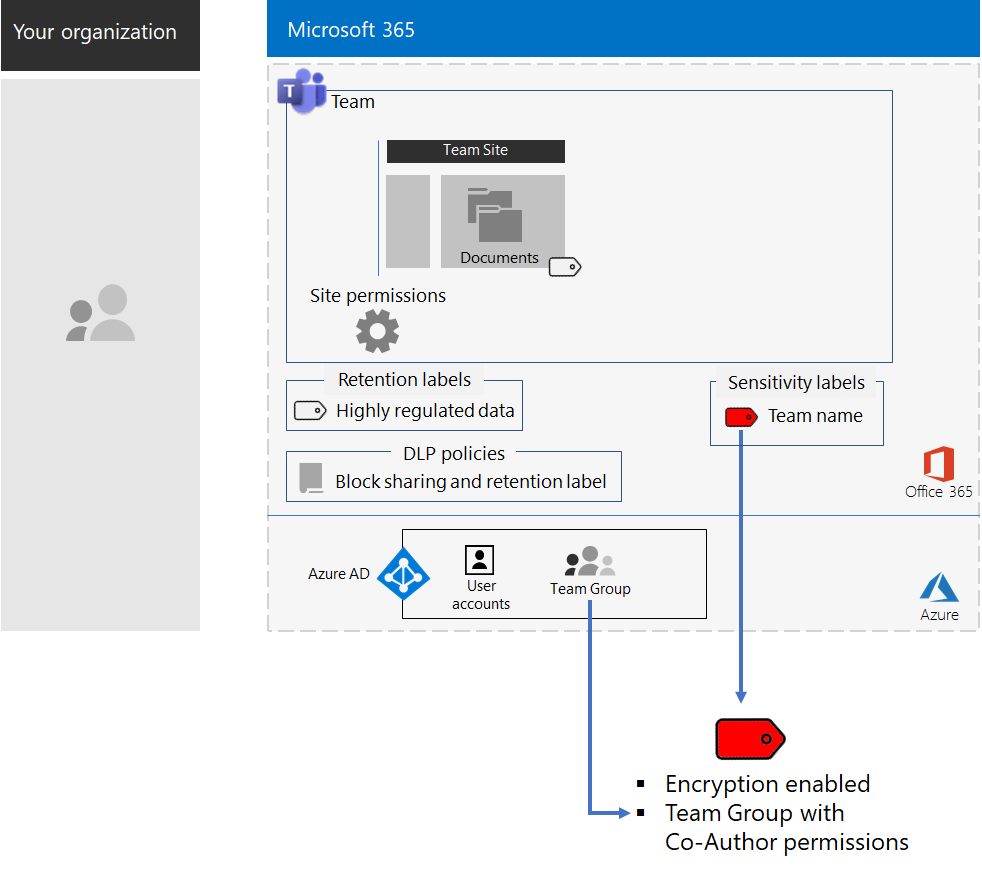
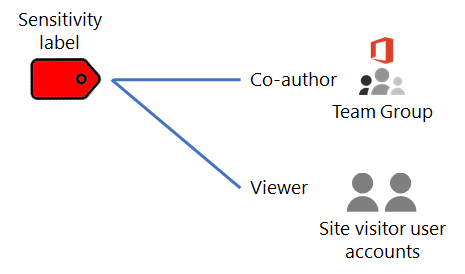
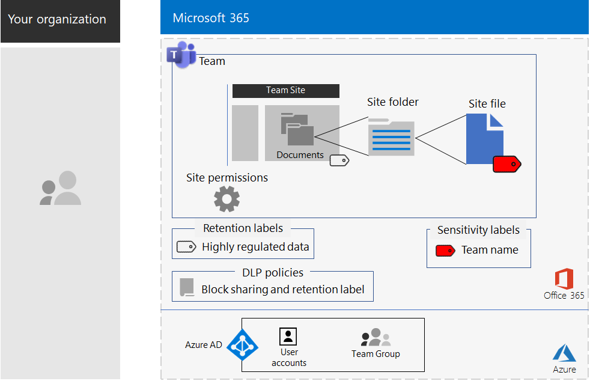

# Teams for highly regulated data

This article provides you with recommendations and steps to configure a private team in Microsoft Teams that locks down access to Teams features—such as chats, meetings, and files—to only members and owners of the Office 365 group for the team. 

Beyond the private access based on the Office 365 group, this article describes how to configure the underlying private SharePoint team site, which you can access from the **Files** section of a team channel, for the additional security needed to store highly regulated data. On this SharePoint team site, you can store and collaborate on files, pages, a shared calendar, tasks, a notebook, and lists.

>[!Note]
> A similar scenario using SharePoint is [here](teams-sharepoint-online-sites-highly-regulated-data.md).
>

The elements of configuration for a team for highly regulated data are:

- A private team with a corresponding Office 365 group that has owner and member user accounts.
- Additional security on the underlying SharePoint site for the team that:
  - Prevents members of the site from granting access to others.
  - Prevents non-members of the site from requesting access to the site.
- An Office 365 retention label for the underlying SharePoint site that is automatically applied to new files on the site as a default way to define retention policies.
- A Data Loss Prevention (DLP) policy that uses the retention label and blocks users from sharing or sending files outside the organization.
- An Office 365 sensitivity label or a sublabel of a highly regulated label that has encryption enabled and Co-Author permissions for the Office 365 group of the team. Users apply the label or sublabel to files stored in **Files** section of the team from the **Sensitivity** menu bar option in Word, Excel, and PowerPoint.

Here is the resulting configuration with a sensitivity label.

For a quick overview, watch this short video.

> [!VIDEO https://www.microsoft.com/videoplayer/embed/RE4mGHf]

For a 1-page summary of this scenario, see the [Teams for highly regulated data poster](./media/secure-teams-highly-regulated-data-scenario/TeamsHighlyRegulatedData.pdf).

You can also download this poster in [PDF](https://github.com/MicrosoftDocs/microsoft-365-docs/raw/public/microsoft-365/enterprise/media/secure-teams-highly-regulated-data-scenario/TeamsHighlyRegulatedData.pdf) or [PowerPoint](https://github.com/MicrosoftDocs/microsoft-365-docs/raw/public/microsoft-365/enterprise/media/secure-teams-highly-regulated-data-scenario/Teams-Highly-Regulated-Data-Poster.pptx) formats and print it on letter, legal, or tabloid (11 x 17)-sized paper.

## Phase 1: Configure a team for highly regulated data

The end-to-end configuration consists of these steps:

1. Configure identity and device access.
2. Create a private team.
3. Configure the underlying SharePoint site for additional security.
4. Create a retention label and DLP policy.
5. Create the label or sublabel of the highly regulated label.

### Step 1: Configure identity and device access

To protect access to the team and its underlying SharePoint site, ensure that you have configured [identity and device access policies](https://docs.microsoft.com/microsoft-365/enterprise/identity-access-policies) and the recommended [SharePoint Online access policies](https://docs.microsoft.com/microsoft-365/enterprise/sharepoint-file-access-policies).

### Step 2: Create a private team

Use [these instructions](https://support.office.com/article/create-a-team-from-scratch-174adf5f-846b-4780-b765-de1a0a737e2b) to create a private team.

When you create a private team, here are the default permissions:

- The Office 365 group for the team (the Team Group) has group owners and group members
- For the underlying SharePoint site for the team (the Team Site):
  - The Site Collection Administrators is configured for the Team Group owners
  - For the Team Site: 
    - The Team Site Owners SharePoint group—with the Full Control permission level—is set to the Team Group owners
    - The Team Site Members SharePoint group—with the Edit permission level—is set to the Team Group members
    - The Team Site Visitors SharePoint group—with the Read permission level—has no groups or user accounts

Here are the default permissions for the Team Site.

 
>[!Note]
>If you view the \<team name> Owners SharePoint group for the Edit permission level, it does not display \<team name> Owners.
>

The resulting permissions allow:

- Team Group owners to administer the site and have full control over the site contents.
- Team Group members to create and edit files on the site. 

Permissions maintenance is the same as team member and owner maintenance.

Here’s the resulting configuration so far.

 
### Step 3: Configure the underlying SharePoint site for additional security

From the Team Site, configure these permission settings.

1. In the tool bar, click the settings icon, and then click **Site permissions**.
2. In the **Site permissions** pane, under **Sharing Settings**, click **Change sharing settings**.
3. Under **Sharing permissions**, choose **Only site owners can share files, folders, and the site**.
4. Turn off **Allow access requests**, and then click **Save**.

With these settings, the ability for Team Group members to share the Team Site with other members or for non-members to request access to the Team Site is disabled.

Here’s the resulting configuration so far.

 
### Step 4: Create a retention label and DLP policy

Use [these instructions](https://docs.microsoft.com/microsoft-365/security/office-365-security/deploy-teams-retention-dlp) to:

1. Create and publish a retention label for highly regulated data (if needed).
2. Configure the Team Site for the retention label created in step 1.
3. Create a DLP policy for highly regulated data that uses the retention label created in step 2 and blocks users from sending files outside the organization. You can also configure the policy for additional requirements, such as those for health and financial industry regulations, based on [DLP policy templates](https://docs.microsoft.com/microsoft-365/compliance/data-loss-prevention-policies#dlp-policy-templates).

Here’s the resulting configuration so far.

 
### Step 5: Create a sensitivity label or a sublabel of the highly regulated sensitivity label

Unlike a sensitivity label for highly regulated data that anyone can apply to any file, a secure team needs its own label or sublabel so that assigned files:

- Are encrypted and the encryption travels with the file.
- Contain custom permissions so that only members of the Team Group can open it.

To accomplish this additional level of security for files stored in the Team Site, you must configure a new sensitivity label that is either its own label a sublabel of the general label for highly regulated files. Only Team Group members will see it in their list of labels.

Use a sensitivity label when you need a small number of labels for both global use and individual private teams. Use a sensitivity sublabel when you have a large number of labels or want to organize labels for private teams under the highly regulated label.

[Use these instructions](https://docs.microsoft.com/microsoft-365/compliance/encryption-sensitivity-labels) to configure a separate label or a sublabel with the following settings:

- The name of the label contains the name of the team
- Encryption is enabled
- The Team Group has Co-Author permissions

Here’s the resulting configuration with the new label.

Here’s the relationship between the sensitivity label and the Team Group.

>[!Note]
>If you configure the sensitivity label or sublabel for user-defined permissions or with an expiration date, you cannot open the file from Teams or SharePoint. You must use an Office app.
>

### Custom permissions

You can also configure custom SharePoint site permissions for the Team Site and, if needed, its corresponding sensitivity label. Here are two examples.

#### Example 1: Delegating SharePoint site administration

If the team owner does not have SharePoint administration experience or wants to delegate administration of the Team Site, they could add the user account of a SharePoint administrator to the list of team owners. But then the SharePoint administrator would have full access to the team and all its resources and would be able to open a file with the sensitivity label applied. 

To prevent this over-granting of privileges, add the user account of the SharePoint administrator to the Team Site Owners SharePoint group in the advanced permissions settings of the site. The SharePoint administrator can administer the site but will not be able to access the team and any of its resources or open the files with the sensitivity label assigned.

#### Example 2: Allowing view-only access to labeled files

If some staff only need to view the contents of labeled files in the Team Site, add their individual user accounts to the:

- \<team name> Visitors SharePoint group, which by default has the Read permission level. 
- The sensitivity label with the Viewer permissions.

Here are the resulting permissions on the label.

 
The site visitors will be able to access the Team Site directly and view the contents of files that have the sublabel applied. But because they are not members of the Team Group, they will not be able to access the team or any of its resources.

## Phase 2: Drive user adoption for team members

With the team in place, it’s time to drive the adoption of this team and its additional security to team members.

### Step 1: Train your users

Members of the Team Group can access the team and all of its resources, including chats, meetings, and other apps. When working with files from the **Files** section of a channel, members of the Team Group must assign the sensitivity label or sublabel to files created for the secure team. Here’s an example.

 
When the label gets applied to the file it is secured. Members of the Team Group can open it in Teams and collaborate in real time. It is encrypted and includes the Co-Author permissions set to the Team Group members. If the file leaves the site and gets forwarded to a malicious user, they will have to supply credentials of a user account that is member of the Team Group to open the file and view its contents. 

Train your team members:

- On the importance of using the new team for chats, meetings, files, and the other resources of the Team Site and the consequences of a highly regulated data leak, such as legal ramifications, regulatory fines, ransomware, or loss of competitive advantage.
- How to access the team.
- How to create new files on the site and upload new files stored locally.
- How the DLP policy blocks them from sharing files externally.
- How to label files with the custom label or sublabel for the team.
- How the label or sublabel protects files even when they are leaked off the site.

This training should include hands-on exercises so that your team members can experience these capabilities and their results.

### Step 2: Conduct periodic reviews of usage and address team member feedback

In the weeks after training:

- Quickly address team member feedback and fine tune polices and configurations.
- Analyze usage for the team and compare it with usage expectations.
- Verify that highly regulated files have been properly labeled with the custom sensitivity label or sublabel.

  You can see which files have a label assigned by viewing a folder in SharePoint and adding the **Sensitivity** column through the **Show/hide columns** option of **Add column**.

Retrain your users as needed.

## Demonstrate this in a test environment

To build out your own test environment to test teams for sensitive and highly confidential files, see [these instructions](https://docs.microsoft.com/microsoft-365/security/office-365-security/secure-team-for-files-in-a-dev-test-environment). 

## How the Contoso Corporation used a secure team for a top-secret project

The Contoso Corporation is a fictional but representative global manufacturing conglomerate. See how Contoso configured and drove the adoption of a [secure team](contoso-team-for-top-secret-project.md) for a top secret project to develop and bring to market a new set of products and services. 

## See also

[SharePoint sites for highly regulated data](teams-sharepoint-online-sites-highly-regulated-data.md)

[Microsoft 365 Enterprise workloads and scenarios](deploy-workloads.md)

[Microsoft 365 Productivity Library](https://aka.ms/productivitylibrary) (https://aka.ms/productivitylibrary)

[Deployment guide](deploy-microsoft-365-enterprise.md)
