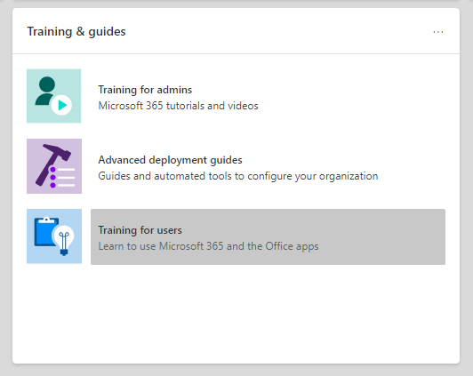
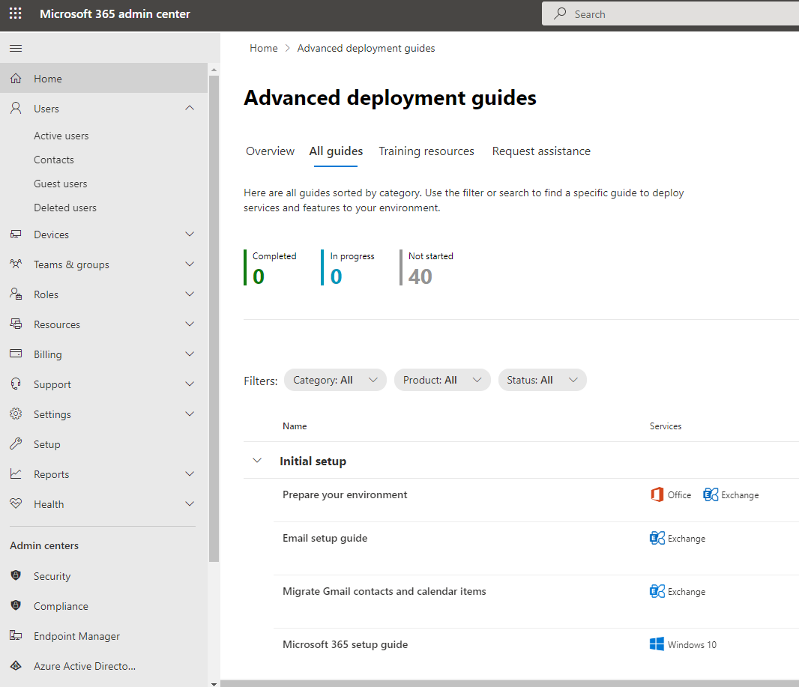

# Setup guides for Microsoft 365 and Office 365 services

Microsoft 365 and Office 365 setup guides give you tailored guidance and resources for planning and deploying your tenant, apps, and services. These guides are created using the same best practices that [Microsoft 365 FastTrack](https://www.microsoft.com/fasttrack/microsoft-365) onboarding specialists share in individual interactions, and they're available to all admins within the Microsoft 365 admin center. They give information on product setup, enabling security features, deploying collaboration tools, and provide scripts to speed up advanced deployments.

> [!NOTE]
> You must be assigned an admin role like Global Reader to access the Microsoft 365 setup guides. Only admins with the Global Administrator role can use the guides to change settings in the tenant. 

## How to access setup guides in the Microsoft 365 admin center

The setup guides are accessible from the [Setup guidance](https://aka.ms/setupguidance) page in the Microsoft 365 admin center. You can keep track of the status of your progress and return at any time to complete a guide. To reach the **Setup guidance** page:

1. In the [Microsoft 365 admin center](https://admin.microsoft.com/), go to the **Home** page.

2. Find the **Training & guides** card.

   

3. Select **Step-by-step guides**.

   

## Guides for initial setup

### Prepare your environment

The [Prepare your environment](https://aka.ms/prepareyourenvironment) guide helps you prepare your organization's environment for Microsoft 365 and Office 365 services. Whatever your goals are, there are tasks you'll need to complete to ensure a successful deployment. To avoid any errors while preparing your environment, you're provided with step-by-step instructions to connect your domain, add users, assign licenses, set up email with Exchange Online, and install or deploy Office apps.

### Email setup guide

The [Email setup guide](https://aka.ms/office365setup) provides you with the step-by-step guidance needed for configuring Exchange Online for your organization. This guidance includes setting up new email accounts, migrating email, and configuring email protection. For a successful email setup, use this advisor and you'll receive the recommended migration method based on your organization's current mail system, the number of mailboxes being migrated, and how you want to manage users and their access.

### Migrate Gmail contacts and calendar items

When you migrate a Gmail user's mailbox to Microsoft 365, email messages are migrated, but contacts and calendar items are not. The [Gmail contacts and calendar advisor](https://aka.ms/gmailcontactscalendar) provides steps for importing Google contacts and Google calendar items to Microsoft 365 using import and export methods with Outlook.com, the Outlook client, or PowerShell.

### Microsoft 365 deployment advisor

The [Microsoft 365 deployment advisor](https://aka.ms/microsoft365setupguide) provides you with guidance when setting up productivity tools, security policies, and device management capabilities. With a Microsoft 365 Business Premium or Microsoft 365 for enterprise subscription, you can use this advisor to set up and configure your organization's devices.

You'll receive guidance and access to resources to enable your cloud services, update devices to the latest supported version of Windows 10, and join devices to Azure Active Directory (Azure AD), all in one central location.

### Remote work setup guide

The [Remote work setup guide](https://aka.ms/remoteworksetup) provides organizations with the tips and resources needed to ensure your users can successfully work remotely, your data is secure, and users' credentials are safeguarded.

You'll receive guidance to optimize remote workers' device traffic to both Microsoft 365 resources in the cloud and your organization's network, which will reduce the strain on your remote access VPN infrastructure.

### Windows Virtual Desktop setup guide

Windows Virtual Desktop is a comprehensive desktop and app virtualization service running in the cloud. It's the only virtual desktop infrastructure (VDI) that delivers simplified management, multi-session Windows 10, optimizations for Microsoft 365 Apps, and support for Remote Desktop Services (RDS) environments. Deploy and scale your Windows desktops and apps to Azure in minutes and get built-in security and compliance features.

The [Windows Virtual Desktop setup guide](https://aka.ms/wvdsetupguide) provides administrators with planning resources and the prerequisites for deployment, setup guidance, and other resources.

### Microsoft Edge setup guide

Microsoft Edge has been rebuilt from the ground up to bring you world-class compatibility and performance, the security and privacy you deserve, and new features designed to bring you the best of the web.

The [Microsoft Edge setup guide](https://aka.ms/edgeadvisor) will help you configure Enterprise Site Discovery to see which sites accessed in your org might need to use IE mode, review and configure important security features, configure privacy policies and compliance policies to meet your org's requirements, and manage web access on your devices. You can download Microsoft Edge to individual devices, or we'll show you how to deploy to multiple users in your org with Group Policy, Configuration Manager, or Microsoft Intune.

### Configure IE mode for Microsoft Edge

If you've already deployed Microsoft Edge and only want to configure IE mode, the [Configure IE mode for Microsoft Edge guide](https://aka.ms/configureiemode) will give you scripts to automate the configuration of Enterprise Site Discovery. You'll also get IE mode recommendations from a cloud-based tool that will help you create an Enterprise Mode Site List to deploy to your users.

### Microsoft Search setup guide

Microsoft Search helps your organization find what they need to complete what they're working on. Whether it's searching for people, files, org charts, sites, or answers to common questions, your org can use Microsoft Search throughout their workday to get answers.

The [Microsoft Search setup guide](https://aka.ms/MicrosoftSearchSetup) helps you configure Microsoft Search whether you want to pilot it to a group of users or roll it out to everyone in your org. You'll assign Search admins and Search editors and then customize the search experience for your users with answers and more options, like adding the Bing extension to Chrome or setting Bing as your default search engine.

### Intune Configuration Manager co-management setup guide

Use the [Intune Configuration Manager co-management setup guide](https://aka.ms/comanagementsetup) for existing Configuration Manager client devices and new internet-based devices that your org wants to co-manage with both Microsoft Intune and Configuration Manager. This co-management deployment guide allows you to manage Windows 10 devices and adds new functionality to your org's devices, while receiving the benefits of both solutions.

## Guides for authentication and access

### Azure AD setup guide

The [Azure AD setup guide](https://aka.ms/aadpguidance) provides information to ensure your organization has a strong security foundation. In this guide you’ll set up initial features, like Azure Role-based access control (Azure RBAC) for admins, Azure AD Connect for your on-premises directory, and Azure AD Connect Health, so you can monitor your hybrid identity's health during automated syncs.

It also includes essential information on enabling self-service password resets, conditional access and integrated third party sign-on including optional advanced identity protection and user provisioning automation.

### Sync users from your Windows Server Active Directory

The [Sync users from your Windows Server Active Directory](https://aka.ms/directorysyncsetup) guide walks you through turning on directory synchronization. Directory synchronization brings your on-premises and cloud identities together for easier access and simplified management. Unlock new capabilities, like single sign-on, self-service options, automatic account provisioning, conditional access controls, and compliance policies. These capabilities ensure your users have access to the resources they need from anywhere.

### Plan your passwordless deployment

Upgrade to an alternative sign-in approach that allows users to access their devices securely with one of the following passwordless authentication methods:

- Windows Hello for Business
- The Microsoft Authenticator app
- Security keys

Use the [Plan your passwordless deployment](https://aka.ms/passwordlesssetup) guide to discover the best passwordless authentication methods to use and receive guidance on how to deploy them.

### Plan your self-service password reset (SSPR) deployment

Give users the ability to change or reset their password independently, if their account is locked, or they forget their password without the need to contact a helpdesk engineer.

Use the [Plan your self-service password reset deployment](https://aka.ms/SSPRSetupGuide) guide to receive relevant articles and instructions for configuring the appropriate Azure portal options to help you deploy SSPR in your environment.

### Active Directory Federation Services (AD FS) deployment advisor

The [AD FS deployment advisor](https://aka.ms/adfsguidance) provides you with step-by-step guidance on deploying an on-premises AD FS infrastructure that authenticates users for Microsoft 365 and Office 365 services. With this guide, your organization can review AD FS components and requirements, acquire and install SSL certificates that are necessary for deployment, and install a required web application proxy server.

## Guides for security and compliance

### Microsoft Intune setup guide

Set up Microsoft Intune to manage devices in your organization. For full control of corporate devices, you’ll use Intune’s mobile device management (MDM) features. To manage your organization's data on shared and personal devices, you can use Intune’s mobile application management (MAM) features.

With the [Microsoft Intune setup guide](https://aka.ms/intunesetupguide), you'll set up device and app compliance policies, assign app protection policies, and monitor the device and app protection status.

### Microsoft Defender for Endpoint setup guide

The [Microsoft Defender for Endpoint setup guide](https://aka.ms/mdatpsetup) provides instructions that will help your enterprise network prevent, detect, investigate, and respond to advanced threats. Make an informed assessment of your organization's vulnerability and decide which deployment package and configuration methods are best.

>[!NOTE]
>A Microsoft Volume License is required for Microsoft Defender for Endpoint.

### Exchange Online Protection setup guide

Microsoft Exchange Online Protection (EOP) is a cloud-based email filtering service for protection against spam and malware, with features to safeguard your organization from messaging policy violations.

Use the [Exchange Online Protection setup guide](https://aka.ms/EOPguidance) to set up EOP by selecting which of the three deployment scenarios&mdash;on-premises mailboxes, hybrid (mix of on-premises and cloud) mailboxes, or all cloud mailboxes&mdash;fits your organization. The guide provides information and resources to set up and review your user's licensing, assign permissions in the Microsoft 365 admin center, and configure your organization's anti-malware and spam policies in the Security & Compliance Center.

### Microsoft Defender for Office 365 setup guide

The [Microsoft Defender for Office 365 setup guide](https://aka.ms/oatpsetup) safeguards your organization against malicious threats that your environment might come across through email messages, links, and third party collaboration tools. This guide provides you with the resources and information to help you prepare and identify the Defender for Office 365 plan to fit your organization's needs.

### Microsoft Defender for Identity setup guide

The [Microsoft Defender for Identity setup guide](https://aka.ms/DefenderforIdentitysetup) provides security solution set-up guidance to identify, detect, and investigate advanced threats that might compromise user identities. These include detecting suspicious user activities and malicious insider actions directed at your organization. You’ll create a Defender for Identity instance, connect to your organization's Active Directory, and then set up sensors, alerts, notifications, and configure your unique portal preferences. 

### Microsoft information protection setup guide

Get an overview of the capabilities you can apply to your Information Protection strategy so you can be confident your sensitive information is protected. Use a four-stage lifecycle approach in which you discover, classify, protect, and monitor sensitive information. The [Microsoft information protection setup guide](https://aka.ms/mipsetupguide) provides guidance for completing each of these stages.

### Microsoft information governance setup guide

The [Microsoft Information governance setup guide](https://aka.ms/migsetupguide) provides you with the information you'll need to set up and manage your organization's governance strategy, to ensure that your data is classified and managed according to the specific lifecycle guidelines you set. With this guide, you'll learn how to create, auto-apply, or publish labels, label policies, and retention policies that are applied to your organization's reusable content and compliance records. You'll also get information on importing CSV files with a file plan for bulk scenarios or for applying them manually to individual documents.

### Microsoft Cloud App Security setup guide

The [Microsoft Cloud App Security setup guide](https://aka.ms/cloudappsecuritysetup) provides easy to follow deployment and management guidance to set up your Cloud Discovery solution. With Cloud Discovery, you'll integrate your supported security apps, and then you'll use traffic logs to dynamically discover and analyze the cloud apps that your organization uses. You'll also set up features available through the Cloud App Security solution, including threat detection policies to identify high-risk use, information protection policies to define access, and real-time session controls to monitor activity. With these features, your environment gets enhanced visibility, control over data movement, and analytics to identify and combat cyberthreats across all your Microsoft and third party cloud services.

## Guides for collaboration

### Build your employee experience

Transform how your employees work together with the [Employee experience dashboard](https://aka.ms/EmployeeExperienceDashboard). For seamless teamwork, use Microsoft 365 to create productive, aligned teams, and keep employees engaged with leadership and the rest of the organization. Help your employees be effective in all work activities. These guides will provide instructions on how to use SharePoint, Teams, and Yammer to build collaboration across your org to help drive productivity.

### Microsoft 365 Apps deployment advisor

The [Microsoft 365 Apps deployment advisor](https://aka.ms/OPPquickstartguide) helps you get your users' devices running the latest version of Office products like Word, Excel, PowerPoint, and OneNote. You'll get guidance on the various deployment methods that include easy self-install options to enterprise deployments with management tools. The instructions will help you assess your environment, figure out your specific deployment requirements, and implement the necessary support tools to ensure a successful install.

### Mobile apps setup guide

The [Mobile apps setup guide](https://aka.ms/officeappguidance) provides instructions for the download and installation of Office apps on your Windows, iOS, and Android mobile devices. This guide provides you with step-by-step information to download and install Microsoft 365 and Office 365 apps on your phone and tablet devices.

### Microsoft Teams setup guide

The [Microsoft Teams setup guide](https://aka.ms/teamsguidance) provides your organization with guidance to set up team workspaces that host real-time conversations through messaging, calls, and audio or video meetings for both team and private communication. Use the tools in this guide to configure Guest access, set who can create teams, and add team members from a .csv file, all without the need to open a PowerShell session. You'll also get best practices for determining your organization's network requirements and ensuring a successful Teams deployment.

### Microsoft Teams for Education setup guide

The [Microsoft Teams for Education setup guide](https://aka.ms/teamsedusetup) provides your school with guidance that brings collaborative classrooms, conversations, meetings, files, and apps together in one place. The guide also provides instructions to prepare, plan, and configure Teams for your school. After your deployment is complete, use built-in tools to configure who can create teams, and optionally create teams yourself while populating members with a .csv file.

### SharePoint setup guide

The [SharePoint setup guide](https://aka.ms/spoguidance) helps you set up your SharePoint document storage and content management, create sites, configure external sharing, migrate data and configure advanced settings, and drive user engagement and communication within your organization. You'll follow steps for configuring your content-sharing permission policies, choose your migration sync tools, and enable the security settings for your SharePoint environment.

### OneDrive setup guide

Use the [OneDrive setup guide](https://aka.ms/ODfBquickstartguide) to get started with OneDrive file storage, sharing, collaboration, and syncing capabilities. OneDrive provides a central location where users can sync their Microsoft 365 Apps files, configure external sharing, migrate user data, and configure advanced security and device access settings. The OneDrive setup guide can be deployed using a OneDrive subscription or a standalone OneDrive plan.

### Yammer deployment advisor

Connect and engage across your organization with Yammer. The [Yammer deployment advisor](https://aka.ms/yammerdeploymentguide) prepares your Yammer network by adding domains, defining admins, and combining Yammer networks. You'll get guidance to deploy Yammer and then customize the look, configure security and compliance, and refine the settings.

## Advanced guides

### In-place upgrade with Configuration Manager

Use the [In-place upgrade with Configuration Manager guide](https://aka.ms/win10upgradedemo) when upgrading Windows 7 and Windows 8.1 devices to the latest version of Windows 10. You'll use the script provided to check the prerequisites and automatically configure an in-place upgrade.

### Deploy Office to your users

Deploy Office apps from the cloud with the ability to customize your installation by using the Office Deployment Tool. The [Deploy Office to your users guide](https://aka.ms/proplusodt) helps you create a customized Office configuration with advanced settings, or you can use a pre-built recommended configuration. Whether your users are conducting a self-install or you're deploying to your users individually or in bulk, this advanced guide provides you with step-by-step instructions to give users an Office installation tailored to your organization.

### Deploy Office to remote users

Now that working remotely is the norm, users need to receive your organization's Office settings when they're not connected to your internal network or when using their own devices.

Use the [Deploy Office to remote users guide](https://aka.ms/officeremoteinstall) to create a customized Office installation and then send users a generated PowerShell script that will seamlessly install Office with your configuration.

### Deploy and update Microsoft 365 Apps with Configuration Manager

For organizations using Configuration Manager, you can use the [Deploy and update Microsoft 365 Apps with Configuration Manager advisor](https://aka.ms/oppinstall) to generate a script that will automatically configure your Microsoft 365 Apps deployment using best practices recommended by FastTrack engineers. Use this guide to build your deployment groups, customize your Office apps and features, configure dynamic or lean installations, and then run the script to create the applications, automatic deployment rules, and device collections you need to target your deployment.

### Intune Configuration Manager co-management setup guide

Use the [Intune Configuration Manager co-management setup guide](https://aka.ms/comanagementsetup) to set up existing Configuration Manager client devices and new internet-based devices that your org wants to co-manage with both Microsoft Intune and Configuration Manager. Co-management allows you to manage Windows 10 devices and adds new functionality to your org's devices, while receiving the benefits of both solutions.
