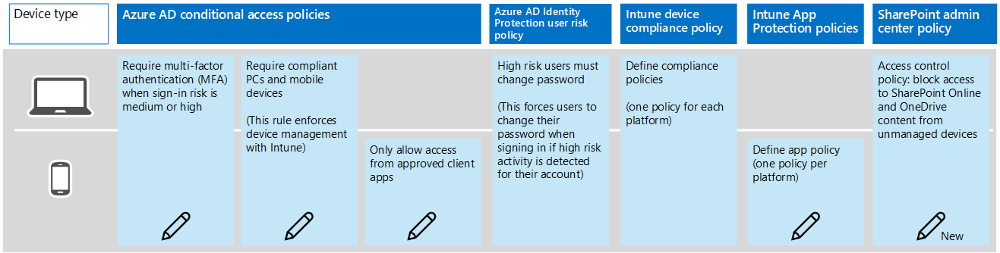
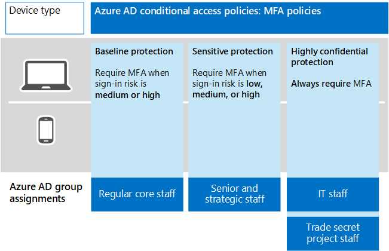

# Policy recommendations for securing SharePoint Sites and files
This article describes how to implement the recommended identity and device access policies to protect SharePoint Online and OneDrive for Business. This guidance builds on the [Common identity and device access policies](identity-access-policies.md). 

These recommendations are based on three different tiers of security and protection for SharePoint files that can be applied based on the granularity of your needs: **baseline**, **sensitive**, and **highly regulated**. You can learn more about these security tiers, and the recommended client operating systems, referenced by these recommendations in the [recommended security policies and configurations introduction](microsoft-365-policies-configurations.md).

##Baseline security
The following diagram illustrates the set of recommended policies for baseline security and indicates which policies will be updated or newly created to add protection for SharePoint Online and OneDrive for Business.

For accessibility, this illustration is detailed in the following table.
|Policy|Where this is configured|Changes for SharePoint Online and OneDrive for Business|Notes|
|:-----|:-----|:-----|:-----|
|Require multi-factor authentication (MFA) when sign-in risk is medium or high|Azure AD conditional access policy|Edit to add SharePoint Online|For sensitive and and highly regulated protection, this rule is more protective|
|Require compliant PCs and mobile devices|Azure AD conditional access policy|Edit to add SharePoint Online|This rule enforces device management with Intune|
|Only allow access from approved client apps|Azure AD conditional access policy|Edit to add SharePoint Online| |
|High risk users must change password|Azure AD Identity Protection user risk policy|No changes|This forces users to change their password when signing in if high risk activity is detected for their account|
|Device compliance policies|Intune device compliance policy|No changes|You should have one policy for each platform|
|Define app plolicy|Intune App Protection policies and conditional access rules|Edit this rule to include apps that access SharePoint Online and OneDrive for Business|One policy for each platform|
|SharePoint admin access control policy|SharePoint admin center policy|This is a new configuration|Configure access control policies to block access to SharePoint Online and OneDrive for Business content from unmanaged devices|

##Sensitive and highly regulated security
Currently, the only difference between the recommendations for baseline security compared to sensitive and highly regulated security is the amount of protection in the first rule in this rule set: Require multi-factor authentication. 

|Level of protection|Require MFA|
|:-----|:-----|
|Baseline|Only when sign-in risk is medium or higher|
|Sensitive|When sign-in risk is medium or higher|
|Highly regulated|Always require MFA|

Not every organization requires sensitive or highly regulated protection. If you do, you likely only require these levels of protection for a subset of users who have access to sensitive or highly regulated data. Therefore, the recommendation is to create additional rules for each level of protection and assign these to the target group of users. If a user is included in more than one rule, the most restrictive rule applies to their access. 

The following diagram provides an example of Azure AD group assignments across the three tiers of protection.

In the illustration:
- The MFA rule for baseline protection is assigned to "Regular core staff."
- The MFA rule for sensitive protection is assigned to "Senior and strategic staff."
- The MFA rule for highly regulated protection is assinged to "IT staff" and "Trade secret project staff."

##Configuring policies
The rest of this article provides guidance on configuring the recommended policies.  

>[!NOTE]
>All security groups created as part of these recommendations must be created with Office features enabled. This is specifically important for the deployment of AIP when securing documents in SharePoint.
>
>
>

## Require MFA

###Baseline protection
For baseline protection, edit the [rule you already created for Exchange Online](secure-email-recommended-policies.md#medium-and-above-risk-requires-mfa) to include SharePoint Online and OneDrive for Business. Edit this in the assignments category:

|Type|Properties|Values|Notes|
|:-----|:-----|:-----|:-----|
|Cloud apps|Include|Select apps:    Office 365 Exchange Online    Office 365 SharePoint Online|Select both|

###Sensitive and highly regulated protection
For sensitive and highly regulated protection, create a new MFA rule for each (with the recommended level of protection) and assign the rule to the intended users. For recommended settings, see the following:
- [Sensitive: Low and above risk requires MFA](secure-email-recommended-policies.md#low-and-above-risk-requires-mfa)
- [Highly regulated: MFA required](secure-email-recommended-policies.md#mfa-required)

## Require a compliant or domain joined device
Add Office 365 SharePoint Online to the scope of the existing rule. See [Require a compliant or domain joined device](secure-email-recommended-policies.md#require-a-compliant-or-domain-joined-device-2). 

## Only allow access from approved client apps
Approved client apps support Intune mobile application management. This conditional access rule only allows access to services, like Exchange Online and SharePoint Online, from approved client apps. The control selected in this rule only applies to the iOS and Android platforms. Add Office 365 SharePoint Online to the scope of this existing rule, or create this rule if you don't already have it configured. 

To create a conditional access policy to only allow access from approved client apps:

1. Go to the [Azure portal](https://portal.azure.com), and sign in with your credentials. After you've successfully signed in, you see the Azure Dashboard.

2. Choose **Azure Active Directory** from the left menu.

3. Under the **Security** section, choose **Conditional access**.

4. Choose **New policy**.

5. Enter a policy name, then choose the **Users and groups** you want to apply the policy for.

6. Choose **Cloud apps**.

7. Choose **Select apps**, select **Office 365 SharePoint Online** from the **Cloud apps** list, click on **Select**. Once the **Office 365 SharePoint Online** app is selected, click **Done**.

8. Choose **Grant** from the **Access controls** section.

9. Choose **Grant access**, select **Require approved client app**, then choose **Select**.

10. Click **Create** to create the conditional access policy.

## Define app protection policies
Modify the app protection policies for your environment to include apps that access SharePoint Online and OneDrive for Business. You must create an app protection policy for each platform: 
- ios
- Android
- Windows 10

If you created these policies for Exchange Online, they might only include Outlook. The recommended list of apps includes the following:
- PowerPoint
- Excel
- Word
- Microsoft Teams
- Microsoft SharePoint
- Microsoft Visio Viewer
- OneDrive
- OneNote
- Outlook

To create or edit the policies and assign these policies to users, see [How to create and assign app protection policies](https://docs.microsoft.com/en-us/intune/app-protection-policies). 

For recommended app protection settings for baseline security, see "Settings" under [Intune mobile application management](secure-email-recommended-policies.md#intune-mobile-application-management).

##Block access to content from unmanaged devices (SharePoint admin center)
In the case of SharePoint Online, when a conditional access policy is applied to enforce Intune app protection policies, this might not apply to all applications that access SharePoint Online. Some applications, such as Exchange, have access to some SharePoint resources. For example, Exchange allows attaching SharePoint files by default. Conditional access policies applied to SharePoint Online will not restrict this access. 

To ensure baseline protection is applied uniformly, regardless of which service is accessing SharePoint Online and OneDrive for Business, configure access controls directly in SharePoint admin center. We recommend you configure the following:
- Block access from unmanaged devices. This includes devices that aren't compliant or joined to a domain. 
- Block access from app that don't use modern authentication.

See [Control access from unmanaged devices](https://support.office.com/en-us/article/Control-access-from-unmanaged-devices-5ae550c4-bd20-4257-847b-5c20fb053622?ui=en-US&rs=en-US&ad=US).

## Next steps
[Learn more about Microsoft 365 services](index.md)
