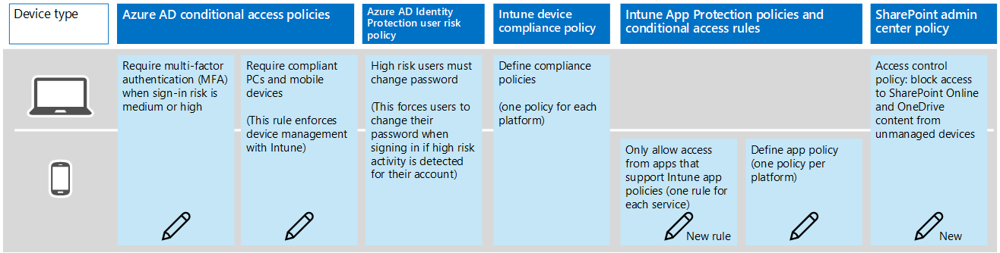

# Policy recommendations for securing SharePoint Sites and files
The following recommendations are provided *in addition to* the [common identity and access policy recommendations](identity-access-policies.md) and [policy recommendations for securing email](secure-email-recommended-policies.md). To safeguard SharePoint Online files, new policies must be created, and existing policies amended, as described here.

The following recommendations are based on three different tiers of security and protection for SharePoint files that can be applied based on the granularity of your needs: **baseline**, **sensitive**, and **highly regulated**. You can learn more about these security tiers, and the recommended client operating systems, referenced by these recommendations in the [recommended security policies and configurations introduction](microsoft-365-policies-configurations.md).

>[!NOTE]
>All security groups created as part of these recommendations must be created with Office features enabled. This is specifically important for the deployment of AIP when securing documents in SharePoint.
>
>
>

## Baseline

### Medium and above risk requires MFA
Make the following changes to the existing CA policy created when applying [policy recomendations to secure email](secure-email-recommended-policies.md) in the assignments category:

|Type|Properties|Values|Notes|
|:-----|:-----|:-----|:-----|
|Cloud apps|Include|Select apps:    Office 365 Exchange Online    Office 365 SharePoint Online|Select both|

### Require a compliant or domain joined device
To create a new Intune Conditional Access Policy for SharePoint Online, log in to the [Microsoft Management portal](http://manage.microsoft.com) with your administrator credentials and then navigate to **Policy** > **Conditional Access** > **SharePoint Online Policy**.

You must set a Conditional Access policy specifically for SharePoint Online in the Intune Management portal to require a compliant or domain joined device.

**Application access**
|Type|Properties|Values|Notes|
|:-----|:-----|:-----|:-----|
|OneDrive for Business and other apps that user modern authentication|All platforms|True|Selected|
|     |Windows must meet the following requirement|Device must be domain joined or compliant|Selected (List)|
|     |Specific platforms|False||
|Browser access to SharePoint and OneDrive for Business |Block non-compliant devices on same platform as OneDrive for Business|True|Check|

**Policy deployment**
|Type|Properties|Values|Notes|
|:-----|:-----|:-----|:-----|
|Targeted groups|Select the Active Directory groups to target with this policy|     |     |
|     |All users|False|     |
|     |Selected security groups|True|Selected|
|     |Modify|Select specific security group containing targeted users.|     |
|Exempt groups|Select the Active Directory groups to exempt from this policy (overrides members of the Targeted Groups list).|     |     |    
|     |No exempt users|True|Selected|
|     |Selected security groups|False|     |

### Mobile application management conditional access for SharePoint Online

You must set a Conditional Access policy specifically for SharePoint Online in the Intune Management portal to manage mobile apps.

To manage mobile apps, log in to the Microsoft Azure portal with your administrator credentials, and then navigate to **Intune App Protection** > **Settings** > **Conditional Access** > **SharePoint Online**.

**App access**
|Type|Properties|Values|Notes|
|:-----|:-----|:-----|:-----|
|Allowed apps|Enable app access|Allow apps that support Intune app policies|Selected (list) – This results in a list of apps/platform combinations supported by Intune app policies.|

**User access**
|Type|Properties|Values|Notes|
|:-----|:-----|:-----|:-----|
|     |Restricted user groups|Add user groups – Select specific security group containing targeted users.|Start with security group including pilot users.|
|     |Exempt user groups|Exception security groups|     |

### Apply to

Once your pilot project has been completed, these policies should be applied to all users in your organization.

## Sensitive

### Low and above risk requires MFA

Make the following changes to the existing CA policy created when applying [policy recomendations to secure email](secure-email-recommended-policies.md):

**Assignments**
|Type|Properties|Values|Notes|
|:-----|:-----|:-----|:-----|
|Cloud apps|Include|Select apps:    Office 365 Exchange Online    Office 365 SharePoint Online|Select both|

### Require a compliant or domain joined device

(See baseline instructions)

### Mobile application management conditional access for SharePoint online

(See baseline instructions)

## Highly regulated

### MFA required

Make the following changes to the existing CA policy created when applying [policy recomendations to secure email](secure-email-recommended-policies.md):

**Assignments**
|Type|Properties|Values|Notes|
|:-----|:-----|:-----|:-----|
|Cloud apps|Include|Select apps:    Office 365 Exchange Online    Office 365 SharePoint Online|Select both|

### Require a compliant or domain joined device
(See baseline instructions)

### Mobile application management conditional access for SharePoint online
(See baseline instructions)

## Additional configurations
In addition to the above policies, you must also lock down legacy protocols that do not support modern authentication.

### Lock down legacy protocols
Conditional access policies protect access through browser flows and apps using modern authentication; like Office 2016 and the apps on the supported platform list. For older Office desktop applications, like Office 2010, conditional access policy is not applied.

Older apps that don’t use modern authentication can be blocked [using the OneDrive admin portal](https://support.office.com/article/Control-access-based-on-network-location-or-app-59b83701-cefd-4bf8-b4d1-d4659b60da08). The SharePoint admin PowerShell cmdlet can also be used to disable SharePoint legacy protocols. To use PowerShell, just run the [Set-SPOTenant cmdlet](https://technet.microsoft.com/library/fp161390.aspx) and set **-LegacyAuthProtocolsEnabled** to **$false**.  Once set, legacy protocol support is disabled and all access to SharePoint using older client applications will be blocked.

## Next steps
[Learn more about Microsoft 365 services](index.md)
