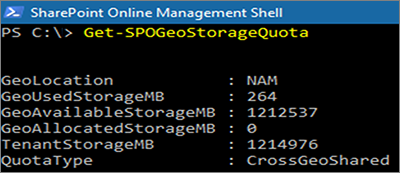

# SharePoint storage quotas in multi-geo environments

By default, all geo locations of a multi-geo environment share the available tenant storage quota.

With the SharePoint geo storage quota setting, you can manage the storage quota for each geo location. When you allocate a storage quota for a geo location, it becomes the maximum amount of storage available for that geo location, and is deducted from the available tenant storage quota. The remaining available tenant storage quota is then shared across the configured geo locations for which a specific storage quota hasn't been allocated.

The SharePoint storage quota for any geo location is allocated by the SharePoint administrator by connecting to the central location. Geo administrators for satellite locations can view the storage quota but can't allocate it.

## Configure a storage quota for a geo location

Use the [Microsoft SharePoint Module](https://www.microsoft.com/download/details.aspx?id=35588) and connect to the central location to allocate the storage quota for a geo location.

> [!NOTE]
> You can find a list of Microsoft 365 geo location codes [here](multi-geo-add-group-with-pdl.md#geo-location-codes).

To allocate Storage Quota for a location, run cmdlet:

```powershell
Set-SPOGeoStorageQuota -GeoLocation <geolocationcode> -StorageQuotaMB <value>
```

To view Storage Quota for the current geo location, run:

```powershell
Get-SPOGeoStorageQuota
```



To view Storage Quota for all geo locations, run:

```powershell
Get-SPOGeoStorageQuota -AllLocations
```

To remove the allocated storage quota for a geo location, set `StorageQuota value = 0`:

```powershell
Set-SPOGeoStorageQuota -GeoLocation <geolocationcode> -StorageQuotaMB 0
```
