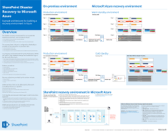
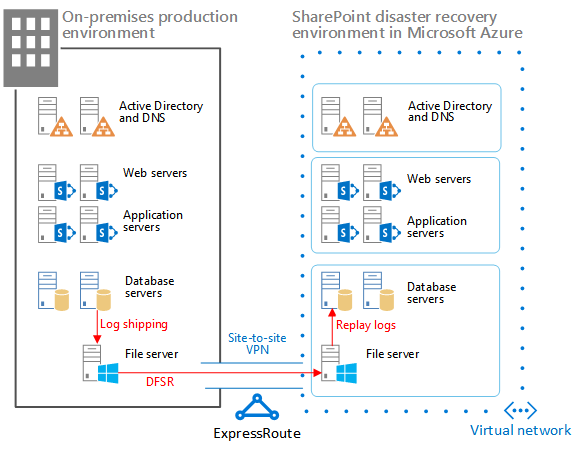
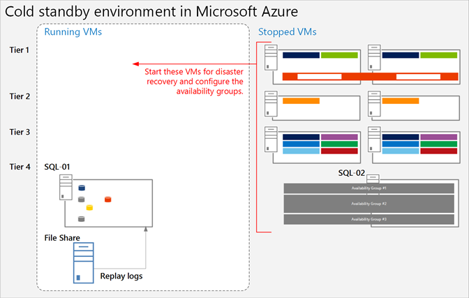
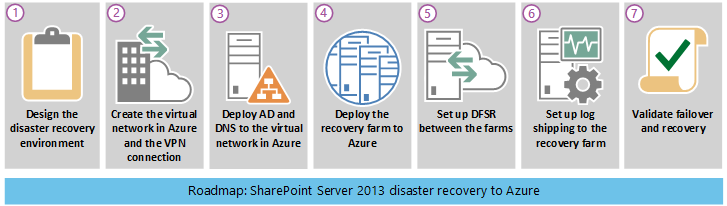
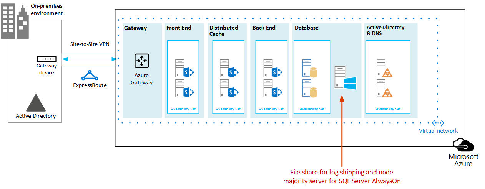

# SharePoint Server 2013 Disaster Recovery in Microsoft Azure

 Using Azure, you can create a disaster-recovery environment for your on-premises SharePoint farm. This article describes how to design and implement this solution.

 **Watch the SharePoint Server 2013 disaster recovery overview video**
> [!VIDEO https://www.microsoft.com/videoplayer/embed/1b73ec8f-29bd-44eb-aa3a-f7932784bfd9?autoplay=false]

 When disaster strikes your SharePoint on-premises environment, your top priority is to get the system running again quickly. Disaster recovery with SharePoint is quicker and easier when you have a backup environment already running in Microsoft Azure. This video explains the main concepts of a SharePoint warm failover environment and complements the full details available in this article.

Use this article with the following solution model: **SharePoint Disaster Recovery in Microsoft Azure**.

[](https://go.microsoft.com/fwlink/p/?LinkId=392555)

 [PDF](https://go.microsoft.com/fwlink/p/?LinkId=392555) | [Visio](https://go.microsoft.com/fwlink/p/?LinkId=392554)

## Use Azure Infrastructure Services for disaster recovery

Many organizations do not have a disaster recovery environment for SharePoint, which can be expensive to build and maintain on-premises. Azure Infrastructure Services provides compelling options for disaster recovery environments that are more flexible and less expensive than the on-premises alternatives.

The advantages for using Azure Infrastructure Services include:

- **Fewer costly resources** Maintain and pay for fewer resources than on-premises disaster recovery environments. The number of resources depends on which disaster-recovery environment you choose: cold standby, warm standby, or hot standby.

- **Better resource flexibility** In the event of a disaster, easily scale out your recovery SharePoint farm to meet load requirements. Scale in when you no longer need the resources.

- **Lower datacenter commitment** Use Azure Infrastructure Services instead of investing in a secondary datacenter in a different region.

There are less-complex options for organizations just getting started with disaster recovery and advanced options for organizations with high-resilience requirements. The definitions for cold, warm, and hot standby environments are a little different when the environment is hosted on a cloud platform. The following table describes these environments for building a SharePoint recovery farm in Azure.

**Table: Recovery environments**

|Type of recovery environment|Description|
|---|---|
|Hot|A fully sized farm is provisioned, updated, and running on standby.|
|Warm|The farm is built and virtual machines are running and updated. <br/> Recovery includes attaching content databases, provisioning service applications, and crawling content. <br/> The farm can be a smaller version of the production farm and then scaled out to serve the full user base.|
|Cold|The farm is fully built, but the virtual machines are stopped. <br/> Maintaining the environment includes starting the virtual machines from time to time, patching, updating, and verifying the environment. <br/> Start the full environment in the event of a disaster.|

It's important to evaluate your organization's Recovery Time Objectives (RTOs) and Recovery Point Objectives (RPOs). These requirements determine which environment is the most appropriate investment for your organization.

The guidance in this article describes how to implement a warm standby environment. You can also adapt it to a cold standby environment, although you need to follow additional procedures to support this kind of environment. This article does not describe how to implement a hot standby environment.

For more information about disaster recovery solutions, see [High availability and disaster recovery concepts in SharePoint 2013](/SharePoint/administration/high-availability-and-disaster-recovery-concepts) and [Choose a disaster recovery strategy for SharePoint 2013](/SharePoint/administration/plan-for-disaster-recovery).

## Solution description

The warm standby disaster-recovery solution requires the following environment:

- An on-premises SharePoint production farm

- A recovery SharePoint farm in Azure

- A site-to-site VPN connection between the two environments

The following figure illustrates these three elements.

**Figure: Elements of a warm standby solution in Azure**



SQL Server log shipping with Distributed File System Replication (DFSR) is used to copy database backups and transaction logs to the recovery farm in Azure:

- DFSR transfers logs from the production environment to the recovery environment. In a WAN scenario, DFSR is more efficient than shipping the logs directly to the secondary server in Azure.

- Logs are replayed to the SQL Server in the recovery environment in Azure.

- You don't attach log-shipped SharePoint content databases in the recovery environment until a recovery exercise is performed.

Perform the following steps to recover the farm:

1. Stop log shipping.

2. Stop accepting traffic to the primary farm.

3. Replay the final transaction logs.

4. Attach the content databases to the farm.

5. Restore service applications from the replicated services databases.

6. Update Domain Name System (DNS) records to point to the recovery farm.

7. Start a full crawl.

We recommend that you rehearse these steps regularly and document them to help ensure that your live recovery runs smoothly. Attaching content databases and restoring service applications can take some time and typically involves some manual configuration.

After a recovery is performed, this solution provides the items listed in the following table.

**Table: Solution recovery objectives**

|Item|Description|
|---|---|
|Sites and content|Sites and content are available in the recovery environment.|
|A new instance of search|In this warm standby solution, search is not restored from search databases. Search components in the recovery farm are configured as similarly as possible to the production farm. After the sites and content are restored, a full crawl is started to rebuild the search index. You do not need to wait for the crawl to complete to make the sites and content available.|
|Services|Services that store data in databases are restored from the log-shipped databases. Services that do not store data in databases are simply started. <br/> Not all services with databases need to be restored. The following services do not need to be restored from databases and can simply be started after failover: <br/> Usage and Health Data Collection <br/> State service <br/> Word automation <br/> Any other service that doesn't use a database|

You can work with Microsoft Consulting Services (MCS) or a partner to address more-complex recovery objectives. These are summarized in the following table.

**Table: Other items that can be addressed by MCS or a partner**

|Item|Description|
|---|---|
|Synchronizing custom farm solutions|Ideally, the recovery farm configuration is identical to the production farm. You can work with a consultant or partner to evaluate whether custom farm solutions are replicated and whether the process is in place for keeping the two environments synchronized.|
|Connections to data sources on-premises|It might not be practical to replicate connections to back-end data systems, such as backup domain controller (BDC) connections and search content sources.|
|Search restore scenarios|Because enterprise search deployments tend to be fairly unique and complex, restoring search from databases requires a greater investment. You can work with a consultant or partner to identify and implement search restore scenarios that your organization might require.|

The guidance provided in this article assumes that the on-premises farm is already designed and deployed.

## Detailed architecture

Ideally, the recovery farm configuration in Azure is identical to the production farm on-premises, including the following:

- The same representation of server roles

- The same configuration of customizations

- The same configuration of search components

The environment in Azure can be a smaller version of the production farm. If you plan to scale out the recovery farm after failover, it's important that each type of server role be initially represented.

Some configurations might not be practical to replicate in the failover environment. Be sure to test the failover procedures and environment to help ensure that the failover farm provides the expected service level.

This solution doesn't prescribe a specific topology for a SharePoint farm. The focus of this solution is to use Azure for the failover farm and to implement log shipping and DFSR between the two environments.

### Warm standby environments

In a warm standby environment, all virtual machines in the Azure environment are running. The environment is ready for a failover exercise or event.

The following figure illustrates a disaster recovery solution from an on-premises SharePoint farm to an Azure-based SharePoint farm that is configured as a warm standby environment.

**Figure: Topology and key elements of a production farm and a warm standby recovery farm**


In this diagram:

- Two environments are illustrated side by side: the on-premises SharePoint farm and the warm standby farm in Azure.

- Each environment includes a file share.

- Each farm includes four tiers. To achieve high availability, each tier includes two servers or virtual machines that are configured identically for a specific role, such as front-end services, distributed cache, back-end services, and databases. It isn't important in this illustration to call out specific components. The two farms are configured identically.

- The fourth tier is the database tier. Log shipping is used to copy logs from the secondary database server in the on-premises environment to the file share in the same environment.

- DFSR copies files from the file share in the on-premises environment to the file share in the Azure environment.

- Log shipping replays the logs from the file share in the Azure environment to the primary replica in the SQL Server AlwaysOn availability group in the recovery environment.

### Cold standby environments

In a cold standby environment, most of the SharePoint farm virtual machines can be shut down. (We recommend occasionally starting the virtual machines, such as every two weeks or once a month, so that each virtual machine can sync with the domain.) The following virtual machines in the Azure recovery environment must remain running to help ensure continuous operations of log shipping and DFSR:

- The file share

- The primary database server

- At least one virtual machine running Windows Server Active Directory Domain Services and DNS

The following figure shows an Azure failover environment in which the file share virtual machine and the primary SharePoint database virtual machine are running. All other SharePoint virtual machines are stopped. The virtual machine that is running Windows Server Active Directory and DNS is not shown.

**Figure: Cold standby recovery farm with running virtual machines**



After failover to a cold standby environment, all virtual machines are started, and the method to achieve high availability of the database servers must be configured, such as SQL Server AlwaysOn availability groups.

If multiple storage groups are implemented (databases are spread across more than one SQL Server high availability set), the primary database for each storage group must be running to accept the logs associated with its storage group.

### Skills and experience

Multiple technologies are used in this disaster recovery solution. To help ensure that these technologies interact as expected, each component in the on-premises and Azure environment must be installed and configured correctly. We recommend that the person or team who sets up this solution have a strong working knowledge of and hands-on skills with the technologies described in the following articles:

- [Distributed File System (DFS) Replication Services](/previous-versions/windows/it-pro/windows-server-2012-R2-and-2012/jj127250(v=ws.11))

- [Windows Server Failover Clustering (WSFC) with SQL Server](/sql/sql-server/failover-clusters/windows/windows-server-failover-clustering-wsfc-with-sql-server)

- [AlwaysOn Availability Groups (SQL Server)](/sql/database-engine/availability-groups/windows/always-on-availability-groups-sql-server)

- [Back Up and Restore of SQL Server Databases](/sql/relational-databases/backup-restore/back-up-and-restore-of-sql-server-databases)

- [SharePoint Server 2013 installation and farm deployment](/SharePoint/install/installation-and-configuration-overview)

- [Microsoft Azure](/azure/)

Finally, we recommend scripting skills that you can use to automate tasks associated with these technologies. It's possible to use the available user interfaces to complete all the tasks described in this solution. However, a manual approach can be time consuming and error prone and delivers inconsistent results.

In addition to Windows PowerShell, there are also Windows PowerShell libraries for SQL Server, SharePoint Server, and Azure. Don't forget T-SQL, which can also help reduce the time to configure and maintain your disaster-recovery environment.

## Disaster recovery roadmap



This roadmap assumes that you already have a SharePoint Server 2013 farm deployed in production.

**Table: Roadmap for disaster recovery**

|Phase|Description|
|---|---|
|Phase 1|Design the disaster recovery environment.|
|Phase 2|Create the Azure virtual network and VPN connection.|
|Phase 3|Deploy Windows Active Directory and Domain Name Services to the Azure virtual network.|
|Phase 4|Deploy the SharePoint recovery farm in Azure.|
|Phase 5|Set up DFSR between the farms.|
|Phase 6|Set up log shipping to the recovery farm.|
|Phase 7|Validate failover and recovery solutions. This includes the following procedures and technologies: <br/> Stop log shipping. <br/> Restore the backups. <br/> Crawl content. <br/> Recover services. <br/> Manage DNS records.|

## Phase 1: Design the disaster recovery environment

Use the guidance in [Microsoft Azure Architectures for SharePoint 2013](microsoft-azure-architectures-for-sharepoint-2013.md) to design the disaster-recovery environment, including the SharePoint recovery farm. You can use the graphics in the [SharePoint Disaster Recovery Solution in Azure](https://go.microsoft.com/fwlink/p/?LinkId=392554) Visio file to start the design process. We recommend that you design the entire environment before beginning any work in the Azure environment.

In addition to the guidance provided in [Microsoft Azure Architectures for SharePoint 2013](microsoft-azure-architectures-for-sharepoint-2013.md) for designing the virtual network, VPN connection, Active Directory, and SharePoint farm, be sure to add a file share role to the Azure environment.

To support log shipping in a disaster-recovery solution, a file share virtual machine is added to the subnet where the database roles reside. The file share also serves as the third node of a Node Majority for the SQL Server AlwaysOn availability group. This is the recommended configuration for a standard SharePoint farm that uses SQL Server AlwaysOn availability groups.

> [!NOTE]
> It is important to review the prerequisites for a database to participate in a SQL Server AlwaysOn availability group. For more information, see [Prerequisites, Restrictions, and Recommendations for AlwaysOn Availability Groups](/sql/database-engine/availability-groups/windows/prereqs-restrictions-recommendations-always-on-availability).

**Figure: Placement of a file server used for a disaster recovery solution**



In this diagram, a file share virtual machine is added to the same subnet in Azure that contains the database server roles. Do not add the file share virtual machine to an availability set with other server roles, such as the SQL Server roles.

If you are concerned about the high availability of the logs, consider taking a different approach by using [SQL Server backup and restore with Azure Blob Storage Service](/sql/relational-databases/backup-restore/sql-server-backup-and-restore-with-microsoft-azure-blob-storage-service). This is a new feature in Azure that saves logs directly to a blob storage URL. This solution does not include guidance about using this feature.

When you design the recovery farm, keep in mind that a successful disaster recovery environment accurately reflects the production farm that you want to recover. The size of the recovery farm is not the most important thing in the recovery farm's design, deployment, and testing. Farm scale varies from organization to organization based on business requirements. It might be possible to use a scaled-down farm for a short outage or until performance and capacity demands require you to scale the farm.

Configure the recovery farm as identically as possible to the production farm so that it meets your service level agreement (SLA) requirements and provides the functionality that you need to support your business. When you design the disaster recovery environment, also look at your change management process for your production environment. We recommend that you extend the change management process to the recovery environment by updating the recovery environment at the same interval as the production environment. As part of the change management process, we recommend maintaining a detailed inventory of your farm configuration, applications, and users.

## Phase 2: Create the Azure virtual network and VPN connection

[Connect an on-premises network to a Microsoft Azure virtual network](connect-an-on-premises-network-to-a-microsoft-azure-virtual-network.md) shows you how to plan and deploy the virtual network in Azure and how to create the VPN connection. Follow the guidance in the topic to complete the following procedures:

- Plan the private IP address space of the Virtual Network.

- Plan the routing infrastructure changes for the Virtual Network.

- Plan firewall rules for traffic to and from the on-premises VPN device.

- Create the cross-premises virtual network in Azure.

- Configure routing between your on-premises network and the Virtual Network.

## Phase 3: Deploy Active Directory and Domain Name Services to the Azure virtual network

This phase includes deploying both Windows Server Active Directory and DNS to the Virtual Network in a hybrid scenario as described in [Microsoft Azure Architectures for SharePoint 2013](microsoft-azure-architectures-for-sharepoint-2013.md) and as illustrated in the following figure.

**Figure: Hybrid Active Directory domain configuration**


In the illustration, two virtual machines are deployed to the same subnet. These virtual machines are each hosting two roles: Active Directory and DNS.

Before deploying Active Directory in Azure, read [Guidelines for Deploying Windows Server Active Directory on Azure Virtual Machines](/windows-server/identity/ad-ds/introduction-to-active-directory-domain-services-ad-ds-virtualization-level-100). These guidelines help you determine whether you need a different architecture or different configuration settings for your solution.

For detailed guidance on setting up a domain controller in Azure, see [Install a Replica Active Directory Domain Controller in Azure Virtual Networks](/windows-server/identity/ad-ds/introduction-to-active-directory-domain-services-ad-ds-virtualization-level-100).

Before this phase, you didn't deploy virtual machines to the Virtual Network. The virtual machines for hosting Active Directory and DNS are likely not the largest virtual machines you need for the solution. Before you deploy these virtual machines, first create the largest virtual machine that you plan to use in your Virtual Network. This helps ensure that your solution lands on a tag in Azure that allows the largest size you need. You do not need to configure this virtual machine at this time. Simply create it, and set it aside. If you do not do this, you might run into a limitation when you try to create larger virtual machines later, which was an issue at the time this article was written.

## Phase 4: Deploy the SharePoint recovery farm in Azure

Deploy the SharePoint farm in your Virtual Network according to your design plans. It might be helpful to review [Planning for SharePoint 2013 on Azure Infrastructure Services](/previous-versions/azure/dn275958(v=azure.100)) before you deploy SharePoint roles in Azure.

Consider the following practices that we learned by building our proof of concept environment:

- Create virtual machines by using the Azure portal or PowerShell.

- Azure and Hyper-V do not support dynamic memory. Be sure this is factored into your performance and capacity plans.

- Restart virtual machines through the Azure interface, not from the virtual machine logon itself. Using the Azure interface works better and is more predictable.

- If you want to shut down a virtual machine to save costs, use the Azure interface. If you shut down from the virtual machine logon, charges continue to accrue.

- Use a naming convention for the virtual machines.

- Pay attention to which datacenter location the virtual machines are being deployed.

- The automatic scaling feature in Azure is not supported for SharePoint roles.

- Do not configure items in the farm that will be restored, such as site collections.

## Phase 5: Set up DFSR between the farms

To set up file replication by using DFSR, use the DNS Management snap-in. However, before the DFSR setup, log on to your on-premises file server and Azure file server and enable the service in Windows.

From the Server Manager Dashboard, complete the following steps:

- Configure the local server.

- Start the **Add Roles and Features Wizard**.

- Open the **File and Storage Services** node.

- Select **DFS Namespaces** and **DFS replication**.

- Click **Next** to finish the wizard steps.

The following table provides links to DFSR reference articles and blog posts.

**Table: Reference articles for DFSR**

|Title|Description|
|---|---|
|[Replication](/previous-versions/windows/it-pro/windows-server-2008-R2-and-2008/cc770278(v=ws.11))|DFS Management TechNet topic with links for replication|
|[DFS Replication: Survival Guide](https://go.microsoft.com/fwlink/p/?LinkId=392737)|Wiki with links to DFS information|
|[DFS Replication: Frequently Asked Questions](/previous-versions/windows/it-pro/windows-server-2003/cc773238(v=ws.10))|DFS Replication TechNet topic|
|[Jose Barreto's Blog](/archive/blogs/josebda/)|Blog written by a Principal Program Manager on the File Server team at Microsoft|
|[The Storage Team at Microsoft - File Cabinet Blog](https://go.microsoft.com/fwlink/p/?LinkId=392740)|Blog about file services and storage features in Windows Server|

## Phase 6: Set up log shipping to the recovery farm

Log shipping is the critical component for setting up disaster recovery in this environment. You can use log shipping to automatically send transaction log files for databases from a primary database server instance to a secondary database server instance. To set up log shipping, see [Configure log shipping in SharePoint 2013](/sharepoint/administration/configure-log-shipping).

> [!IMPORTANT]
> Log shipping support in SharePoint Server is limited to certain databases. For more information, see [Supported high availability and disaster recovery options for SharePoint databases (SharePoint 2013)](/SharePoint/administration/supported-high-availability-and-disaster-recovery-options-for-sharepoint-databas).

## Phase 7: Validate failover and recovery

The goal of this final phase is to verify that the disaster recovery solution works as planned. To do this, create a failover event that shuts down the production farm and starts up the recovery farm as a replacement. You can start a failover scenario manually or by using scripts.

The first step is to stop incoming user requests for farm services or content. You can do this by disabling DNS entries or by shutting down the front-end web servers. After the farm is "down," you can fail over to the recovery farm.

### Stop log shipping

You must stop log shipping before farm recovery. Stop log shipping on the secondary server in Azure first, and then stop it on the primary server on-premises. Use the following script to stop log shipping on the secondary server first and then on the primary server. The database names in the script might be different, depending on your environment.

```
-- This script removes log shipping from the server.
-- Commands must be executed on the secondary server first and then on the primary server.

SET NOCOUNT ON
DECLARE  @PriDB nvarchar(max)
,@SecDB nvarchar(250)
,@PriSrv nvarchar(250)
,@SecSrv nvarchar(250)

Set @PriDB= ''
SET @PriDB = UPPER(@PriDB)
SET @PriDB = REPLACE(@PriDB, ' ', '')
SET @PriDB = '''' + REPLACE(@PriDB, ',', ''', ''') + ''''

Set @SecDB = @PriDB

Exec ( 'Select  ''exec master..sp_delete_log_shipping_secondary_database '' + '''''''' + prm.primary_database +  ''''''''
from msdb.dbo.log_shipping_monitor_primary prm INNER JOIN msdb.dbo.log_shipping_primary_secondaries sec  ON  prm.primary_database=sec.secondary_database
where prm.primary_database in ( ' + @PriDB + ' )')

Exec ( 'Select  ''exec master..sp_delete_log_shipping_primary_secondary '' + '''''''' + prm.Primary_Database + '''''', '''''' + sec.Secondary_Server + '''''', '''''' + sec.Secondary_database + ''''''''
from msdb.dbo.log_shipping_monitor_primary prm INNER JOIN msdb.dbo.log_shipping_primary_secondaries sec  ON  prm.primary_database=sec.secondary_database
where prm.primary_database in ( ' + @PriDB + ' )')

Exec ( 'Select  ''exec master..sp_delete_log_shipping_primary_database '' + '''''''' + prm.primary_database +  ''''''''
from msdb.dbo.log_shipping_monitor_primary prm INNER JOIN msdb.dbo.log_shipping_primary_secondaries sec  ON  prm.primary_database=sec.secondary_database
where prm.primary_database in ( ' + @PriDB + ' )')

Exec ( 'Select  ''exec master..sp_delete_log_shipping_secondary_primary '' + '''''''' + prm.primary_server + '''''', '''''' + prm.primary_database +  ''''''''
from msdb.dbo.log_shipping_monitor_primary prm INNER JOIN msdb.dbo.log_shipping_primary_secondaries sec  ON  prm.primary_database=sec.secondary_database
where prm.primary_database in ( ' + @PriDB + ' )')
```

### Restore the backups

Backups must be restored in the order in which they were created. Before you can restore a particular transaction log backup, you must first restore the following previous backups without rolling back uncommitted transactions (that is, by using  `WITH NORECOVERY`):

- The full database backup and the last differential backup - Restore these backups, if any exist, taken before the particular transaction log backup. Before the most recent full or differential database backup was created, the database was using the full recovery model or bulk-logged recovery model.

- All transaction log backups - Restore any transaction log backups taken after the full database backup or the differential backup (if you restore one) and before the particular transaction log backup. Log backups must be applied in the sequence in which they were created, without any gaps in the log chain.

To recover the content database on the secondary server so that the sites render, remove all database connections before recovery. To restore the database, run the following SQL statement.

```SQL
restore database WSS_Content with recovery
```

> [!IMPORTANT]
> When you use T-SQL explicitly, specify either **WITH NORECOVERY** or **WITH RECOVERY** in every RESTORE statement to eliminate ambiguity—this is very important when writing scripts. After the full and differential backups are restored, the transaction logs can be restored in SQL Server Management Studio. Also, because log shipping is already stopped, the content database is in a standby state, so you must change the state to full access.

In SQL Server Management Studio, right-click the **WSS_Content** database, point to **Tasks** > **Restore**, and then click **Transaction Log** (if you have not restored the full backup, this is not available). For more information, see[Restore a Transaction Log Backup (SQL Server)](/sql/relational-databases/backup-restore/restore-a-transaction-log-backup-sql-server).

### Crawl the content source

You must start a full crawl for each content source to restore the Search Service. Note that you lose some analytics information from the on-premises farm, such as search recommendations. Before you start the full crawls, use the Windows PowerShell cmdlet **Restore-SPEnterpriseSearchServiceApplication** and specify the log-shipped and replicated Search Administration database, **Search_Service__DB_\<GUID\>**. This cmdlet gives the search configuration, schema, managed properties, rules, and sources and creates a default set of the other components.

To start a full crawl, complete the following steps:

1. In the SharePoint 2013 Central Administration, go to **Application Management** > **Service Applications** > **Manage service applications**, and then click the Search Service application that you want to crawl.

2. On the **Search Administration** page, click **Content Sources**, point to the content source that you want, click the arrow, and then click **Start Full Crawl**.

### Recover farm services

The following table shows how to recover services that have log-shipped databases, the services that have databases but are not recommended to restore with log shipping, and the services that do not have databases.

> [!IMPORTANT]
> Restoring an on-premises SharePoint database into the Azure environment will not recover any SharePoint services that you did not already install in Azure manually.

**Table: Service application database reference**

|Restore these services from log-shipped databases|These services have databases, but we recommend that you start these services without restoring their databases|These services do not store data in databases; start these services after failover|
|---|---|---|
|Machine Translation Service <br/> Managed Metadata Service <br/> Secure Store Service <br/> User Profile. (Only the Profile and Social Tagging databases are supported. The Synchronization database is not supported.) <br/> Microsoft SharePoint Foundation Subscription Settings Service|Usage and Health Data Collection <br/> State service <br/> Word automation|Excel Services <br/> PerformancePoint Services <br/> PowerPoint Conversion <br/> Visio Graphics Service <br/> Work Management|

The following example shows how to restore the Managed Metadata service from a database.

This uses the existing Managed_Metadata_DB database. This database is log shipped, but there is no active service application on the secondary farm, so it needs to be connected after the service application is in place.

First, use  `New-SPMetadataServiceApplication`, and specify the  `DatabaseName` switch with the name of the restored database.

Next, configure the new Managed Metadata Service Application on the secondary server, as follows:

- Name: Managed Metadata Service

- Database server: The database name from the shipped transaction log

- Database name: Managed_Metadata_DB

- Application pool: SharePoint Service Applications

### Manage DNS records

You must manually create DNS records to point to your SharePoint farm.

In most cases where you have multiple front-end web servers, it makes sense to take advantage of the Network Load Balancing feature in Windows Server 2012 or a hardware load balancer to distribute requests among the web-front-end servers in your farm. Network load balancing can also help reduce risk by distributing requests to the other servers if one of your web-front-end servers fails.

Typically, when you set up network load balancing, your cluster is assigned a single IP address. You then create a DNS host record in the DNS provider for your network that points to the cluster. (For this project, we put a DNS server in Azure for resiliency in case of an on-premises datacenter failure.) For instance, you can create a DNS record, in DNS Manager in Active Directory, for example, called  `https://sharepoint.contoso.com`, that points to the IP address for your load-balanced cluster.

For external access to your SharePoint farm, you can create a host record on an external DNS server with the same URL that clients use on your intranet (for example, `https://sharepoint.contoso.com`) that points to an external IP address in your firewall. (A best practice, using this example, is to set up split DNS so that the internal DNS server is authoritative for `contoso.com` and routes requests directly to the SharePoint farm cluster, rather than routing DNS requests to your external DNS server.) You can then map the external IP address to the internal IP address of your on-premises cluster so that clients find the resources they are looking for.

From here, you might run into a couple of different disaster-recovery scenarios:

 **Example scenario: The on-premises SharePoint farm is unavailable because of hardware failure in the on-premises SharePoint farm.** In this case, after you have completed the steps for failover to the Azure SharePoint farm, you can configure network load balancing on the recovery SharePoint farm's web-front-end servers, the same way you did with the on-premises farm. You can then redirect the host record in your internal DNS provider to point to the recovery farm's cluster IP address. Note that it can take some time before cached DNS records on clients are refreshed and point to the recovery farm.

 **Example scenario: The on-premises datacenter is lost completely.** This scenario might occur due to a natural disaster, such as a fire or flood. In this case, for an enterprise, you would likely have a secondary datacenter hosted in another region as well as your Azure subnet that has its own directory services and DNS. As in the previous disaster scenario, you can redirect your internal and external DNS records to point to the Azure SharePoint farm. Again, take note that DNS-record propagation can take some time.

If you are using host-named site collections, as recommended in [Host-named site collection architecture and deployment (SharePoint 2013)](/SharePoint/administration/host-named-site-collection-architecture-and-deployment), you might have several site collections hosted by the same web application in your SharePoint farm, with unique DNS names (for example, `https://sales.contoso.com` and `https://marketing.contoso.com`). In this case, you can create DNS records for each site collection that point to your cluster IP address. After a request reaches your SharePoint web-front-end servers, they handle routing each request to the appropriate site collection.

## Microsoft proof-of-concept environment

We designed and tested a proof-of-concept environment for this solution. The design goal for our test environment was to deploy and recover a SharePoint farm that we might find in a customer environment. We made several assumptions, but we knew that the farm needed to provide all of the out-of-the-box functionality without any customizations. The topology was designed for high availability by using best practice guidance from the field and product group.

The following table describes the Hyper-V virtual machines that we created and configured for the on-premises test environment.

**Table: Virtual machines for on-premises test**

|Server name|Role|Configuration|
|---|---|---|
|DC1|Domain controller with Active Directory.|Two processors <br/> From 512 MB through 4 GB of RAM <br/> 1 x 127-GB hard disk|
|RRAS|Server configured with the Routing and Remote Access Service (RRAS) role.|Two processors <br/> 2-8 GB of RAM <br/> 1 x 127-GB hard disk|
|FS1|File server with shares for backups and an end point for DFSR.|Four processors <br/> 2-12 GB of RAM <br/> 1 x 127-GB hard disk <br/> 1 x 1-TB hard disk (SAN) <br/> 1 x 750-GB hard disk|
|SP-WFE1, SP-WFE2|Front-end web servers.|Four processors <br/> 16 GB of RAM|
|SP-APP1, SP-APP2, SP-APP3|Application servers.|Four processors <br/> 2-16 GB of RAM|
|SP-SQL-HA1, SP-SQL-HA2|Database servers, configured with SQL Server 2012 AlwaysOn availability groups to provide high availability. This configuration uses SP-SQL-HA1 and SP-SQL-HA2 as the primary and secondary replicas.|Four processors <br/> 2-16 GB of RAM|

The following table describes drive configurations for the Hyper-V virtual machines that we created and configured for the front-end web and application servers for the on-premises test environment.

**Table: Virtual machine drive requirements for the Front End Web and Application servers for the on-premises test**

|Drive letter|Size|Directory name|Path|
|---|---|---|---|
|C|80|System drive|\<DriveLetter\>:\\Program Files\\Microsoft SQL Server\\|
|E|80|Log drive (40 GB)|\<DriveLetter\>:\\Program Files\\Microsoft SQL Server\\MSSQL10_50.MSSQLSERVER\\MSSQL\\DATA|
|F|80|Page (36 GB)|\<DriveLetter\>:\\Program Files\\Microsoft SQL Server\\MSSQL\\DATA|

The following table describes drive configurations for the Hyper-V virtual machines created and configured to serve as the on-premises database servers. On the **Database Engine Configuration** page, access the **Data Directories** tab to set and confirm the settings shown in the following table.

**Table: Virtual machine drive requirements for the database server for the on-premises test**

|Drive letter|Size|Directory name|Path|
|---|---|---|---|
|C|80|Data root directory|\<DriveLetter\>:\\Program Files\\Microsoft SQL Server\\|
|E|500|User database directory|\<DriveLetter\>:\\Program Files\\Microsoft SQL Server\\MSSQL10_50.MSSQLSERVER\\MSSQL\\DATA|
|F|500|User database log directory|\<DriveLetter\>:\\Program Files\\Microsoft SQL Server\\MSSQL10_50.MSSQLSERVER\\MSSQL\\DATA|
|G|500|Temp DB directory|\<DriveLetter\>:\\Program Files\\Microsoft SQL Server\\MSSQL10_50.MSSQLSERVER\\MSSQL\\DATA|
|H|500|Temp DB log directory|\<DriveLetter\>:\\Program Files\\Microsoft SQL Server\\MSSQL10_50.MSSQLSERVER\\MSSQL\\DATA|

### Setting up the test environment

During the different deployment phases, the test team typically worked on the on-premises architecture first and then on the corresponding Azure environment. This reflects the general real-world cases where in-house production farms are already running. What is even more important is that you should know the current production workload, capacity, and typical performance. In addition to building a disaster recovery model that can meet business requirements, you should size the recovery farm servers to deliver a minimum level of service. In a cold or warm standby environment, a recovery farm is typically smaller than a production farm. After the recovery farm is stable and in production, the farm can be scaled up and out to meet workload requirements.

We deployed our test environment in the following three phases:

- Set up the hybrid infrastructure

- Provision the servers

- Deploy the SharePoint farms

#### Set up the hybrid infrastructure

This phase involved setting up a domain environment for the on-premises farm and for the recovery farm in Azure. In addition to the normal tasks associated with configuring Active Directory, the test team implemented a routing solution and a VPN connection between the two environments.

#### Provision the servers

In addition to the farm servers, it was necessary to provision servers for the domain controllers and configure a server to handle RRAS as well as the site-to-site VPN. Two file servers were provisioned for the DFSR service, and several client computers were provisioned for testers.

#### Deploy the SharePoint farms

The SharePoint farms were deployed in two stages in order to simplify environment stabilization and troubleshooting, if required. During the first stage, each farm was deployed on the minimum number of servers for each tier of the topology to support the required functionality.

We created the database servers with SQL Server installed before creating the SharePoint 2013 servers. Because this was a new deployment, we created the availability groups before deploying SharePoint. We created three groups based on MCS best practice guidance.

> [!NOTE]
> Create placeholder databases so that you can create availability groups before the SharePoint installation. For more information, see [Configure SQL Server 2012 AlwaysOn Availability Groups for SharePoint 2013](/SharePoint/administration/configure-an-alwayson-availability-group)

We created the farm and joined additional servers in the following order:

- Provision SP-SQL-HA1 and SP-SQL-HA2.

- Configure AlwaysOn and create the three availability groups for the farm.

- Provision SP-APP1 to host Central Administration.

- Provision SP-WFE1 and SP-WFE2 to host the distributed cache.

We used the  _skipRegisterAsDistributedCachehost_ parameter when we ran **psconfig.exe** at the command line. For more information, see [Plan for feeds and the Distributed Cache service in SharePoint Server 2013](/sharepoint/administration/plan-for-feeds-and-the-distributed-cache-service).

We repeated the following steps in the recovery environment:

- Provision AZ-SQL-HA1 and AZ-SQL-HA2.

- Configure AlwaysOn and create the three availability groups for the farm.

- Provision AZ-APP1 to host Central Administration.

- Provision AZ-WFE1 and AZ-WFE2 to host the distributed cache.

After we configured the distributed cache and added test users and test content, we started stage two of the deployment. This required scaling out the tiers and configuring the farm servers to support the high-availability topology described in the farm architecture.

The following table describes the virtual machines, subnets, and availability sets we set up for our recovery farm.

**Table: Recovery farm infrastructure**

|Server name|Role|Configuration|Subnet|Availability set|
|---|---|---|---|---|
|spDRAD|Domain controller with Active Directory|Two processors <br/> From 512 MB through 4 GB of RAM <br/> 1 x 127-GB hard disk|sp-ADservers||
|AZ-SP-FS|File server with shares for backups and an endpoint for DFSR|A5 configuration: <br/> Two processors <br/> 14 GB of RAM <br/> 1 x 127-GB hard disk <br/> 1 x 135-GB hard disk <br/> 1 x 127-GB hard disk <br/> 1 x 150-GB hard disk|sp-databaseservers|DATA_SET|
|AZ-WFE1, AZ -WFE2|Front End Web servers|A5 configuration: <br/> Two processors <br/> 14 GB of RAM <br/> 1 x 127-GB hard disk|sp-webservers|WFE_SET|
|AZ -APP1, AZ -APP2, AZ -APP3|Application servers|A5 configuration: <br/> Two processors <br/> 14 GB of RAM <br/> 1 x 127-GB hard disk|sp-applicationservers|APP_SET|
|AZ -SQL-HA1, AZ -SQL-HA2|Database servers and primary and secondary replicas for AlwaysOn availability groups|A5 configuration: <br/> Two processors <br/> 14 GB of RAM|sp-databaseservers|DATA_SET|

### Operations

After the test team stabilized the farm environments and completed functional testing, they started the following operations tasks required to configure the on-premises recovery environment:

- Configure full and differential backups.

- Configure DFSR on the file servers that transfer transaction logs between the on-premises environment and the Azure environment.

- Configure log shipping on the primary database server.

- Stabilize, validate, and troubleshoot log shipping, as required. This included identifying and documenting any behavior that might cause issues, such as network latency, which would cause log shipping or DFSR file synchronization failures.

### Databases

Our failover tests involved the following databases:

- WSS_Content

- ManagedMetadata

- Profile DB

- Sync DB

- Social DB

- Content Type Hub (a database for a dedicated Content Type Syndication Hub)

## Troubleshooting tips

The section explains the problems we encountered during our testing and their solutions.

### Using the Term Store Management Tool caused the error, "The Managed Metadata Store or Connection is currently not available."

Ensure that the application pool account used by the web application has the Read Access to Term Store permission.

### Custom term sets are not available in the site collection

Check for a missing service application association between your content site collection and your content type hub. In addition, under the **Managed Metadata - \<site collection name\> Connection** properties screen, make sure this option is enabled: **This service application is the default storage location for column specific term sets.**

### The Get-ADForest Windows PowerShell command generates the error, "The term 'Get-ADForest' is not recognized as the name of a cmdlet, function, script file, or operable program."

When setting up user profiles, you need the Active Directory forest name. In the Add Roles and Features Wizard, ensure that you have enabled the Active Directory Module for Windows PowerShell (under the **Remote Server Administration Tools>Role Administration Tools>AD DS and AD LDS Tools** section). In addition, run the following commands before using **Get-ADForest** to help ensure that your software dependencies are loaded.

```powershell
Import-Module ServerManager
Import-Module ActiveDirectory
```

### Availability group creation fails at Starting the 'AlwaysOn_health' XEvent session on '\<server name\>'

Ensure that both nodes of your failover cluster are in the Status "Up" and not "Paused" or "Stopped".

### SQL Server log shipping job fails with access denied error trying to connect to the file share

Ensure that your SQL Server Agent is running under network credentials, instead of the default credentials.

### SQL Server log shipping job indicates success, but no files are copied

This happens because the default backup preference for an availability group is **Prefer Secondary**. Ensure that you run the log shipping job from the secondary server for the availability group instead of the primary; otherwise, the job will fail silently.

### Managed Metadata service (or other SharePoint service) fails to start automatically after installation

Services might take several minutes to start, depending on the performance and current load of your SharePoint Server. Manually click **Start** for the service and provide adequate time for startup while occasionally refreshing the Services on Server screen to monitor its status. In case the service remains stopped, enable SharePoint diagnostic logging, attempt to start the service again, and then check the log for errors. For more information, see [Configure diagnostic logging in SharePoint 2013](/sharepoint/administration/configure-diagnostic-logging)

### After changing DNS to the Azure failover environment, client browsers continue to use the old IP address for the SharePoint site

Your DNS change might not be visible to all clients immediately. On a test client, perform the following command from an elevated command prompt and attempt to access the site again.

```DOS
Ipconfig /flushdns
```

## Additional resources

[Supported high availability and disaster recovery options for SharePoint databases](/sharepoint/administration/supported-high-availability-and-disaster-recovery-options-for-sharepoint-databas)

[Configure SQL Server 2012 AlwaysOn Availability Groups for SharePoint 2013](/SharePoint/administration/configure-an-alwayson-availability-group)

## See Also

[Microsoft 365 solution and architecture center](../solutions/index.yml)
