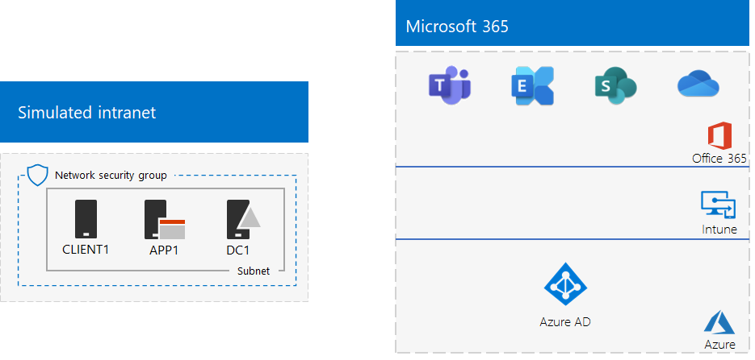
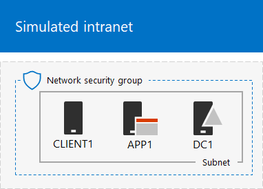
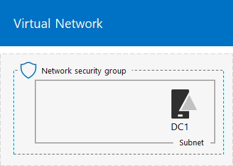
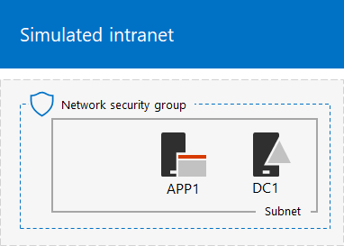

# The simulated enterprise base configuration

*This Test Lab Guide can be used for both Microsoft 365 Enterprise and Office 365 Enterprise test environments.*

This article provides you with step-by-step instructions to create a simplified environment for Microsoft 365 Enterprise that includes:

- A Microsoft 365 E5 trial or paid subscription.
- A simplified organization intranet connected to the Internet, consisting of three virtual machines on an Azure virtual network (DC1, APP1, and CLIENT1).
 


You can use the resulting environment to test the features and functionality of [Microsoft 365 Enterprise](https://www.microsoft.com/microsoft-365/enterprise) with additional [Test Lab Guides](m365-enterprise-test-lab-guides.md) or on your own.


> [!TIP]
> Click [here](media/m365-enterprise-test-lab-guides/Microsoft365EnterpriseTLGStack.pdf) for a visual map to all the articles in the Microsoft 365 Enterprise Test Lab Guide stack.

## Phase 1: Create a simulated intranet

In this phase, you build a simulated intranet in Azure infrastructure services that includes an Active Directory Domain Services (AD DS) domain controller, an application server, and a client computer. 

You'll use these computers in additional [Microsoft 365 Enterprise Test Lab Guides](m365-enterprise-test-lab-guides.md) to configure and demonstrate hybrid identity and other capabilities.

### Method 1: Build your simulated intranet with an Azure Resource Manager template

In this method, you use an Azure Resource Manager (ARM) template to build out the simulated intranet. ARM templates contain all of the instructions to create the Azure networking infrastructure, the virtual machines, and their configuration.

Prior to deploying the template, read through the [template README page](https://github.com/maxskunkworks/TLG/tree/master/tlg-base-config_3-vm.m365-ems) and have the following information ready:

- The public DNS domain name of your test environment (testlab.\<your public domain>). You’ll need to enter this name in the **Domain Name field** of the **Custom deployment** page.
- A DNS label prefix for the URLs of the public IP addresses of your virtual machines. You’ll need to enter this label in the **Dns Label Prefix** field of the **Custom deployment** page.

After reading through the instructions, click **Deploy to Azure** on the [template README page](https://github.com/maxskunkworks/TLG/tree/master/tlg-base-config_3-vm.m365-ems) to get started.

>[!Note]
>The simulated intranet built by the ARM template requires a paid Azure subscription.
>

Here is your configuration after the template is complete.



### Method 2: Build your simulated intranet with Azure PowerShell

In this method, you use Windows PowerShell and the Azure PowerShell module to build out the networking infrastructure, the virtual machines, and their configuration.

Use this method if you want to get experience creating elements of Azure infrastructure one step at a time with PowerShell. You can then customize the PowerShell command blocks for your own deployment of other virtual machines in Azure.

#### Step 1: Create DC1

In this step, we create an Azure virtual network and add DC1, a virtual machine that is a domain controller for an AD DS domain.

First, start a Windows PowerShell command prompt on your local computer.
  
> [!NOTE]
> The following command sets use the latest version of Azure PowerShell. See [Get started with Azure PowerShell cmdlets](https://docs.microsoft.com/powershell/azureps-cmdlets-docs/). 
  
Sign in to your Azure account with the following command.
  
```powershell
Connect-AzAccount
```

Get your subscription name using the following command.
  
```powershell
Get-AzSubscription | Sort Name | Select Name
```

Set your Azure subscription. Replace everything within the quotes, including the < and > characters, with the correct name.
  
```powershell
$subscr="<subscription name>"
Get-AzSubscription -SubscriptionName $subscr | Select-AzSubscription
```

Next, create a new resource group for your simulated enterprise test lab. To determine a unique resource group name, use this command to list your existing resource groups.
  
```powershell
Get-AzResourceGroup | Sort ResourceGroupName | Select ResourceGroupName
```

Create your new resource group with these commands. Replace everything within the quotes, including the < and > characters, with the correct names.
  
```powershell
$rgName="<resource group name>"
$locName="<location name, such as West US>"
New-AzResourceGroup -Name $rgName -Location $locName
```

Next, you create the TestLab virtual network that will host the Corpnet subnet of the simulated enterprise environment and protect it with a network security group. Fill in the name of your resource group and run these commands at the PowerShell command prompt on your local computer.
  
```powershell
$rgName="<name of your new resource group>"
$locName=(Get-AzResourceGroup -Name $rgName).Location
$corpnetSubnet=New-AzVirtualNetworkSubnetConfig -Name Corpnet -AddressPrefix 10.0.0.0/24
New-AzVirtualNetwork -Name TestLab -ResourceGroupName $rgName -Location $locName -AddressPrefix 10.0.0.0/8 -Subnet $corpnetSubnet -DNSServer 10.0.0.4
$rule1=New-AzNetworkSecurityRuleConfig -Name "RDPTraffic" -Description "Allow RDP to all VMs on the subnet" -Access Allow -Protocol Tcp -Direction Inbound -Priority 100 -SourceAddressPrefix Internet -SourcePortRange * -DestinationAddressPrefix * -DestinationPortRange 3389
New-AzNetworkSecurityGroup -Name Corpnet -ResourceGroupName $rgName -Location $locName -SecurityRules $rule1
$vnet=Get-AzVirtualNetwork -ResourceGroupName $rgName -Name TestLab
$nsg=Get-AzNetworkSecurityGroup -Name Corpnet -ResourceGroupName $rgName
Set-AzVirtualNetworkSubnetConfig -VirtualNetwork $vnet -Name Corpnet -AddressPrefix "10.0.0.0/24" -NetworkSecurityGroup $nsg
$vnet | Set-AzVirtualNetwork
```

Next, you create the DC1 virtual machine and configure it as a domain controller for the **testlab.**\<your public domain> AD DS domain and a DNS server for the virtual machines of the TestLab virtual network. For example, if your public domain name is **<span>contoso</span>.com**, the DC1 virtual machine will be a domain controller for the **<span>testlab</span>.contoso.com** domain.
  
To create an Azure virtual machine for DC1, fill in the name of your resource group and run these commands at the PowerShell command prompt on your local computer.
  
```powershell
$rgName="<resource group name>"
$locName=(Get-AzResourceGroup -Name $rgName).Location
$vnet=Get-AzVirtualNetwork -Name TestLab -ResourceGroupName $rgName
$pip=New-AzPublicIpAddress -Name DC1-PIP -ResourceGroupName $rgName -Location $locName -AllocationMethod Dynamic
$nic=New-AzNetworkInterface -Name DC1-NIC -ResourceGroupName $rgName -Location $locName -SubnetId $vnet.Subnets[0].Id -PublicIpAddressId $pip.Id -PrivateIpAddress 10.0.0.4
$vm=New-AzVMConfig -VMName DC1 -VMSize Standard_A1
$cred=Get-Credential -Message "Type the name and password of the local administrator account for DC1."
$vm=Set-AzVMOperatingSystem -VM $vm -Windows -ComputerName DC1 -Credential $cred -ProvisionVMAgent -EnableAutoUpdate
$vm=Set-AzVMSourceImage -VM $vm -PublisherName MicrosoftWindowsServer -Offer WindowsServer -Skus 2016-Datacenter -Version "latest"
$vm=Add-AzVMNetworkInterface -VM $vm -Id $nic.Id
$vm=Set-AzVMOSDisk -VM $vm -Name "DC1-OS" -DiskSizeInGB 128 -CreateOption FromImage
$diskConfig=New-AzDiskConfig -AccountType "Standard_LRS" -Location $locName -CreateOption Empty -DiskSizeGB 20
$dataDisk1=New-AzDisk -DiskName "DC1-DataDisk1" -Disk $diskConfig -ResourceGroupName $rgName
$vm=Add-AzVMDataDisk -VM $vm -Name "DC1-DataDisk1" -CreateOption Attach -ManagedDiskId $dataDisk1.Id -Lun 1
New-AzVM -ResourceGroupName $rgName -Location $locName -VM $vm
```

You will be prompted for a user name and password for the local administrator account on DC1. Use a strong password and record both the name and password in a secure location.
  
Next, connect to the DC1 virtual machine.
  
1. In the [Azure portal](https://portal.azure.com), click **Resource Groups >** [the name of your new resource group] **> DC1 > Connect**.
    
2. In the open pane, click **Download RDP file**. Open the DC1.rdp file that is downloaded, and then click **Connect**.
    
3. Specify the DC1 local administrator account name:
    
   - For Windows 7:
    
     In the **Windows Security** dialog box, click **Use another account**. In **User name**, type **DC1\\**[Local administrator account name].
    
   - For Windows 8 or Windows 10:
    
     In the **Windows Security** dialog box, click **More choices**, and then click **Use a different account**. In **User name**, type **DC1\\**[Local administrator account name].
    
4. In **Password**, type the password of the local administrator account, and then click **OK**.
    
5. When prompted, click **Yes**.
    
Next, add an extra data disk as a new volume with the drive letter F: with this command at an administrator-level Windows PowerShell command prompt on DC1.
  
```powershell
Get-Disk | Where PartitionStyle -eq "RAW" | Initialize-Disk -PartitionStyle MBR -PassThru | New-Partition -AssignDriveLetter -UseMaximumSize | Format-Volume -FileSystem NTFS -NewFileSystemLabel "WSAD Data"
```

Next, configure DC1 as a domain controller and DNS server for the **testlab.**\<your public domain> domain. Specify your public domain name, remove the \< and > characters, and then run these commands at an administrator-level Windows PowerShell command prompt on DC1.
  
```powershell
$yourDomain="<your public domain>"
Install-WindowsFeature AD-Domain-Services -IncludeManagementTools
Install-ADDSForest -DomainName testlab.$yourDomain -DatabasePath "F:\NTDS" -SysvolPath "F:\SYSVOL" -LogPath "F:\Logs"
```
You will need to specify a safe mode administrator password. Store this password in a secure location.
  
Note that these commands can take a few minutes to complete.
  
After DC1 restarts, reconnect to the DC1 virtual machine.
  
1. In the [Azure portal](https://portal.azure.com), click **Resource Groups >** [your resource group name] **> DC1 > Connect**.
    
2. Run the DC1.rdp file that is downloaded, and then click **Connect**.
    
3. In **Windows Security**, click **Use another account**. In **User name**, type **TESTLAB\\**[Local administrator account name].
    
4. In **Password**, type the password of the local administrator account, and then click **OK**.
    
5. When prompted, click **Yes**.
    
Next, create a user account in Active Directory that will be used when logging in to TESTLAB domain member computers. Run this command at an administrator-level Windows PowerShell command prompt.
  
```powershell
New-ADUser -SamAccountName User1 -AccountPassword (read-host "Set user password" -assecurestring) -name "User1" -enabled $true -PasswordNeverExpires $true -ChangePasswordAtLogon $false
```

Note that this command prompts you to supply the User1 account password. Because this account will be used for remote desktop connections for all TESTLAB domain member computers, choose a strong password. Record the User1 account password and store it in a secured location.
  
Next, configure the new User1 account as a domain, enterprise, and schema administrator. Run this command at the administrator-level Windows PowerShell command prompt.
  
```powershell
$yourDomain="<your public domain>"
$domainName = "testlab"+$yourDomain
$userName="user1@" + $domainName
$userSID=(New-Object System.Security.Principal.NTAccount($userName)).Translate([System.Security.Principal.SecurityIdentifier]).Value
$groupNames=@("Domain Admins","Enterprise Admins","Schema Admins")
ForEach ($name in $groupNames) {Add-ADPrincipalGroupMembership -Identity $userSID -MemberOf (Get-ADGroup -Identity $name).SID.Value}
```

Close the Remote Desktop session with DC1 and then reconnect using the TESTLAB\\User1 account.
  
Next, to allow traffic for the Ping tool, run this command at an administrator-level Windows PowerShell command prompt.
  
```powershell
Set-NetFirewallRule -DisplayName "File and Printer Sharing (Echo Request - ICMPv4-In)" -enabled True
```

This is your current configuration.
  

  
#### Step 2: Configure APP1

In this step, you create and configure APP1, which is an application server that initially provides web and file sharing services.

To create an Azure Virtual Machine for APP1, fill in the name of your resource group and run these commands at the  command prompt on your local computer.
  
```powershell
$rgName="<resource group name>"
$locName=(Get-AzResourceGroup -Name $rgName).Location
$vnet=Get-AzVirtualNetwork -Name TestLab -ResourceGroupName $rgName
$pip=New-AzPublicIpAddress -Name APP1-PIP -ResourceGroupName $rgName -Location $locName -AllocationMethod Dynamic
$nic=New-AzNetworkInterface -Name APP1-NIC -ResourceGroupName $rgName -Location $locName -SubnetId $vnet.Subnets[0].Id -PublicIpAddressId $pip.Id
$vm=New-AzVMConfig -VMName APP1 -VMSize Standard_A1
$cred=Get-Credential -Message "Type the name and password of the local administrator account for APP1."
$vm=Set-AzVMOperatingSystem -VM $vm -Windows -ComputerName APP1 -Credential $cred -ProvisionVMAgent -EnableAutoUpdate
$vm=Set-AzVMSourceImage -VM $vm -PublisherName MicrosoftWindowsServer -Offer WindowsServer -Skus 2016-Datacenter -Version "latest"
$vm=Add-AzVMNetworkInterface -VM $vm -Id $nic.Id
$vm=Set-AzVMOSDisk -VM $vm -Name "APP1-OS" -DiskSizeInGB 128 -CreateOption FromImage
New-AzVM -ResourceGroupName $rgName -Location $locName -VM $vm
```

Next, connect to the APP1 virtual machine using the APP1 local administrator account name and password, and then open a Windows PowerShell command prompt.
  
To check name resolution and network communication between APP1 and DC1, run the **ping dc1.testlab.**\<your public domain name> command and verify that there are four replies.
  
Next, join the APP1 virtual machine to the TESTLAB domain with these commands at the Windows PowerShell prompt.
  
```powershell
$yourDomain="<your public domain name>"
Add-Computer -DomainName ("testlab" + $yourDomain)
Restart-Computer
```

Note that you must supply the TESTLAB\\User1 domain account credentials after running the **Add-Computer** command.
  
After APP1 restarts, connect to it using the TESTLAB\\User1 account, and then open an administrator-level Windows PowerShell command prompt.
  
Next, make APP1 a web server with this command at an administrator-level Windows PowerShell command prompt on APP1.
  
```powershell
Install-WindowsFeature Web-WebServer -IncludeManagementTools
```

Next, create a shared folder and a text file within the folder on APP1 with these PowerShell commands.
  
```powershell
New-Item -path c:\files -type directory
Write-Output "This is a shared file." | out-file c:\files\example.txt
New-SmbShare -name files -path c:\files -changeaccess TESTLAB\User1
```

This is your current configuration.
  

  
#### Step 3: Configure CLIENT1

In this step, you create and configure CLIENT1, which acts as a typical laptop, tablet, or desktop computer on the intranet.

> [!NOTE]  
> The following command set creates CLIENT1 running Windows Server 2016 Datacenter, which can be done for all types of Azure subscriptions. If you have an Visual Studio-based Azure subscription, you can create CLIENT1 running Windows 10 with the [Azure portal](https://portal.azure.com). 
  
To create an Azure Virtual Machine for CLIENT1, fill in the name of your resource group and run these commands at the  command prompt on your local computer.
  
```powershell
$rgName="<resource group name>"
$locName=(Get-AzResourceGroup -Name $rgName).Location
$vnet=Get-AzVirtualNetwork -Name TestLab -ResourceGroupName $rgName
$pip=New-AzPublicIpAddress -Name CLIENT1-PIP -ResourceGroupName $rgName -Location $locName -AllocationMethod Dynamic
$nic=New-AzNetworkInterface -Name CLIENT1-NIC -ResourceGroupName $rgName -Location $locName -SubnetId $vnet.Subnets[0].Id -PublicIpAddressId $pip.Id
$vm=New-AzVMConfig -VMName CLIENT1 -VMSize Standard_A1
$cred=Get-Credential -Message "Type the name and password of the local administrator account for CLIENT1."
$vm=Set-AzVMOperatingSystem -VM $vm -Windows -ComputerName CLIENT1 -Credential $cred -ProvisionVMAgent -EnableAutoUpdate
$vm=Set-AzVMSourceImage -VM $vm -PublisherName MicrosoftWindowsServer -Offer WindowsServer -Skus 2016-Datacenter -Version "latest"
$vm=Add-AzVMNetworkInterface -VM $vm -Id $nic.Id
$vm=Set-AzVMOSDisk -VM $vm -Name "CLIENT1-OS" -DiskSizeInGB 128 -CreateOption FromImage
New-AzVM -ResourceGroupName $rgName -Location $locName -VM $vm
```

Next, connect to the CLIENT1 virtual machine using the CLIENT1 local administrator account name and password, and then open an administrator-level Windows PowerShell command prompt.
  
To check name resolution and network communication between CLIENT1 and DC1, run the **ping dc1.testlab.**\<your public domain name> command at a Windows PowerShell command prompt and verify that there are four replies.
  
Next, join the CLIENT1 virtual machine to the TESTLAB domain with these commands at the Windows PowerShell prompt.
  
```powershell
$yourDomain="<your public domain name>"
Add-Computer -DomainName ("testlab" + $yourDomain)
Restart-Computer
```

Note that you must supply your TESTLAB\\User1 domain account credentials after running the **Add-Computer** command.
  
After CLIENT1 restarts, connect to it using the TESTLAB\\User1 account name and password, and then open an administrator-level Windows PowerShell command prompt.
  
Next, verify that you can access web and file share resources on APP1 from CLIENT1.
  
1. In Server Manager, in the tree pane, click **Local Server**.
    
2. In **Properties for CLIENT1**, click **On** next to **IE Enhanced Security Configuration**.
    
3. In **Internet Explorer Enhanced Security Configuration**, click **Off** for **Administrators** and **Users**, and then click **OK**.
    
4. From the Start screen, click **Internet Explorer**, and then click **OK**.
    
5. In the Address bar, type **http<span>://</span>app1.testab.**\<your public domain name>**/**, and then press ENTER. You should see the default Internet Information Services web page for APP1.
    
6. From the desktop taskbar, click the File Explorer icon.
    
7. In the address bar, type **\\\\app1\\Files**, and then press ENTER. You should see a folder window with the contents of the Files shared folder.
    
8. In the **Files** shared folder window, double-click the **Example.txt** file. You should see the contents of the Example.txt file.
    
9. Close the **example.txt - Notepad** and the **Files** shared folder windows.
    
This is your current configuration.
  


## Phase 2: Create your Microsoft 365 E5 subscription

In this phase, you create a new Microsoft 365 E5 subscription that uses a new Azure AD tenant, one that is separate from your production subscription. You can do this in two ways:

- Use a trial subscription of Microsoft 365 E5. 

  The Microsoft 365 E5 trial subscription is 30 days, which can be easily extended to 60 days. When the trial subscription expires, you must either convert it to a paid subscriptions or create a new trial subscription. Creating new trial subscriptions means you will leave your configuration, which could include complex scenarios, behind.  

- Use a separate production subscription of Microsoft 365 E5 with a small number of licenses.

  This is an additional cost, but ensures that you have a working test environment to try features, configurations, and scenarios that does not expire. You can use the same test environment over the long term for proofs of concept, demonstration to peers and management, and application development and testing. This is the recommended method.

To start your Microsoft 365 E5 trial subscription, you first need a fictitious company name and a new Microsoft account.
  
1. We recommend that you use a variant of the company name Contoso for your company name, which is a fictitious company used in Microsoft sample content, but it isn't required. Record your fictitious company name here: 
    
2. To sign up for a new Microsoft account, go to [https://outlook.com](https://outlook.com) and create an account with a new email account and address. You will use this account to sign up for Office 365.
    
  - Record the first and last name of your new account here: 
    
  - Record the new email account address here: @outlook.com
    
### Sign up for an Office 365 E5 trial subscription

We start with an Office 365 E5 trial subscription and then add the Microsoft 365 E5 subscription to it.

1. For the simulated enterprise Office 365 dev/test environment, connect to CLIENT1 with the CORP\User1 account from the Azure portal.  From the Start screen, run Microsoft Edge and go to [https://aka.ms/e5trial](https://aka.ms/e5trial).
    
2. On the **Welcome, let's get to know you** page, specify:
    
  - Your physical location
    
  - The first and last name of your new Microsoft account
    
  - Your new email account address
    
  - A business phone number
    
  - Your fictional company name
    
  - An organization size of 250-999 people
    
3. Click **Just one more step**.
    
4. On the **Create your user ID** page, type a user name based on your new email address, your fictional company after the @ sign (remove all spaces in the name), then a password (twice) for this new Office 365 account.
    
    Record the password that you typed in a secure location.
    
    Record your fictional company name, to be referred to as the **organization name**, here: 
    
5. Click **Create my account**.
    
6. On the **Prove. You're. Not. A. Robot.** page, type the phone number of your text-capable phone, and then click **Text me**.
    
7. Type the verification code from the received text message, and then click **Next**.
    
8. Record the sign-in page URL here (select and copy): 
    
9. Record the user ID here (select and copy): .onmicrosoft.com
    
    This value will be referred to as the **Office 365 global administrator name**.
    
10. When you see **You're ready to go**, click it.
    
11. On the next page, wait until Office 365 completes setting up and all the tiles are available.
    
You should see main Office 365 portal page from which you can access Office services and the Microsoft 365 admin center.
  
We have you create a trial subscription of Office 365 so that your dev/test environment has a separate Azure AD tenant from any paid subscriptions you currently have. This separation means you can add and remove users and groups in the test tenant without affecting your production subscriptions.
    
### Configure your Office 365 E5 trial subscription

Next, you configure your Office 365 E5 subscription with additional users and assign them Office 365 E5 licenses.
  
Use the instructions in [Connect to Office 365 PowerShell](https://docs.microsoft.com/office365/enterprise/powershell/connect-to-office-365-powershell#connect-with-the-azure-active-directory-powershell-for-graph-module) to connect to your Office 365 subscription with the Azure Active Directory PowerShell for Graph module the CLIENT1 virtual machine.
    
In the Windows PowerShell Credential Request dialog box, type the Office 365 global administrator name (example: jdoe@contosotoycompany.onmicrosoft.com) and password.
  
Fill in your organization name (example: contosotoycompany), the two-character country code for your location, a common account password, and then run the following commands from the PowerShell prompt:

```powershell
$orgName="<organization name>"
$loc="<two-character country code, such as US>"
$commonPW="<common user account password>"
$PasswordProfile=New-Object -TypeName Microsoft.Open.AzureAD.Model.PasswordProfile
$PasswordProfile.Password=$commonPW

$userUPN= "user2@" + $orgName + ".onmicrosoft.com"
New-AzureADUser -DisplayName "User 2" -GivenName User -SurName 2 -UserPrincipalName $userUPN -UsageLocation $loc -AccountEnabled $true -PasswordProfile $PasswordProfile -MailNickName "user2"
$License = New-Object -TypeName Microsoft.Open.AzureAD.Model.AssignedLicense
$License.SkuId = (Get-AzureADSubscribedSku | Where-Object -Property SkuPartNumber -Value "ENTERPRISEPREMIUM" -EQ).SkuID
$LicensesToAssign = New-Object -TypeName Microsoft.Open.AzureAD.Model.AssignedLicenses
$LicensesToAssign.AddLicenses = $License
Set-AzureADUserLicense -ObjectId $userUPN -AssignedLicenses $LicensesToAssign

$userUPN= "user3@" + $orgName + ".onmicrosoft.com"
New-AzureADUser -DisplayName "User 3" -GivenName User -SurName 3 -UserPrincipalName $userUPN -UsageLocation $loc -AccountEnabled $true -PasswordProfile $PasswordProfile -MailNickName "user3"
$License = New-Object -TypeName Microsoft.Open.AzureAD.Model.AssignedLicense
$License.SkuId = (Get-AzureADSubscribedSku | Where-Object -Property SkuPartNumber -Value "ENTERPRISEPREMIUM" -EQ).SkuID
$LicensesToAssign = New-Object -TypeName Microsoft.Open.AzureAD.Model.AssignedLicenses
$LicensesToAssign.AddLicenses = $License
Set-AzureADUserLicense -ObjectId $userUPN -AssignedLicenses $LicensesToAssign

$userUPN= "user4@" + $orgName + ".onmicrosoft.com"
New-AzureADUser -DisplayName "User 4" -GivenName User -SurName 4 -UserPrincipalName $userUPN -UsageLocation $loc -AccountEnabled $true -PasswordProfile $PasswordProfile -MailNickName "user4"
$License = New-Object -TypeName Microsoft.Open.AzureAD.Model.AssignedLicense
$License.SkuId = (Get-AzureADSubscribedSku | Where-Object -Property SkuPartNumber -Value "ENTERPRISEPREMIUM" -EQ).SkuID
$LicensesToAssign = New-Object -TypeName Microsoft.Open.AzureAD.Model.AssignedLicenses
$LicensesToAssign.AddLicenses = $License
Set-AzureADUserLicense -ObjectId $userUPN -AssignedLicenses $LicensesToAssign
```
> [!NOTE]
> The use of a common password here is for automation and ease of configuration for a dev/test environment. Obviously, this is highly discouraged for production subscriptions. 

#### Record key information for future reference

You might want to print this article to record the specific information that you will need for this environment over the 30 days of the Office 365 trial subscription. You can easily extend the trail subscription for another 30 days. For a permanent dev/test environment, create a new paid subscription with a separate Azure AD tenant and a small number of licenses.

Record these values:
  
- Office 365 global administrator name: .onmicrosoft.com (from step 9 of Phase 2)
    
    Also record the password for this account in a secure location.
    
- Your trial subscription organization name:  (from step 4 of Phase 2)
    
- To list the accounts for User 2, User 3, User 4, and User 5, run the following command from the Windows Azure Active Directory Module for Windows PowerShell prompt:
    
  ```powershell
  Get-AzureADUser | Sort UserPrincipalName | Select UserPrincipalName
  ```

    Record the account names here:
    
  - User 2 account name: user2@.onmicrosoft.com
    
  - User 3 account name: user3@.onmicrosoft.com
    
  - User 4 account name: user4@.onmicrosoft.com
    
  - User 5 account name: user5@.onmicrosoft.com
    
    Also record the common password for these accounts in a secure location.
   

#### Using an Office 365 E5 dev/test environment

If all you need is an Office 365 dev/test environment, you can stop here. 

See [Microsoft 365 Enterprise Test Lab Guides](m365-enterprise-test-lab-guides.md) for additional Test Lab Guides that apply to both Office 365 and Microsoft 365.
  
### Add a Microsoft 365 E5 trial subscription

Next, you sign up for the Microsoft 365 E5 trial subscription and add it to the same organization as your Office 365 E5 trial subscription.
  
First, add the Microsoft 365 E5 trial subscription and assign a Microsoft 365 license to your global administrator account.
  
1. With a private instance of an Internet browser, sign in to the Microsoft 365 admin center at [https://admin.microsoft.com](https://admin.microsoft.com) with your global administrator account credentials.
    
2. On the **Microsoft 365 admin center** page, in the left navigation, click **Billing > Purchase services**.
    
3. On the **Purchase services** page, find the **Microsoft 365 E5** item. Hover your mouse pointer over it and click **Start free trial**.

4. On the **Microsoft 365 E5 Trial** page, choose to receive a text or a call, enter your phone number, then click **Text me** or **Call me**.

5. On the **Confirm your order** page, click **Try now**.

6. On the **Order receipt** page, click **Continue**.

7. In the Microsoft 365 admin center, click **Active users**, and then your administrator account.

8. Click **Edit** for **Product licenses**.

9. Turn off the license for Office 365 Enterprise E5 and turn on the license for Microsoft 365 E5.

10. Click **Save > Close > Close**.

Next, repeat steps 8 through 11 of the previous procedure for all of your other accounts (User 2, User 3, User 4, and User 5).
  
> [!NOTE]
> The Microsoft 365 E5 trial subscription is 30 days. For a permanent test environment, convert this trial subscription to a paid subscription with a small number of licenses. 
  
### Results

Your test environment now has:
  
- Microsoft 365 E5 trial subscription.
- All your appropriate user accounts are enabled to use Microsoft 365 E5.
- A simulated and simplified intranet.
    
This is your final configuration.
  

  
You are now ready to experiment with additional features of [Microsoft 365 Enterprise](https://www.microsoft.com/microsoft-365/enterprise).
  
## Next steps

Explore these additional sets of Test Lab Guides:
  
- [Identity](m365-enterprise-test-lab-guides.md#identity)
- [Mobile device management](m365-enterprise-test-lab-guides.md#mobile-device-management)
- [Information protection](m365-enterprise-test-lab-guides.md#information-protection)

## See also

[Microsoft 365 Enterprise Test Lab Guides](m365-enterprise-test-lab-guides.md)

[Deploy Microsoft 365 Enterprise](deploy-microsoft-365-enterprise.md)

[Microsoft 365 Enterprise documentation](https://docs.microsoft.com/microsoft-365-enterprise/)
