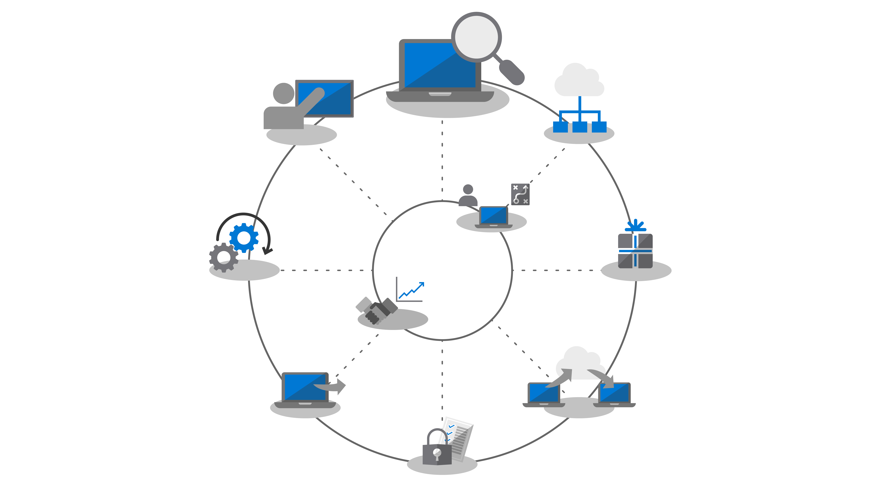
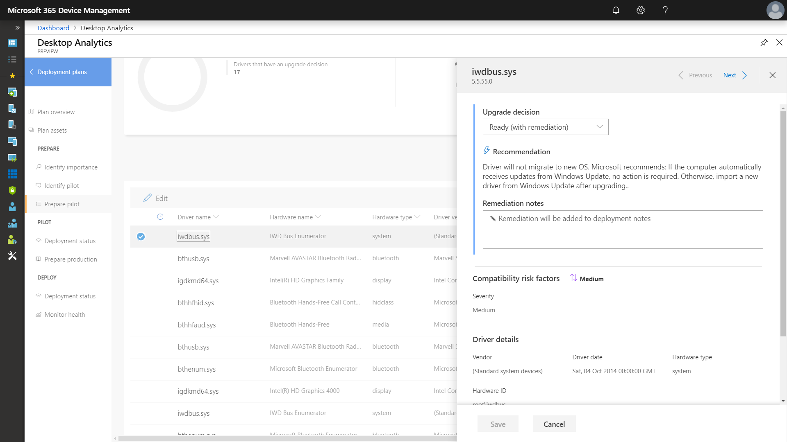
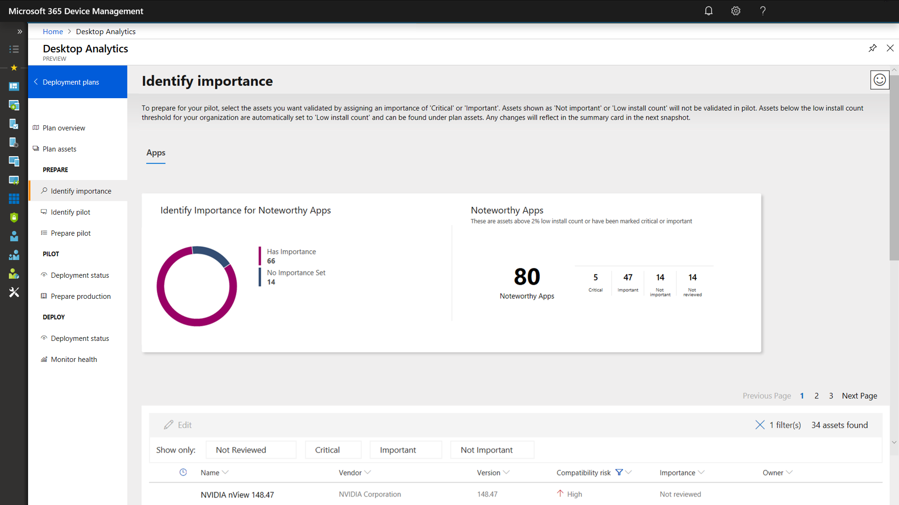
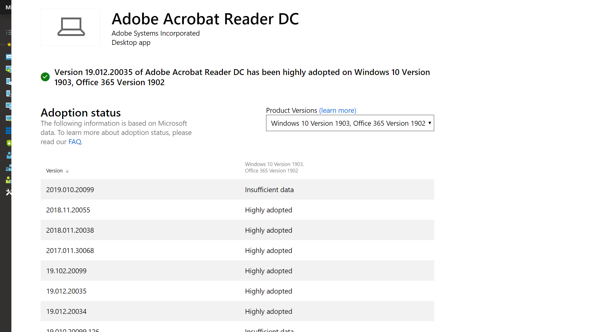
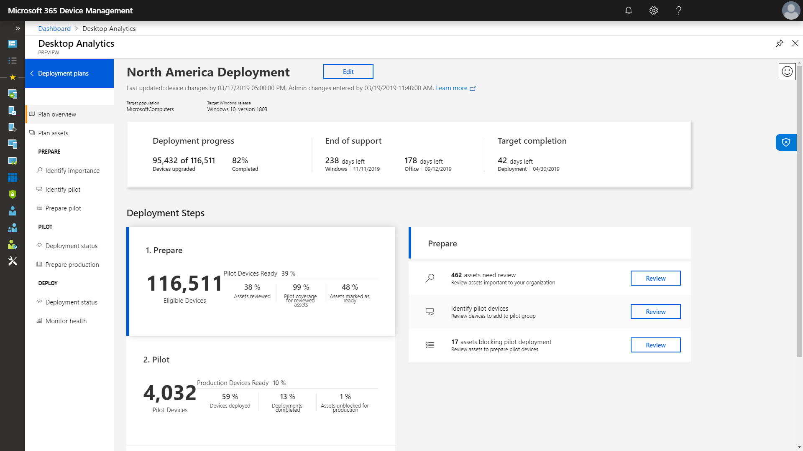

# Step 1: Device and App Readiness

<table>
<thead>
<td></td>
<td>
<strong>Step 1: Device and App Readiness</strong>

Begin your desktop deployment project with an inventory of your devices and apps, prioritize what you need to move forward, test prioritized apps and devices, then remediate what’s needed to get ready for deployment.
</td>
<td></td>
</thead>
</table>

>[!NOTE]
>Device and App Readiness is the first step in our recommended deployment process wheel by covering the holistic aspects of application and hardware compatibility. To see the full desktop deployment process, visit the [Desktop Deployment Center](https://aka.ms/HowToShift).
>

In the past, a major hurdle to upgrading the users’ desktops is application and hardware compatibility. The good news as you plan your shift to Windows 10 and Office 365 ProPlus, is just about any application written in the last 10 years will run on Windows 10, and any COM add-ins and VBA macros your organization used on versions of Office dating back to Office 2010, will continue to work on the latest versions of Office, without modification.

That said, depending on the size and age of your organization, verifying application and hardware compatibility is likely still an essential initial step in our recommended 8-phase deployment process.

In this article we take you through that first phase – Device and App Readiness – using Microsoft readiness assessment tools including the Desktop Analytics, an intelligent cloud-based solution available with your Windows license.

## Windows 10 Compatibility Scan

Before deploying Windows 10 Microsoft recommends checking the readiness of your existing devices running Windows 7 or 8/8.1. Windows 10 installation media supports a command line switch for the setup.exe to run the upgrade but only check for compatibility, not actually perform the upgrade. ScanOnly can be run as a scripted batch file or integrated into a Microsoft Endpoint Configuration Manager task sequence, including the ability to run the ScanOnly directly from the network so the Windows 10 installation media isn't streamed down to the local device. When ScanOnly completes the results are returned via return codes in log files generated by Setup.EXE.   

A sample ScanOnly command line that completes the compatibility scan silently would look like the below:

	Setup.EXE /Auto Upgrade /Quiet /NoReboot /Compat ScanOnly

For more information on ScanOnly and other Windows setup command switches please review the [Windows Setup Command-line Options](https://aka.ms/setupswitches).

## Recommended Tool: Desktop Analytics

Desktop Analytics offers many advantages over traditional desktop management systems and is our recommended tool. It is agentless and guides you through what needs to be done making use of application and driver compatibility information gathered through the upgrade of hundreds of millions of consumer PCs. This information gives you a detailed assessment, identifying compatibility issues that might block your upgrade, supported with links to suggested fixes known to Microsoft.

To set up Desktop Analytics you’ll first need to set up an Azure subscription and include an Azure Log Analytics workspace to that. Once you have the Desktop Analytics service running, you can then enroll any Internet-connected Windows 7 SP1 or newer device via Group Policy settings - it’s that simple. There are no agents to deploy, and Desktop Analytics’ visual workflow guides you from pilot to production deployment. If you wish, you can export data from Desktop Analytics to software deployment tools such as Microsoft Endpoint Configuration Manager (Current Branch), to target PCs directly and build collections as they become ready for deployment.

If you don’t currently have Desktop Analytics set up for your environment or would like to sign up for a trial, go the Desktop Analytics page](https://www.aka.ms/desktopanalytics) and get started.

## Device and App Readiness Process

Device and App Readiness is comprised of four steps: 1. Inventory, 2. Prioritize, 3. Test, 4. Remediate. Let’s look at each of these in turn.

### 1\. Inventory

Desktop Analytics uses an agent-less process to inventory the computers and applications across your desktop estate. It also provides reports on highly visited Internet sites, apps, and Intranet locations to help you with compatibility testing later.

### 2\. Prioritize

With inventory taken, Desktop Analytics helps you to identify and prioritize the most common apps and hardware used in your organization, as well as what to focus on to unblock as many PCs as possible for deployment.

It also provides guidance to help you assess the updates necessary to resolve issues during the next step: testing.

### 3\. Testing

You will find that most of the applications, drivers, and add-ins inventoried will work as-is. For items Desktop Analytics assesses to have issues, it provides you with known information including where to find version updates to resolve compatibility problems. Rather than devoting time and resource resolving complex issues in non-critical, sparsely deployed applications and older devices, you may choose instead to work with users to retire and replace these items.

You can use Desktop Analytics to assess browser-based compatibility issues too, identifying websites and web apps accessed by users still using ActiveX controls, Browser Helper Objects, VBScript, or other legacy technology not supported by the Microsoft Edge browser. Your users will still need to use Internet Explorer 11 for these sites, and you can add them to the [Enterprise Mode site list](https://docs.microsoft.com/microsoft-edge/deploy/emie-to-improve-compatibility), using the Enterprise Mode Site List Manager.

Additionally, to assist in your move to Office 365 ProPlus, you may wish to make use of the [Readiness Toolkit for Office](https://docs.microsoft.com/deployoffice/use-the-readiness-toolkit-to-assess-application-compatibility-for-office-365-pro) to test the compatibility of your add-ins and Microsoft Visual Basic for Applications (VBA) macros.

### 4\. Remediation

The final phase of device and app readiness is to ‘remediate’. Here you’ll want to collect the required software or driver packages; you are going to use these to supersede or update older versions as part of the deployment process.

As you work through the list remediating issues, you’ll see that more and more PCs become “Ready for Deployment”. This means that both the drivers and apps on the PCs are noted as compatible with the version of Windows 10 you are targeting for deployment.

### Configuration Manager Software Inventory for Application Prioritization

Configuration Manager software inventory is an alternative to using cloud-based analytics solutions for device and app readiness. You can use installation counts and drill into specific computers to help prioritize compatibility testing and validation and set application packages as compatible with Windows 10 via package settings. While this option does not offer the ability to compare known compatibility information with Microsoft’s analytics services, it can be an effective solution to target a smaller set of prioritized apps for manual testing. 

For more information, see [Introduction to software inventory in Configuration Manager](https://docs.microsoft.com/configmgr/core/clients/manage/inventory/introduction-to-software-inventory) and setting platform requirements in application packages in [Packages and programs in Configuration Manager](https://docs.microsoft.com/configmgr/apps/deploy-use/packages-and-programs).

## App Assure

Another tool to help with Windows 10 and Office 365 ProPlus app compatibility is the [App Assure](https://aka.ms/appassure) program available through the FastTrack Center. In the event of valid application issues, a Microsoft engineer with work with you at no additional cost through App Assure to help remediate the application incompatibility.

## Continued Use of Diagnostic Data Tools

Desktop Analytics isn’t just a tool to help you shift to Windows 10 and Office 365 ProPlus. Once you have desktops running on Windows 10 and Office 365 you can use it to help maintain your deployment and manage semi-annual Feature Updates so that you can stay current.

## Next Step 

## [Step 2: Directory and Network Readiness](https://aka.ms/mdd2)
