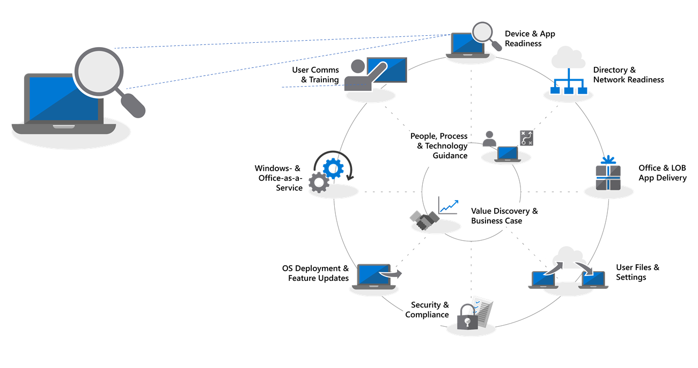
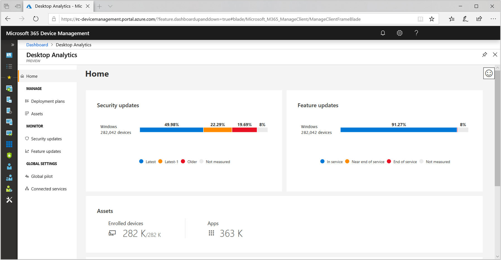
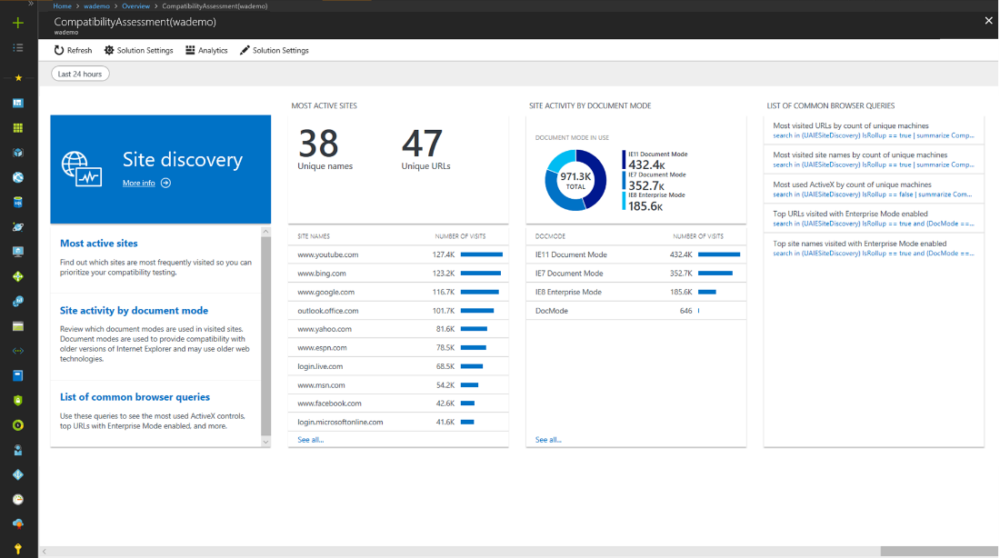
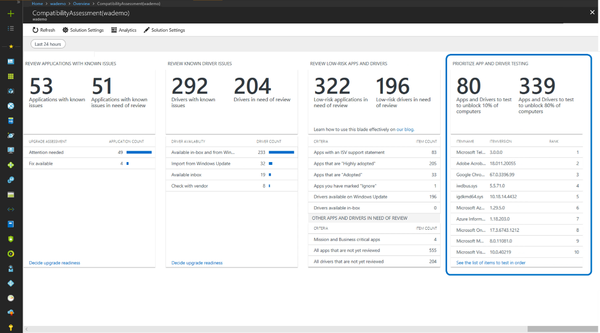
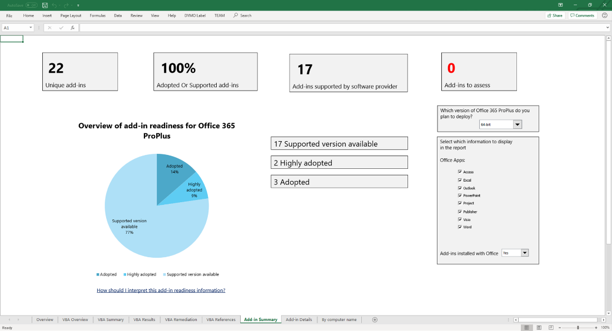
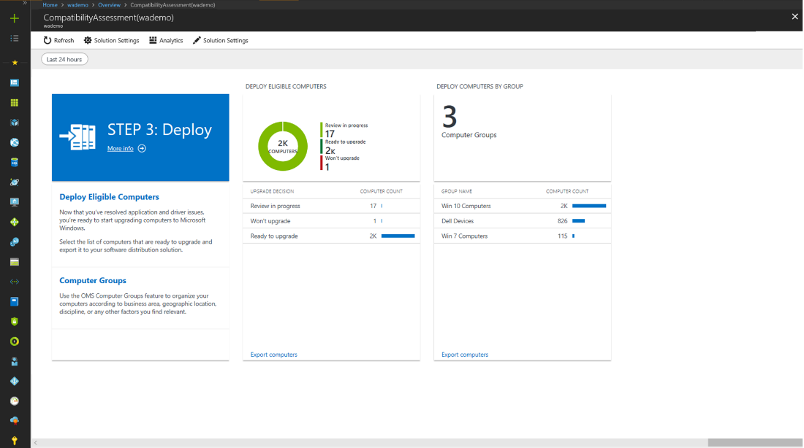

# Step 1: Device and App Readiness

Begin your desktop deployment project with an inventory of your devices and apps, prioritize what you to move forward, test prioritized apps and devices, then remediate what’s needed to get ready for deployment.

>[!NOTE]
>Device and App Readiness is the first step in our recommended deployment process wheel by covering the holistic aspects of application and hardware compatibility. To see the full desktop deployment process, visit the [Modern Desktop Deployment Center](https://aka.ms/mddhome).

>Before reading this article, please watch the following introduction video [Step 1:Device and App Readiness](https://aka.ms/dde1)

In the past, a major hurdle to upgrading the users’ desktops is application and hardware compatibility. The good news as you plan your shift to Windows 10 and Office 365 ProPlus, is just about any application written in the last 10 years will run on Windows 10, and any COM add-ins and VBA macros your organization used on versions of Office dating back to Office 2010, will continue to work on the latest versions of Office, without modification.

That said, depending on the size and age of your organization, verifying application and hardware compatibility is likely still an essential initial step in our recommended 8-phase deployment process.

In this article we take you through that first phase – Device and App Readiness – using the new Windows Analytics Upgrade Readiness tool, an intelligent cloud-based solution available with your Windows license.

If you don’t currently have Windows Analytics set up for your environment or would like to sign up for a trial, go the [Windows Analytics page](http://www.aka.ms/windowsanalytics) and get started.

## Recommended Tool: Windows Analytics Upgrade Readiness

Windows Analytics Upgrade Readiness offers many advantages over traditional desktop management systems and is our recommended tool. It is agentless; it guides you through what needs to be done; and, it makes use of application and driver compatibility information gathered through the upgrade of hundreds of millions of consumer PCs, to give you a detailed assessment, identifying compatibility issues that might block your upgrade, with links to suggested fixes known to Microsoft.

To set up Window Analytics Upgrade Readiness you’ll first need to set up an Azure subscription and include an Azure Log Analytics workspace to that. Once you have the Windows Analytics Upgrade Readiness service running, you can then enroll any Internet-connected Windows 7 SP1 or newer device via Group Policy settings. It’s that simple. There are no agents to deploy, and Windows Analytics Upgrade Readiness’s visual workflow guides you from pilot to production deployment. If you wish, you can export data from Windows Analytics Upgrade Readiness to software deployment tools such as System Center Configuration Manager, to target PCs directly and build collections as they become ready for deployment.

## Device and App Readiness Process

Device and App Readiness compromises four steps: 1. Inventory, 2. Prioritize, 3. Test, 4. Remediate. Let’s look at each of these in turn.

### 1\. Inventory

Windows Analytics Upgrade Readiness service uses an agent-less process to inventory the computers, applications and Office add-ins across your desktop estate.

It also provides reports on highly visited Internet sites, apps and Intranet locations to help you with compatibility testing later.

### 2\. Prioritize

With inventory taken, Windows Analytics Upgrade Readiness helps you to identify and prioritize the most common apps and hardware used in your organization, and what to focus on to unblock as many PCs as possible for deployment,

also providing guidance to help you assess the updates are necessary to resolve issues during the next step: testing.

### 3\. Testing

You will find that most of the applications, drivers, and add-ins inventoried, will work as-is. For items Windows Analytics Upgrade Readiness assesses to have issues, it provides you with known information, including where to find version updates to resolve compatibility problems. Rather than devoting time and resource resolving complex issues in non-critical, sparsely deployed applications and older devices, you may choose instead to work with users to retire and replace these items.

You can use Windows Analytics Upgrade Readiness to assess browser-based compatibility issues too, identifying websites and web apps accessed by users still using ActiveX controls, Browser Helper Objects, VBScript, or other legacy technology not supported by the Microsoft Edge browser. Your users will still need to use Internet Explorer 11 for these sites, and you can add them to the [Enterprise Mode site list](https://docs.microsoft.com/en-us/microsoft-edge/deploy/emie-to-improve-compatibility), using the Enterprise Mode Site List Manager.

Additionally, to assist in your move to Office 365 ProPlus, you may wish to make use of the [Readiness Toolkit for Office](https://docs.microsoft.com/en-us/deployoffice/use-the-readiness-toolkit-to-assess-application-compatibility-for-office-365-pro) to test the compatibility of your add-ins and Microsoft Visual Basic for Applications (VBA) macros.

### 4\. Remediation

As the final phase of device and app readiness is to ‘remediate’. Here you’ll want to collect the required software or driver packages; you are going to use these to supersede or update older versions as part of the deployment process.

As you work through the list remediating issues, you’ll see that more and more PCs become “Ready for Deployment”. This means that both the drivers and apps on the PCs are noted as compatible with the version of Windows 10 you are targeting for deployment.

## Continued use of telemetry tools

Windows Analytics Upgrade Readiness isn’t just a tool to help you shift to Windows 10 and Office 365 ProPlus. Once you have desktops running on Windows 10 and Office 365 you can use it to help maintain your deployment and manage semi-annual Feature Updates so that you can stay current.

## Next Step: 

## [Step 2: Directory and Network Readiness](https://aka.ms/dd2)

## Feedback:

We'd love to hear your thoughts. Choose the type you'd like to provide:

Product feedback Sign in to give documentation feedback

Our new feedback system is built on GitHub Issues. Read about this change in our blog post.
