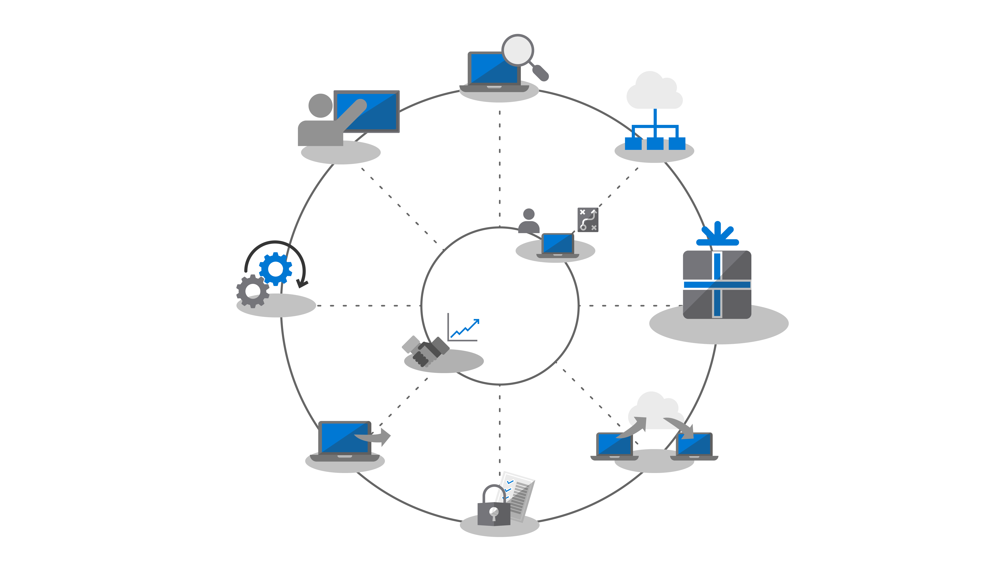
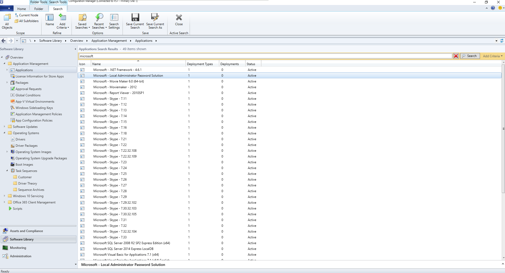
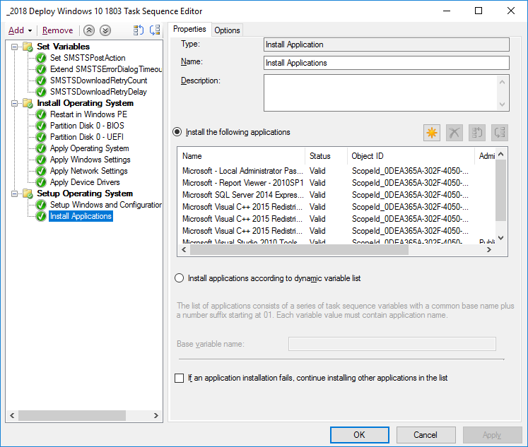
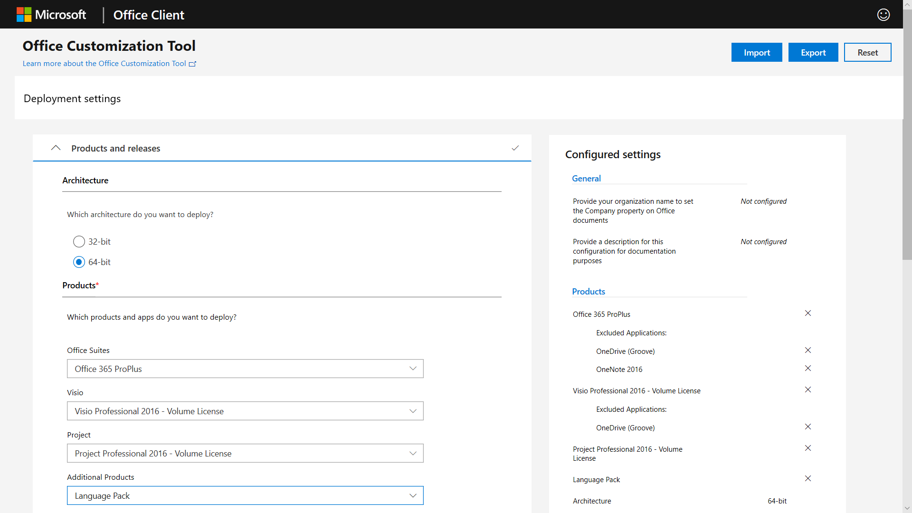

# Step 3: Office and LOB App Delivery

<table>
<thead>
<td></td>
<td>
<strong>Step 3: Office and LOB App Delivery</strong>

Ensure your apps are packaged and ready for automated installation. Learn how Click-to-Run packaging with Office 365 ProPlus gives you new options to configure, deliver and keep your Office apps up-to-date.
</td>
<td></td>
</thead>
</table>

>[!NOTE]
>Office and LOB App Delivery is the third step in our recommended deployment process wheel covering the options to install and manage Office and LOB. For successful deployment do not skip the first two steps.  To see the full desktop deployment process, visit the [Desktop Deployment Center](https://aka.ms/HowToShift).
>

You are now ready to deliver Office and your Line of Business Apps and there are a number of ways to do this, including some exciting new options. While some applications are only available as either a 32-bit or 64-bit compiled version, others such as Office 365 ProPlus, offer both as 32-bit and 64-bit native compiled code, and one of biggest decisions you will make is which version to deploy. To take advantage of additional compute power and RAM on new devices Microsoft recommends using the 64-bit version when there are no 32-bit dependencies. To determine any add-in or file-related compatibility challenges you may have it is recommended to revisit Step 1 Device and App Readiness before you continue.

If nothing is blocking you, we recommend you deploy 64-bit versions of all apps, including Microsoft Office. 64-bit native compiled apps offer the best performance and is the most future-proof choice.

There are many methods and models for installing apps on Windows, so let’s look at your delivery options.

[Windows 10 application management](https://docs.microsoft.com/windows/application-management/)

## MSI-based Deployments

For your line of business apps, you’ll probably use MSI-based packages or executable  and install apps as part of an OS deployment task sequence. Windows 10 continues to work with these packages.

Software deployment tools like Microsoft Endpoint Configuration Manager and Microsoft Intune are also optimized to deliver MSI-packaged apps. Once you have validated your apps on Windows 10, you can use Microsoft Endpoint Configuration Manager (current branch) for app delivery. If you use the Company Portal in Microsoft Intune you can extend the choice of IT sanctioned apps available to your organization to include the latest applications, and users to self-select what they need.

## PC Imaging

Another popular method of app delivery is PC imaging. In this case, applications are either installed via task sequence or manually on a sample PC, then a system image is captured with the required applications pre-installed. The imaging approach to build and capture can save time when provisioning new PCs but remember operating systems and apps within the image can become stale quickly. The Cumulative Update model in Windows 10 and Office 365 ProPlus help with this problem, but doesn’t eliminate it completely. This is why we recommend a thin image approach, where your applications are installed from outside the image at deploy time.

If you do want to include Office 365 ProPlus in your image, remember that this uses a user-based activation; it cannot be pre-activated by the system admin. Use the Office Deployment Tool to pre-install Office on the device you are imaging and skip the user sign-in. Once the image is deployed end users can sign-in using their Office 365 credentials and activate Office 365 ProPlus.

[Create a Task Sequence to Install an Operating System](https://docs.microsoft.com/configmgr/osd/deploy-use/create-a-task-sequence-to-install-an-operating-system)

[Deploy Office 365 ProPlus as part of an operating system image](https://docs.microsoft.com/deployoffice/deploy-office-365-proplus-as-part-of-an-operating-system-image)

## Office Click-to-Run 

Office 365 ProPlus is installed using Click-to-Run, and Click-to-Run replaces MSI-based packaging in every version of the upcoming Office 2019 release for Windows. It brings with it a number of advantages, including faster installations, faster and more efficient updating, and cleaner uninstallation. 

Programs delivered via Click-to-Run execute in a virtual application environment on your computer and so co-exist with other applications without conflict; they also take about half the disk space they would as an MSI-based package. Office applications are delivered and managed via the [Office Deployment Tool](https://www.microsoft.com/download/details.aspx?id=49117) which is the Office setup engine needed to download, configure, and customize your Office apps. The Office Deployment Tool reads a configuration XML file which provides the metadata instructions on how to configure and customization your Office installation.

Microsoft recommends using the [Office Customization Tool](https://config.office.com/) to customize your deployment settings and create your configuration XML file. Through the Office Customization Tool you can set which applications and languages will be installed, how the applications will be updated, application preferences, and installation expereince settings.

If you use Configuration Manager, you can still use it for broad deployment of Office 365 ProPlus. Configuration Manager (current branch) has native support for the updated Office Customization Tool, package customization for Click-to-Run at install time, and native support for software update management post installation.

[Deployment Guide for Office 365 ProPlus](https://docs.microsoft.com/deployoffice/deployment-guide-for-office-365-proplus)

[Remove existing MSI versions of Office when upgrading to Office 365 ProPlus](https://docs.microsoft.com/deployoffice/upgrade-from-msi-version)

[Manage Office 365 ProPlus with Configuration Manager](https://docs.microsoft.com/configmgr/sum/deploy-use/manage-office-365-proplus-updates)

[Assign Office 365 apps to Windows 10 devices with Microsoft Intune](https://docs.microsoft.com/intune/apps-add-office365)

## Browser-based Apps

There are a few things to consider in order to make sure that your browser-based applications continue to work as expected. If you have specific web sites and apps that you know have compatibility problems with Microsoft Edge, you can use the Enterprise Mode site list so that the web sites will automatically open using Internet Explorer 11.

Additionally, if you know that your intranet sites aren't going to work properly with Microsoft Edge, you can set all intranet sites to open using Internet Explorer 11 automatically. This process uses an XML file to govern whether IE11 is used for each site, using Group Policy to enforce settings.

[What is Enterprise Mode](https://docs.microsoft.com/internet-explorer/ie11-deploy-guide/what-is-enterprise-mode#what-is-enterprise-mode)

So far, we have covered well known deployment methods. But there are two new approaches to app deployment you may wish to consider.

## Microsoft Store for Business 

Microsoft Store for Business provides a flexible way discover, acquire, manage, and distribute free and paid apps to Windows 10 devices at scale. As an IT admin, you can publish selected Microsoft Store apps, along with your custom own apps, to your own private store while assigning and re-using licenses as needed. Your users are directed to this store only, and so can only find and install approved apps.

Store apps can be natively built as UWP apps or you can use the Desktop Bridge to repackage your existing apps for the Store and add modern experiences for Windows 10. Aside from the code that you use to light up Windows 10 experiences, your app remains unchanged and continues to run in full-trust user mode.

## MSIX Containerization

A new option for application packaging is MSIX. MSIX uses the containerization technology available in Windows, bringing together the best aspects of Click-to-Run, UWP and MSI packaging. With tools to migrate existing installers like EXE, MSI, APPV and APPX directly to MSIX we see MSIX Containerization provides a unifed path for the many installation technologies in use today. MSIX support is included in current versions of Windows: any device running Windows 10 RS5 or newer includes everything you need to install and run MSIX packaged apps. Windows 10 dynamically integrates MSIX containers it receives, while keeping the applications separate from the operating system.

Containerization means clean uninstall and removal of packages, unlike a lot of MSI and EXE-based packages today that may leave items on the system. It also means only needing Standard User credentials to install applications – you do not have to have Administrator credentials to install MSIX containers. MSIX containers are more efficient to update too. When an update is published, use of block level differentials means only net new binaries are applied, reducing the update payload, for faster deployments consuming less network bandwidth.

You can find more information on MSIX via the [MSIX Tech Community site](https://techcommunity.microsoft.com/t5/MSIX/ct-p/MSIX)

## Next Step

## [Step 4: User Files and Settings](https://aka.ms/mdd4)

## Previous Step

## [Step 2: Directory and Network Readiness](https://aka.ms/mdd2) 
