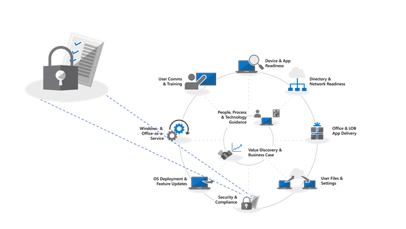
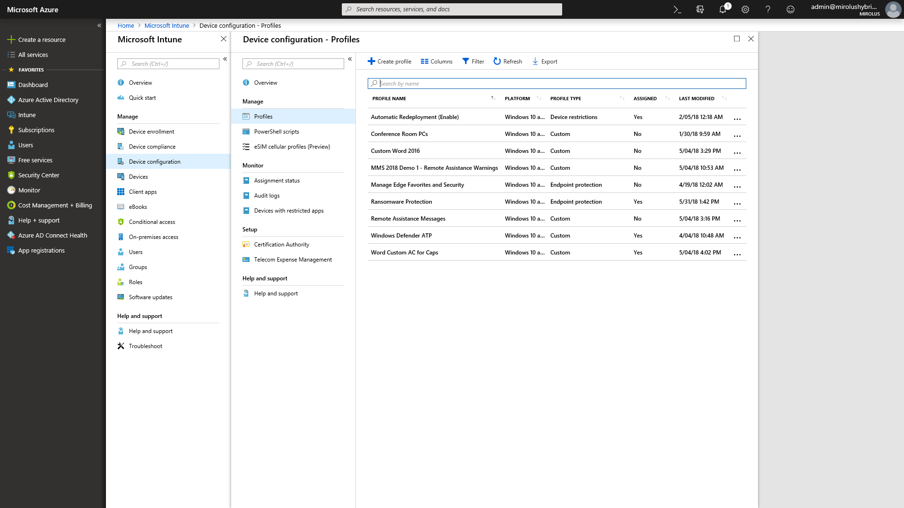

---
title: Step 5 - Security and Compliance Considerations
ms.author: jogruszc
author: JGruszczyk
manager: jemed
ms.date: 05/20/2019
ms.audience: ITPro
ms.topic: article
ms.service: o365-solutions
localization_priority: Priority
ms.collection: 
- Ent_O365
- Strat_O365_Enterprise
ms.custom: 
description: Learn about the important Windows and Office security and compliance considerations.
---

# Step 5: Security and Compliance Considerations

<table>
<thead>
<td></td>
<td>
<strong>Step 5: Security and Compliance Considerations</strong>

Windows 10 and Office 365 ProPlus provide new ways to protect your data, devices and users and quickly detect and respond to threats. Also, learn how to deal with common problems associated with disk encryption, anti-malware apps and policies when moving to Windows 10.
</td>
<td></td>
</thead>
</table>

>[!NOTE]
>Security and Compliance is the fifth step in our recommended deployment process wheel covering Windows 10 and Office 365 ProPlus security and compliance considerations. To see the full desktop deployment process, visit the [Desktop Deployment Center](https://aka.ms/HowToShift).
>

Now it's time to review options for targeting new security and compliance capabilities as part of your Windows 10 and Office 365 ProPlus deployment, along with the considerations and common blockers when moving from previous versions of Windows and Office. Many of the security-related capabilities in Windows 10 alone are driving the shift to the newer platform. Also, integration with cloud services in Office 365 and identity options using Azure Active Directory brings access to new and continually updated protections for your data, devices and users.

## Overcoming Potential Security-Related Deployment Blockers

Before explaining new capabilities that you can add as you move to Windows 10 and Office 365 ProPlus and connect those experiences to the cloud, let’s start with a few trends we’re seeing that can often interrupt deployment progress.

### Disk Encryption

First one of the initial challenges you might encounter is hard disk encryption. Many solutions for hard disk encryption cannot easily be upgraded from a previous version of Windows to a newer version of Windows.

Some disk encryption solutions allow you to perform the upgrades when using the ‘/reflectdrivers’ option with Windows Setup on certain versions of their platforms, but others may require you to unencrypt the drive prior to deployment, then re-encrypt after Windows 10 is installed. Some solutions also do not allow you to move from Master Boot Record (MBR), using legacy BIOS, to GUID Partition Table (GPT), required for UEFI. This is important because a 64-bit version of Windows 10 with UEFI is required for the new virtualization-based security capabilities in Windows 10 and those are explained below.

One option to resolve these issues is using BitLocker in Windows 10, which is included in Windows 10 Pro and higher editions. BitLocker allows you to suspend protection for OS upgrades and Feature Updates as part of the process.

[Bitlocker basic deployment](https://docs.microsoft.com/windows/security/information-protection/bitlocker/bitlocker-basic-deployment)

### Antivirus and Antimalware Application Compatibility

Second, while we’ve seen that more than [99% of Windows applications are compatible](https://www.microsoft.com/microsoft-365/blog/2018/09/06/helping-customers-shift-to-a-modern-desktop/) between Windows 7 and Windows 10, the exceptions are often anti-virus (AV) apps or Virtual Private Network (VPN) clients. These applications often implement non-standard development practices and APIs, using often undocumented ways to protect your system or connect you to network resources.

As a result, these apps by nature can be fragile to changes when shifting to a new version of Windows. If your AV or VPN software doesn’t work in Windows 10 or after upgrading, the fix is typically to replace the app you’re using with something supported and tested on Windows 10.

### Security Policies

Your Active Directory Group Policy settings used for older versions of Windows and Office may not translate directly to Windows 10 and Office 365 ProPlus, and there are different considerations with newer security and compliance capabilities. It’s a good idea to use the Microsoft Security Compliance Toolkit to get a baseline of the security policies for current versions of Windows and Office. Additionally, it’s worth looking into Mobile Device Management policies as part of Microsoft Intune.

## 

## New Security and Compliance Capabilities in Microsoft 365

Now, those were considerations for moving your current protections forward and things to be aware of before your shift. Now let’s take a look at new capabilities that you can take advantage of when moving to Windows 10, Office 365 ProPlus and cloud-based options from EMS and beyond.

### Identity and Access Management

Starting with identity and access management. Azure Active Directory is the identity control plane for apps, devices and Cloud services and is the modern way to connect to Office 365 and other Cloud services. Conditional access allows you to define different authentication requirements based on where you are logging in from, which device you're using, as well as things like anomalous behaviors.

At the device level, biometrics can provide unique identifiers for simpler and more secure access to your devices and apps - as you move toward the goal of eliminating passwords. Windows Hello offers device-based, multi-factor authentication. It relies on the device itself, your PIN, or unique biometric identifier such as your face or fingerprint, which you can enforce via policy.

[Fundamentals of Azure identity management](https://docs.microsoft.com/azure/active-directory/fundamentals/identity-fundamentals)

[Understand Azure identity solutions](https://docs.microsoft.com/azure/active-directory/fundamentals/understand-azure-identity-solutions)

[Azure Active Directory Conditional Access](https://docs.microsoft.com/azure/active-directory/conditional-access/overview)

[Windows Hello for Business](https://docs.microsoft.com/windows/security/identity-protection/hello-for-business/hello-identity-verification)

### Virtualization-based security

Now beyond identity, you can also enable continuous protection against both known and unknown threats and to do this Windows 10 uses virtualization-based security at the core to ensure boot integrity and code integrity using Secure Boot. We can help also stop credential theft with Credential Guard by maintaining user secrets in isolation from Windows. And, Application Guard can isolate and mitigate browser-based threats by running the browser in an isolated container. All of these technologies use virtualization-based security in Windows 10 and are foundational changes that cannot be replicated on a Windows 7 system – note that these also require UEFI, 64-bit Windows and virtualization extension support with SLAT – at the hardware level.

[More on Virtualization-based Security](https://docs.microsoft.com/windows-hardware/design/device-experiences/oem-vbs)

### Security enhancements from cloud services

Cloud services provide another layer of optional protection to improve Windows and Office security. These can give you a new level of often real-time control that can instantly detect, resist and respond to new attacks and attack types – especially compared to traditional software updating and AV signature files – where response and update deployment times are inherently slower.

Along with the Microsoft Intelligent Security Graph, you have faster access to both information and protections from emerging threats. Here are a few examples of what you can take advantage of, starting with Office.

**[Data Loss Prevention](https://docs.microsoft.com/office365/securitycompliance/data-loss-prevention-policies)** built into Office 365 ProPlus, helps inform users of security policies when high risk content like credit card or identification numbers are detected. Policies can inform or block sending and sharing after notifying users.

**[Azure Information Protection](https://docs.microsoft.com/azure/information-protection/rms-client/client-admin-guide)** is a complementary service that can be used with Office, allowing users to easily classify and label their Office files. It can trigger automatic action on labeled files, such as encryption or locking down sharing.

We've also introduced **[Safe Links](https://docs.microsoft.com/office365/securitycompliance/atp-safe-links)** protection across Office apps to protect you against a dynamic list of known malicious websites.

Additionally, **[Safe Attachments](https://docs.microsoft.com/office365/securitycompliance/atp-safe-attachments)** in Outlook and as part of Exchange Online goes beyond email filtering to inspect attachments. If a high-risk attachment is identified, Safe Attachments will inform the user of known malicious attachments and remove them from email.

**[Office 365 Message Encryption](https://docs.microsoft.com/office365/securitycompliance/encryption)** (OME) can also be used to safeguard email and attachments sent, ensuring only intended recipients can view email content. OME works seamlessly with Google, Yahoo, and Microsoft consumer account authentication, and one-time passcodes allow users of other email services to securely receive email as well.

#### Additional Windows 10 protections

**[Windows Defender Application Control](https://docs.microsoft.com/windows/security/threat-protection/windows-defender-application-control/windows-defender-application-control)** in Windows 10 operates off an approved allow and deny list of applications that Microsoft has checked for safety and all that is managed by endpoint protection policies using Microsoft Intune.

**[Microsoft Defender Advanced Threat Protection](https://docs.microsoft.com/windows/security/threat-protection/windows-defender-atp/overview)** is a unified platform for preventative protection, post-breach detection, automated investigation, and response. It protects endpoints from cyber threats; detects advanced attacks and data breaches, automates security incidents and improves security posture.

**[Exploit Guard](https://docs.microsoft.com/windows/security/threat-protection/windows-defender-exploit-guard/windows-defender-exploit-guard)** helps reduce the attack surface for running applications by preventing malware from getting into Windows and blocking untrusted processes from accessing protected folders.

#### Microsoft Intune

[Microsoft Intune](https://docs.microsoft.com/intune/introduction-intune) serves as a Cloud based management service for mobile scenarios, including IOS, Android and Windows devices, and can now be configured for co-management to complement and extend controls for specific workloads managed by Configuration Manager. One advantage here is that, devices accessing protected resources can be required to enroll into device management – even non-managed, non-domain joined or non-Azure AD joined devices. You can also take advantage of granular configuration and compliance policy enforcement at the operating system and application level. Application policies and settings can be configured centrally and enforced for Office 365 ProPlus and Store apps in Windows 10 using Microsoft Intune.

## Next Step

## [Step 6: OS Deployment and Feature Updates](https://aka.ms/mdd6)

## Previous Step 

## [Step 4: User Files and Settings](https://aka.ms/mdd4)
