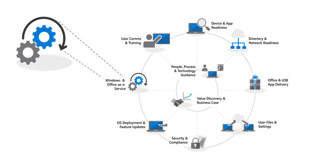
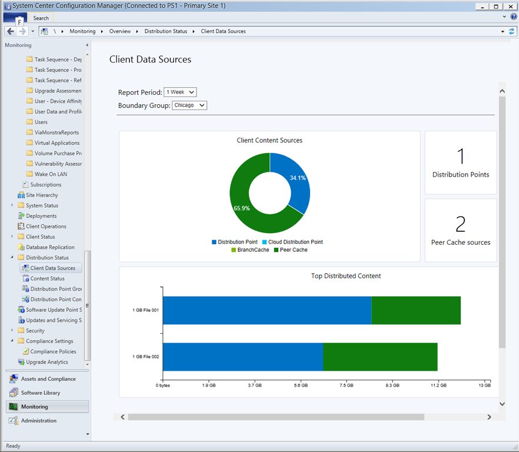

---
title: Step 7 - Windows and Office Servicing
ms.author: jogruszc
author: JGruszczyk
manager: jemed
ms.date: 05/20/2019
ms.audience: ITPro
ms.topic: article
ms.service: o365-solutions
localization_priority: Priority
ms.collection: 
- Ent_O365
- Strat_O365_Enterprise
ms.custom: 
description: Learn how to prepare for Windows and Office servicing in your environment.
---

# Step 7: Windows and Office Servicing

<table>
<thead>
<td></td>
<td>
<strong>Step 7: Windows and Office Servicing</strong>

Both Windows 10 and Office 365 ProPlus continually add new capabilities to keep bringing user experiences and security forward with the latest innovations. Learn how to stay current with semi-annual and monthly updates, how the new servicing model works and the tools and options you have.
</td>
<td></td>
</thead>
</table>

>[!NOTE]
>Windows and Office Servicing is the seventh step in our recommended deployment process wheel covering the planning aspects of preparing for semi-annual updates to features. To see the full desktop deployment process, visit the [Desktop Deployment Center](https://aka.ms/HowToShift).
>

Both Windows 10 and Office 365 ProPlus introduce new servicing options, support models, and update timelines. These changes simplify the process for staying current on the latest features. Along with these updates are new configuration options to enable servicing plans that meet your needs. Let's learn how to prepare for semi-annual channel updates offering new features and capabilities in Windows 10 and Office 365 ProPlus while leveraging new features within Microsoft Endpoint Configuration Manager (Current Branch).

[Helping customers shift to Windows 10 and Office 365 ProPlus](https://www.microsoft.com/microsoft-365/blog/2018/09/06/helping-customers-shift-to-a-modern-desktop/)

## Update Types

Updates fall into two main categories, feature updates and then quality and security updates which contain cumulative security, reliability and bug fixes. In terms of cadence both Windows and Office deliver a semi-annual channel which delivers new features twice per year around March and September while quality and security Updates occur Monthly. Additionally, unique to Office 365 applications, we offer a fully-supported Monthly Channel option where updates contain both new features and quality updates.

If you’re used to a longer cycle between desktop OS and app updates, you might be wondering;

  - Will the updates be compatible?

  - Will I need to keep retraining my users?

  - And what are the risks?

To answer those questions and the rationale for delivering new capabilities more frequently, we’ll some of the advantages of this approach

### Feature Update Benefits

First, we’ve moved away from the model of the past that would introduce huge waves of change around every three years to now incremental smaller changes with feature updates twice per year. Why? With technology trends moving so fast in addition to rapidly evolving security threats, this keeps experiences and protections current. Some of the security related updates for example can’t just be delivered by monthly security updates or antivirus signature files; they may be low-level changes platform, like virtualization-based security.

[Quick guide to Windows as a service](https://docs.microsoft.com/windows/deployment/update/waas-quick-start)

[Mitigate threats by using Windows 10 security features](https://docs.microsoft.com/windows/security/threat-protection/overview-of-threat-mitigations-in-windows-10%20%20)

### Cumulative Update Model Benefits

Second delivering quality and security updates as a cumulative update package corrects many of the issues of the past. It used to be that you might pick and choose sometimes from a dozen updates or more each month for both Windows and Office. As you can imagine, this creates a nearly impossible set of test matrices for support. Also, if you install a version of Windows or Office that is a year or more old, it might take hours or sometimes days to apply all updates delivered since that version was released.

With the cumulative model, you’re always one update away from being current and in doing so the number of monthly updates that you need to deploy is reduced. Each update builds upon updates from previous months and contains all of the fixes that you need to get current. Cumulative updates are especially helpful when PCs has been turned off for several months because they are in storage waiting to be reassigned to a different user.

### Expanded Validation of Updates

Another advantage is that, before we roll out updates for broad deployment, we first release builds via the Insider programs for [Office](https://products.office.com/office-insider?tab=Windows-Desktop) and [Windows](https://insider.windows.com/), and this allows us to gather diagnostic data and feedback ahead of us releasing updates broadly. Now the Insider programs are open to everyone so that you can get ahead of understanding the updates. By the time we release updates we will have received diagnostic data from millions of configurations, so when we do roll out updates, quality is now inherently more predictable

AND one more thing, because Office 365 ProPlus Insider builds reflect monthly channel updates, if you are using semi-annual channel for Office to deliver feature updates twice per year aligned to Windows, you can validate those builds early as well using the semi-annual channel targeted releases.

### Supporting Management Tools

We've also thought through how to make the deployment of updates seamless to you. Configuration Manager (Current Branch) is updated frequently to support the roll-out of these updates to Windows and Office and any new capabilities.

[Deploy Windows 10 updates using Configuration Manager](https://docs.microsoft.com/windows/deployment/update/waas-manage-updates-configuration-manager)

[Manage Office 365 ProPlus with Configuration Manager](https://docs.microsoft.com/configmgr/sum/deploy-use/manage-office-365-proplus-updates)

## Overview of Windows and Office Channels

Windows 10 offers three servicing channels:

- [**Windows Insider Program**](https://docs.microsoft.com/windows/deployment/update/waas-overview#windows-insider) for organizations to test and provide feedback on features shipped in the next feature update
- **Semi-Annual Channel** provides new functionality with Feature Update releases twice per year
- **Long Term Servicing Channel** is designed only for specialized devices needing a longer servicing option

Office 365 offers four servicing channels:

- [**Office Insider Program**](https://support.office.com/article/What-is-Office-Insider-f4208185-b63a-4b68-9c7a-9a32d2411c16) for organizations to test and provide feedback on the newest Office features and functionalities still in development
- **Monthly Channel** to provide users with the newest Office features as soon as they're available
- **Semi-Annual Channel** provides new functionality with new features only twice per year
- **Semi-Annual Channel (Targeted)** is a fully supported build of Office that enables pilot users and application compatibility testers to test and validate the next Semi-Annual Channel

For detailed information about Windows and Office servicing channels please review the below documentation:

- [Overview of Windows as a Service](https://docs.microsoft.com/windows/deployment/update/waas-overview#servicing-channels)
- [Overview of Update Channels for Office 365 ProPlus](https://docs.microsoft.com/DeployOffice/overview-of-update-channels-for-office-365-proplus#BKMK_SAC)

## Phased Deployment of Updates

Now let’s shift gears to how you will roll out these updates. For any release, we recommend at least three deployment phases for IT – validation, piloting and broad production deployment. Once you’re up and running on Windows 10 and Office 365 ProPlus, you'll use monthly servicing to stay current with critical security and quality updates, then you’ll move to semi-annual servicing for new features.

### Monthly Updating

The service model is designed so you can choose to limit the roll-out of new features to twice per year, and if needed you can even skip a semi-annual update and continue receiving quality and security updates. As mentioned, the cumulative nature of monthly updates means each will increase in size per month.

#### Express Updates

Using a technology called "Express Updates" in Windows and Binary Delta Compression in Office, we can reduce the download size significantly. In both approaches, the update engines compare what’s on the PC and finds only the differentials needed to update what’s there.

[Windows 10 quality updates explained & the end of delta updates](https://techcommunity.microsoft.com/t5/Windows-IT-Pro-Blog/Windows-10-quality-updates-explained-amp-the-end-of-delta/ba-p/214426)

Windows Update for Business and Windows Server Update Services have supported express updates for a long time, but we've now extended that support to Microsoft Endpoint Configuration Manager (Current Branch) so that it can also use Express Updates.

#### Binary Delta Compression

Binary Delta Compression in Office is only used if you're updating from the most recent version of Office 365 ProPlus-- so to use this approach you need to be updating from the previous build and can’t skip updates.

Windows and Office update channels can be managed via Configuration Manager using the standard approval and targeting process. Additionally, you can use policy settings in Office and Windows to enforce update channels used, as well as related settings.

### Semi-Annual Updates

So those are your considerations for monthly updates, now let’s move to the larger, semi-annual updates.

As we covered in Device and App Readiness, you’ll want to begin your preparation for these larger updates using the same readiness tools we set up in Step 1 of the deployment process wheel.

As for tooling, you can use policy settings with Windows Update for Business, software update management via Microsoft Endpoint Configuration Manager (Current Branch), Windows Server Update Services (WSUS), or update policies set by Microsoft Intune. If you are concerned about network bandwidth, see Step 2: Directory and Network Readiness, to learn about your options to reduce network traffic via Delivery Optimization and other peer to peer caching technologies.

[Windows Semi-Annual Channel](https://docs.microsoft.com/windows/deployment/update/waas-overview#semi-annual-channel)

[Semi-Annual Channel for Office 365 ProPlus](https://docs.microsoft.com/DeployOffice/overview-of-update-channels-for-office-365-proplus#BKMK_SAC)

#### Upgrade Task Sequences

Installing the larger feature updates via standard software update management routines is a supported option, but many organizations will opt to use an Upgrade Task Sequence with Microsoft Endpoint Configuration Manager (Current Branch) or the Microsoft Deployment Toolkit.

A Task Sequence allows you to create custom checks or tasks BEFORE to the installing the Feature Update and allows you to perform custom tasks AFTER the update installation itself has completed – post-update tasks might include temporarily suspending services if needed during the update, driver installation and replacement, application upgrades or taskbar and Windows 10 Start personalization settings.

If you’re already using task sequences to migrate your Windows 7 machines to Windows 10 and are well-versed with those tools, this is a great place to start and provides ultimate control. While you can use a single task sequence for the entire upgrade, it is quite common that organizations use two task sequences. One task sequence for making sure the machines are ready for the upgrade, that silently pre-stages all the required setup files on target computers, and one to do the actual upgrade. This approach ensures that your user productivity is less impacted.

[Create a task sequence to upgrade an OS in Configuration Manager](https://docs.microsoft.com/configmgr/osd/deploy-use/create-a-task-sequence-to-upgrade-an-operating-system)

#### Semi-annual channel support for feature updates

[As announced in September 2018](https://www.microsoft.com/microsoft-365/blog/2018/09/06/helping-customers-shift-to-a-modern-desktop/), support timeline for semi-annual channel updates will use the following model.

  - All currently supported feature updates of Windows 10 Enterprise and Education, starting with version 1607, will be supported for 30 months from their original release date.

  - All future feature updates, starting with 1809, with a targeting September will be supported for 30 months from their release date.

  - Future feature updates targeting March and starting with 1903 will continue to be supported for 18 months from their release date.

  - Office 365 ProPlus semi-annual updates continue to be supported for 18 months

#### Additional setup automation options outside of task sequences

If you don’t use Upgrade Task Sequences, you can now run custom actions or apply driver files during feature updates in the Pre-install phase – before setup runs its compatibility checks – or in the pre-commit phase – before the upgrade is applied.

[What's new in Windows 10 setup, version 1803](https://docs.microsoft.com/windows/whats-new/whats-new-windows-10-version-1803%23windows-setup)

## Next Step 

## [Step 8: User Communications and Training](https://aka.ms/mdd8)

## Previous Step 

## [Step 6 OS Deployment and Feature Updates](https://aka.ms/mdd6)